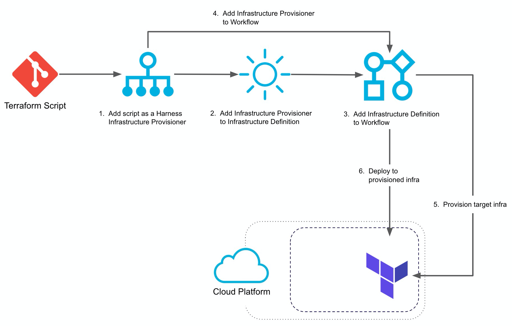

This content is for Harness [FirstGen](../../../../getting-started/harness-first-gen-vs-harness-next-gen.md). Switch to [NextGen](https://docs.harness.io/article/w6i5f7cpc9).Harness lets you use Terraform to provision infrastructure as part of your deployment process. Harness can provision any resource that is supported by a Terraform  [provider or plugin](https://www.terraform.io/docs/configuration/providers.html).

Looking for How-tos? See [Terraform How-tos](../../terraform-category/terrform-provisioner.md).

### Terraform Implementation Summary

Here is a visual summary of how you use your Terraform scripts in Harness to provision infra and then deploy to it:

You set up a Terraform Infrastructure Provisioner in the following order:

1. **Terraform Infrastructure Provisioner** — Add your Terraform scripts as a Harness Terraform Provisioner. You add the provisioner script by connecting to a Git repo where the scripts are kept and setting up any inputs.
2. **​Infrastructure Definition** — Select the Terraform Provisioner you set up. Now it can be used in any Workflow where you want to target the provisioned infrastructure. You simply map your script outputs to the required Harness settings:

   

3. **Workflow Setup** — When you create your Workflow, you select the Infrastructure Definition that maps to your script outputs.
4. **Workflow Provisioner Step** — In the Workflow, you add a **Terraform Provisioner** step. The Workflow will build the infrastructure according to your Terraform script.
5. **Pre-deployment** — The pre-deployment steps are executed and provision the infrastructure using the **Terraform Provisioner** step.
6. **Deployment** — The Workflow deploys to the provisioned infrastructure defined in its Infrastructure Definition.

### Use Terraform for Non-deployment Provisioning

You can use Terraform in Harness to provision any infrastructure, not just the target infrastructure for the deployment.

See [Using the Terraform Apply Command](../../terraform-category/using-the-terraform-apply-command.md).

### Limitations

* Terraform Infrastructure Provisioners are only supported in Canary and Multi-Service deployment types. For AMI/ASG and ECS deployments, Terraform Infrastructure Provisioners are also supported in Blue/Green deployments.
* The **Terraform Provision** and **Terraform Rollback** commands are available in the **Pre-deployment** section and the **Terraform Destroy** command is available in the **Post-deployment** section.

### Permissions

You need to give Harness permissions in your target environment so Harness can provision using Terraform. These are the same permissions you would need to grant Harness for existing, static infrastructures.

The permissions required for Harness to use your provisioner and successfully deploy to the provisioned instances depends on the deployment platform you use.

As a summary, you will need to manage the following permissions:

* **Delegate** - The Harness Delegate will require permissions according to the deployment platform. It will use the access, secret, and SSH keys you configure in Harness  [Secrets Management](https://docs.harness.io/article/au38zpufhr-secret-management) to perform deployment operations. For ECS Delegates, you can add an IAM role to the ECS Delegate task definition. For more information, see  [Trust Relationships and Roles](../../aws-deployments/ecs-deployment/harness-ecs-delegate.md#trust-relationships-and-roles).
* **Cloud Provider** - The Harness Cloud Provider must have access permissions for the resources you are planning to create in the Terraform script. For some Harness Cloud Providers, you can use the installed Delegate and have the Cloud Provider assume the permissions used by the Delegate. For others, you can enter cloud platform account information.

The account used for the Cloud Provider will require platform-specific permissions for creating infrastructure. For example, to create EC2 AMIs the account requires the **AmazonEC2FullAccess** policy.* **Git Repo** - You will add the Git repo where the provisioner script is located to Harness as a Source Repo Provider. For more information, see  [Add Source Repo Providers](https://docs.harness.io/article/ay9hlwbgwa-add-source-repo-providers).
* **Access and Secret Keys** - These are set up in Harness  [Secrets Management](https://docs.harness.io/article/au38zpufhr-secret-management) and then used as variable values when you add a Provisioner step to a Workflow.
* **SSH Key** - In order for the Delegate to copy artifacts to the provisioned instances, it will need an SSH key. You set this up in Harness Secrets Management and then reference it in the Harness Environment Infrastructure Definition. See [Secrets Management](https://docs.harness.io/article/au38zpufhr-secret-management).
* **Platform Security Groups** - Security groups are associated with EC2 and other cloud platform instances and provide security at the protocol and port access level. You will need to define security groups in your provisioner scripts and ensure that they allow the Delegate to connect to the provisioned instances.

### No Artifact Required

You do not need to deploy artifacts via Harness Services to use Terraform provisioning in a Workflow. You can simply set up a Terraform Provisioner and use it in a Workflow to provision infrastructure without deploying any artifact. In Harness documentation, we include artifact deployment as it is the ultimate goal of Continuous Delivery.

### Service Instances (SIs) Consumption

Harness Service Instances (SIs) are not consumed when a Harness Workflow uses Terraform to provision resources. When Harness deploys artifacts via Harness Services to the provisioned infrastructure in the same Workflow or Pipeline, SIs licensing is consumed.

### Next Steps

Get started with [Terraform How-tos](../../terraform-category/terrform-provisioner.md).

