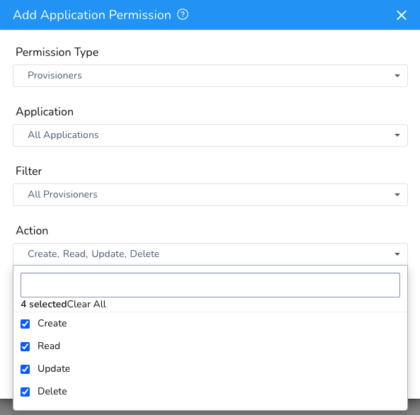

Harness lets you use [Terragrunt](https://terragrunt.gruntwork.io/) to provision infrastructure as part of your deployment process. Harness can provision any resource that is supported by Terragrunt and the related Terraform [provider or plugin](https://www.terraform.io/docs/configuration/providers.html).

Once Harness provisions the target infrastructure using Terragrunt and Terraform, Harness can deploy to it, all in the same Workflow.

You can also simply provision non-target infrastructure without deploying to it.

If you want to use Terraform without Terragrunt, Harness supports that, too. See [Terraform Provisioning with Harness](terraform-provisioning-with-harness.md) and [Terraform How-tos](../../terraform-category/terrform-provisioner.md).

Looking for How-tos? See [Terragrunt How-tos](../../terragrunt-category/terragrunt-how-tos.md).

### Terragrunt Target Infrastructure Provisioning

Here is a visual summary of how you use your and Terragrunt and Terraform files with Harness to provision target infra and then deploy to it:

Here's a 6 minute video walkthrough of the process:

<!-- Video:
https://harness-1.wistia.com/medias/rpv5vwzpxz-->
<docvideo src="https://www.youtube.com/embed/HYSi2LAaYdc?feature=oembed" />

You set up a Terragrunt deployment in the following order:

1. **Terragrunt** **Infrastructure Provisioner** — Add your Terragrunt config file(s) (.hcl) as a Harness Terragrunt Provisioner. You add the Terragrunt file(s) by connecting to a Git repo where the files are kept.
2. **​Infrastructure Definition** — You use the Terragrunt Infrastructure Provisioner to define a deployment target infrastructure.  
In a Harness Infrastructure Definition, you select the Terragrunt Infrastructure Provisioner you set up and map specific Terraform outputs to the required Infrastructure Definition settings.  
With Terragrunt, the outputs will be in the Terraform module the Terragrunt config file points to (`source`).
3. **Workflow Setup** — When you create your Workflow, you select the Infrastructure Definition that maps to your outputs. You might add it in the main Workflow settings or in the settings within a Workflow Phase. Either way, the Infrastructure Definition mapped to your Terragrunt/Terraform files is the deployment target for the Workflow.
4. **Workflow Provisioner Step** — In the Workflow, you add a **Terragrunt** **Provisioner** pre-deployment step that uses the same Terragrunt Infrastructure Provisioner. The Workflow will build the infrastructure according to your Terragrunt and Terraform files.
5. **During** **Pre-deployment execution** — The pre-deployment steps are executed and provision the target infrastructure using the **Terragrunt** **Provisioner** step.
6. **Deployment** — The Workflow deploys your application to the provisioned infrastructure.

See [Terragrunt How-tos](../../terragrunt-category/terragrunt-how-tos.md).

### Use Terragrunt for Non-target Provisioning

You can use Terragrunt in Harness to provision any infrastructure, not just the target infrastructure for the deployment.

In this use case, you simply add the Terragrunt Provision step to your Workflow and it runs some Terragrunt commands to provision some non-target resources in your infrastructure.

You do not need to deploy artifacts via Harness Services to use Terragrunt provisioning in a Workflow. You can simply set up a Terragrunt Provisioner and use it in a Workflow to provision infrastructure without deploying any artifact.

See [Provision using the Terragrunt Provision Step](../../terragrunt-category/provision-using-the-terragrunt-provision-step.md).

### Limitations

* Terragrunt Infrastructure Provisioners are only supported in Canary and Multi-Service deployment types.
* For AMI/ASG and ECS deployments, Terragrunt Infrastructure Provisioners are also supported in Blue/Green deployments.

### Permissions

You need to give Harness permissions in your target environment so Harness can provision using Terraform. These are the same permissions you would need to grant Harness for existing, static infrastructures.

The permissions required for Harness to use your provisioner and successfully deploy to the provisioned instances depends on the deployment platform you use.

As a summary, you will need to manage the following permissions:

* **Harness User Groups:** to set up Terragrunt in Harness your Harness User Groups needs CRUD Application permissions for the Harness Application(s) that will use Terragrunt:
	+ **Provision Type:** Provisioners.
	+ **Application:** All Applications that you want to use with Terragrunt.
	+ **Filter:** All Provisioners.
	+ **Action:** Create, Read, Update, Delete.  
	  See [Managing Users and Groups (RBAC)](https://docs.harness.io/article/ven0bvulsj-users-and-permissions).
	  
* **Delegate**: the Harness Delegate will require permissions according to the deployment platform. It will use any access, secret, and SSH keys you configure in Harness [Secrets Management](https://docs.harness.io/article/au38zpufhr-secret-management) to perform deployment operations. For ECS Delegates, you can add an IAM role to the ECS Delegate task definition. For more information, see  [Trust Relationships and Roles](../../aws-deployments/ecs-deployment/harness-ecs-delegate.md#trust-relationships-and-roles).
* **Cloud Provider**: the Harness Cloud Provider must have access permissions for the resources you are planning to create using Terragrunt and Terraform. For some Harness Cloud Providers, you can use the installed Delegate and have the Cloud Provider assume the permissions used by the Delegate. For others, you can enter cloud platform account information.
:::note 
The account used for the Cloud Provider will require platform-specific permissions for creating infrastructure. For example, to create EC2 AMIs the account requires the **AmazonEC2FullAccess** policy.
:::
* **Git Repo**: you will add the Git repo(s) where the Terragrunt and Terraform files are located to Harness as a Source Repo Provider. For more information, see  [Add Source Repo Providers](https://docs.harness.io/article/ay9hlwbgwa-add-source-repo-providers).
* **Access and Secret Keys**: if needed, these are set up in Harness [Secrets Management](https://docs.harness.io/article/au38zpufhr-secret-management) and then used as variable values when you add a Provisioner step to a Workflow.
* **SSH Key**: in some cases, in order for the Delegate to copy artifacts to the provisioned instances, it will need an SSH key. You set this up in Harness Secrets Management and then reference it in the Harness Environment Infrastructure Definition. See [Secrets Management](https://docs.harness.io/article/au38zpufhr-secret-management).
* **Platform Security Groups**: security groups are associated with EC2 and other cloud platform instances and provide security at the protocol and port access level. If needed, you will need to define security groups in your provisioner scripts and ensure that they allow the Delegate to connect to the provisioned instances.

### Supported Terraform Versions with Terragrunt

The following recommendations are from [Terragrunt](https://terragrunt.gruntwork.io/docs/getting-started/supported-terraform-versions/). In practice, as Terragrunt notes, the version compatibility is more relaxed.

|  |  |
| --- | --- |
| **Terraform Version** | **Terragrunt Version** |
| 0.14.x | >= 0.27.0 |
| 0.13.x | >= 0.25.0 |
| 0.12.x | 0.19.0 - 0.24.4 |
| 0.11.x | 0.14.0 - 0.18.7 |

### No Artifact Required

You do not need to deploy artifacts via Harness Services to use Terragrunt provisioning in a Workflow. You can simply set up a Terragrunt Provisioner and use it in a Workflow to provision infrastructure without deploying any artifact. In Harness documentation, we include artifact deployment as it is the ultimate goal of Continuous Delivery.

### Service Instances (SIs) Consumption

Harness Service Instances (SIs) are not consumed and no additional licensing is required when a Harness Workflow uses Terragrunt to provision resources.

When Harness deploys artifacts via Harness Services to the provisioned infrastructure in the same Workflow or Pipeline, SIs licensing is consumed.

### Auto-Approve and Force Option Support

Currently `auto-approve` option support is behind the feature flag `TG_USE_AUTO_APPROVE_FLAG`. Contact [Harness Support](mailto:support@harness.io) to enable the feature.By default, Harness uses the `force` option with `terraform apply -destroy`. 

The `force` option is deprecated in Terraform version 0.15.0 and greater. Consequently, Harness will use the `auto-approve` option if you are using Terraform version 0.15.0 and greater. 

If you are using a Terraform version earlier than Terraform version 0.15.0, Harness will continue to use `force`.

### Next Steps

Get started with [Terragrunt How-tos](../../terragrunt-category/terragrunt-how-tos.md).

