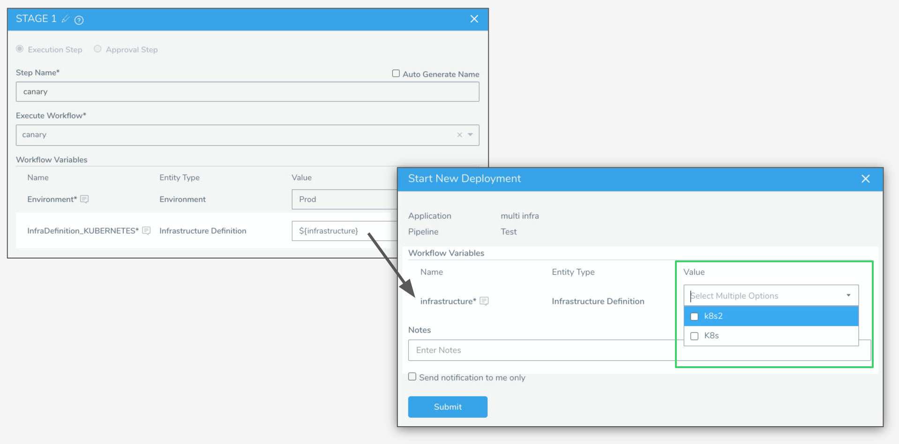
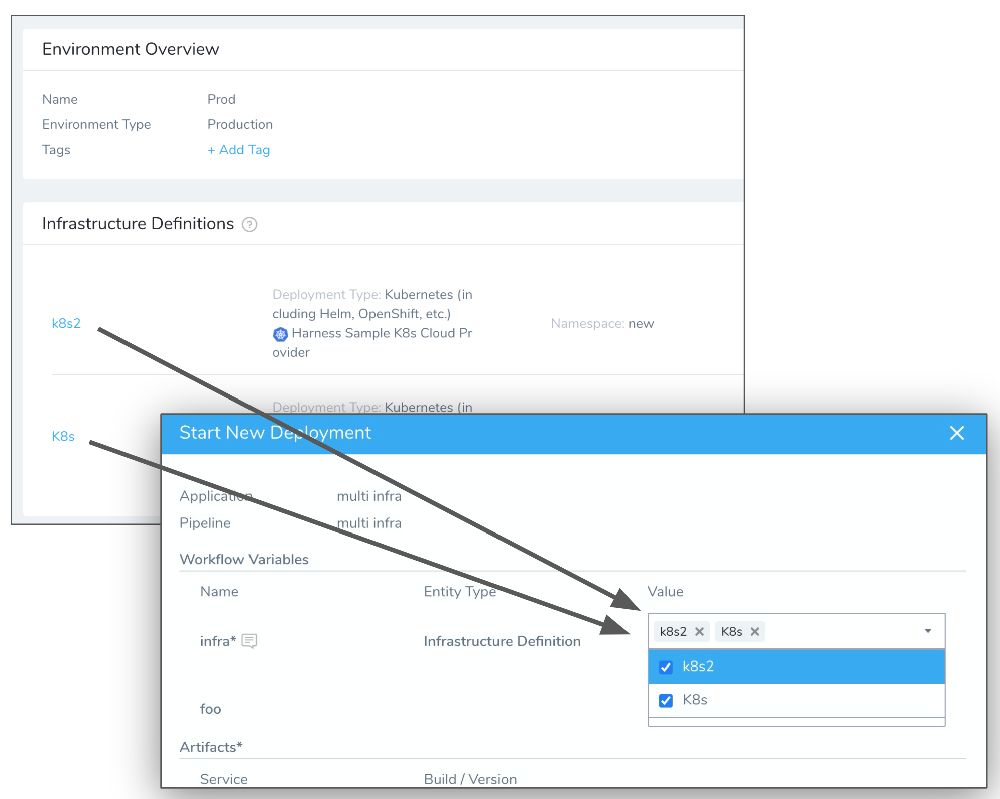
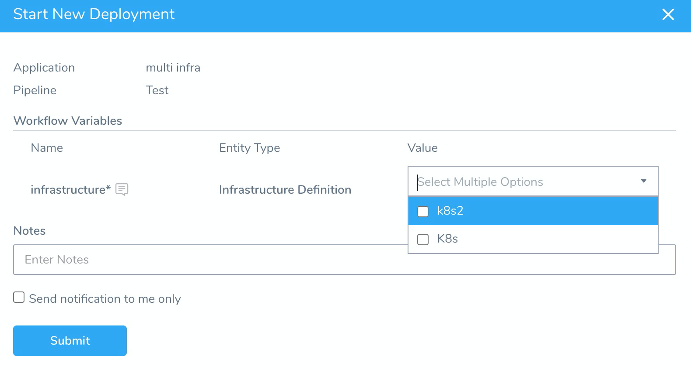
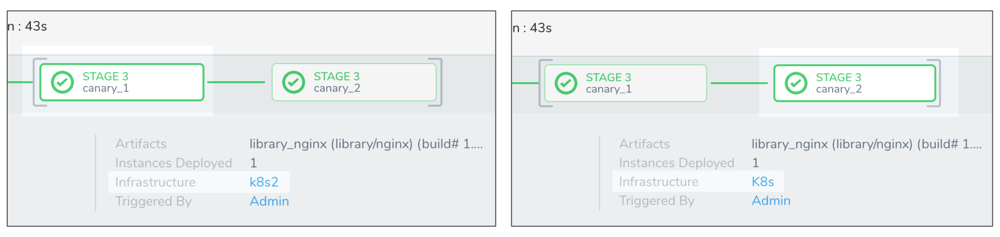
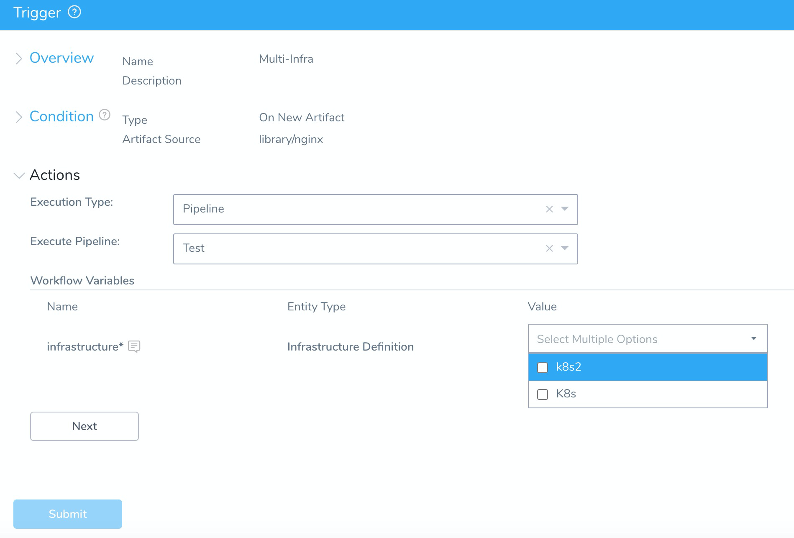

This content is for Harness [FirstGen](../../../../getting-started/harness-first-gen-vs-harness-next-gen.md). Switch to [NextGen](https://docs.harness.io).Most Harness customers deploy the same service to multiple infrastructures, such as infrastructures for different stages of the release process (QA, Prod) or in different regions. However, by default, Workflows only have one target infrastructure configured, defined as its Infrastructure Definition.

Having only one infrastructure configured can pose certain challenges:

* Multiple Workflow deployments for each infrastructure must be managed (tracked, rolled back, etc).
* More Workflows means more errors can be introduced, and consistency is more difficult to ensure.
* Creating separate Workflows for each infrastructure is time-consuming.

To solve these challenges, Harness lets you deploy a single Workflow to several infrastructures. First you template the Infrastructure Definition setting, add the Workflow to a Pipeline, and then select multiple infrastructures when you deploy the Pipeline. Next, Harness reruns the same Workflow for each infrastructure, in parallel.

### Before You Begin

* [Templatize a Workflow](https://docs.harness.io/article/bov41f5b7o-templatize-a-workflow-new-template)
* [Create Pipeline Templates](https://docs.harness.io/article/60j7391eyy-templatize-pipelines)

### Visual Summary

First, the Workflow Infrastructure Definition setting is templated with the `${infrastructure}` expression and then, when deployed, the `infrastructure` Workflow multi-select variable is given multiple infrastructures.



Here is an example of a Pipeline deployment Stage using the Workflow that deploys to two Infrastructure Definitions:



### Limitations

* Multi-infrastructure deployments can be done using Pipelines only, not individual Workflow deployments.
* You can only use the same variable when you template the Infrastructure Definitions settings in multiple phases or a Workflow for in multi-infrastructure deployments.  
If you have a multi-phase Workflow (such as a two-phase Canary Deployment) then you must use the same variable for both phases **Infrastructure Definition** settings.
* You can only execute Multi-infrastructure deployments if your User Group's Application Permissions includes the **Execute Pipeline** action on all the infrastructures selected in the Pipeline. By default, all User Groups can deploy to all Infrastructure Definitions. See [Restrict Deployment Access to Specific Environments](restrict-deployment-access-to-specific-environments.md).

### Step 1: Add Multiple Infrastructure Definitions

To deploy to multiple infrastructures, you first need to define multiple Infrastructure Definitions in a Harness Environment.

You must use a single Environment for these Infrastructure Definitions. You can use this Environment in the Workflow that you want to deploy to these Infrastructure Definitions, or you can template the Environment setting in the Workflow, and then select the Environment when you deploy. Either way, a single Environment is used when you deploy.

Later, when you deploy the Pipeline, you will select from the list of multiple Infrastructure Definitions in the Environment.

See [Add an Infrastructure Definition](https://docs.harness.io/article/v3l3wqovbe-infrastructure-definitions).

### Step 2: Template Workflow Infrastructure Definitions

In order for a Workflow to deploy to multiple infrastructures, you must template (or *templatize*) its Infrastructure Definition setting. This turns the Infrastructure Definition setting into a parameter that can be given a value when you deploy the Pipeline (and its Workflows).

You can only use multi-infrastructure deployments on Workflows with one phase. See [Limitations](#limitations) below.

For steps on templating the Infrastructure Definition setting in a Workflow, see [Templatize a Workflow](https://docs.harness.io/article/bov41f5b7o-templatize-a-workflow-new-template).

### Step 3: Template Pipeline Infrastructure Definitions

You can only deploy a Workflow to multiple infrastructures as part of a Pipeline. You cannot deploy a Workflow to multiple infrastructures by itself.

Add the Workflow that you want to deploy to multiple infrastructures to a Pipeline. See [Create a Pipeline](https://docs.harness.io/article/zc1u96u6uj-pipeline-configuration).

When you add your Workflow to the Pipeline, you must template its Infrastructure Definition setting. If, instead, you select an Infrastructure Definition, you cannot select multiple Infrastructure Definition later when you deploy.

For steps on templating the Infrastructure Definitions in a Pipeline, as well as other Pipeline settings, see [Create Pipeline Templates](https://docs.harness.io/article/60j7391eyy-templatize-pipelines). You simply need to enter in a variable expression, such as `${infrastructure}`.

Here is an example where the Workflow Infrastructure Definition setting is templated with the `${infrastructure}` expression and then, when deployed, the `infrastructure` Workflow variable is given multiple infrastructures.


### Step 4: Deploy to Multiple Infrastructure Definitions

Now that you have added the Workflow to a Pipeline and templated the Infrastructure Definition setting, you can deploy the Pipeline and select multiple infrastructures.

In your Pipeline, click **Deploy**. If you click **Start New Deployment** in the Continuous Deployment page, select the Pipeline.

In **Workflow Variables**, find the Workflow variable created for the templated Infrastructure Definition.

In **Value**, select the multiple infrastructures where you want to deploy. Click the checkbox next to each Infrastructure Definition.



Click **Submit**.

The Workflows that use multiple Infrastructure Definitions are displayed in parentheses to indicate that they are executing in parallel.

Click each Workflow and look in the **Infrastructure** displayed. It will show a different Infrastructure Definition for each Workflow.



### Step 5: Trigger Multiple Infrastructure Workflows and Pipelines

When you create a Trigger for the Pipeline, you must select the multiple Infrastructure Definitions for the Workflow(s) it contains:



The Trigger will execute the Pipeline and deploy to both infrastructures just as it did when you deployed the Pipeline on its own.

See [Trigger Workflows and Pipelines](https://docs.harness.io/article/xerirloz9a-add-a-trigger-2).

### Option: Use Multiple Infrastructure Definitions in the API

If you have templated your Workflow and Pipeline **Infrastructure Definition** settings as described above, you can execute the Pipeline in the Harness GraphQL API and provide multiple Infrastructure Definitions.

You can provide multiple Infrastructure Definitions as a comma-separated list by Infrastructure Definition name:


```
...  
      {  
        name: "InfraDefinition_Kubernetes"  
      variableValue: {  
        type: NAME  
        value: "k8s1,k8s2"  
      	}  
      },  
...
```
Or by Infrastructure Definition ID:


```
...  
    {  
      name: "InfraDefinition_Kubernetes"  
      variableValue: {  
        type: ID  
        value: "oX8gFrDsTLWtYcZq4E8eGg,g6ghpzB3QICjNNbnzYRpIg"  
      }  
    }  
...
```
See [Trigger Workflows or Pipelines Using GraphQL API](https://docs.harness.io/article/s3leksekny-trigger-workflow-or-a-pipeline-using-api).

### Review: Rollback

When you deploy a Workflow to multiple infrastructures, the Workflow is executed as if it were two Workflows executed in parallel. Harness is actually triggering the same Workflow twice using two different Infrastructure Definitions.

If either Workflow fails, that particular Workflow is rolled back, not both Workflows. The Failure Strategy for the failed Workflow is executed. The Workflow that succeeded is not rolled back.

If either Workflow fails, the Pipeline stage fails, naturally, and the Pipeline deployment fails.

