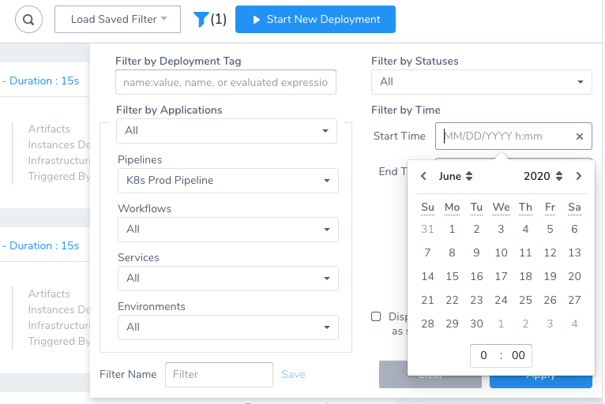
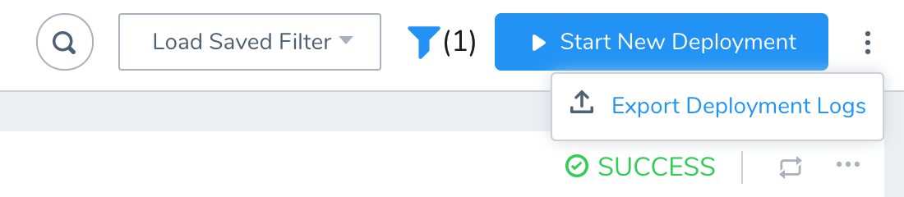
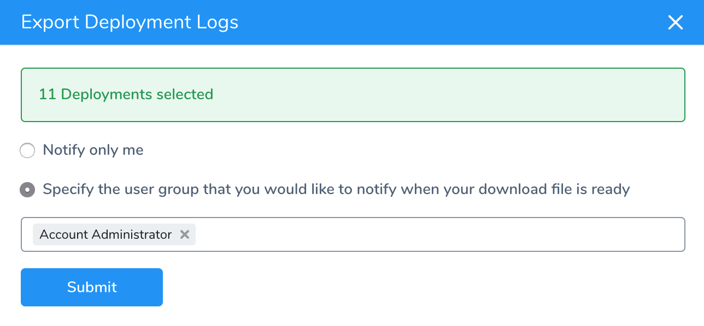
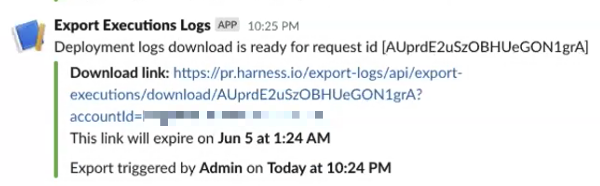
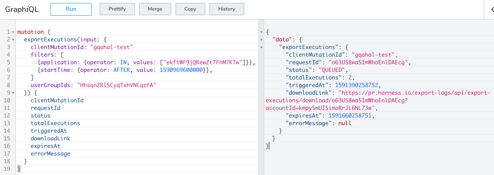
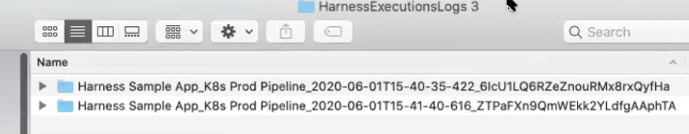
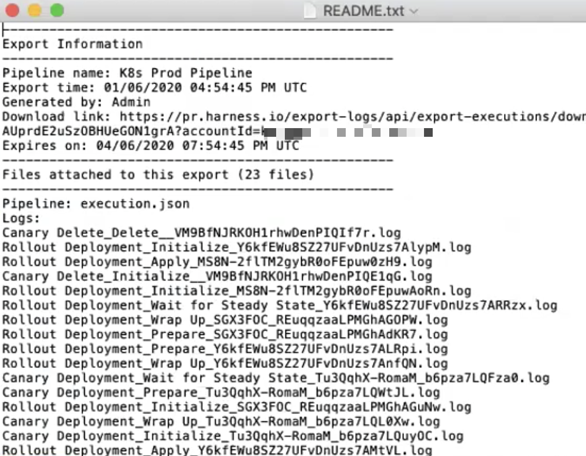

This content is for Harness [FirstGen](../../../../getting-started/harness-first-gen-vs-harness-next-gen.md). Switch to [NextGen](https://docs.harness.io/article/0slo2gklsy).Large enterprises are highly regulated and auditing the deployments happening in their environments is critical. These audits might take into account deployment information across years.

Harness provides advanced auditing in the Harness Manager, as described in [Audit Trail](https://docs.harness.io/article/kihlcbcnll-audit-trail), and deployment information in the **Deployments** page and [dashboards](https://docs.harness.io/article/c3s245o7z8-main-and-services-dashboards), but large enterprises want to save deployment information to their centralized archives for years to come.

Harness includes deployment exports to serve this need. Deployment exports give you control over what is stored and audited and allows you to save deployment information in your archives.

Harness also provides an API for deployment exports, enabling you to extract logs programmatically.

### Before You Begin

Familiarize yourself with the different ways Harness displays deployment information:

* [Custom Dashboards](https://docs.harness.io/article/rxlbhvwe6q-custom-dashboards)
* [Main and Services Dashboards](https://docs.harness.io/article/c3s245o7z8-main-and-services-dashboards)
* [Audit Trail](https://docs.harness.io/article/kihlcbcnll-audit-trail)
* [Harness API](https://docs.harness.io/article/tm0w6rruqv-harness-api)

### Limitations

* Exports are limited to 25 exports per day.
* There is a limit of 1000 deployments per export. You can use the Deployments page filtering to control how many deployments are in each log.
* Anyone can use the export file download link from Harness to download the logs. There is no authentication. You can specify the Harness User Group to notify in Harness Manager and in the API (`userGroupIds`).
* Export log download links expire 72 hours after they are generated.
* There is a hard limit of 25MB for logs produced by 1 Workflow step. Logs beyond this limit will be skipped and not available for download as well.

### Review: Export Process

There are two options for exporting deployment logs from Harness:

* Harness Manager
* Harness API

In both options, the process is:

1. Once you export logs from Harness, Harness is notified of your request.
2. Harness processes your request in the background.
3. Once Harness is finished:
	1. If you are using the Harness Manager: Harness sends you an email or Slack message with a link to your log file. You can specify the Harness User Group to notify.
	2. If you using the Harness API, the `status` field is updated with `READY`.
4. You can then download the log archive file.

### Option 1: Export Using the Harness Manager

In the Harness Manager **Deployments** page, you filter all deployments to get the exact deployments you want to export, specify which Harness User Groups to notify when Harness has the export file, and then export the logs.

Next, you check email or Slack to get the download link.

#### Filter Deployments

In the Harness Manager, filter the deployment logs before exporting. This ensures that you have exactly the deployment logs you want.

1. In **Deployments**, click the filter button to show the filter settings.
   
2. Use the filter settings to get the exact logs you want to export. Be sure to use the **Filter by** and **Filter by Time** settings to control which deployments you download and their date range.

Once you have the deployments you want to export, you can begin the export process.

#### Export Deployment Logs

1. In the **Deployments** page, click the options button and click **Export Deployment Logs**.
   
2. In **Export Deployment Logs**, specify the Harness User Groups to notify when the log file is ready.
   
   The User Groups are notified using their email and/or Slack settings, as described in [Manage User Notifications](https://docs.harness.io/article/kf828e347t-notification-groups).
3. Click **Submit**.

#### Download Log File

Check the User Group's email or Slack channels (or other notification tools) for the Export Execution Logs message:



As you can see, the message has a **Download link**. Click that link to download the log archive.

### Option 2: Export Using the Harness API

You can use Harness API mutation `exportExecutions` to fetch your deployment logs. It provides all of the same options as the Harness Manager.

`exportExecutions` includes the following arguments:


```
clientMutationId: String  
  
filters: [ExecutionFilter!]  
  Execution filters  
  
notifyOnlyTriggeringUser: Boolean  
  Notify only the triggering user  
  
userGroupIds: [String!]  
  User group ids
```
You will use these arguments to specify the deployment logs you want. You can also use `Executionfilter` fields to control which deployments you download and their date range.

Here's an example that downloads an Application's deployments and uses the `startTime` field to filter:


```
mutation {  
  exportExecutions(input: {  
    clientMutationId: "gqahal-test"  
    filters: [  
      {application: {operator: IN, values: ["ekftWF9jQRewZt7FhM7KTw"]}},  
      {startTime: {operator: AFTER, value: 1590969600000}},  
    ]  
    userGroupIds: "HhsqnZRlSCyqTxhVNCqzfA"  
  }) {  
    clientMutationId  
    requestId  
    status  
    totalExecutions  
    triggeredAt  
    downloadLink  
    expiresAt  
    errorMessage  
  }  
}
```
The `clientMutationId` option is simply used here to demonstrate the case where multiple clients are making updates.Note the use of `userGroupIds` to indicate which Harness User Group to notify via its [Notification Settings](https://docs.harness.io/article/kf828e347t-notification-groups). You can get the ID using the API queries `userGroup` or `userGroupByName` or from the Harness Manager URL when looking at the User Group.

Here is the example response:


```
{  
  "data": {  
    "exportExecutions": {  
      "clientMutationId": "gqahal-test",  
      "requestId": "o63US8waSImWhoEnlDAEcg",  
      "status": "QUEUED",  
      "totalExecutions": 2,  
      "triggeredAt": 1591390258752,  
      "downloadLink": "https://pr.harness.io/export-logs/api/export-executions/download/o63US8waSImWhoEnlDAEcg?accountId=kmpySmUISimoRrJL6NL73w",  
      "expiresAt": 1591660258751,  
      "errorMessage": null  
    }  
  }  
}
```
Here is a screenshot showing them together:



The `downloadLink` field contains the link to your export log archive.

Look for the `status` code in the results. It will show `"status": "QUEUED"` until the export is ready.

There are four statuses:

* EXPIRED
* FAILED
* QUEUED
* READY

When the export is ready, it will show `"status": "READY"`.

When the status code is READY you can download the log archive using the link.

### Step 1: Examine the Log Files

Once you have downloaded and extracted the log archive, you will have the folder named **HarnessExecutionsLogs**.

Inside, you will see separate folders for each deployment:



The folder name shows the deployment timestamp and unique ID.

Open a folder and you will see that each deployment step has a different log file.


These correspond to the deployment steps and subcommands displayed in the Harness **Deployments** page.

The README file contains a summary of all log files.



Open a log file and you will see the deployment information for the step subcommands.

### Step 2: Use the JSON Export File

In each deployment folder there is a file named **execution.json**.

The execution.json file contains your entire Pipeline or Workflow structure, all Workflow steps and subcommands, Services, artifacts, Harness Delegates, and so on.

The execution log file for each subcommand is listed also:


```
...  
            "subCommands" : [ {  
              "name" : "Execute",  
              "type" : "COMMAND",  
              "status" : "FAILURE",  
              "executionLogFile" : "Shell Script_Execute_Oc8AGrsXR6KimnFPTN97AgXlt2.log"  
            } ],  
...
```
