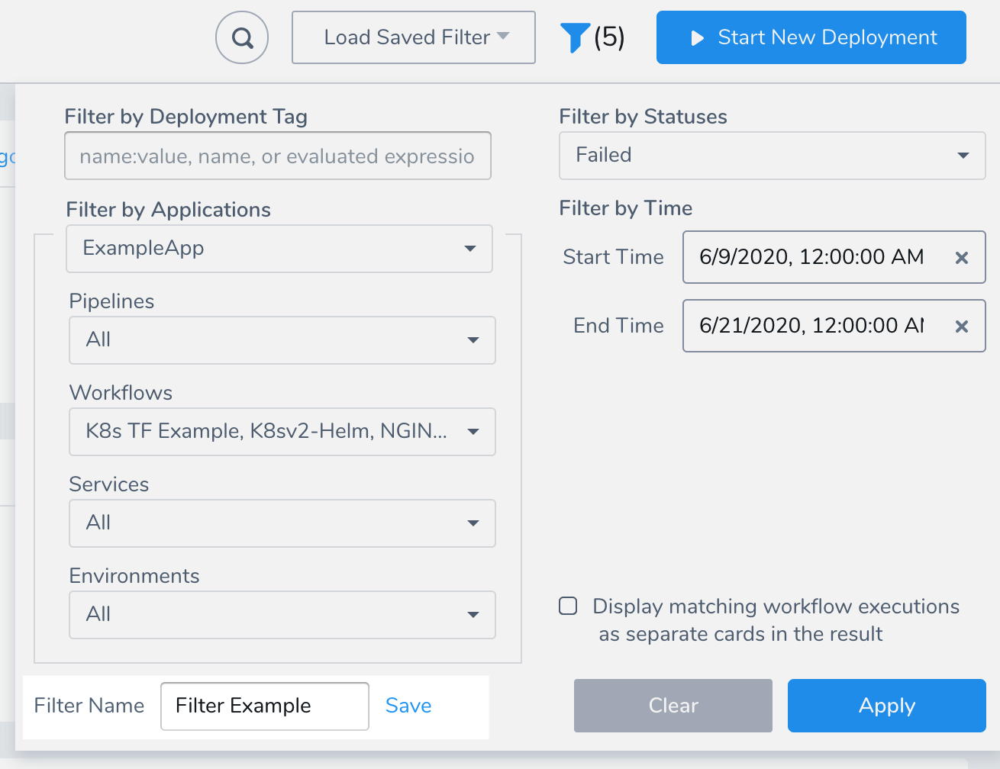
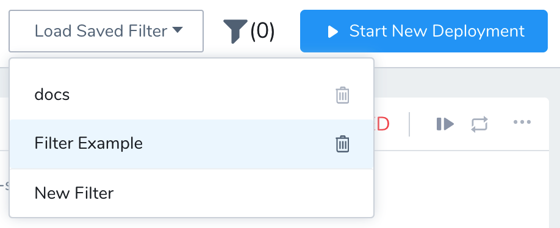
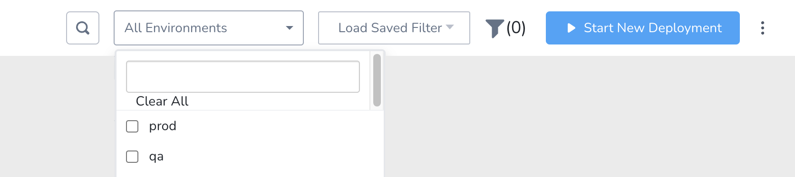
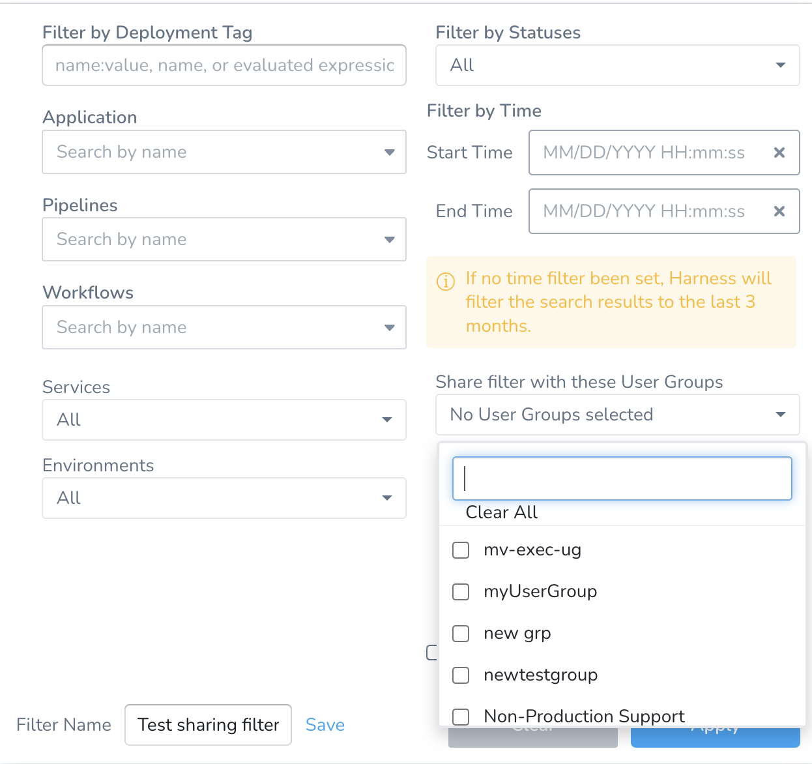

This content is for Harness [FirstGen](/docs/getting-started/harness-first-gen-vs-harness-next-gen.md). Switch to [NextGen](/docs/continuous-delivery/monitor-deployments/monitor-cd-deployments.md).You can filter deployments on the the Deployments page according to multiple criteria.

You can save these filters as a quick way to filter deployments in the future.

### Before You Begin

- [Deployments Overview](deployments-overview.md)
- [Harness Key Concepts](../../../starthere-firstgen/harness-key-concepts.md)

### Limitations

The **Aborting** status filter is in progress and does not work presently.

### Visual Summary

Here is what the Deployments page filter options looks like:

As you can see, you can filter according to multiple criteria. Next, you can give your filter a name and save it.

### Option 1: Filter by Deployment Tag

In **Filter by Deployment Tag**, enter one or more Tags in your account's **Tags Management**.

You can enter a Tag name, name:value pair, or evaluated expression.

See [Assign Metadata Using Tags](../../../firstgen-platform/account/tags/tags.md), [Use Expressions in Workflow and Pipeline Tags](../../../firstgen-platform/account/tags/use-expressions-in-workflow-and-pipeline-tags.md), and [Apply Filters Using Tags](../../../firstgen-platform/account/tags/apply-filters-using-tags.md).

### Option 2: Filter by Applications

In **Filter by Applications**, select the Application entities to filter on.

First, select an Application. This will populate the remaining settings with the subordinate entities of the Application.

If you select multiple Applications, then all of the subordinate entities of the Applications are provided.

### Option 3: Filter by Statuses

In **Filter by Statuses**, select all of the statuses you want to filter on.

### Option 4: Filter by Time

In **Filter by Time**, select a date range for the filter.

### Step: Save a Filter

In **Filter Name**, enter a name for the filter and click **Save**.

The filter is now available from the **Load Saved Filter**:

### Quickly filter by environment

:::note

Currently, this feature is behind the feature flag `SPG_ENABLE_STATUS_OF_DEPLOYMENTS`. Contact [Harness Support](mailto:support@harness.io) to enable the feature.

:::

You can quickly filter environments by selecting specific environments using the filter menu:

### Sharing filters

:::note

Currently, this feature is behind the feature flag `SPG_ENABLE_SHARING_FILTERS`. Contact [Harness Support](mailto:support@harness.io) to enable the feature.

:::

If you are a Harness Account Manager, you can user the **Share filter with these User Groups** setting to select the user groups that can see a filter. All the users in that user group will be able to use the saved filter, but they won't be able to delete it. Users belonging to other user groups won't see the filter.

