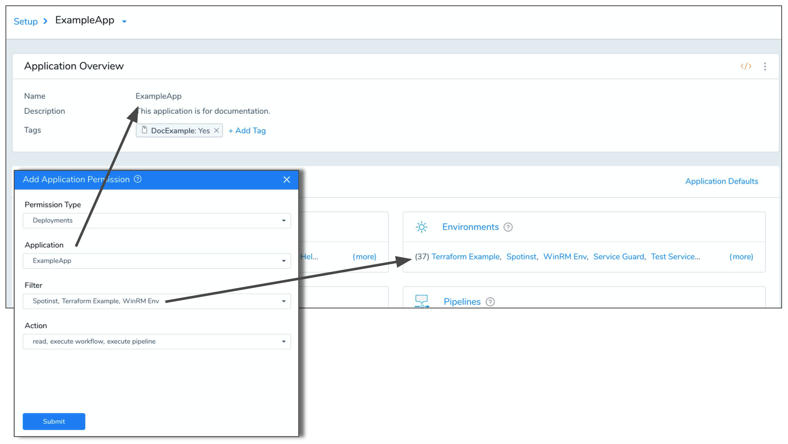
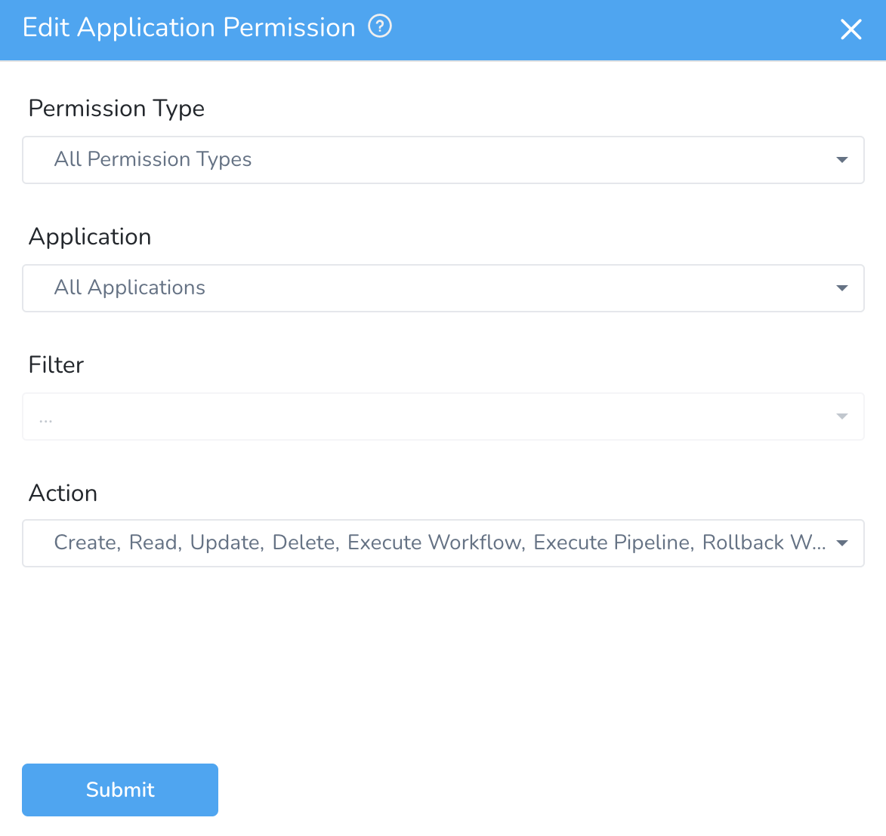
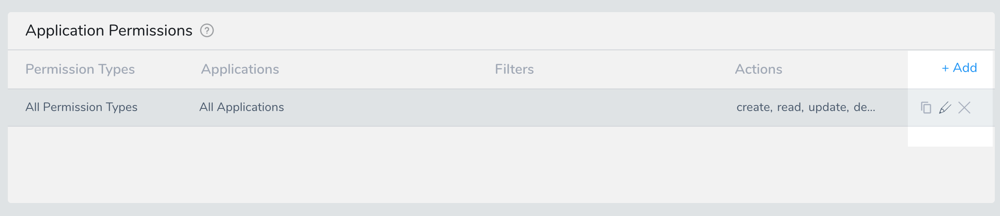
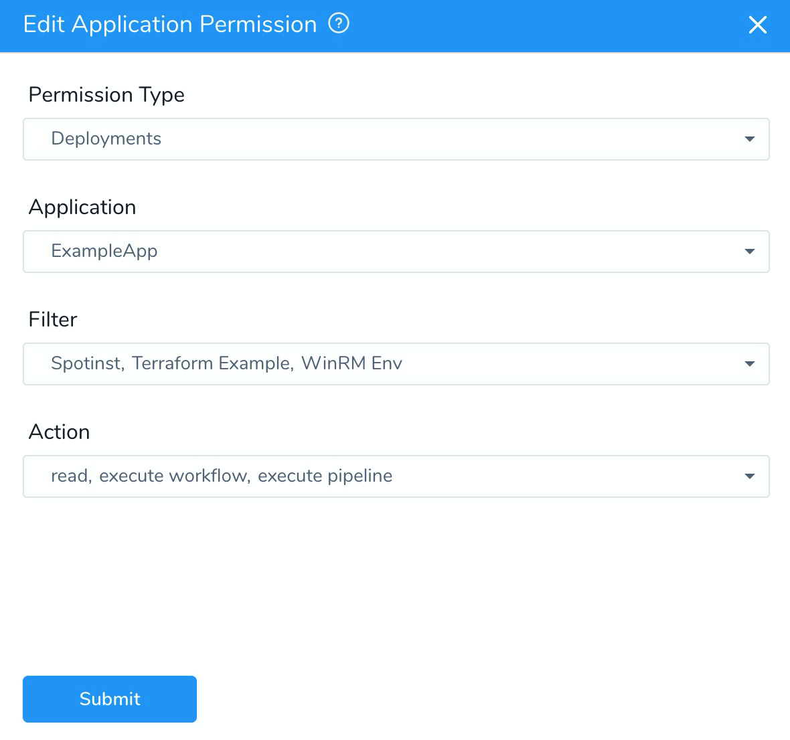
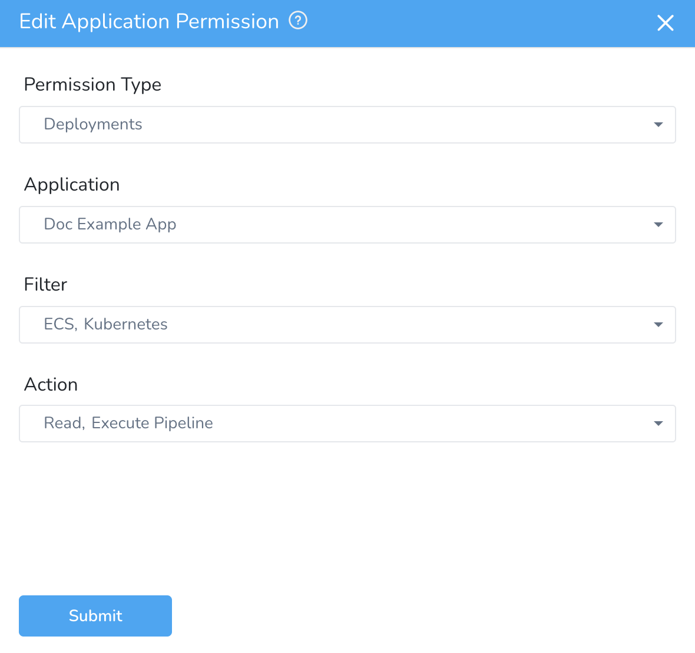

This content is for Harness [FirstGen](../../../../getting-started/harness-first-gen-vs-harness-next-gen.md). Switch to [NextGen](https://docs.harness.io).By default, all Harness User Group members have full permissions on all Applications.

Using Harness RBAC functionality, you can restrict the deployments a User Group may perform to specific Harness Applications and their subordinate Environments.

Restricting a User Group's deployments to specific Environments enables you to manage which target infrastructures are impacted by your different teams. For example, you can have Dev environments only impacted by Dev teams, and QA environments only impacted by QA teams.

### Before You Begin

Ensure you are familiar with the following Harness features:

* [Managing Users and Groups (RBAC)](https://docs.harness.io/article/ven0bvulsj-users-and-permissions)
* [Create an Application](https://docs.harness.io/article/bucothemly-application-configuration)
* [Add an Environment](https://docs.harness.io/article/n39w05njjv-environment-configuration)

### Visual Summary

In the following image, you can see that the Application Permissions for a Harness User Group are set for a specific Application and three of its Environments:

Members of this User Group will have permission to execute Workflow and Pipeline deployments for those target Environments only.

### Option: Create or Edit a User Group

Harness User Groups are managed in **Security** > **Access Management** > **User Groups**.

Open a User Group. You will edit its **Application Permissions** to restrict its members deployment permissions to specific Application Environments.

For steps on setting up a User Group, see [Managing Users and Groups (RBAC)](https://docs.harness.io/article/ven0bvulsj-users-and-permissions).

### Option: Set Application Permissions

By default, all Harness User Groups members have full permissions on all Applications.

In **Application Permissions**, click the pencil icon to edit the default permissions.

The Application Permission settings appear. Configure the following settings:

1. In **Permission Type**, enable **Deployments** or any other permissions other than **All Permission Types**.
2. In **Application**, select the Application(s) you want to grant deployment permissions for. Use the search feature if needed.
3. In **Filter**, select the Environments in the Applications you selected. These are the Environments that you want to allow the User Group members to deploy to. Use the search feature if needed.
4. In **Action**, select **Read**, **Execute Workflow**, **Execute Pipeline,** and **Rollback Workflow**.

When you're done, the Application Permission will look something like this:

Now this User Group's members can only deploy to the Environments you selected.

Add and remove members as needed.

### Option: Set Application Permissions for Execute Workflow

In **Application Permissions**, click the pencil icon to edit the default permissions.

The Application Permission settings appear. Configure the following settings:

1. In **Permission Type**, enable **Deployments** or any other permissions other than **All Permission Types**.
2. In **Application**, select the Application(s) you want to grant deployment permissions for. Use the search feature if needed.
3. In **Filter**, select the Environments in the Applications you selected. These are the Environments that you want to allow the User Group members to deploy to. Use the search feature if needed.
4. In **Action**, select **Read** and **Execute Workflow**.

User Group members with only **Execute Workflow** permissions cannot **Execute Pipeline** or **Rollback Workflow**.When you're done, the Application Permission will look something like this:

### Option: Set Application Permissions for Execute Pipeline

In **Application Permissions**, click the pencil icon to edit the default permissions.

The Application Permission settings appear. Configure the following settings:

1. In **Permission Type**, enable **Deployments** or any other permissions other than **All Permission Types**.
2. In **Application**, select the Application(s) you want to grant deployment permissions for. Use the search feature if needed.
3. In **Filter**, select the Environments in the Applications you selected. These are the Environments that you want to allow the User Group members to deploy to. Use the search feature if needed.
4. In **Action**, select **Read** and **Execute Pipeline**.

User Group members with only **Execute Pipeline** permissions cannot **Execute Workflow** or **Rollback Workflow**.When you're done, the Application Permission will look something like this:

### Option: Set Application Permissions for Rollback Workflow

In **Application Permissions**, click the pencil icon to edit the default permissions.

The Application Permission settings appear. Configure the following settings:

1. In **Permission Type**, enable **Deployments** or any other permissions other than **All Permission Types**.
2. In **Application**, select the Application(s) you want to grant deployment permissions for. Use the search feature if needed.
3. In **Filter**, select the Environments in the Applications you selected. These are the Environments that you want to allow the User Group members to deploy to. Use the search feature if needed.
4. In **Action**, select **Read** and **Rollback Workflow**.

User Group members with only **Rollback Workflow** permissions cannot **Execute Pipeline** or **Execute Workflow**.When you're done, the Application Permission will look something like this:

### Deployments Permissions

The following table lists the permissions of User Group members based on the Action assigned corresponding to the Deployments Permission Type:

|  |  |  |  |
| --- | --- | --- | --- |
| **Permission Type** | **Action** | **Users Can** | **Users Cannot** |
| Deployments | Read | * Can View Workflow Executions
* Can View Pipeline Executions
 | * Cannot Execute/Pause/Resume/Abort/Rollback Workflow Executions
* Cannot perform any Manual Intervention Workflow
* Cannot Execute/Pause/Resume/Abort Pipeline Executions
* Cannot perform any Manual Intervention or Runtime Inputs for Pipelines
 |
|  | Execute Workflow | * Can View/Execute/Pause/Resume/Abort Workflow Executions
* Can perform Manual Intervention Workflow (except Rollback)
 | * Cannot Rollback Workflow Executions
* Cannot Execute/Pause/Resume/Abort Pipeline Executions
* Cannot perform Manual Intervention Pipeline
 |
|  | Execute Pipeline | * Can View/Execute/Pause/Resume/Abort Pipeline Executions
* Can perform Manual Intervention Pipeline (except Rollback)
 | * Cannot Execute/Pause/Resume/Abort/Rollback Workflow Executions
* Cannot perform Manual Intervention Workflow (except Rollback)
 |
|  | Rollback Workflow | * Can View Workflow Executions
* Can View Pipeline Executions
* Can Rollback Workflow Executions
 | * Cannot Execute/Pause/Resume/Abort Workflow Executions
* Cannot Execute/Pause/Resume/Abort Pipeline Executions
* Cannot perform Manual Intervention Workflows
* Cannot perform Manual Intervention Pipelines
 |

### Related

* **Assign Permissions** in [Use Users and Groups API](https://docs.harness.io/article/p9ssx4cv5t-sample-queries-create-users-user-groups-and-assign-permissions)
* [Manage User Notifications](https://docs.harness.io/article/kf828e347t-notification-groups)

