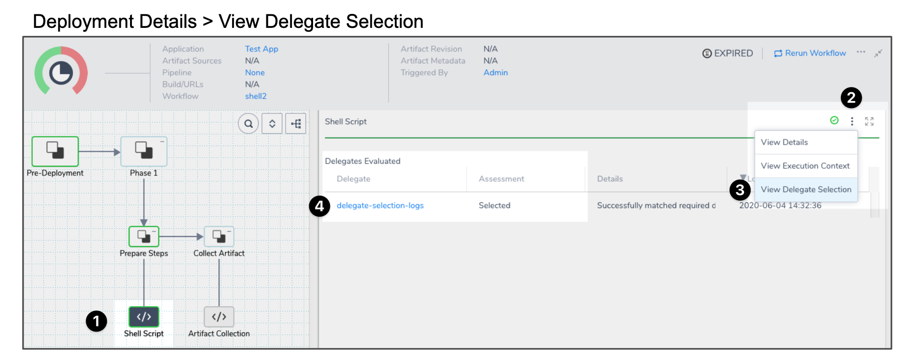
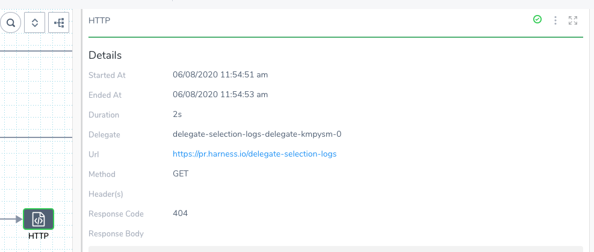
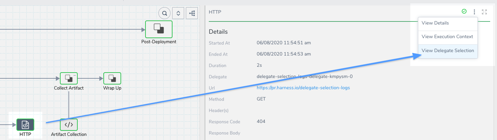
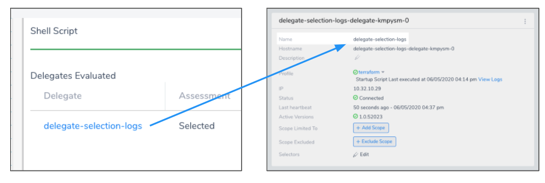
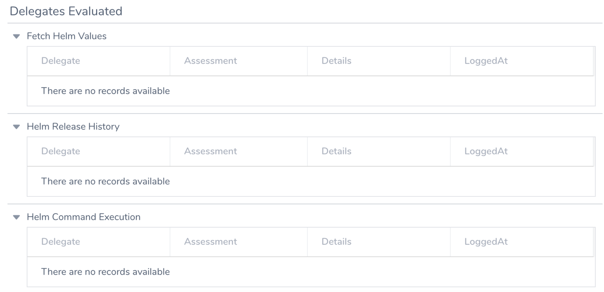

This content is for Harness [FirstGen](../../../../getting-started/harness-first-gen-vs-harness-next-gen.md). Switch to [NextGen](https://docs.harness.io/article/0slo2gklsy).Each task performed by a Harness deployment is assigned to a Delegate. Knowing which Delegate was used for a task can be useful when diagnosing issues, or when planning on infrastructure changes.

Harness displays which Delegate performed a task in the Deployments page. You simply click on a command in a deployment's graph and select **View Delegate Selection** in its details.

This topic will walk you through the process.

### Before You Begin

* [Harness Key Concepts](https://docs.harness.io/article/4o7oqwih6h-harness-key-concepts)
* [Delegate Installation and Management](https://docs.harness.io/article/h9tkwmkrm7-delegate-installation)

### Visual Summary

The following illustration shows you how to view Delegate selection for each deployment task:

1. Select a command in the deployment graph.
2. Click the *more options* button (**︙**) in the command's details
3. Select **View Delegate Selection**.
4. Click the Delegate name to see the Delegate on the **Harness Delegates** page.

### Review: How Does Harness Pick Delegates?

When a task is ready to be assigned, the Harness Manager first validates its list of Delegates to see which Delegate should be assigned the task.

The following information describes how the Harness Manager validates and assigns tasks to a Delegate:

* **Heartbeats** - Running Delegates send heartbeats to the Harness Manager in 1 minute intervals. If the Manager does not have a heartbeat for a Delegate when a task is ready to be assigned, it will not assign the task to that Delegate.
* **Selectors and Scoping** - For more information, see  [Delegate Selectors](https://docs.harness.io/article/h9tkwmkrm7-delegate-installation#delegate_selectors) and  [Delegate Scope](https://docs.harness.io/article/h9tkwmkrm7-delegate-installation#delegate_scope).
* **Whitelisting** - Once a Delegate has been validated for a task, it is whitelisted for that task and will likely be used again for that task. The whitelisting criteria is the URL associated with the task, such as a connection to a cloud platform, repo, or API. A Delegate is whitelisted for all tasks using that URL. The Time-To-Live (TTL) for the whitelisting is 6 hours, and the TTL is reset with each successful task validation.
* **Blacklisting** - If a Delegate fails to perform a task that Delegate is blacklisted for that task and will not be tried again. TTL is 5 minutes. This is true if there is only one Delegate and even if the Delegate is selector for that task with a Selector, such as with a Shell Script command in a Workflow.

### Step 1: Select a Deployment Command

In Harness, click **Continuous Deployment** to see the Harness **Deployments** page.

Click on a **deployment**. You can use the filter options to located specific deployments by Tag, Application name, date range, and so on.

In the deployment, click a command. The details for the command appear.

### Step 2: Select View Delegate Selection

In the details pane for the command, click the more options button (**︙**) and select **View Delegate Selection**.

### Step 3: View the Delegate Selection for the Command

The Delegate selection information contains the Delegate(s) used for the command, their assessment (Selected, etc), details about how the Delegate was used, and the timestamp of the log entry.

The **Assessment** and **Details** sections explain why a Delegate was or wasn't selected.

#### Delegate selection logs do not apply

If you see the message `Delegate selection logs do not apply`, it means that the Workflow step does not require a Delegate or that there is no information in the database.

### Step 4: View the Delegate Status and Settings

In the **Delegate** column you will see the Delegate name. You can click the name to go to the Harness Delegates page and see the Delegates.

### Limitations

Full support for all Workflow steps will be added soon. A tooltip in **View Delegate Selection** will indicate any currently unsupported Workflow steps.

### Deployments Prior to Enabling View Delegate Selection

For deployments that occurred before the View Delegate Selection feature was enabled, you will see the message `There are no records available`:

After View Delegate Selection is enabled (the Feature Flag is removed), only subsequent deployments will display Delegate selection records for supported steps.

