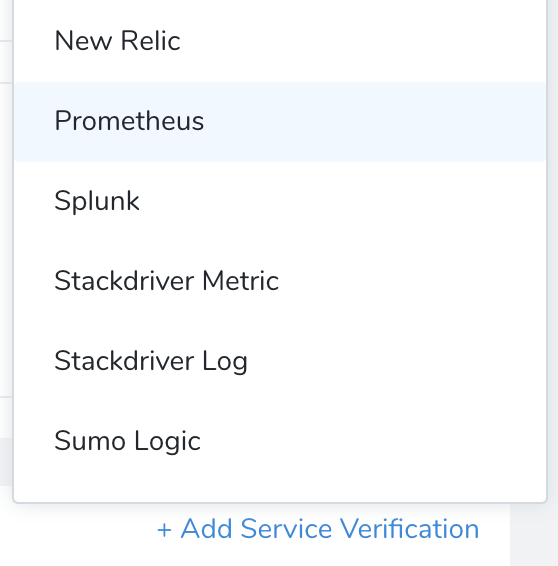
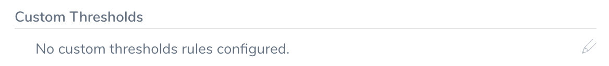
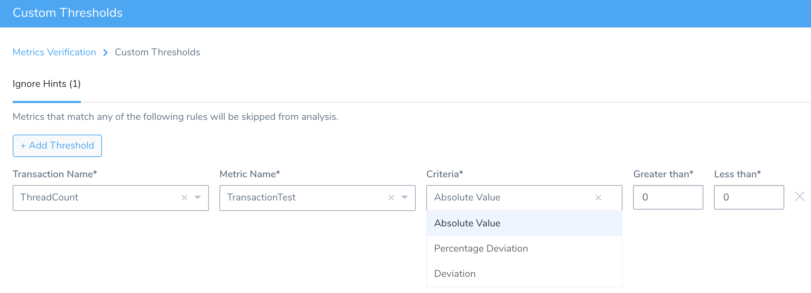
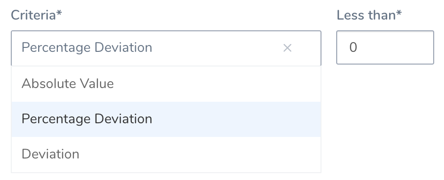

Use Custom Thresholds to define **Ignore Hints** rules that instruct Harness to remove certain metrics/value combinations from 24/7 Service Guard analysis. 

### Before You Begin

* See [24/7 Service Guard Overview](set-up-service-guard.md).
* In your Application's Environment, select **24/7 Service Guard** > **Add Service Verification**.
* Select a verification provider compatible with Custom Thresholds.Harness currently supports Custom Thresholds with [Prometheus](../prometheus-verification/2-24-7-service-guard-for-prometheus.md) and [Custom APMs](../custom-metrics-and-logs-verification/custom-verification-overview.md).

  
  
* Configure at least one Metrics Collection for this verification provider.

### Step 1: Invoke Custom Thresholds

To begin defining one or more Ignore Hints:

1. In the configuration dialog for your selected 24/7 Service Guard verification provider, click the pencil icon shown below.

   
   
2. In the resulting dialog, click **Add Threshold** to begin defining a rule, as shown below.

   

### Step 2: Define a Rule

Use the drop-downs to select a desired **Transaction Name** and **Metric Name** from your defined Metrics Collections.

### Step 3: Select Criteria

Select the **Criteria** for this rule, and enter a corresponding **Value**. (Depending on your **Criteria** selection, the **Value** field's label will change to **Less than** and/or **Greater than**.)

Here are the **Criteria** and **Value** options available for the metric you've selected.

|  |  |
| --- | --- |
| **Criteria** | **Value** |
| Absolute Value | Enter literal values of the selected metric in the **Greater than** and **Less than** fields. Observed values between these two threshold boundaries will be removed from 24/7 Service Guard analysis. |
| Percentage Deviation | Enter a threshold percentage at which to remove the metric from 24/7 Service Guard analysis. Units here are percentages, so entering **Less than:** `3` will instruct Harness to ignore anomalies less 3% away from the norm. |
| Deviation | This also sets a threshold deviation from the norm. But here, the units are not percentages, but literal values of the selected metric. Observed anomalies **Less than** the threshold you enter will be removed from analysis. |

### Step 4: Add Rules and Save

1. If you want to define additional rules, click **Add Threshold**, then repeat Steps 2–3.
2. Click **Submit** to save your rules and apply them to 24/7 Service Guard verification for this Service.

### Next Steps

* In Harness' Continuous Verification dashboard, the [24/7 Service Guard heat map](set-up-service-guard.md#setup-overview) for this Service and verification provider will show no risk indicators for events that fall within your Ignore Hints.

