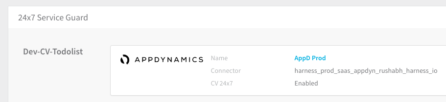
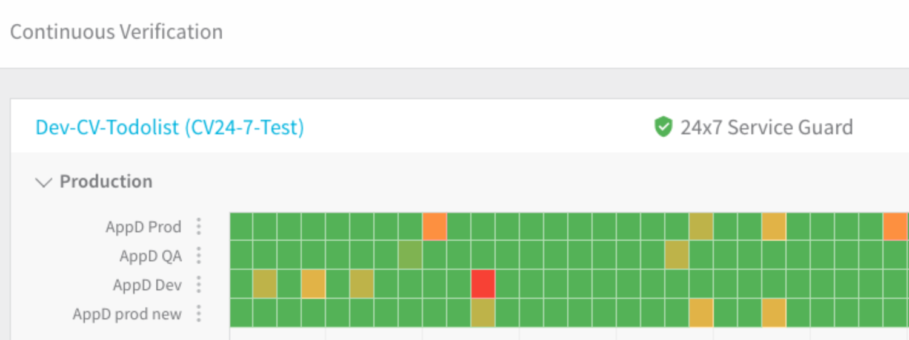
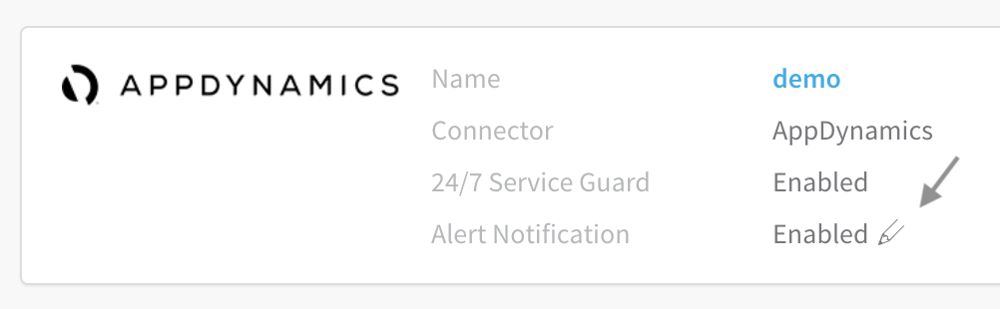
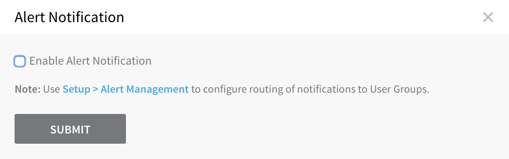
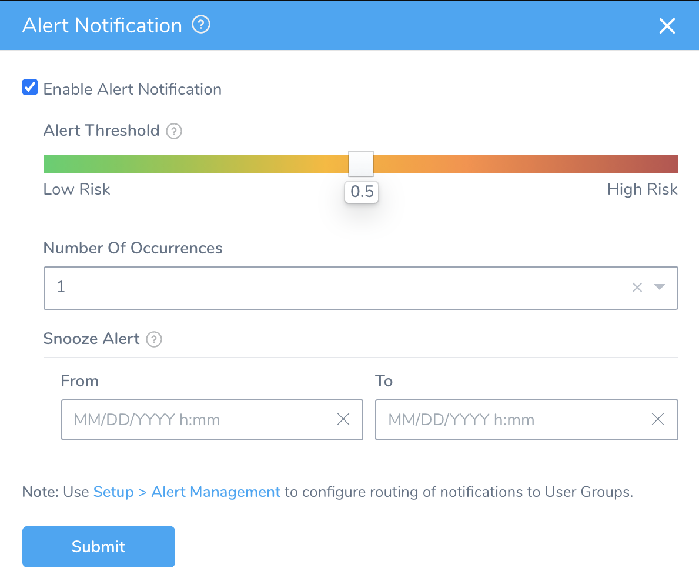
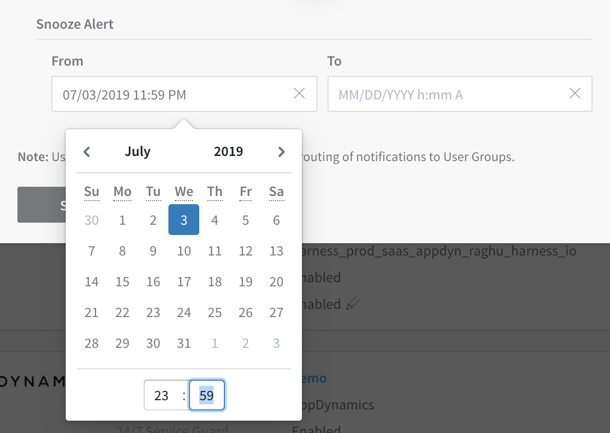
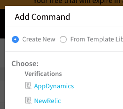
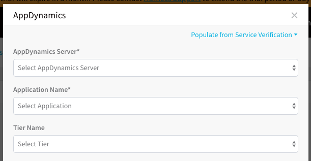
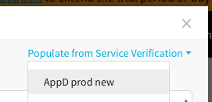

To go to the 24/7 Service Guard setup for a specific tool, see its listing in [Continuous Verification](https://docs.harness.io/category/continuous-verification).

To see the list of all the APM and logging tools Harness supports, see [CV Summary and Provider Support](https://docs.harness.io/article/myw4h9u05l-verification-providers-list).

For information on analysis strategies and best practices, see [CV Strategies, Tuning, and Best Practices](../continuous-verification-overview/concepts-cv/cv-strategies-and-best-practices.md).

### Limitations

You can set up 20 Service Guards in your account by default. You can request an increase from Harness.

Harness places this limitation to ensure that your Service Guards can be supported adequately in our SaaS environment.

Note that a Service Guard is not related to the Services deployed by Harness. Service Guard is a combination of Service and Environment. Service Guard is actually managed at the Environment level. Consequently, the Service Guard limitation is a limitation of Service and Environment combinations.

### Scope Harness Delegates for 24/7 Service Guard

You can scope Harness Delegates to perform different tasks.

As a best practice, you should scope one or more Delegates to perform 24/7 Service Guard tasks.

Scoping ensures that 24/7 Service Guard tasks do not consume resources from other real time processing such as deployments and pulling artifacts.

You scope the Delegate by adding a Delegate Scope that uses the **Service Guard** task.

Harness recommends you use a Delegate for no more than 40 Continuous Verification setups.

For more information, see [Scope Delegates to Harness Components and Commands](https://docs.harness.io/article/hw56f9nz7q-scope-delegates-to-harness-components-and-commands).

### 24/7 Service Guard is for Production Environments

Harness enables you to organize your infrastructure into groups called Environments. Environments represent your deployment infrastructures, such as Dev, QA, Stage, Production, etc.

Harness uses two types of Environments: **Production** and **Non-Production**.

24/7 Service Guard monitors live applications and is for Production Environments only.

### Setup Overview

Here are the high-level steps for setting up 24/7 Service Guard using one or more APM and logging tools:

1. Connect each of your APM and logging tools to Harness as Verification Providers. Verification Providers contain the APM and logging tool account information Harness will use to access the tools via their APIs.

For information on setting up a Verification Provider, see [Add Verification Providers](https://docs.harness.io/article/r6ut6tldy0-verification-providers).1. Create a Harness Application. The Application will identify the application you want to monitor, will identify the production environment where the application is running, and will allow you to use Harness RBAC to control who can set up 24/7 Service Guard.

For more information on setting up a Harness Application, see [Application Checklist](../../model-cd-pipeline/applications/application-configuration.md).1. Add a Harness Service to your Application. The Service is a logical representation of your production application. You will add a Service for each application you want to monitor with 24/7 Service Guard.
2. Add a Harness Environment to your Application. The Environment represents the production environments for one or more applications.
3. Add a 24/7 Service Guard configuration for each Service in the Environment using a Verification Provider.

Once 24/7 Service Guard is set up in a Harness Environment, the new configuration is listed according to its Service name (in this example, the Service name **Dev-CV-Todolist**).

 
 
 In a few minutes, the Continuous Verification dashboard will display the 24/7 Service Guard configuration.

 
 
 No deployment is needed to add the 24/7 Service Guard configuration to the dashboard.

### Alert Notifications

For each Verification Provider, you can customize the threshold and timing for alert notifications. To do so:

1. Click the pencil icon to the right of the **Alert Notification** row. 
2. In the resulting **Alert Notification** dialog, select the **Enable Alert Notification** check box. 
3. Adjust the **Alert Threshold** slider to set the minimum severity level at which you want Harness to send alert notifications.

The slider's scale represents the Overall Risk Level that Harness evaluates, based on data from your Verification Providers, transaction history, and machine-learning models. Harness' alerts are dynamic: over time, they will escalate or decrease, as we observe anomalies, regressions, and other factors. The scale's range corresponds to risk indicators on the dashboard's heat map as shown below.

 

1. Select the **Number of Occurrences** from the drop down list after which you want to receive the alert notifications.

By default, the notifications that you configure here will appear under Harness Manager's bell-shaped **Alerts** indicator, and will also be sent to your [Catch-All Notification User Group](https://docs.harness.io/article/kf828e347t-notification-groups#catch_all_notification_rule). However, you can also configure detailed conditions that [route alert notifications to other User Groups](https://docs.harness.io/article/kf828e347t-notification-groups#alert_thresholds). This dialog includes a link to Harness Manager's corresponding **Notification Settings** controls.

##### Suspending (Snoozing) Alerts

Optionally, you can pause alerts—for example, during lightly staffed periods. You'd do so in the **Alert Notification** dialog's **Snooze Alert** section, as follows:

1. Click in the **From** field, to reveal the calendar and clock display for the snooze start time. 
2. After setting the **From** date and time, use the **To** field's similar controls to set the snooze period's ending date and time.
3. Once the whole **Alert Notification** dialog is set to your specifications, click **SUBMIT** to save them.

### Harness Variables and 24/7 Service Guard

No Harness variable expressions may be used in 24/7 Service Guard setup.

Harness variable expressions are evaluated at deployment runtime, and 24/7 Service Guard does not involve deployments. It only monitors live services.

### Add Workflow Steps

Once you have set up 24/7 Service Guard in an Environment, you can use the 24/7 Service Guard setup to quickly configure the **Verify Service** step in any Workflow that uses the Environment.

For example, the following Canary Deployment Workflow uses an Environment with 24/7 Service Guard set up. In **Phase 1** of the Workflow, in **Verify Service**, you can add a Verification Provider.

 

1. Under **Verify Service**, click **Add Verification**.
2. In the **Add Command** dialog, under **Verifications**, select a Verification Provider that is also used in the 24/7 Service Guard of the Environment used by this Workflow. For example, **AppDynamics**.

  

  The **AppDynamics** dialog appears.

  

3. At the top of the dialog, click **Populate from Service Verification**, and then click the name of the 24/7 Service Guard configuration you want to use.

   

The dialog is automatically configured with the same settings as the 24/7 Service Guard configuration you selected.

