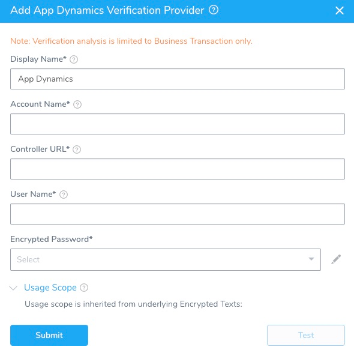

To set up AppDynamics to work with Harness' Continuous Verification features, you must add AppDynamics as Harness Verification Provider. 

### Before You Begin

* Set up a Harness Application, containing a Service and Environment. See [Create an Application](../../model-cd-pipeline/applications/application-configuration.md).
* See the [AppDynamics Verification Overview](../continuous-verification-overview/concepts-cv/app-dynamics-verification-overview.md).
* The AppDynamics account that you use to connect Harness to AppDynamics must have the following [General Permission](https://docs.appdynamics.com/21.9/en/appdynamics-essentials/account-management/tenant-user-management/create-and-manage-custom-roles/application-permissions#ApplicationPermissions-GeneralPermissions): `View`.

### Limitations

Harness does not support [AppDynamics Lite](https://www.appdynamics.com/lite/). If you set up AppDynamics with Harness using an AppDynamics Pro Trial account, and that trial expires, you will be using AppDynamics Lite—which will *not* work with Harness.  

If you require more flexibility than the standard integration outlined here, you also have the option to [add AppDynamics as a Custom APM](../custom-metrics-and-logs-verification/connect-to-app-dynamics-as-a-custom-apm.md).

### Step 1: Add Verification Provider

To begin adding AppDynamics as a Harness Verification Provider,:

1. In Harness, click **Setup**.
2. Click **Connectors**, and then click **Verification Providers**.
3. Click **Add Verification Provider**, and select **AppDynamics**. The **Add AppDynamic Verification Provider** dialog appears.

   
   
### Step 2: Display Name

Enter a name for this connection. You will use this name when selecting the Verification Provider in Harness Environments and Workflows.

If you plan to use multiple providers of the same type, ensure that you give each provider a different name.

### Step 3: Account Name

In the **Account Name** field, enter the name of AppDynamics account you want to use.

For Harness On-Prem, enter **customer1**.
### Step 4: Controller URL

In the **Controller URL** field, enter the URL of the AppDynamic controller in the format:

**http://&lt;Controller\_Host&gt;:&lt;port&gt;/controller**

For example:

**https://xxxx.saas.appdynamics.com/controller**

### Step 5: User Name and Password

In the **User Name** and **Encrypted** **Password** fields, enter the credentials to authenticate with the AppDynamics server.

In **Encrypted** **Password**, select or create a new [Harness Encrypted Text secret](https://docs.harness.io/article/ygyvp998mu-use-encrypted-text-secrets).

Only local AppDynamics users are supported. SAML users are not supported.
### Step 6: Usage Scope

Usage scope is inherited from the secret used in **Encrypted Password**.

### Step 7: Test and Save

1. When you have set up the dialog, click **Test**.
2. Once the test is successful, click **Submit** to add this Verification Provider.

### Next Step

* [Use 24/7 Service Guard with AppDynamics](2-24-7-service-guard-for-app-dynamics.md)

