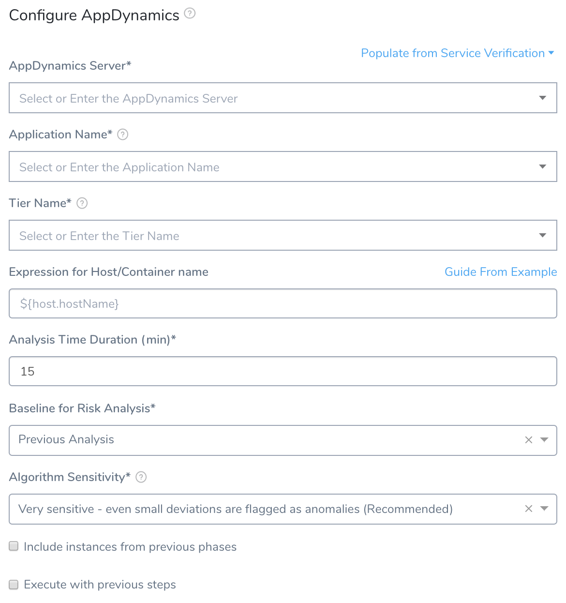
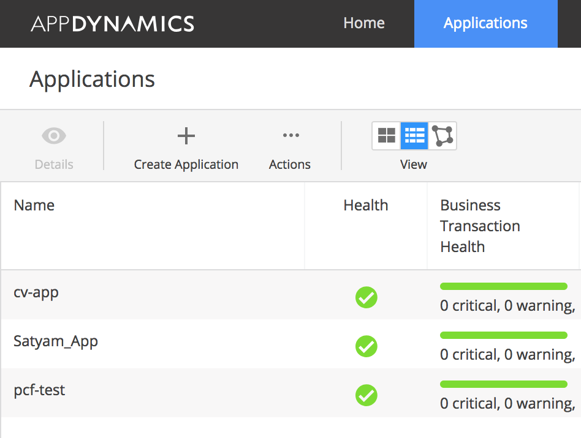
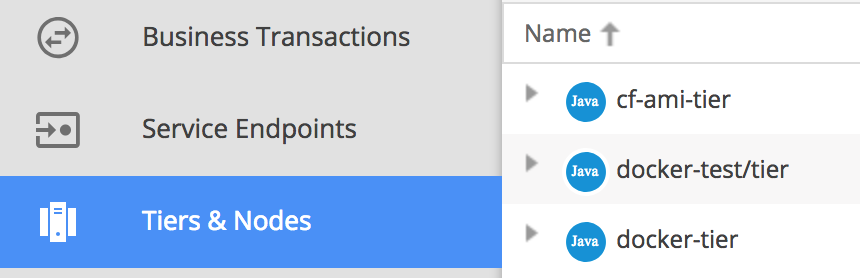
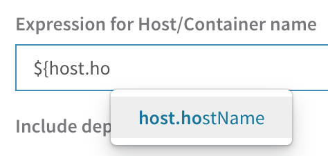
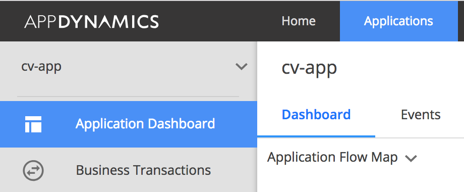
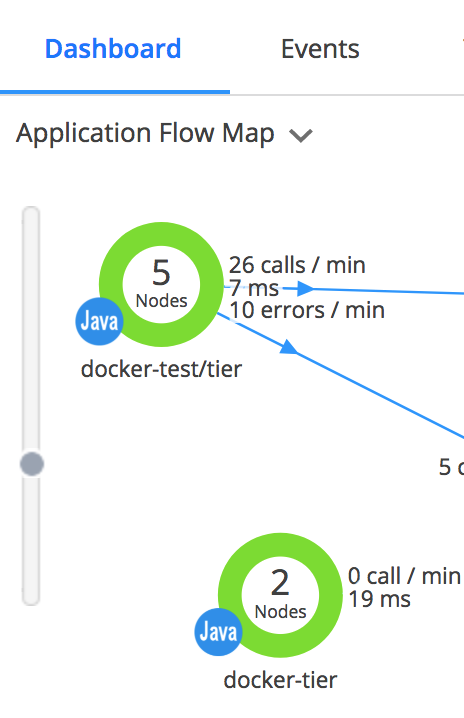
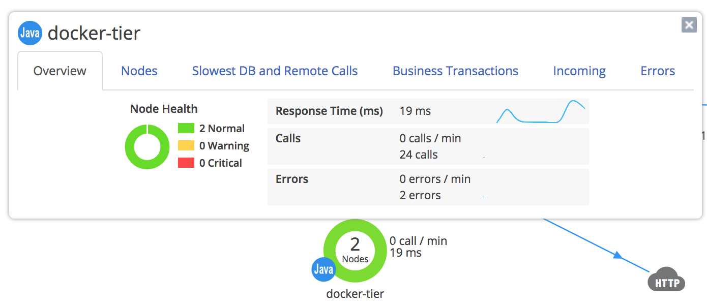
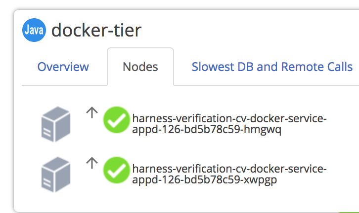
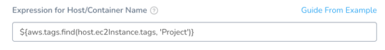

Harness can analyze AppDynamics data to verify, rollback, and improve your deployments. To enable this analysis, you must configure AppDynamics as a verification step in a Harness Workflow. 

### Before You Begin

* Add AppDynamics as a Harness [Verification Provider](1-app-dynamics-connection-setup.md).


### Limitations

Add the AppDynamics Verification Provider to your Workflow only *after* you have run at least one successful Workflow deployment. This enables the AppDynamics integration to obtain the names of the host(s) or container(s) where your service is deployed.

See [general limitations](https://docs.harness.io/article/9dvxcegm90-variables#limitations) on the Harness variable expressions that are presented as options below.


### Step 1: Add Verification Step

To add an AppDynamics verification step to your Workflow:

1. In your Workflow, under **Verify Service**, click **Add Verification**.
2. In the resulting **Add Step** settings, select **Performance Monitoring** > **AppDynamics**.

   

3. Click **Next**. The **Configure** **AppDynamics** settings appear, ready for you to configure in the steps below.

   


### Step 2: AppDynamics Server

In the **AppDynamics Server** drop-down, select the server you added when you set up your [AppDynamics Verification Provider](1-app-dynamics-connection-setup.md).

You can also enter variable expressions, such as: `${serviceVariable.appd_QA}`. Do not use hyphens (dashes) in variable expressions; also, see other [limitations on Harness variables](https://docs.harness.io/article/9dvxcegm90-variables#limitations).

If the **AppDynamics Server** field contains an expression, the **Application Name** and **Tier Name** fields must also use an expression. [Templatized](#templatize) fields cannot take variable expressions, and cannot be edited. Using expressions or templatization will disable the **Test** button.
### Step 3: Application Name

This field's drop-down list is populated with the applications available on the AppDynamcis server you selected. Select an application from the list. In **AppDynamics**, the applications are listed in the **Applications** tab.



You can also enter variable expressions, such as: `${app.name}`.

Do not use hyphens (dashes) in variable expressions. See other [limitations on Harness variables](https://docs.harness.io/article/9dvxcegm90-variables#limitations). If the **AppDynamics Server** field contains an expression, the **Application Name** and **Tier Name** fields must also use an expression. [Templatized](#templatize) fields cannot take variable expressions, and cannot be edited. Using expressions or templatization will disable the **Test** button.
### Step 4: Tier Name

The field's drop-down list is populated with tiers from the AppDynamics application you selected. Pick the tier from which you want usage metrics, code exceptions, error conditions, and exit calls. In **AppDynamics**, the tiers are displayed in the **Tiers & Nodes** page.



You can also enter variable expressions, such as: `${service.name}`.

Do not use hyphens (dashes) in variable expressions. See other [limitations on Harness variables](https://docs.harness.io/article/9dvxcegm90-variables#limitations). If the **Application Name** field contains an expression, the **Tier Name** field must also use an expression. [Templatized](#templatize) fields cannot take variable expressions, and cannot be edited. Using expressions or templatization will disable the **Test** button.For PCF deployments, application tiers will match tier information from the [application manifest file](https://docs.harness.io/article/3ekpbmpr4e-adding-and-editing-inline-pcf-manifest-files).


### Step 5: Expression for Host/Container Name

Any expression that you enter in this field should resolve to a host/container name in your deployment environment. By default, the expression is `${instance.host.hostName}`.

For most use cases, you can leave this field empty, to apply the default. However, if you want to add a prefix or suffix, enter an expression as outlined here.If you begin typing an expression into the field, the field provides expression assistance.



For AWS EC2 hostnames, use the expression `${instance.hostName`}.

#### Do Not Use Reuse Node Name

When the AppDynamics [Reuse Node Name property](https://docs.appdynamics.com/display/PRO45/Java+Agent+Configuration+Properties#JavaAgentConfigurationProperties-reusenodenameReuseNodeName) is set to true, it reuses node names in AppDynamics. As a result, you don't need to supply a node name, but you do need to provide a node name prefix using -Dappdynamics.agent.reuse.nodeName.prefix.

For verifying Harness deployments, we suggest you refrain the Reuse Node Name property unless it is absolutely needed. This property made sense in the past, but with Kubernetes and Docker deployments Harness always uses a unique identifier for the pod/node and that is sufficient.

On AppDynamics, the node retention settings of these nodes can be adjusted to delete older instances.

#### Find Node Names in AppDynamics

Harness does not support AppDynamics dynamic, or reuse, node names.To find the node names in **AppDynamics**, do the following:

1. Click **Applications**.
2. Click the name of your application.
3. Click **Application Dashboard**, and then click **Dashboard**.

  
    
4. Change your display to **Application Flow Map**.

      
   
5. Click a node in your Application Flow Map to display its details.

      
   
6. In the details, click the **Nodes** tab.

   

#### Expression for AWS EC2 Tags

In some cases, hosts are provisioned using a dynamic naming format uses prefixes/suffixes or some other convention that makes it difficult to identify them consistently.

In these cases, tagging hosts and using EC2 tag names to identify them can be a successful workaround.

You can the Harness expression `${aws.tags.find(host.ec2Instance.tags, '[tag_name]')}` to locate the hosts by EC2 tag name.

For example, `${aws.tags.find(host.ec2Instance.tags, 'Project')}`:



#### Expressions for Tanzu Application Service (formerly PCF) Hosts

You can use expressions for some CF [Environment variables](https://docs.cloudfoundry.org/devguide/deploy-apps/environment-variable.html#view-env). For example, you might enter an expression like:


```
${host.pcfElement.displayName}_${host.pcfElement.instanceIndex}
```
...which could yield something like: `harness_example-1`, where the `displayName` is `harness-example` and `instanceIndex` is `1`.


See [PCF Built-in Variables](https://docs.harness.io/article/ojd73hseby-pcf-built-in-variables).

When you are setting up the Workflow for the first time, Harness will *not* be able to help you create an expression, because there has not been a host/container deployed yet. This is another reason why Harness recommends adding the **Verify Step** *after* you have done one successful deployment.
### Step 6: Analysis Time Duration

Use the **Analysis Time Duration** field to set the duration for the verification step. If a verification step exceeds the value, the Workflow's [Failure Strategy](../../model-cd-pipeline/workflows/workflow-configuration.md#failure-strategy) is triggered.

For example, if the Failure Strategy is **Ignore**, then the verification state is marked **Failed**, but the Workflow execution continues. For details, see [CV Strategies, Tuning, and Best Practices](../continuous-verification-overview/concepts-cv/cv-strategies-and-best-practices.md).


### Step 7: Baseline for Risk Analysis

To select among the options available on this drop-down list, [CV Strategies, Tuning, and Best Practices](../continuous-verification-overview/concepts-cv/cv-strategies-and-best-practices.md).


### Step 8: Algorithm Sensitivity

Use this drop-down list to specify the sensitivity of the failure criteria. When the criteria are met, the Workflow's **Failure Strategy** is triggered. For details about the options, see [CV Strategies, Tuning, and Best Practices](../continuous-verification-overview/concepts-cv/cv-strategies-and-best-practices.md).


### Step 9: Include Instances from Previous Phases

If you are using this verification step in a multi-phase deployment, select this checkbox to include instances used in previous phases when collecting data.

Do not apply this setting to the first phase in a multi-phase deployment.
### Step 10: Execute with Previous Steps

Select this checkbox to run this verification step in parallel with the previous steps in the Workflow's **Verify Service**.


### Step 11: Test and Save

To finish configuring this AppDynamics verification step:

1. Click **Test**. Harness verifies the settings you entered.
2. When testing is successful, click **Submit**. This AppDynamics verification step is now configured.

The **Test** button will be disabled if any of the **AppDynamics Server**, **Application Name**, and/or **Tier Name** fields contain [templatized values](templatize-app-dynamics-verification.md) or variable expressions. This is because Harness can't test the abstract values. As a workaround, you can fill these fields with static values from their drop-down lists, then click **Test** to verify all the static values, and then swap in your intended variable expressions before clicking **Submit**.


### Step 12: View Verification Results

Once you have executed the Workflow, Harness performs the verification you configured and displays the results in the **Deployments** and **Continuous Verification** pages. Verification is executed in real time, quantifying the business impact of every production deployment.

For a quick overview of the verification UI elements, see [Continuous Verification Tools](https://docs.harness.io/article/xldc13iv1y-meet-harness#continuous_verification_tools). For details about viewing and interpreting verification results, see [Verification Results Overview](../continuous-verification-overview/concepts-cv/deployment-verification-results.md).

### Harness Expression Support in CV Settings

You can use expressions (`${...}`) for [Harness built-in variables](https://docs.harness.io/article/7bpdtvhq92-workflow-variables-expressions) and custom [Service](../../model-cd-pipeline/setup-services/service-configuration.md) and [Workflow](../../model-cd-pipeline/workflows/add-workflow-variables-new-template.md) variables in the settings of Harness Verification Providers.

Here is an example using Dynatrace, but it applies to all providers.


Expression support lets you template your Workflow verification steps. You can add custom expressions for settings, and then provide values for those settings at deployment runtime. Or you can use Harness built-in variable expressions and Harness will provide values at deployment runtime automatically.


### Next Steps

* [Templatize AppDynamics Verification](templatize-app-dynamics-verification.md)
* [Set AppDynamics Environment Variables](app-dynamics-environment-variables.md)
* [AppDynamics as a Custom APM](../custom-metrics-and-logs-verification/connect-to-app-dynamics-as-a-custom-apm.md)

