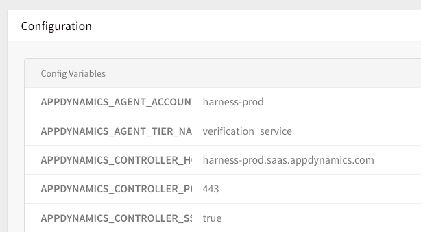

This topic covers how to set required environment variables to monitor Java applications in the AppDynamics Controller. 

### Before You Begin

* Add AppDynamics as a Harness [Verification Provider](1-app-dynamics-connection-setup.md).
* Add an AppDynamics [verification step](3-verify-deployments-with-app-dynamics.md) to a Workflow.

### Step 1: Install the Java Agent

To monitor Java applications in the AppDynamics Controller, you must install the AppDynamics Java Agent on each server that hosts applications to be monitored. The Java Agent requires that certain environment variables be set.

### Option: Set Variables in Artifact

For a Docker Image artifact, you can include the Java Agent in the Docker Image you deploy, and set these environment variables in the artifact. You can do this using a `controller-info.xml` file, such as [this one located on GitHub](https://github.com/Appdynamics/appdynamics-openshift-quickstart/blob/master/AppServerAgent/conf/controller-info.xml).

### Option: Set Variables in Service

You can also set these variables in the Harness Service that is using the Docker Image. Here is an example of a Harness Service containing the environment variables as Config Variables.

#### Identifying Environment Variables

For a list of the required environment variables, see [Use Environment Variables for Java Agent Settings](https://docs.appdynamics.com/display/PRO42/Use+Environment+Variables+for+Java+Agent+Settings) from AppDynamics. You might also include the `JAVA_OPTS` variable to add the Java Agent path to `JAVA_OPTS`.

The Config Variables in the Harness Service can be overwritten by the Harness Environment [Service Overrides](../../model-cd-pipeline/environments/environment-configuration.md#override-a-service-configuration).
### Limitations

Do not hard-code the node name (`APPDYNAMICS_AGENT_NODE_NAME`) in any environment variables. Doing so will prevent certain deployment features—such as Canary and Blue/Green strategies, and rollback—from executing.
### Next Steps

* [Configuration as Code](https://docs.harness.io/article/htvzryeqjw-configuration-as-code)
* [AppDynamics as a Custom APM](../custom-metrics-and-logs-verification/connect-to-app-dynamics-as-a-custom-apm.md)

