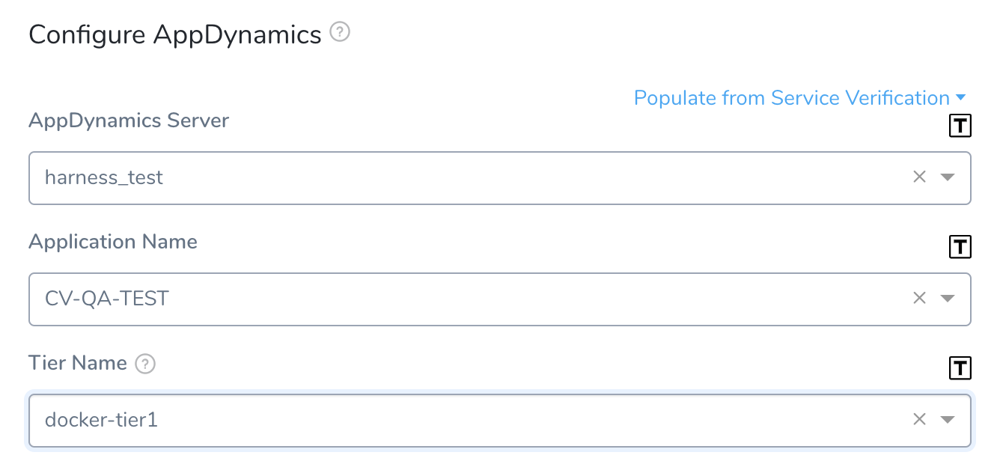
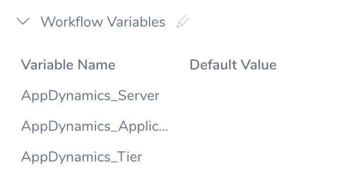
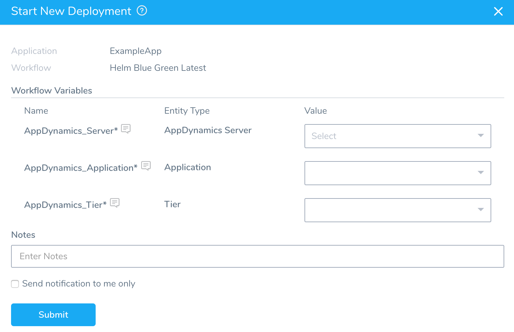

By templatizing certain settings in an AppDynamics verification step, you can use that verification step in a Workflow (and in multiple Pipelines) without having to provide settings until runtime.

### Before You Begin

* Add AppDynamics as a Harness [Verification Provider](1-app-dynamics-connection-setup.md).
* Add an AppDynamics [verification step](3-verify-deployments-with-app-dynamics.md) to a Workflow.

### Step 1: Templatize Settings

You templatize settings by click the **[T]** icon next to the setting.

The settings are replaced by [Workflow variables](../../model-cd-pipeline/workflows/workflow-configuration.md#add-workflow-variables):

You will now see them in the **Workflow Variables** section of the Workflow:

### Step 2: Deploy a Templatized Workflow

When you deploy the Workflow, **Start New Deployment** prompts you to enter values for templatized settings:

You can select the necessary settings and deploy the Workflow.

### Option: Trigger Variables

You can also use a Trigger to pass variables and set Workflow values. For details, see [Passing Variables into Workflows and Pipelines from Triggers](../../model-cd-pipeline/expressions/passing-variable-into-workflows.md).

### Limitations

* When templatized, fields cannot be edited.
* If any of the fields within the **Configure AppDynamics** settings contain templatized values (or variable expressions), the settings' **Test** button is disabled. This is because Harness can't test the abstract values. As a workaround, you can fill these fields with static values from their drop-down lists, click **Test** to verify all the static values, and then swap in your intended variable expressions before clicking **Submit**.

### Next Steps

* [Set AppDynamics Environment Variables](app-dynamics-environment-variables.md)
* [AppDynamics as a Custom APM](../custom-metrics-and-logs-verification/connect-to-app-dynamics-as-a-custom-apm.md)

