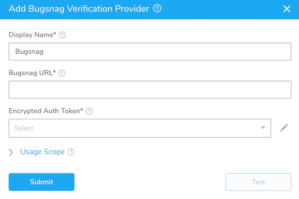
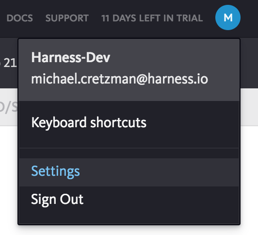
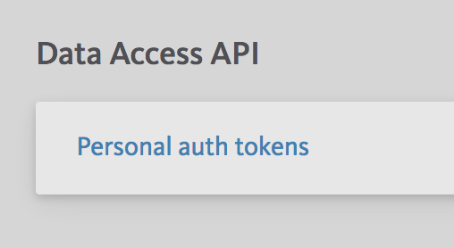
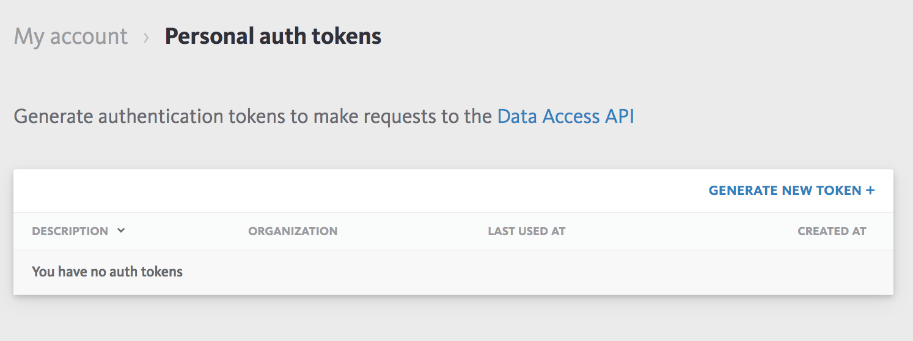
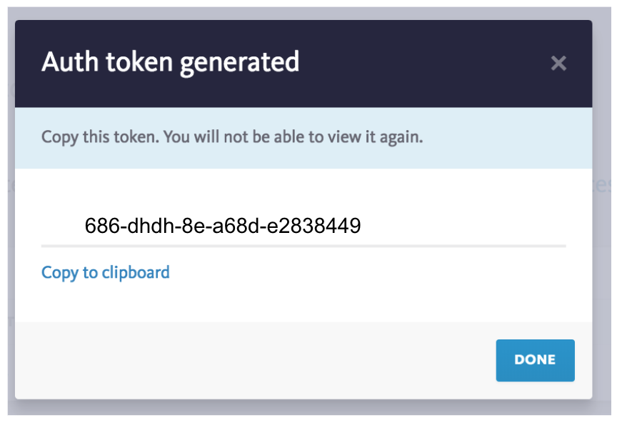

The first step in using Bugsnag with Harness is to set up an Bugsnag Verification Provider in Harness.

A Harness Verification Provider is a connection to monitoring tools such as Bugsnag. Once Harness is connected, you can use Harness 24/7 Service Guard and Deployment Verification with your Bugsnag data and analysis.

### Before You Begin

* See the [Bugsnag Verification Overview](../continuous-verification-overview/concepts-cv/bugsnag-verification-overview.md).

### Step 1: Add Bugsnag Verification Provider

To add Bugsnag as a verification provider, do the following:

1. Click **Setup**.
2. Click **Connectors**, and then click **Verification Providers**.
3. Click **Add Verification Provider**, and select **Bugsnag**. The **Add Bugsnag Verification Provider** dialog for your provider appears.

   

The **Add Bugsnag Verification Provider** dialog has the following fields.

### Step 2: Bugsnag URL

Enter **https://api.bugsnag.com/**. This is the URL for the Bugsnag API.

### Step 3: Encrypted Auth Token

For secrets and other sensitive settings, select or create a new [Harness Encrypted Text secret](https://docs.harness.io/article/ygyvp998mu-use-encrypted-text-secrets).Enter the **Data Access API** personal auth token for your Bugsnag account. Here is how you get the token in Bugsnag:

1. In **Bugsnag**, click your account icon in the top-right of any page, and then click **Settings**.

  

2. In the **My account** page, next to **Data Access API**, click **Personal auth tokens**.

  

3. In **Personal auth tokens**, click **GENERATE NEW TOKEN**.

  
  
  The **Generate new auth token** dialog appears.

  
  
4. In **Token description**, enter a name, such as **Harness**, and click **GENERATE**. The auth token is generated.

  

5. Click **Copy to clipboard**.
6. In **Harness**, in the **Add Bugsnag Verification Provider** dialog, paste the token in the **Auth Token** field.

### Step 4: Display Name

The name for this Bugsnag verification provider connection in Harness. If you will have multiple Bugsnag connections, enter a unique name. You will use this name to select this connection when integrating Bugsnag with the **Verify Steps** of your workflows, described below.

### Step 5: Usage Scope

Usage scope is inherited from the secret used in **Encrypted Auth Token**.

### Next Steps

* [Monitor Applications 24/7 with Bugsnag](2-24-7-service-guard-for-bugsnag.md)
* [Verify Deployments with Bugsnag](3-verify-deployments-with-bugsnag.md)

