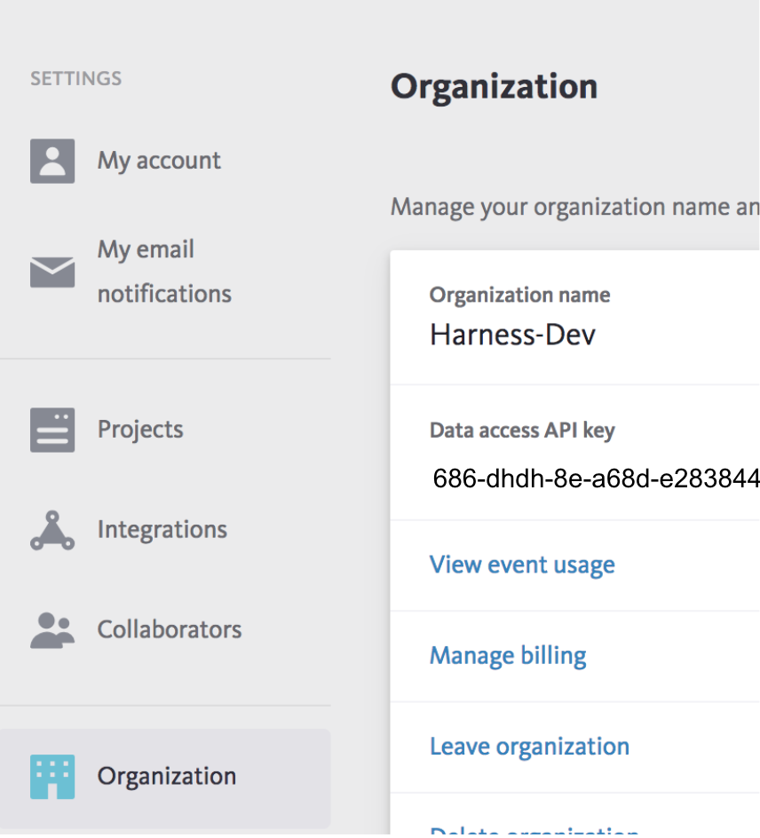

Harness 24/7 Service Guard monitors your live applications, catching problems that surface minutes or hours following deployment. For more information, see [24/7 Service Guard Overview](../continuous-verification-overview/concepts-cv/24-7-service-guard-overview.md).

You can add your Bugsnag monitoring to Harness 24/7 Service Guard in your Harness Application Environment. For a setup overview, see .

This section assumes you have a Harness Application set up and containing a Service and Environment. For steps on setting up a Harness Application, see [Application Checklist](../../model-cd-pipeline/applications/application-configuration.md).

### Before You Begin

* See the [Bugsnag Verification Overview](../continuous-verification-overview/concepts-cv/bugsnag-verification-overview.md).
* See [Connect to Bugsnag](1-bugsnag-connection-setup.md).

### Step 1: Set Up 24/7 Service Guard for Bugsnag

To set up 24/7 Service Guard for Bugsnag, do the following:

1. Ensure that you have added Bugsnag as a Harness Verification Provider, as described in [Connect to Bugsnag](1-bugsnag-connection-setup.md).
2. In your Harness Application, ensure that you have added a Service, as described in  [Services](../../model-cd-pipeline/setup-services/service-configuration.md). For 24/7 Service Guard, you do not need to add an Artifact Source to the Service, or configure its settings. You simply need to create a Service and name it. It will represent your application for 24/7 Service Guard.
3. In your Harness Application, click **Environments**.
4. In **Environments**, ensure that you have added an Environment for the Service you added. For steps on adding an Environment, see  [Environments](../../model-cd-pipeline/environments/environment-configuration.md).
5. Click the Environment for your Service. Typically, the **Environment Type** is **Production**.
6. In the **Environment** page, locate **24/7 Service Guard**.

   

7. In **24/7 Service Guard**, click **Add Service Verification**, and then click **Bugsnag**.

Fill out the dialog. The **Bugsnag** dialog has the following fields.

For 24/7 Service Guard, the queries you define to collect logs are specific to the application or service you want monitored. Verification is application/service level. This is unlike Workflows, where verification is performed at the host/node/pod level.

### Step 2: Display Name

The name that will identify this service on the Continuous Verification dashboard. Use a name that indicates the environment and monitoring tool, such as Bugsnag.

### Step 3: Service

The Harness Service to monitor with 24/7 Service Guard.

### Step 4: Bugsnag Server

Select the Bugsnag verification provider you added to Harness, as described above. Harness will immediately use the connection to obtain organization and project information from Bugsnag.

### Step 5: Organization ID

Select the **Organization ID** for your Bugsnag account. In Bugsnag, this is the **Organization name** in the account's **Organization** page:

### Step 6: Project ID

Select the Project ID for the Bugsnag project you want to use. In Bugsnag, this is the **Project Name** in the **Projects** page:

, if necessary.

### Step 8: Search Keywords

The keywords to search, such as `*exception*`.

### Step 9: Browser Application

Click the checkbox to have Harness ignore host/node events and focus on the browser events Bugsnag captures.

### Step 10: Baseline

Select the baseline time unit for monitoring. For example, if you select **For 4 hours**, Harness will collect the logs for the last 4 hours as the baseline for comparisons with future logs. If you select **Custom Range** you can enter a **Start Time** and **End Time**.

### Next Steps

* [Verify Deployments with Bugsnag](3-verify-deployments-with-bugsnag.md)

