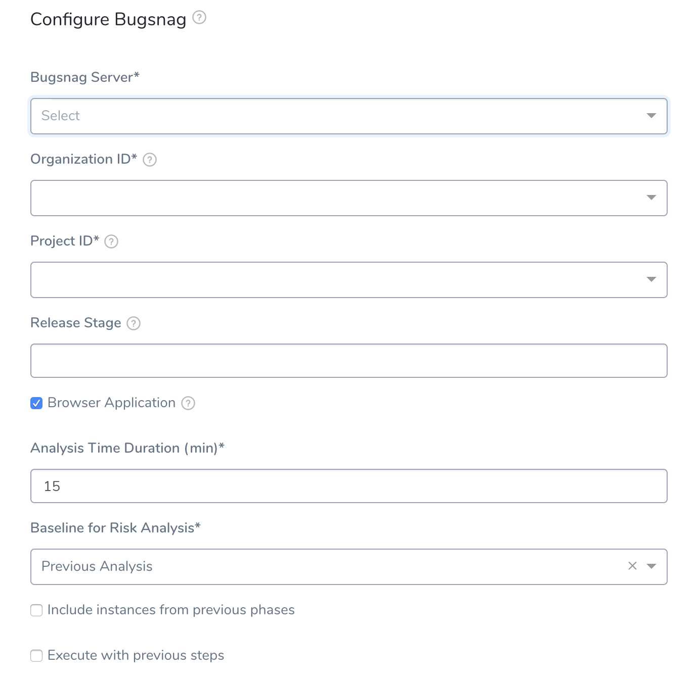
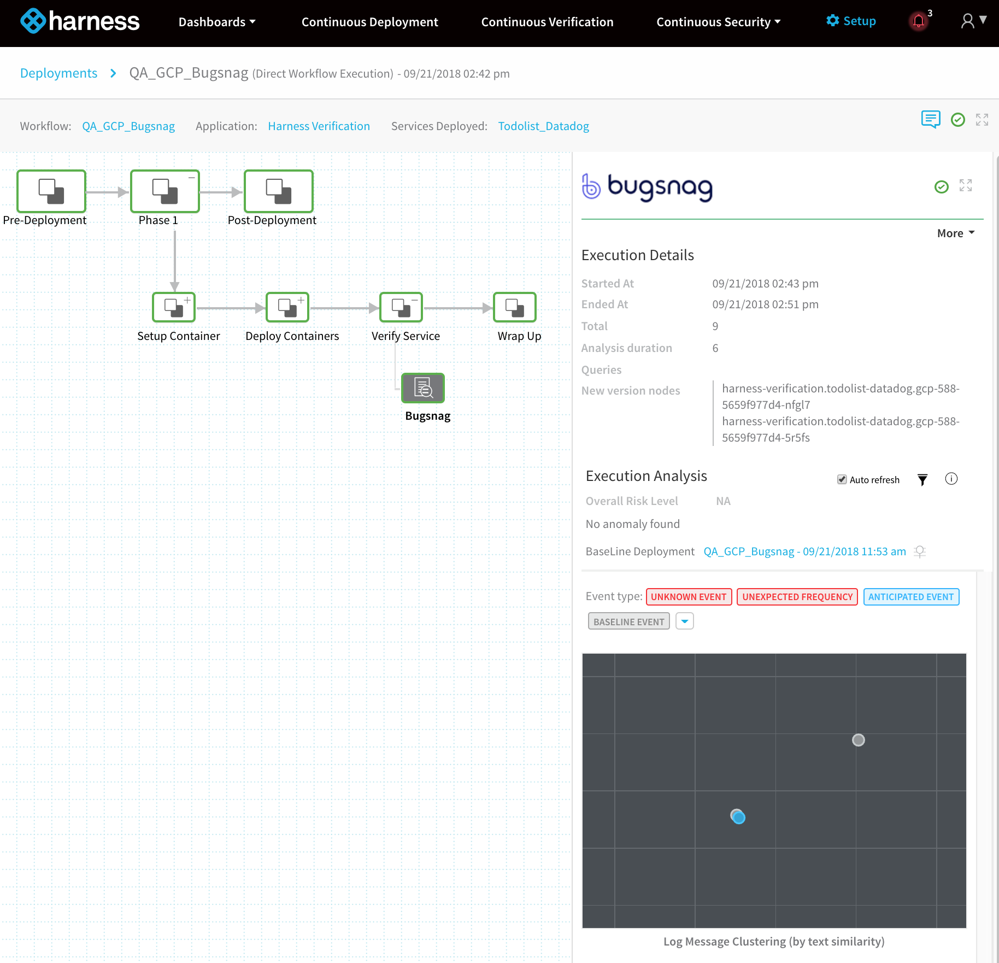
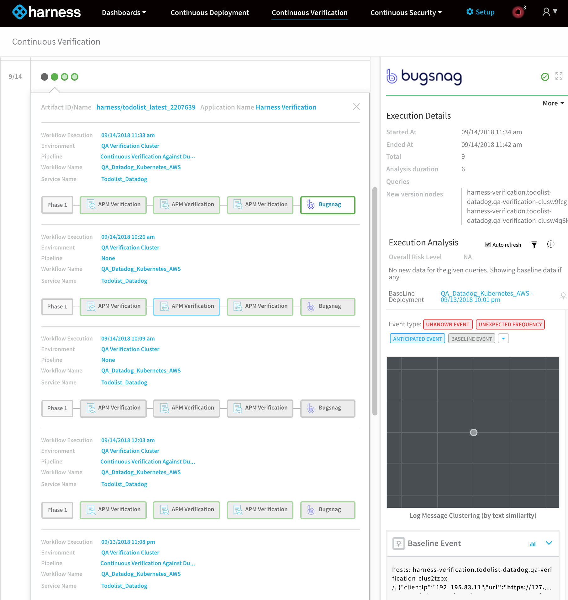

The following procedure describes how to add Bugsnag as a verification step in a Harness workflow. For more information about workflows, see [Add a Workflow](../../model-cd-pipeline/workflows/workflow-configuration.md).

Once you run a deployment and Bugsnag preforms verification, Harness' machine-learning verification analysis will assess the risk level of the deployment.

In order to obtain the useful comparison data, the verification provider should be added to your workflow **after** you have run at least one successful deployment.

##  Before You Begin

* See the [Bugsnag Verification Overview](../continuous-verification-overview/concepts-cv/bugsnag-verification-overview.md).
* See [Connect to Bugsnag](1-bugsnag-connection-setup.md).

##  Visual Summary

Here's an example Bugsnag deployment verification configuration.

##  Step 1: Set Up the Deployment Verification

To verify your deployment with Bugsnag, do the following:

1. Ensure that you have added Bugsnag as a verification provider, as described in [Connect to Bugsnag](1-bugsnag-connection-setup.md).
2. In your workflow, under **Verify Service**, click **Add Verification**.
3. In the resulting **Add Step** settings, select **Log Analysis** > **Bugsnag**.

   

4. Click **Next**. The **Configure Bugsnag** settings appear.

   

These settings include the following fields.

##  Step 2: Bugsnag Server

Select the Bugsnag verification provider you added to Harness, as described above. Harness will immediately use the connection to obtain organization and project information from Bugsnag.

##  Step 3: Organization ID

Select the **Organization ID** for your Bugsnag account. In Bugsnag, this is the **Organization name** in the account's **Organization** page:

##  Step 4: Project ID

Select the Project ID for the Bugsnag project you want to use. In Bugsnag, this is the **Project Name** in the **Projects** page:

##  Step 5: Release Stage

Enter the Bugsnag  [release stage](https://docs.bugsnag.com/product/releases/#configuring-the-release-stage), if necessary.

##  Step 6: Browser Application

Click the checkbox to have Harness ignore host/node deployment events and focus on the browser events Bugsnag captures.

##  Step 7: Expression for Host/Container name

If you do not enable the **Browser Application** checkbox, Harness will use the host/node/container event data Bugsnag captures. Add a variable that evaluates to the hostname value in the **host** field of event messages. For example, in a Bugsnag message in a Harness deployment verification, if you look at a event message, you will see a **hosts** field:

Next, look in the JSON for the host/container/pod in the deployment environment and identify the label containing the same hostname. The path to that label is what the expression should be in **Expression for Host/Container name**. The default variable is **${instance.host.hostName}**. In most cases, this expression will work.

For AWS EC2 hostnames, use the expression `${instance.hostName`}.

##  Step 8: Analysis Time Duration

Set the duration for the verification step. If a verification step exceeds the value, the workflow [Failure Strategy](../../model-cd-pipeline/workflows/workflow-configuration.md#failure-strategy) is triggered. For example, if the Failure Strategy is **Ignore**, then the verification state is marked **Failed** but the workflow execution continues.

See [CV Strategies, Tuning, and Best Practices](../continuous-verification-overview/concepts-cv/cv-strategies-and-best-practices.md).

##  Step 9: Baseline for Risk Analysis

See [CV Strategies, Tuning, and Best Practices](../continuous-verification-overview/concepts-cv/cv-strategies-and-best-practices.md).

##  Step 10: Include instances from previous phases

If you are using this verification step in a multi-phase deployment, select this checkbox to include instances used in previous phases when collecting data. Do not apply this setting to the first phase in a multi-phase deployment.

##  Step 11: Execute with previous steps

Check this checkbox to run this verification step in parallel with the previous steps in **Verify Service**.

##  Review: Harness Expression Support in CV Settings

You can use expressions (`${...}`) for [Harness built-in variables](https://docs.harness.io/article/7bpdtvhq92-workflow-variables-expressions) and custom [Service](../../model-cd-pipeline/setup-services/service-configuration.md) and [Workflow](../../model-cd-pipeline/workflows/add-workflow-variables-new-template.md) variables in the settings of Harness Verification Providers.

Expression support lets you template your Workflow verification steps. You can add custom expressions for settings, and then provide values for those settings at deployment runtime. Or you can use Harness built-in variable expressions and Harness will provide values at deployment runtime automatically.

##  Step 12: View Verification Results

Once you have deployed your workflow (or pipeline) using the Bugsnag verification step, you can automatically verify cloud application and infrastructure performance across your deployment. For more information, see [Add a Workflow](../../model-cd-pipeline/workflows/workflow-configuration.md) and [Add a Pipeline](../../model-cd-pipeline/pipelines/pipeline-configuration.md).

###  Workflow Verification

To see the results of Harness machine-learning evaluation of your Bugsnag verification, in your workflow or pipeline deployment you can expand the **Verify Service** step and then click the **Bugsnag** step.

###  Continuous Verification

You can also see the evaluation in the **Continuous Verification** dashboard. The workflow verification view is for the DevOps user who developed the workflow. The **Continuous Verification** dashboard is where all future deployments are displayed for developers and others interested in deployment analysis.

To learn about the verification analysis features, see the following sections.

####  Deployments

* **Deployment info:** See the verification analysis for each deployment, with information on its service, environment, pipeline, and workflows.
* **Verification phases and providers:** See the vertfication phases for each vertfication provider. Click each provider for logs and analysis.
* **Verification timeline:** See when each deployment and verification was performed. |

####  Transaction Analysis

* **Execution details:** See the details of verification execution. Total is the total time the verification step took, and Analysis duration is how long the analysis took.
* **Risk level analysis:** Get an overall risk level and view the cluster chart to see events.
* **Transaction-level summary:** See a summary of each transaction with the query string, error values comparison, and a risk analysis summary.

####  Execution Analysis

* **Event type:** Filter cluster chart events by Unknown Event, Unexpected Frequency, Anticipated Event, Baseline Event, and Ignore Event.
* **Cluster chart:** View the chart to see how the selected event contrast. Click each event to see its log details. |

####  Event Management

* **Event-level analysis:** See the threat level for each event captured.
* **Tune event capture:** Remove events from analysis at the service, workflow, execution, or overall level.
* **Event distribution:** Click the chart icon to see an event distribution including the measured data, baseline data, and event frequency. 

##  Next Steps

* [Configuration as Code](https://docs.harness.io/article/htvzryeqjw-configuration-as-code)
* [Users and Permissions](https://docs.harness.io/article/ven0bvulsj-users-and-permissions)

