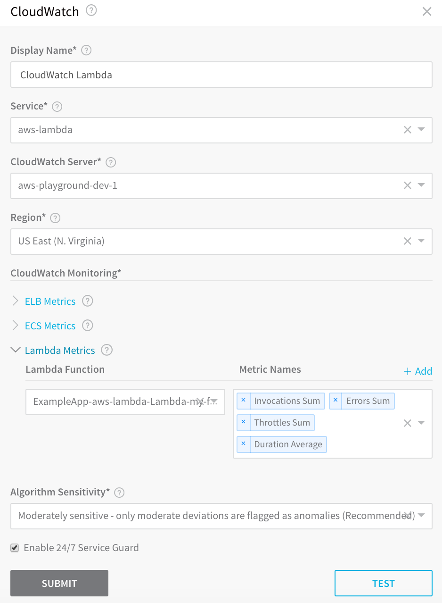
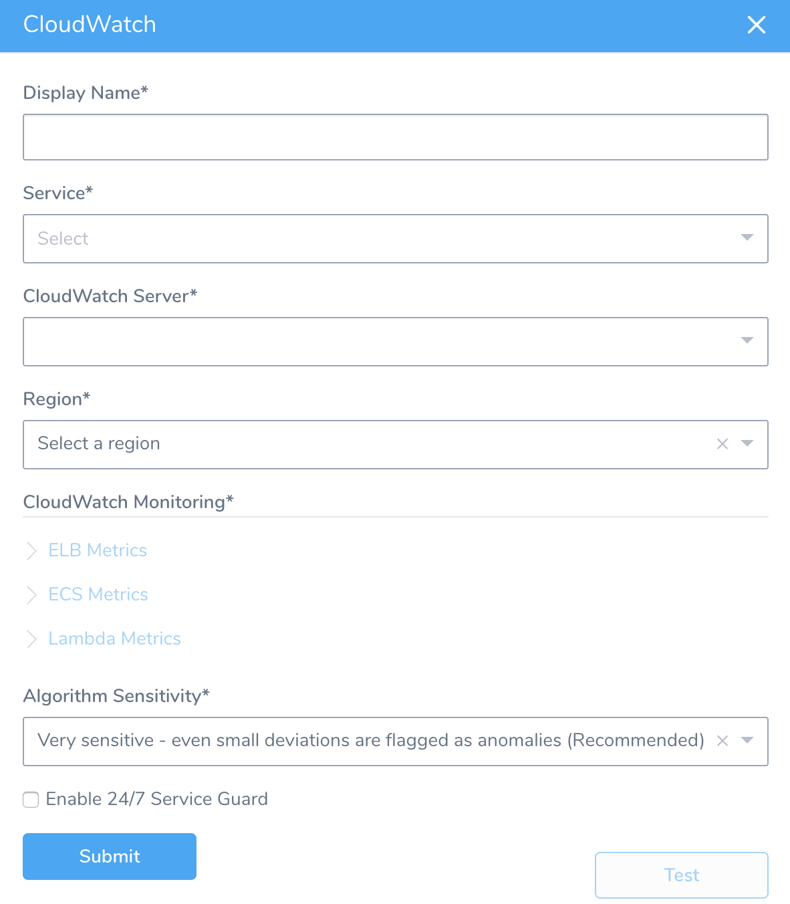
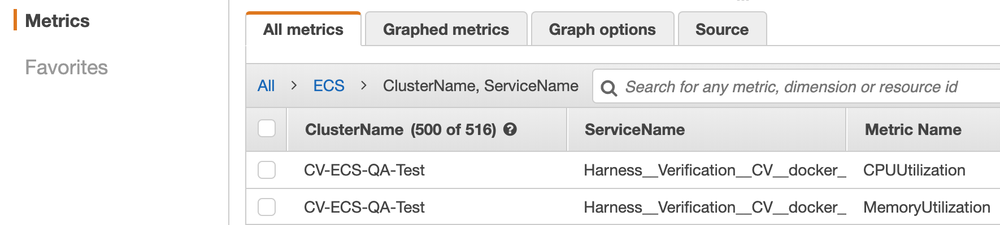
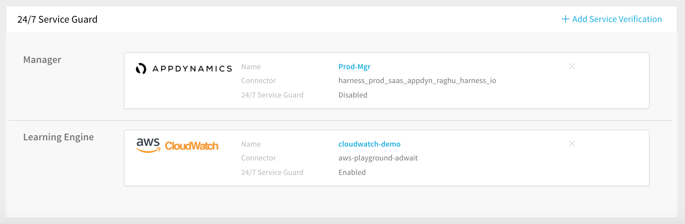
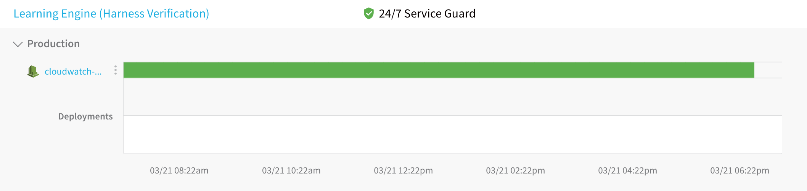

Harness 24/7 Service Guard monitors your live applications, catching problems that surface minutes or hours following deployment. For more information, see [24/7 Service Guard Overview](../continuous-verification-overview/concepts-cv/24-7-service-guard-overview.md).

You can add your CloudWatch monitoring to Harness 24/7 Service Guard in your Harness Application Environment. For a setup overview, see [Connect to CloudWatch](cloud-watch-connection-setup.md).

This section assumes you have a Harness Application set up and containing a Service and Environment. For steps on setting up a Harness Application, see [Application Checklist](../../model-cd-pipeline/applications/application-configuration.md). You cannot configure CloudWatch 24/7 Service Guard for AWS ALB and AWS EKS.

### Before You Begin

* Set up a Harness Application, containing a Service and Environment. See [Create an Application](../../model-cd-pipeline/applications/application-configuration.md).
* See the [CloudWatch Verification Overview](../continuous-verification-overview/concepts-cv/cloud-watch-verification-overview.md).

### Visual Summary

Here's an example of a 24/7 Service Guard configuration for CloudWatch.

### Step 1: Set up 24/7 Service Guard for CloudWatch

1. Ensure that you have added CloudWatch as a Harness Verification Provider, as described in [Connect to CloudWatch](cloud-watch-connection-setup.md).
2. In your Harness Application, ensure that you have added a Service, as described in [Services](../../model-cd-pipeline/setup-services/service-configuration.md). For 24/7 Service Guard, you do not need to add an Artifact Source to the Service, or configure its settings. You simply need to create a Service and name it. It will represent your application for 24/7 Service Guard.
3. In your Harness Application, click **Environments**.
4. In **Environments**, ensure that you have added an Environment for the Service you added. For steps on adding an Environment, see [Environments](../../model-cd-pipeline/environments/environment-configuration.md).
5. Click the Environment for your Service. Typically, the **Environment Type** is **Production**.
6. In the **Environment** page, locate **24/7 Service Guard**.

  
  
7. In **24/7 Service Guard**, click **Add Service Verification**, and then click **CloudWatch**. The **CloudWatch** dialog appears.

   

For 24/7 Service Guard, the queries you define to collect logs are specific to the application or service you want monitored. Verification is application/service level. This is unlike Workflows, where verification is performed at the host/node/pod level.
### Step 2: Display Name

The name that will identify this service on the **Continuous Verification** dashboard. Use a name that indicates the environment and monitoring tool, such as **CloudWatch**.

### Step 3: Service

The Harness Service to monitor with 24/7 Service Guard.

### Step 4: CloudWatch Server

Select the CloudWatch Verification Provider to use.

### Step 5: Region

Select the AWS region where the ECS and/or ELB are located.

### Step 6: ELB Metrics

Click **Add** for each load balancer you want to monitor. For more information, see  [Elastic Load Balancing Metrics and Dimensions](https://docs.aws.amazon.com/AmazonCloudWatch/latest/monitoring/elb-metricscollected.html) from AWS.

### Step 7: ECS Metrics

This **Cluster** drop-down menu contains the available ECS clusters. The Metrics drop-down contains the available metrics. Select the metrics to monitor.

You can see the available metrics in CloudWatch.

For more information, see [Using Amazon CloudWatch Metrics from AWS](https://docs.aws.amazon.com/AmazonCloudWatch/latest/monitoring/working_with_metrics.html).

### Step 8: Lambda

Select the Lambda function and metrics to monitor. The functions displayed are from the region you selected. Only functions that have been deployed are displayed.

### Step 9: Algorithm Sensitivity

See [CV Strategies, Tuning, and Best Practices](../continuous-verification-overview/concepts-cv/cv-strategies-and-best-practices.md#algorithm-sensitivity-and-failure-criteria).

### Step 10: Enable 24/7 Service Guard

Enable this setting to turn on 24/7 Service Guard. If you just want to set up 24/7 Service Guard, but not enable it, leave this setting disabled.

When you are finished, the dialog will look something like this:

### Step 11: Verify Your Settings

1. Click **TEST**. Harness verifies the settings you entered.
2. Click **SUBMIT**. The CloudWatch 24/7 Service Guard to configured.

To see the running 24/7 Service Guard analysis, click **Continuous Verification**.

The 24/7 Service Guard dashboard displays the production verification results.

For information on using the dashboard, see [24/7 Service Guard Overview](../continuous-verification-overview/concepts-cv/24-7-service-guard-overview.md).

### Next Steps

* [Verify Deployments with CloudWatch](3-verify-deployments-with-cloud-watch.md)

