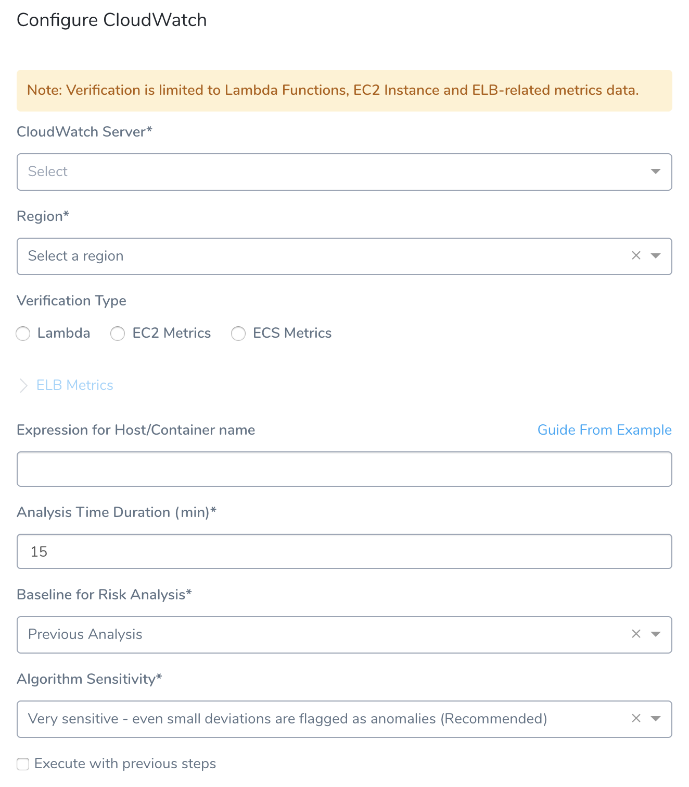
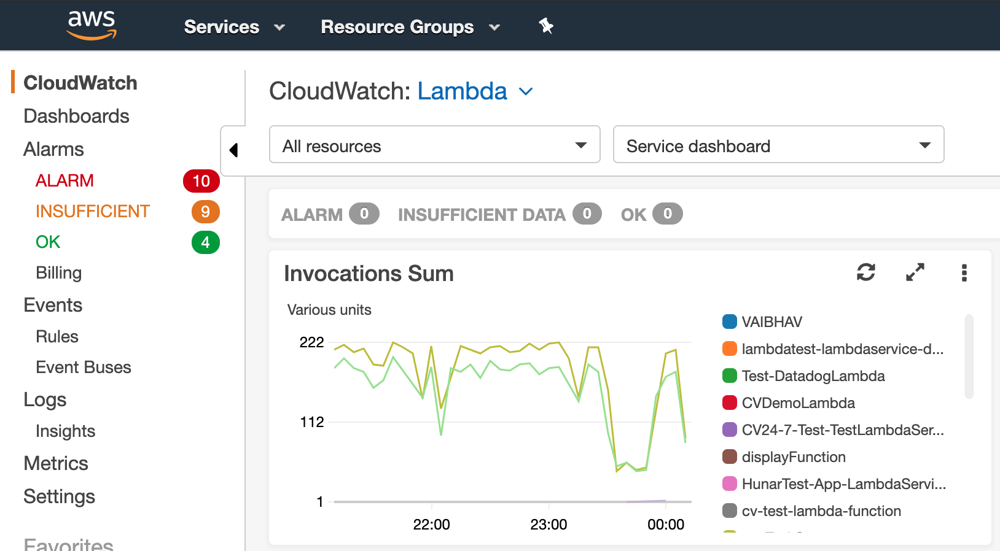
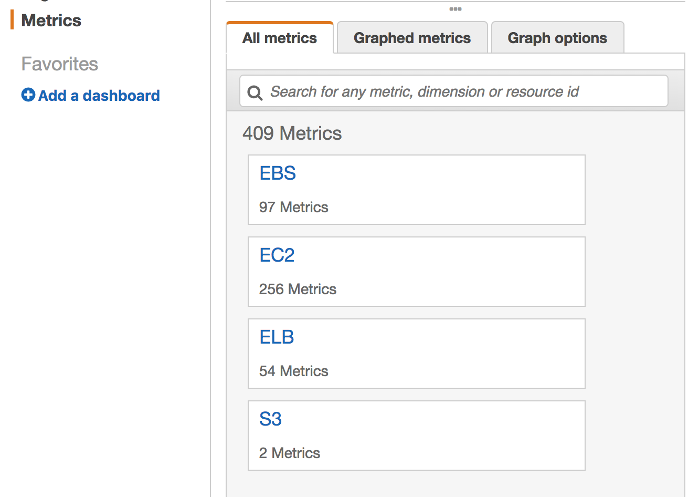
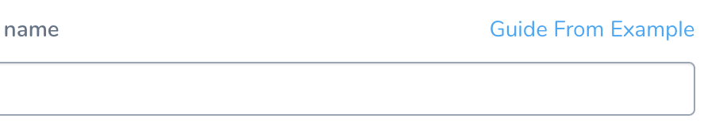
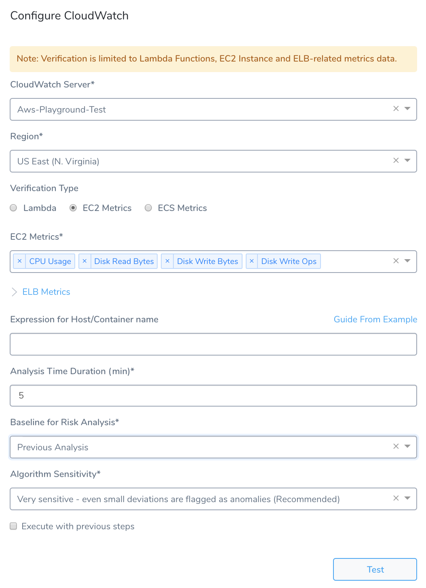
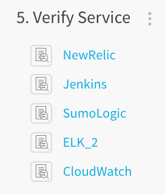
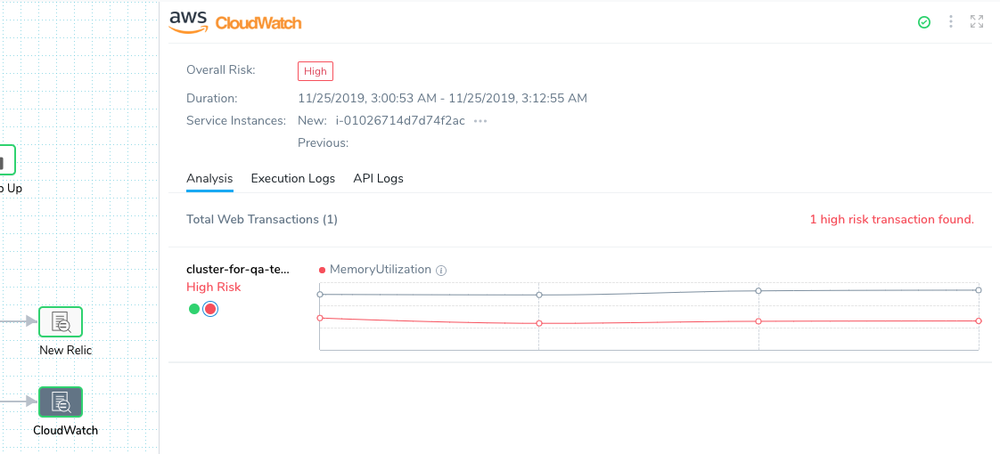
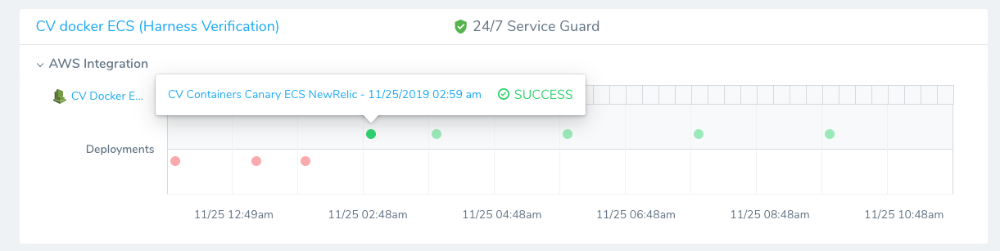
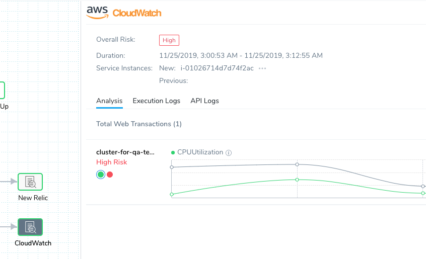

The following procedure describes how to add CloudWatch as a verification step in a Harness workflow. For more information about workflows, see [Add a Workflow](../../model-cd-pipeline/workflows/workflow-configuration.md).

Once you run a deployment and CloudWatch preforms verification, Harness' machine-learning verification analysis will assess the risk level of the deployment.

In order to obtain the names of the host(s), pod(s), or container(s) where your service is deployed, the verification provider should be added to your workflow **after** you have run at least one successful deployment.You cannot configure CloudWatch Deployment Verification for AWS ALB and AWS EKS.

##   Before You Begin

* Set up a Harness Application, containing a Service and Environment. See [Create an Application](../../model-cd-pipeline/applications/application-configuration.md).
* See the [CloudWatch Verification Overview](../continuous-verification-overview/concepts-cv/cloud-watch-verification-overview.md).

##   Visual Summary

Here's an example of a CloudWatch setup for verification.

##   Step 1: Set up the Deployment Verification

1. Ensure that you have added AWS as a Cloud Provider, as described in [Connect to CloudWatch](cloud-watch-connection-setup.md).
2. In your Workflow, under **Verify Service**, click **Add Step**.
3. In the resulting **Add Step** settings, select **Performance Monitoring** > **CloudWatch**.
4. Click **Next**. The **Configure****CloudWatch** settings appear.

   

##   Step 2: CloudWatch Server

Select the AWS Cloud Provider you set up in [Connect to CloudWatch](cloud-watch-connection-setup.md). You can also enter variable expressions, such as: `${serviceVariable.cloudwatch_connector_name}`.

##   Step 3: Region

Select the AWS region where the EC2 and/or ELB are located. You can also enter variable expressions, such as: `${env.name}`.

If the **Cloudwatch Server** field contains an expression, the **Region** field must also use an expression.
##   Step 4: Lambda

Select this option for Harness to use the CloudWatch monitoring for the Lambda function(s) the Workflow is deploying.

You can select **ELB Metrics** (Load Balancers, Metric Names) but they are not required. For information on Lambda metrics, see [AWS Lambda Metrics](https://docs.aws.amazon.com/lambda/latest/dg/monitoring-functions-metrics.html).

The metrics are Invocations, Errors, Throttles, and Duration.

##   Step 5: EC2 Metrics

This drop-down menu contains the available EC2 metrics. Select the metrics to monitor. For more information, see [Using Amazon CloudWatch Metrics](https://docs.aws.amazon.com/AmazonCloudWatch/latest/monitoring/working_with_metrics.html) from AWS.

You can see the available metrics in **CloudWatch**. Click **Metrics**, and then click **All metrics**.

##   Step 6: ECS Metrics

Expand the **ECS Metrics** option and specify the **Cluster** and **Metric Names** for monitoring.

In your are performing a Canary analysis, ECS metrics measure historical data because there is no host.

See [Canary Analysis](../continuous-verification-overview/concepts-cv/cv-strategies-and-best-practices.md#canary-analysis).

##   Step 7: ELB Metrics

**ELB Metrics** are available for all of the CloudWatch types. Add each load balancer you want to monitor. For more information, see [Elastic Load Balancing Metrics and Dimensions](https://docs.aws.amazon.com/AmazonCloudWatch/latest/monitoring/elb-metricscollected.html) from AWS.

##   Step 8: Load Balancers

Select the load balancer to monitor. The list of load balancers is populated according to the AWS cloud provider and region you selected. (Note: For CloudWatch analysis to appear, you must select a load balancer that provides at least 7 days of historical data for comparison.)

##   Step 9: Metrics Name

This drop-down menu contains the available ELB metrics. Select the metrics you want to monitor.

##   Step 10: Expression for Host/Container name

The expression entered here should resolve to a host/container name in your deployment environment. By default, the expression is `${instance.host.hostName}`. If you begin typing the expression into the field, the field provides expression assistance.

For AWS EC2 hostnames, use the expression `${instance.hostName`}.

You can also click **Guide from Example** to select available hosts from a drop-down list and test them.

##   Step 11: Analysis Time Duration

Set the duration for the verification step. If a verification step exceeds the value, the workflow [Failure Strategy](../../model-cd-pipeline/workflows/workflow-configuration.md#failure-strategy) is triggered. For example, if the Failure Strategy is **Ignore**, then the verification state is marked **Failed** but the workflow execution continues.

See  [CV Strategies, Tuning, and Best Practices](../continuous-verification-overview/concepts-cv/cv-strategies-and-best-practices.md#algorithm-sensitivity-and-failure-criteria).

##   Step 12: Baseline for Risk Analysis

See  [CV Strategies, Tuning, and Best Practices](../continuous-verification-overview/concepts-cv/cv-strategies-and-best-practices.md).

In your are performing a Canary analysis, ECS metrics measure historical data because there is no host.

See [Canary Analysis](../continuous-verification-overview/concepts-cv/cv-strategies-and-best-practices.md#canary-analysis).

##   Step 13: Execute with previous steps

Check this checkbox to run this verification step in parallel with the previous steps in **Verify Service**.

Here is an example of a completed CloudWatch verification step.

##   Step 14: Verify Your Configuration

When you are finished, click **Test** to verify your configuration. Once the test succeeds, click **Submit**. This adds the CloudWatch verification step to your Workflow.

##   Step 15: View Verification Results

Once you have deployed your workflow (or pipeline) using the CloudWatch verification step, you can automatically verify cloud application and infrastructure performance across your deployment. For more information, see [Add a Workflow](../../model-cd-pipeline/workflows/workflow-configuration.md) and [Add a Pipeline](../../model-cd-pipeline/pipelines/pipeline-configuration.md).

####   Workflow Verification

To see the results of Harness machine-learning evaluation of your CloudWatch verification, in your Workflow or Pipeline deployment you can expand the **Verify Service** step and then click the **CloudWatch** step.

####   Continuous Verification

You can also see the evaluation in the **Continuous Verification** dashboard. The workflow verification view is for the DevOps user who developed the workflow. The **Continuous Verification** dashboard is where all future deployments are displayed for developers and others interested in deployment analysis.

Clicking a deployment instance open the deployment details in the **Deployments** page.

To learn about the verification analysis features, see the following sections.

####   Deployments

Harness supports Metrics from CloudWatch for Lambda, EC2, ECS, and ELB.

* **Deployment info -** See the verification analysis for each deployment, with information on its service, environment, pipeline, and workflows.
* **Verification phases and providers -** See the verification phases for each verification provider. Click each provider for logs and analysis.
* **Verification timeline -** See when each deployment and verification was performed. 

####   Web Transaction Analysis

* **Execution details -** See the details of verification execution. Total is the total time the verification step took, and Analysis duration is how long the analysis took.
* **Risk level analysis -** Get an overall risk level and view the cluster chart to see events.
* **Web** **Transaction-level summary -** See a summary of each transaction with the query string, error values comparison, and a risk analysis summary. 

##   Harness Expression Support in CV Settings

You can use expressions (`${...}`) for [Harness built-in variables](https://docs.harness.io/article/7bpdtvhq92-workflow-variables-expressions) and custom [Service](../../model-cd-pipeline/setup-services/service-configuration.md) and [Workflow](../../model-cd-pipeline/workflows/add-workflow-variables-new-template.md) variables in the settings of Harness Verification Providers.

Expression support lets you template your Workflow verification steps. You can add custom expressions for settings, and then provide values for those settings at deployment runtime. Or you can use Harness built-in variable expressions and Harness will provide values at deployment runtime automatically.

##   Next Steps

* [CV Strategies, Tuning, and Best Practices](../continuous-verification-overview/concepts-cv/cv-strategies-and-best-practices.md).

