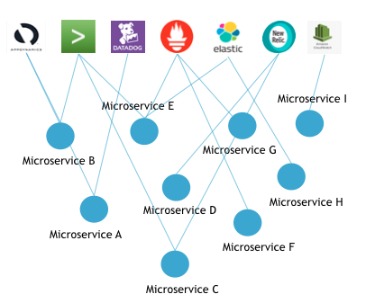
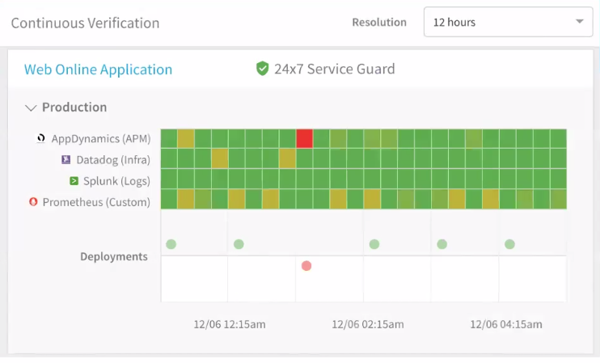
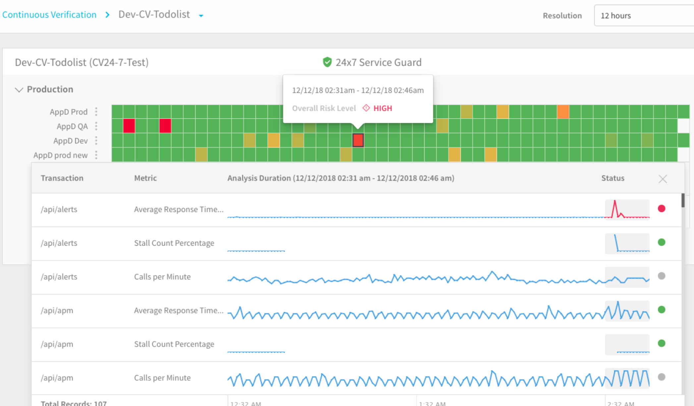
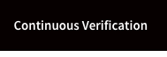
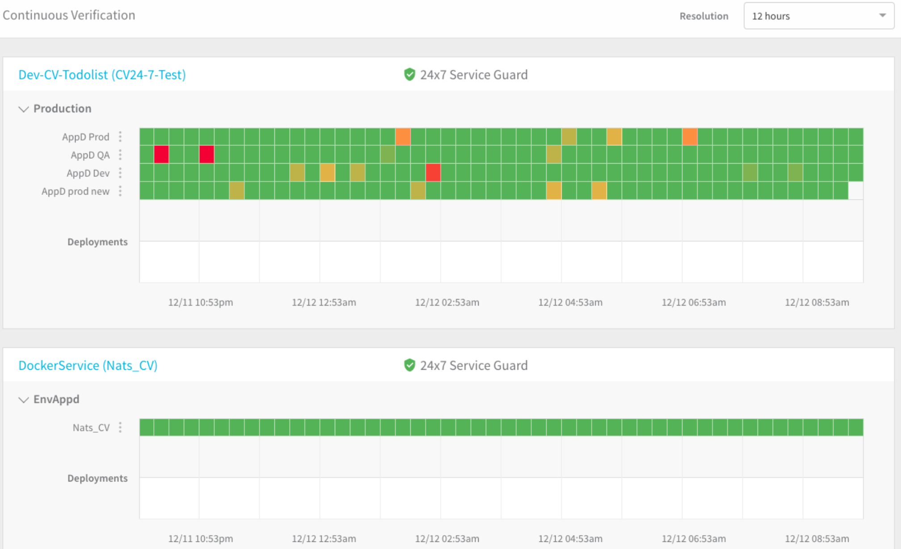

This article introduces Harness 24/7 Service Guard. 

Most enterprises use multiple monitoring and verification tools for each stage of their microservice deployment, and multiple tools for monitoring the live microservice in production. Detecting and investigating regressions and anomalies across these tools consumes a lot of time. For those of you tasked with monitoring microservices, the following image will be familiar.

Harness solves this problem with Harness 24/7 Service Guard.

Harness 24/7 Service Guard:

* Collects all of your monitoring and verification tools into a single dashboard.
* Applies Harness Continuous Verification unsupervised machine-learning to detect regressions and anomalies across transactions and events.
* Lets you drill down to the individual issue and open it in the related tool.

Harness 24/7 Service Guard gives DevOps operational visibility across all your monitoring tools in all your production environments.

24/7 Service Guard's automatic anomaly and regression detection allows you to see when end users are impacted—without requiring configuration, thresholds (which you can [optionally add](#alert_notifications)), or rules.

### Combined with Workflow Verifications

24/7 Service Guard is an addition to Harness' basic deployment verification functionality, which is described in [Continuous Verification](https://docs.harness.io/article/myw4h9u05l-verification-providers-list). Harness Workflow verification steps provide verification of Harness deployments and the running microservice for the first 15-30 minutes. 24/7 Service Guard provides detection of your microservices from then on, catching problems that surface minutes or hours following deployment.

The following image shows how the Continuous Verification dashboard includes both 24/7 Service Guard and Harness Deployments verification.

1. 24/7 Service Guard detection.
2. Harness Deployments verification.

For 24/7 Service Guard, the queries you define to collect logs are specific to the application or service you want monitored. Verification is at the application/service level. This is unlike Workflows, where verification is performed at the host/node/pod level.

### Machine Learning Overview

24/7 Service Guard sits on top of all your Application Performance Monitoring (APM), verification, and logging tools. 24/7 Service Guard applies:

* Predictive machine learning models for short-term behavior:
	+ Applies deep neural nets to short-term history.
	+ Detects unusual patterns due to spikes.
	+ Adapts to drift over deployments.
* Applies memory models for long term behavior:
	+ Learns historical/cyclical trends.
	+ Quantifies app reliability over Web and business transactions, based on the history of anomalous behavior.
	+ Quantifies the importance of different Web and business transactions, based on app usage over short- and long-term periods.

### Video Demonstration

Here's a 2-minute video that explains Harness 24/7 Service Guard:

<!-- Video:
https://harness-1.wistia.com/medias/rpv5vwzpxz-->
<docvideo src="https://fast.wistia.net/embed/iframe/izo4qehiuu" />

### Using the Dashboard

To use 24/7 Service Guard, click Harness Manager's **Continuous Verification** link.

The Services configured with 24/7 Service Guard appear. In this example, we have two applications:

Let's look at the dashboard in detail. The following image describes the 24/7 Service Guard dashboard for the application.

1. **Monitoring sources:** Verification and metrics providers, such as AppDynamics, etc. For a list of the verification providers supported by Harness, see [Continuous Verification](https://docs.harness.io/article/myw4h9u05l-verification-providers-list).
2. **Heat map:** The heat map is generated using the application and the monitoring sources. Each square is a time segment.
3. **Time resolution:** You can go high-level (for example, 30 days) or low-level (12 hours).
4. **Performance regressions:** Red and yellow are used to highlight regressions and anomalies. The colors indicate the Overall Risk Level for the monitoring segment.
5. **Transactions analysis:** Click a square to see the machine-learning details for the monitoring segment. The analysis details show the transactions for the monitoring segment. High-risk transactions are listed first.
6. **Drill-in to find the cause of the regression or anomaly:** When you click the dot for a transaction, you get further details and you can click a link to open the transaction in the monitoring tool. This allows you to go into the monitoring tool and find the root cause of the regression (specific queries, events, etc).

### Next Step

* [Set Up 24/7 Service Guard](../../24-7-service-guard/set-up-service-guard.md)

