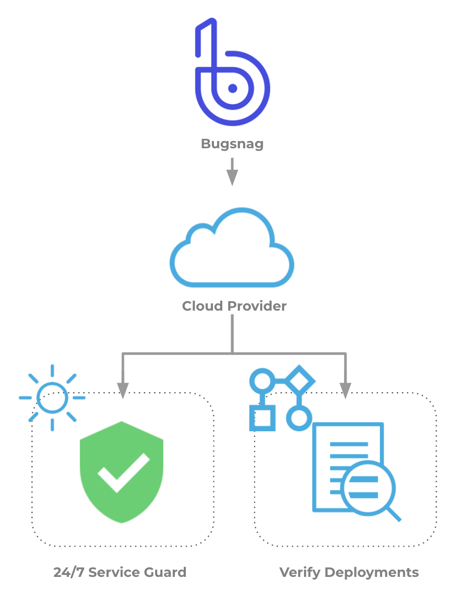

This topic describes how to set up Harness Continuous Verification, and monitor your deployments and production applications using its unsupervised machine-learning functionality, on Bugsnag.

Bugsnag provides error reporting libraries for every major software platform, detecting and reporting errors in your apps, and capturing diagnostic data for each error. Bugsnag captures your app’s exceptions or events, and groups them into errors according to their root causes.

### Visual Summary

Harness Continuous Verification integrates with Bugsnag to verify your deployments and live production applications using the following Harness features:

* **24/7 Service Guard** - Monitors your live, production applications.
* **Deployment Verification** - Monitors your application deployments, and performs automatic rollback according to your criteria.

This document describes how to set up these Harness Continuous Verification features, and then monitor your deployments and production applications using its unsupervised machine-learning functionality.

Bugsnag provides unique browser-focused reporting. See [Browser-Based Benefits](#browser_based_benefits) below.

|  |  |
| --- | --- |
| **Reporting with Bugsnag** | **Harness Analysis** |
|  |  |

### Integration Process Summary

You set up Bugsnag and Harness in the following way:

1. **Bugsnag** - Monitor your application using Bugsnag. In this article, we assume that you are using Bugsnag to monitor your application already.
2. **​Verification Provider Setup** - In Harness, you connect Harness to your Bugsnag account, adding Bugsnag as a **Harness Verification Provider**.
3. **Harness Application** - Create a Harness Application with a Service and an Environment. We do not cover Application setup in this sequence. See [Create an Application](../../../model-cd-pipeline/applications/application-configuration.md).
4. **​24/7 Service Guard Setup****-** In the Environment, set up 24/7 Service Guard to monitor your live, production application.
5. ​**Verify Deployments**:
	1. Add a Workflow to your Harness Application and deploy your microservice or application to the service infrastructure/[Infrastructure Definition](../../../model-cd-pipeline/environments/environment-configuration.md#add-an-infrastructure-definition) in your Environment.
	2. After you have run a successful deployment, you then add verification steps to the Workflow using your Verification Provider.
	3. Harness uses unsupervised machine-learning and Bugsnag analytics to analyze your future deployments, discovering events that might be causing your deployments to fail. Then you can use this information to set rollback criteria and improve your deployments.

### Browser-Based Benefits

Bugsnag is particularly useful for browser-based apps, as it collects browser information as part of its exception and error capture. This can helpful in determining if a new version of a browser is causing problems for users. Here is an example from Bugsnag:

Once you have deployed your app via Harness, you can add host/node-focused verification to your Harness workflow using another [Verification Provider](https://docs.harness.io/article/myw4h9u05l-verification-providers-list), and use Bugsnag to focus on browser-based issues. Here is an example of a Harness verification where other verification tools have been used to verify host/node issues, and Bugsnag is added as the last verification step to capture browser-based issues:

When you set up Bugsnag as a verification step in a Harness workflow, you can indicate if your app is browser-based. When Harness arrives at the Bugsnag verification step, Harness will ignore deployment host or node information and focus on browser-based data. This browser focus enables you to capture browser issues on their own after you have already ensured that the deployment host/node environment is running correctly.

Harness can now use this browser data with the machine-learning in its Continuous Verification and determine what events are causing errors or have to the potential to cause errors in the future.

For information about advanced browser event capturing in Bugsnag, see [React integration guide](https://docs.bugsnag.com/platforms/browsers/react/#sending-diagnostic-data) from Bugsnag.

### Next Steps

* [Connect to Bugsnag](../../bugsnag-verification/1-bugsnag-connection-setup.md)
* [Monitor Applications 24/7 with Bugsnag](../../bugsnag-verification/2-24-7-service-guard-for-bugsnag.md)
* [Verify Deployments with Bugsnag](../../bugsnag-verification/3-verify-deployments-with-bugsnag.md)

