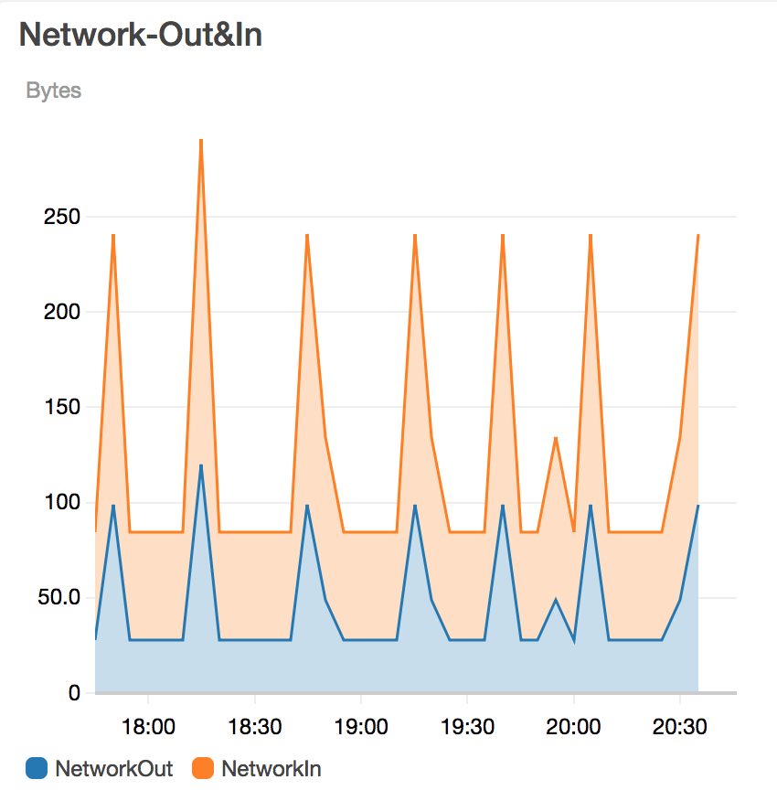
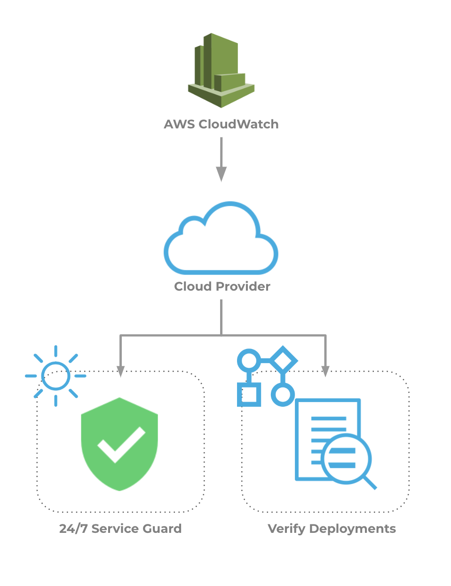
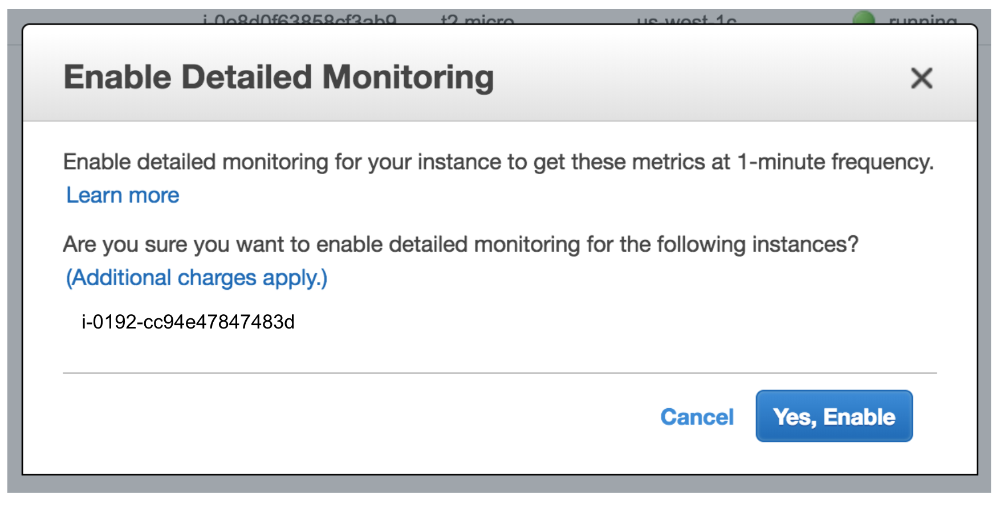

[Amazon CloudWatch](https://aws.amazon.com/cloudwatch/) collects monitoring and operational data in the form of logs, metrics, and events, providing you with a unified view of AWS resources, applications and services that run on AWS, and on-premises servers.

In this topic:

* [Visual Summary](#visual_summary)
* [Integration Process Summary](#anchor_1)
* [Next Steps](#next_steps)

### Visual Summary

Harness Continuous Verification integrates with CloudWatch to verify your deployments and live production applications using the following Harness features:

* **24/7 Service Guard** - Monitors your live, production applications.
* **Deployment Verification** - Monitors your application deployments, and performs automatic rollback according to your criteria.

This document describes how to set up these Harness Continuous Verification features and monitor your deployments and production applications using its unsupervised machine-learning functionality.

|  |  |
| --- | --- |
| **Monitoring with CloudWatch** | **Harness Analysis** |
|  |  |

Verification is limited to EC2 instance and ELB-related metrics data.
### Integration Process Summary

You set up CloudWatch and Harness in the following way:

1. **CloudWatch** - Using CloudWatch, you monitor the EC2 and ELB used to run your microservice or application.
2. **Cloud Provider** - In Harness, you connect Harness to your AWS account, adding AWS as a [Cloud Provider](https://docs.harness.io/article/whwnovprrb-infrastructure-providers).
3. **Harness Application** - Create a Harness Application with a Service and an Environment. We do not cover Application setup in this sequence. See [Application Components](../../../model-cd-pipeline/applications/application-configuration.md).
4. **​24/7 Service Guard Setup****-** In the Environment, set up 24/7 Service Guard to monitor your live, production application.
5. ​**Verify Deployments**:
	1. Add a Workflow to your Harness Application and deploy your microservice or application to the service infrastructure/[Infrastructure Definition](../../../model-cd-pipeline/environments/environment-configuration.md#add-an-infrastructure-definition) in your Environment.
	2. After you have run a successful deployment, you then add verification steps to the Workflow using your Verification Provider.
	3. Harness uses unsupervised machine-learning and CloudWatch analytics to analyze your future deployments, discovering events that might be causing your deployments to fail. Then you can use this information to set rollback criteria and improve your deployments.

For information on setting up CloudWatch to monitor EC2, ECS, and ELB, see [Monitoring Your Instances Using CloudWatch](https://docs.aws.amazon.com/AWSEC2/latest/UserGuide/using-cloudwatch.html) from AWS. When you enable CloudWatch monitoring on EC2, you are prompted with the following dialog.

Click **Yes, Enable**, and then go to CloudWatch to view metrics.

### Next Steps

* [Connect to CloudWatch](../../cloud-watch-verification/cloud-watch-connection-setup.md)
* [Monitor Applications 24/7 with CloudWatch](../../cloud-watch-verification/2-24-7-service-guard-for-cloud-watch.md)
* [Verify Deployments with CloudWatch](../../cloud-watch-verification/3-verify-deployments-with-cloud-watch.md)

