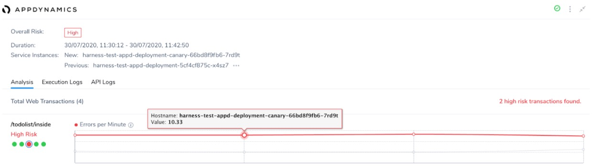
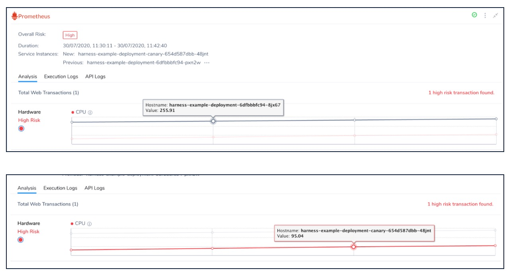

While adding a service verification step in your Workflow, you can select the metrics that you like to be monitored, specify thresholds, and monitor the anomalies that occur during the deployment verification.

You can also add your Custom metrics to Harness 24/7 Service Guard in your Harness Application Environment.

### Before You Begin

* See  [Continuous Verification Overview](https://www.google.com/url?q=https://docs.harness.io/article/ina58fap5y-what-is-cv&sa=D&ust=1596624436180000&usg=AOvVaw2-B986HwZG0UmYlOCU41s7).
* See  [Custom Verification Overview](https://www.google.com/url?q=https://docs.harness.io/article/e87u8c63z4-custom-verification-overview&sa=D&ust=1596624436181000&usg=AOvVaw1hDkv2iuHflv6VWR5AZT5g).

### Identifying the Anomalies

When you select a metric, the previously deployed host data or baseline is used as a yardstick for identifying the anomalies during this verification. While any change can be flagged as an anomaly, the learning engine takes into account the significance of the change and the ratio associated with the existing pattern. All the metrics that lie within the default threshold values will be excluded from the analysis and will always result in low risk.

#### **Default Delta**

It is the absolute deviation from the previous value. It is the absolute value calculated by subtracting the previous value from the current value. If this Delta value is less than the ratio, it will not be identified as an anomaly. If this value is higher than the ratio, analysis is run on the data to figure out the anomaly.

The formula for **Default Delta** is represented as follows:

 `allow if abs(y - x ) < ratio`

#### **Default Ratio**

It is the ratio of the deviation from the previous value. It should be ideally less than the minimal threshold value that you set during the verification configuration. If this value is higher than the threshold value, machine learning algorithms are run to identify the anomalies and highlight them.

The formula for **Default Ratio** is represented as follows:

`allow if abs (y - x)/x < min_threshold_ratio`

Here is a tabular summary of the various metrics, their thresholds, and the allowed Delta and Ratio computations. The x value for the metrics indicates the base value from the previous analysis. The y value is the new value derived from the current analysis.

 

|  |  |  |  |  |
| --- | --- | --- | --- | --- |
| **Metric Type** | **Type of Values** | **Deviation Type** | **Default Delta** | **Default Ratio** |
| Error rate | Web / Business transactions | Higher is bad | 0 | 0 |
| Response Times | Web / Business transactions | Higher is bad | 20 | .2 |
| Throughput | Web / Business transactions | Lower is bad | 20 | .2 |
| Infra | Cpu, memory .... | Higher and Lower is bad | 20 | .2 |
| Apdex | value between 0 and 1 | Lower is bad | 0 | .2 |

If the default thresholds are not relevant to your setup and do not make sense with these formulae, you can set up Custom Thresholds or Fail Fast Thresholds. For more information, see [Apply Custom Thresholds to Deployment Verification](../../tuning-tracking-verification/custom-thresholds.md).

### Error Rate

Error rate indicates the number of errors. There is no threshold associated with this metric. Unlike the other metrics, there is no **Default Delta** or **Default Ratio** against which this metric is measured. If there is a deviation from the previous value, analysis done on all the data without any filtering to find if there are any anomalies.

For example, if the previous verification cycle had 10 errors, and if 2 more errors occur in this cycle, further analysis is done to identify the anomalies.

In this example, the number of **Errors per Minute** increased from 4 to 10.33 and hence it is flagged as a **High Risk** transaction.

### Response Time

This metric considers the response time of web/business transactions. Usually, a higher value is considered as an anomaly.

Response Time indicates the time spent for the transaction from the beginning of a request. Usually, higher response times indicate issues in performance.

For example, if the value of **Response Time** was 20 in the previous run and it increased to 30, it will not be flagged as an anomaly. The difference or delta in this case is less than the previous run. If you calculate the ratio of difference, it is not significant either. Unless the Response Time value crosses the ratio and the delta is high, the anomaly is not flagged.

### Throughput

Throughput indicates the number of successful requests per minute to your web server. The throughput values different from application data to web/browser data as a single user request may result in multiple requests by the application.

If the number of requests per minute comes down, it is considered as an anomaly using the **Default Delta** and **Default Ratio** formulae.

### Infra/Infrastructure

This value measures the errors in infrastructure such as CPU, memory, and HTTP errors.

If the memory usage or CPU usage is low, it is flagged as a High Risk anomaly, because it is an indicator of some other factor that might be underperforming. Unless there is a fundamental intentional change, it is highly unusual to have sudden change or reduction in the usage of Infrastructural resources. Harness CV indicates the need to identify such indirect factors using this anomaly.

In this example, you can notice that the CPU utilization value decreased from 255.91 to 95.04. Unless, there has been a deliberate change in the code or resources, this is usually highly unlikely to happen. Hence, it is flagged as a **High Risk** transaction.

### Apdex

The Apdex value is usually between 0 and 1. A lower Apdex score indicates that the performance is not as expected.

Apdex measures user satisfaction with the response time. It indicates the measured response time against a specified threshold value.

