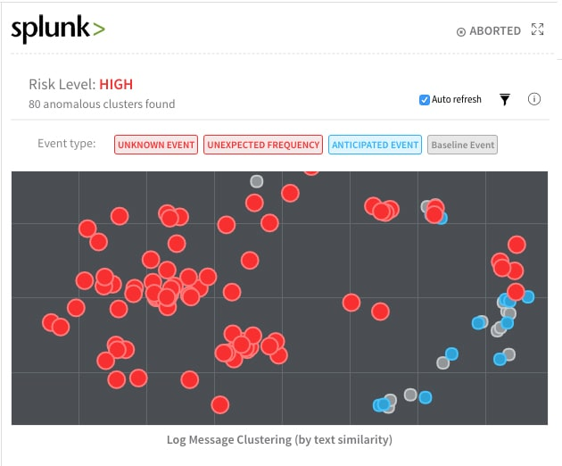
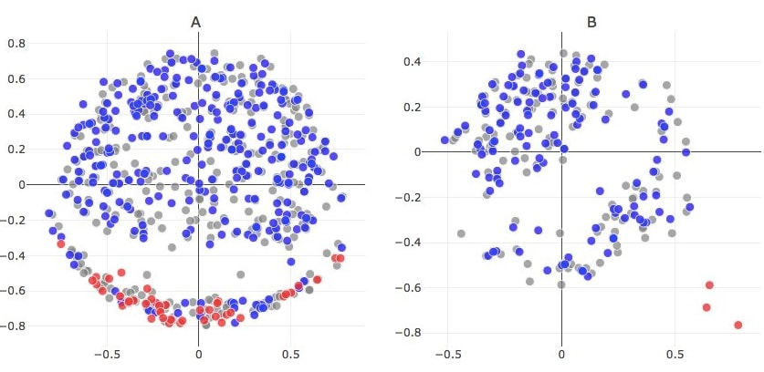
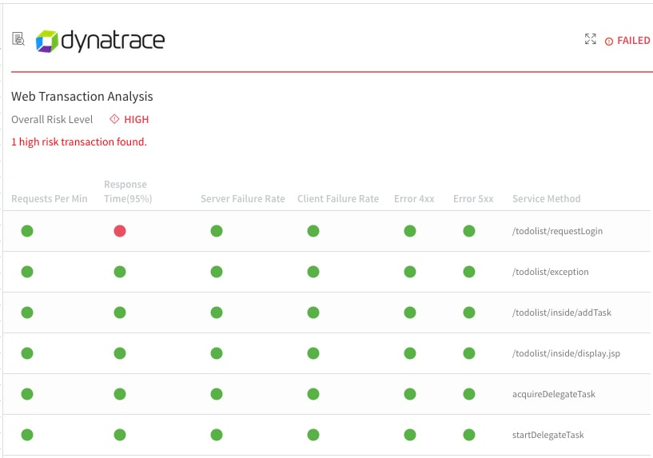
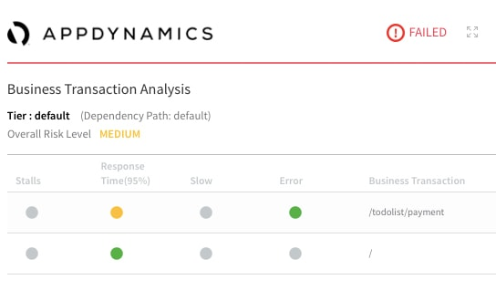
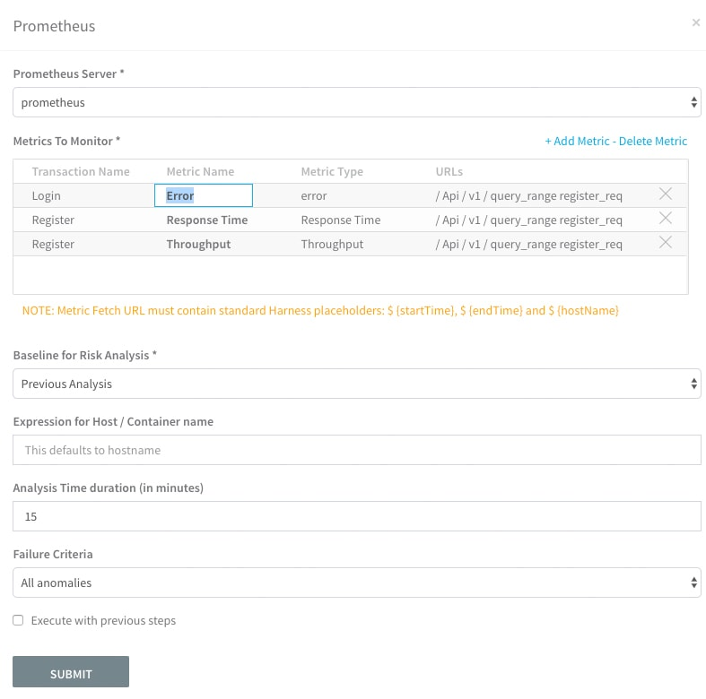
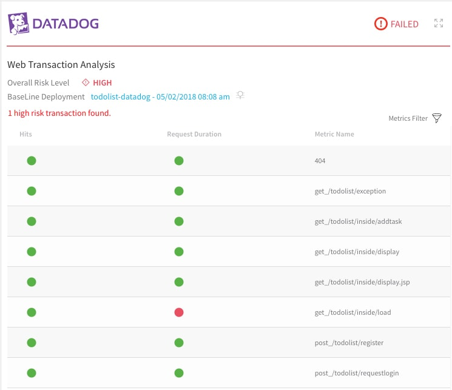

This topic lists the verification providers that integrate with Harness, and links to further details about each provider. It also covers the types of analysis strategies that Harness supports for each provider.

### Verification Providers Supported

[See the list of providers](https://harness.helpdocs.io/l/en/category/gurgsl2gqt-continuous-verification).

### Analysis Support by Provider

The following table lists which analysis strategies are supported for each Verification Provider.

|  |  |  |
| --- | --- | --- |
| **Provider** | **Previous** | **Canary** |
| AppDynamics | Yes | Yes |
| NewRelic | Yes | Yes |
| DynaTrace | Yes | Yes |
| Prometheus | Yes | Yes |
| SplunkV2 | Yes | Yes |
| ELK | Yes | Yes |
| Sumo | Yes | Yes |
| Datadog Metrics | Yes | Yes |
| Datadog Logs | Yes | Yes |
| CloudWatch | Yes | Yes |
| Custom Metric Verification | Yes | Yes |
| Custom Log Verification | Yes | Yes |
| BugSnag | Yes | No |
| Stackdriver Metrics | Yes | Yes |
| Stackdriver Logs | Yes | Yes |

### Deployment Type Support

The following table lists which analysis strategies are supported in each deployment type.

|  |  |
| --- | --- |
| **Deployment Type** | **Analysis Supported** |
| Basic | Previous |
| Canary | Canary |
| BlueGreen | Previous, |
| Rolling | Previous |
| Multi-service | No |
| Build  | No |
| Custom | No |

### Blog Articles

The following blog articles cover a range of Verification Providers and discuss Harness Continuous Verification functionality.

#### Machine Learning and Continuous Delivery

 [Can you apply Machine Learning to Continuous Delivery?](http://www.harness.io/blog/how-to-do-continuous-delivery-for-machine-learning-systems)

Interested in turning your deployment canary into a cybernetic living organism? Awesome, this blog is for you.

#### Harness Eliminates False Positives

 [How Harness Eliminates False Positives with Neural Nets](http://www.harness.io/blog/eliminate-false-positives-with-neural-nets)

Harness analyzes application log events to help customers detect anomalies and verify their production deployments. To do this, our algorithms have been based on textual similarity and occurrence frequencies. Harness has native integrations for popular log aggregation tools like Splunk, ELK, and Sumo Logic.

#### Dynatrace

 [Harness Extends Continuous Verification To Dynatrace](https://harness.io/2018/02/harness-extends-continuous-verification-dynatrace/)

One of our early customers, Build.com, used to verify production deployments with 5-6 team leads manually analyzing monitoring data and log files. This process took each team lead 60 minutes, and occurred 3 times a week. That’s 1,080 minutes, or 18 hours, of team lead time spent on verification. With Harness, Build.com reduced verification time to just 15 minutes, and also enabled automatic rollback to occur in production.

#### AppDynamics

 [Introducing Harness Service Impact Verification for AppDynamics](https://harness.io/2018/05/introducing-harness-service-impact-verification-for-appdynamics/)

AppDynamics announced a new partnership with Harness to help customers embrace continuous delivery and understand the business impact of every application deployment.

#### Prometheus

 [Automating Deployment Health Checks with Prometheus and Harness Continuous Delivery](http://www.harness.io/blog/verifying-ci-cd-pipelines-prometheus)

Overview of Harness' integration with Prometheus, the open-source monitoring project.

#### Datadog

 [Harness Extends Continuous Verification To Datadog](https://harness.io/2018/05/harness-extends-continuous-verification-datadog/)

Overview of Harness' integration with Datadog APM.

### Next Up

Next, see how you can interpret the verification results that Harness provides:

* [Verification Results Overview](deployment-verification-results.md)

