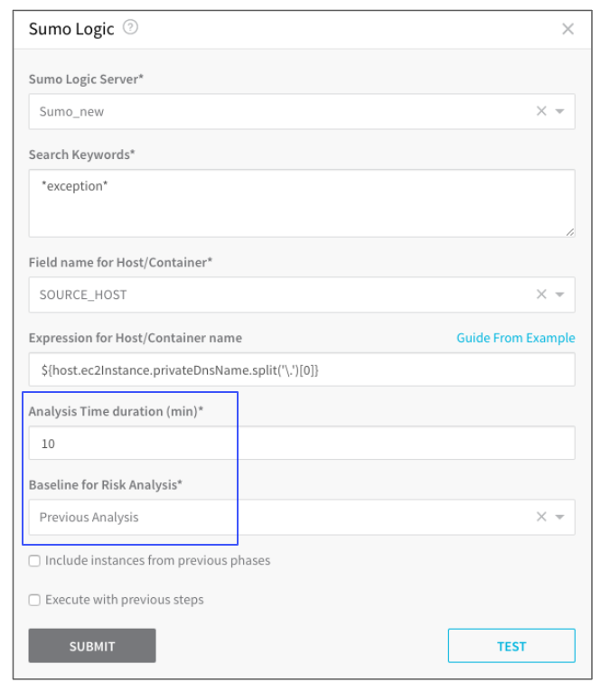
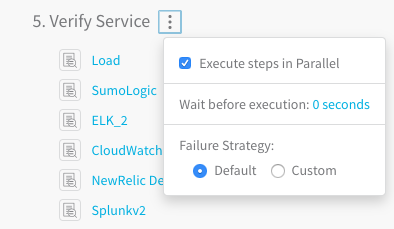
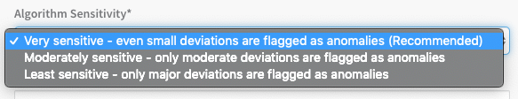
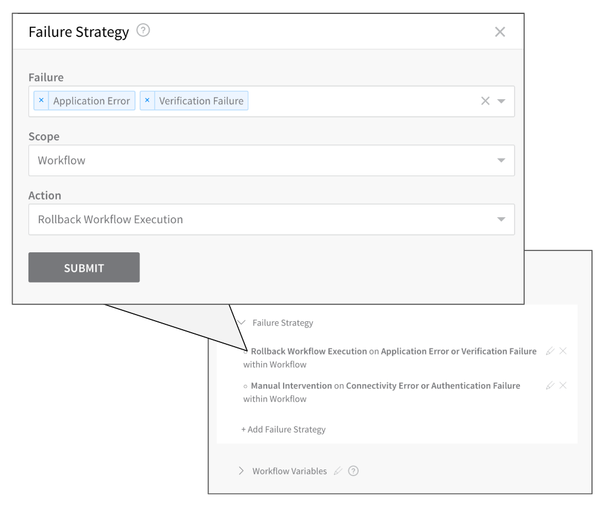
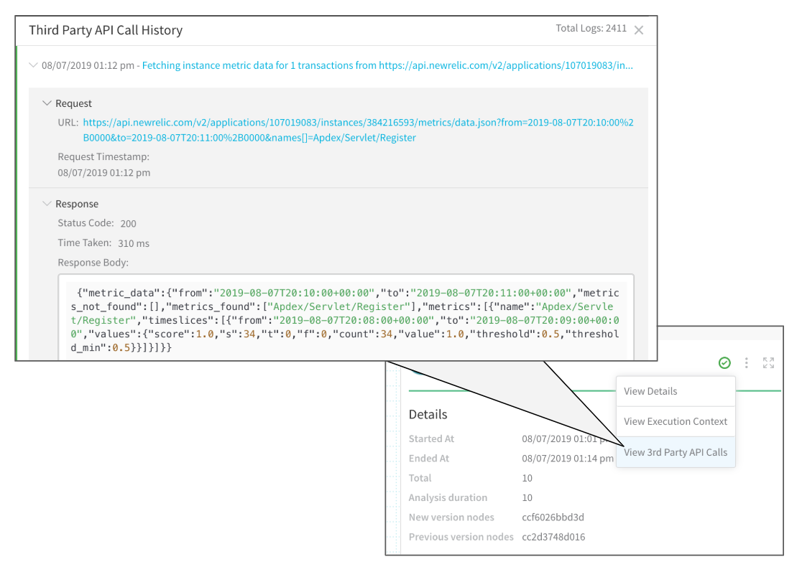
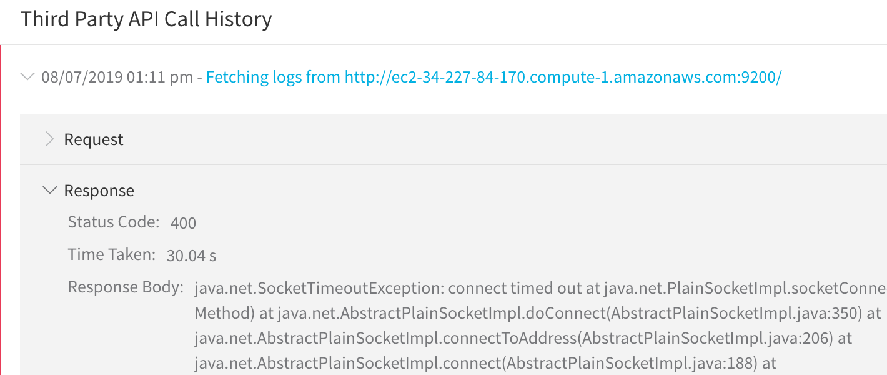
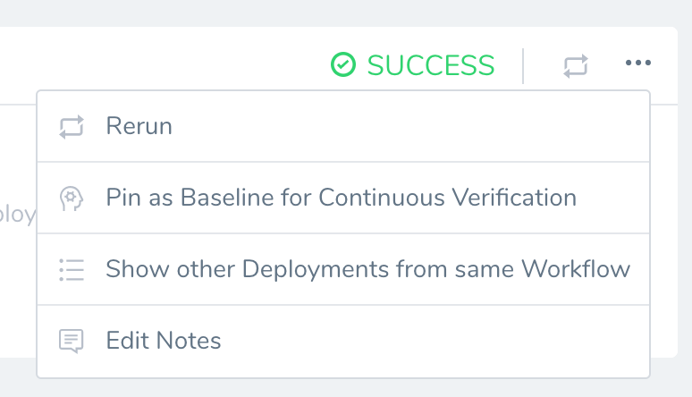
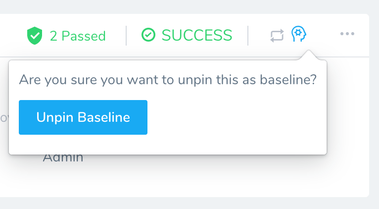

This topic helps you pick the best analysis strategy when setting up Harness Continuous Verification (CV) for deployments, and helps you tune the results using your expertise.

First, learn about the types of analysis strategies, and then learn about best practices and tuning.


### Where Are Analysis Strategies Set Up?

When you set up a verification step in a Harness Workflow, each supported APM lists the available analysis strategies in its **Baseline for Risk Analysis** setting and for how long the verification should be performed in its **Analysis Time duration** setting.



These two settings are used to tune the verification Harness performs. They are discussed in detail in this topic. 

### Types of Analysis Strategies

Harness uses these types of analysis strategies, each with a different combination of load (datasets) and granularity:


|  |  |  |
| --- | --- | --- |
| **Analysis Strategy** | **Load** | **Granularity** |
| Previous | Synthetic | Container level |
| Canary | Real user traffic | Container level |

Each strategy is defined below.


#### Previous Analysis

In Previous Analysis, Harness compares the metrics received for the nodes deployed in each Workflow Phase with metrics received for all the nodes during the previous deployment. Remember that verification steps are used only after you have deployed successfully at least once: In order to verify deployments and find anomalies, Harness needs data from previous deployments.

For example, if Phase 1 deploys app version 1.2 to node A, the metrics received from the APM during this deployment are compared to the metrics for nodes A, B, and C (all the nodes) during the previous deployment (version 1.1). Previous Analysis is best used when you have predictable load, such as in a QA environment.

For Previous Analysis to be effective, the load on the application should be the same across deployments. For example, provide a (synthetic) test load using [Apache JMeter](https://jmeter.apache.org/). If the load varies between deployments, then Previous Analysis is not effective.

##### Baseline for Previous Analysis

How does Harness identify the baseline? As stated earlier, Harness uses the metrics received for all the nodes during the previous deployment.

You can use [Pin as Baseline for Continuous Verification](#pin_as_baseline_for_continuous_verification) to specify a deployment to use as a baseline.

But if you do not use **Pin as Baseline for Continuous Verification**, Harness uses a combination of the following Harness entities to define what deployment is compared:

* Workflow (the specific Workflow that performed the deployment)
* Service
* Environment
* Infrastructure Definition (the specific Infrastructure Definition used for the specific deployment)


#### Canary Analysis

For Canary Analysis, Harness compares the metrics received for all old app version nodes with the metrics for the new app version nodes. The nodes deployed in each Workflow Phase are compared with metrics received for all of the existing nodes hosting the application.

In the following example, a Prometheus verification step is using Canary Analysis to compare a new node with two previous nodes:


For example, if Phase 1 deploys to 25% of your nodes, the metrics received for the new app versions on these nodes are compared with metrics received for the old app versions on these nodes.

The metrics are taken for the period of time defined in **Analysis Time duration**.

Harness supports Canary Analysis only in [Canary deployments](https://docs.harness.io/article/325x7awntc-deployment-concepts-and-strategies#canary_deployment).

##### Canary Analysis without a Host

Most providers have the concept of a host, where you use a host placeholder in the query used by Harness. In cases where the metrics provider does not have this concept (for example, Dynatrace), Canary analysis performs historical analysis.

For example, if your deployment is from 10-10:15am, Harness will compare it with deployments from 10-10:15am over the last 7 days. That historical data is the control data.

### Verification Best Practices

When picking an analysis strategy, there are several factors to consider, such as the type of deployment, in which Phase of the Workflow to add verification, and whether the number of instances/nodes/etc are consistent between deployments.  

This section provides help on selecting the right analysis strategy for your deployment.

#### Previous Analysis

Use the following best practices with Previous Analysis.

##### Do

* Use Previous Analysis in deployments where 100% of instances are deployed at once (single-phase deployments):
	+ Basic deployment.
	+ Canary deployment with only one phase.
	+ Blue/Green deployment.
	+ Rolling deployment.
* Use Previous Analysis if the number of instances deployed remains the same between deployments.
* In log verification, construct queries that selectively target errors. (This trains Continuous Verification to detect new failures.)
* In time-series verification, add signals that are strong indications of service issues:
	+ For example, a spike in error rates is cause for concern.
	+ Response times are also good candidates.
	+ Add CPU usage, memory usage, and similar metrics only if you are concerned about them.
	+ When configuring deployment verification, collect signals at the Service Instance level.
	+ When configuring 24/7 Service Guard, collect signals at the Service level.

##### Don't

* Don't use Previous Analysis in any phase of a *multiphase* Canary deployment.
* Don't use Previous Analysis when [Kubernetes Horizontal Pod Autoscaler (HPA)](https://kubernetes.io/docs/tasks/run-application/horizontal-pod-autoscale-walkthrough/) is configured for a deployment.
* In log verification, don't construct a generic query—such as one that will match all `info` messages. (Generic queries pull in a huge volume of data, without training Continuous Verification to recognize errors. The result is little signal, amid lots of noise.)

#### Canary Analysis

Use the following best practices with Canary Analysis.

##### Do

* Use Canary Analysis in multiphase Canary Workflows only.

##### Don't

* Don't use Canary Analysis if there is only one phase in the Canary Workflow.
* Don't use Canary Analysis in the last phase of a Canary Workflow because the final phase deploys to 100% of nodes and so there are no other nodes to compare.
* Don't use Canary Analysis when deploying 100% of instances at once.

Harness supports Canary Analysis only in [Canary deployments](https://docs.harness.io/article/325x7awntc-deployment-concepts-and-strategies#canary_deployment).

### Analysis Time Duration

This is the number of data points Harness uses. If you enter 10 minutes, Harness will take the first 10 minutes worth of the log/APM data points and analyze it.

The length of time it takes Harness to analyze the 10 min of data points depends on the number of instances being analyzed and the monitoring tool. If you have a 1000 instances, it can take some time to analyze the first 10 minutes of all of their logs/APM data points.

The recommended Analysis Time Duration is 10 minutes for logging providers and 15 minutes for APM and infrastructure providers.

Harness waits 2-3 minutes to allow enough time for the data to be sent to the verification provider before it analyzes the data. This wait time is a standard with monitoring tools. So, if you set the **Analysis Time Duration** to 10 minutes, it includes the initial 2-3 minute wait, and so the total sample time is 13 minutes.

#### Wait Before Execution

The **Verify Service** section of the Workflow has a **Wait before execution** setting.



As stated earlier, Harness waits 2-3 minutes before performing analysis to avoid initial noise. Use the **Wait before execution** setting only when your deployed application takes more than 3-4 minutes to reach steady state. This will help avoid initial noise when an application starts like CPU spikes.

### Algorithm Sensitivity and Failure Criteria

When adding a verification step to your Workflow, you can use the **Algorithm Sensitivity** setting to define the risk level that will be used as failure criteria during the deployment.



When the criteria are met, the Failure Strategy for the Workflow is executed.



For time-series analysis (APM), the risk level is determined using standard deviations, as follows: 5𝞼 ([sigma](https://watchmaker.uncommons.org/manual/ch03s05.html)) represents high risk, 4𝞼 represents medium risk, and 3𝞼 or below represents low risk.

Harness also takes into account the number of points that deviated: 50%+ is high risk, 25%-50% is medium risk, and 25% or below is low risk.

Harness will normally invoke a Workflow's Failure Strategy when it detects high risk; however, if you have set a verification step's sensitivity to **Very sensitive**, Harness will also invoke the Workflow's Failure Strategy upon detecting medium risk.

Every successful deployment contributes to creating and shaping a healthy baseline that tells Harness what a successful deployment looks like, and what should be flagged as a risk. If a deployment failed due to verification, Harness will not consider any of the metrics produced by that deployment as part of the baseline.

### Tuning Your Verification

When you first start using Harness Continuous Verification, we recommend you examine the results and use the following features to tune your verification using your knowledge of your application and deployment environment:

#### Customize Threshold

In your deployment verification results, you can customize the threshold of each metric/transaction for a Harness Service in a Workflow.


You can tune each specific metric for each Harness Service to eliminate noise. 

The example above helps you refine the response time. This means if the response time is less than the value entered in **Ignore if [95th Percentile Response Time (ms)] is [less]** then Harness will not mark it as a failure even if it is an anomaly.

Let's say the response time was around 10ms and it went to 20ms. Harness' machine-learning engine will flag it as an anomaly because it jumped 100%. If you add a threshold configured to ignore a response time is less than 100ms, then Harness will not flag it.

You can adjust the threshold for any metric analysis. The following example shows how you can adjust the min and max of host memory comparisons.


#### 3rd-Party API Call History

You can view each API call and response between Harness and a verification provider by selecting **View 3rd Party API Calls** in the deployment's verification details.



The **Request** section shows the API call made by Harness and the **Response** section shows what the verification provider returned:


```
 {"sdkResponseMetadata":{"requestId":"bd678748-f905-46bc-91e1-f17843f87ac2"},"sdkHttpMetadata":{"httpHeaders":{"Content-Length":"988","Content-Type":"text/xml","Date":"Wed, 07 Aug 2019 20:12:06 GMT","x-amzn-RequestId":"bd678748-f905-46bc-91e1-f17843f87ac2"},"httpStatusCode":200},"label":"MemoryUtilization","datapoints":[{"timestamp":1565208600000,"average":10.512906283101966,"unit":"Percent"},{"timestamp":1565208540000,"average":10.50788872163684,"unit":"Percent"},{"timestamp":1565208420000,"average":10.477005777531302,"unit":"Percent"},{"timestamp":1565208480000,"average":10.493672297485643,"unit":"Percent"}]} 
```
The API response details allow you to drill down to see the specific datapoints and the criteria used for comparison. Failures can also examined in the **Response** section:



Harness' machine-learning engine can process a maximum of 1,000 logs per minute. 

#### Event Distribution

You can view the event distribution for each event by clicking the graph icon:


The Event Distribution will show you the measured and baseline data, allowing you to see why the comparison resulted in an anomaly. 

#### Pin as Baseline for Continuous Verification

If you do not use Pin as Baseline, Harness uses default criteria. See [Baseline for Previous Analysis](#baseline_for_previous_analysis).By default in a Previous Analysis strategy, Harness uses the Continuous Verification data of the last successful Workflow execution **with data** as the baseline for the current analysis. This is an automatic setting, but you can select a specific deployment as a new baseline.

Data is never deleted from a workflow if it is set as the baseline. Also the baseline assignment can only be done through the UI and it has no Git property reference.To set a specific deployment as the baseline, do the following:

1. In Harness, click **Continuous Deployment**.
2. Locate the deployment you want to use as the new baseline.
3. Click the options button, and select **Pin as Baseline for Continuous Verification**. When you are prompted to confirm, click **Pin Baseline**.



If the deployment does not contain verification data, you will see the following error:

`Either there is no workflow execution with verification steps or verification steps haven't been executed for the workflow.`

Once the deployment is pinned as the baseline. You will see an icon on it and the option to unpin it:



### Analysis Support for Providers

The following table lists which analysis strategies are supported for each Verification Provider.


|  |  |  |
| --- | --- | --- |
| **Provider** | **Previous** | **Canary** |
| AppDynamics | Yes | Yes |
| NewRelic | Yes | Yes |
| DynaTrace | Yes | Yes |
| Prometheus | Yes | Yes |
| SplunkV2 | Yes | Yes |
| ELK | Yes | Yes |
| Sumo | Yes | Yes |
| Datadog Metrics | Yes | Yes |
| Datadog Logs | Yes | Yes |
| CloudWatch | Yes | Yes |
| Custom Metric Verification | Yes | Yes |
| Custom Log Verification | Yes | Yes |
| BugSnag | Yes | No |
| Stackdriver Metrics | Yes | Yes |
| Stackdriver Logs | Yes | Yes |

### Deployment Type Support

The following table lists which analysis strategies are supported in each deployment type.


|  |  |
| --- | --- |
| **Deployment Type** | **Analysis Supported** |
| Basic | Previous |
| Canary | Canary |
| BlueGreen | Previous |
| Rolling | Previous |
| Multi-service | No |
| Build  | No |
| Custom | No |

