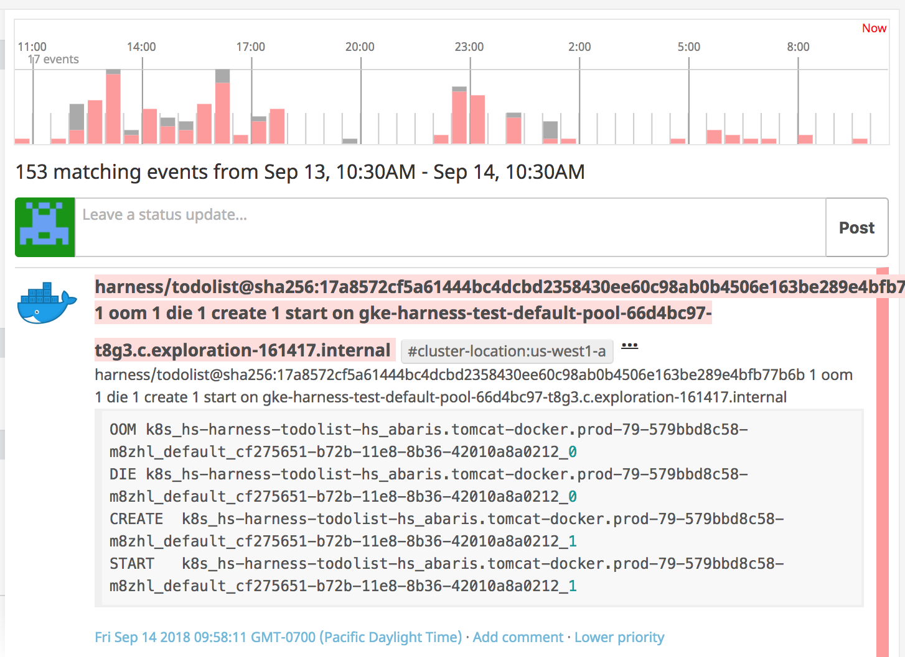
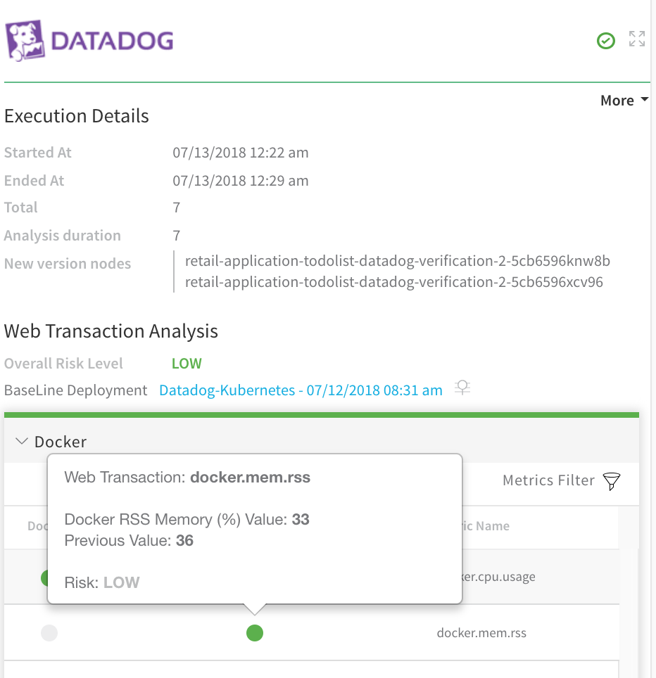
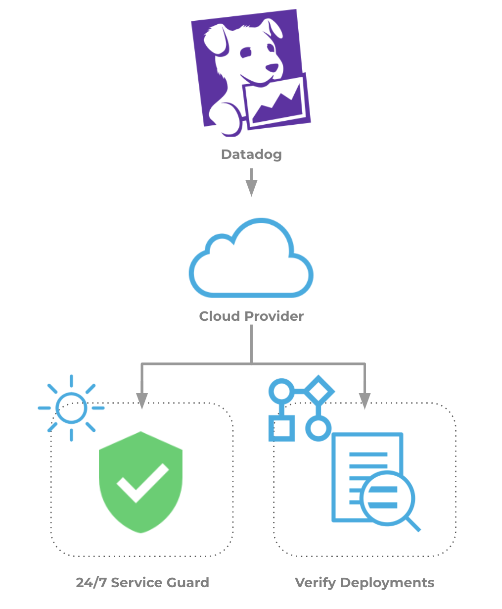

This topic describes how to set up Harness Continuous Verification features, and monitor your deployments and production applications using Harness' unsupervised machine-learning functionality, on Datadog.

In this topic:

* [Visual Summary](#visual_summary)
* [Integration Process Summary](#integration_process_summary)
* [Next Steps](#next_steps)

### Visual Summary

Datadog delivers real-time and trending data about application performance by seamlessly aggregating metrics and events across the full DevOps stack. Datadog automatically collects logs from all your services, applications, and platforms.

Harness Continuous Verification integrates with Datadog to verify your deployments and live production applications using the following Harness features:

* **24/7 Service Guard** - Monitors your live, production applications.
* **Deployment Verification** - Monitors your application deployments, and performs automatic rollback according to your criteria.

At this time, Datadog **Deployment Verification** is supported for Harness **Kubernetes** and **ECS Service** deployments only. To add deployment verification in Workflows for other Service types, use [Datadog as a Custom APM](../../custom-metrics-and-logs-verification/connect-to-datadog-as-a-custom-apm.md) and your Datadog monitoring. Datadog is fully supported for all Services in **24/7 Service Guard**.This document describes how to set up these Harness Continuous Verification features and monitor your deployments and production applications using its unsupervised machine-learning functionality.

|  |  |
| --- | --- |
| **Analysis with Datadog** | **Harness Analysis** |
|  |  |

### Integration Process Summary

You set up Datadog and Harness in the following way:

1. **Datadog** - Monitor your application using Datadog. In this article, we assume that you are using Datadog to monitor your application already.
2. **​Verification Provider Setup** - In Harness, you connect Harness to your Datadog account, adding Datadog as a **Harness Verification Provider**.
3. **Harness Application** - Create a Harness Application with a Service and an Environment. We do not cover Application setup in this sequence. See [Create an Application](../../../model-cd-pipeline/applications/application-configuration.md).
4. **​24/7 Service Guard Setup****-** In the Environment, set up 24/7 Service Guard to monitor your live, production application.
5. ​**Verify Deployments**:
	1. Add a Workflow to your Harness Application and deploy your microservice or application to the Service Infrastructure/[Infrastructure Definition](../../../model-cd-pipeline/environments/environment-configuration.md#add-an-infrastructure-definition) in your Environment.
	2. After you have run a successful deployment, you then add verification steps to the Workflow using your Verification Provider.
	3. Harness uses unsupervised machine-learning and Datadog analytics to analyze your future deployments, discovering events that might be causing your deployments to fail. Then you can use this information to set rollback criteria and improve your deployments.

### Next Steps

Read the following topics to build on what you've learned:

* [Connect to Datadog](../../datadog-verification/1-datadog-connection-setup.md)
* [Monitor Applications 24/7 with Datadog Metrics](../../datadog-verification/monitor-applications-24-7-with-datadog-metrics.md)
* [Monitor Applications 24/7 with Datadog Logging](../../datadog-verification/2-24-7-service-guard-for-datadog.md)
* [Verify Deployments with Datadog Logging](../../datadog-verification/3-verify-deployments-with-datadog.md)
* [Verify Deployments with Datadog Metrics](../../datadog-verification/verify-deployments-with-datadog-metrics.md)

