Harness provides verification results as analysis, data, and summaries. These results help you understand why deployments succeeded or failed, and why live production applications experience regressions and anomalies.

This topic describes the different ways Harness provides verification results.

### General Details

The following diagrams call out some of the main analysis elements.

Here is an example of the badges and summaries provided in the header.


Here is an example showing a few of the elements for log analysis.


Here is an example showing a few of the elements for metric analysis:


The following sections describe the different verification elements in more detail.

### Verification Badges

Verification badges provide a summary of the success and failure of the verification steps at the Pipeline and Workflow levels:

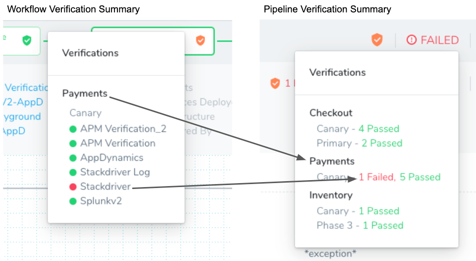

#### Badges Reflect Verification Steps

The badges do not indicate the success or failure of the Workflow itself, just the verification steps within the Workflow. If a Workflow in the Pipeline fails to reach its verification steps because it fails to deploy, it does not impact the badge color or appear in the verification summary.

#### Badges Apply to Integrated Providers

Currently, the badges only apply to verification steps using the providers integrated into Harness (AppDynamics, Splunk, etc). The badges do not reflect the status of other steps in the **Verify** section of a Workflow, such as smoke tests and HTTP health checks.

#### Badge Colors

The badge colors indicate the following:

* **Green:** All verifications passed. If a verification step (AppDynamics, Datadog, etc) passes in Phase 1 of a Workflow, but the same verification is aborted in Phase 2 of a Workflow, a green badge is displayed because the verification step did pass.
* **Orange:** A combination of passes, failures, or aborted verifications.
* **Red:** All verifications failed.
* **Gray:** All verifications are aborted.
* **No shield:** There are no verification steps in the Workflow.

The green, red, and gray badges match the colors of the Pipeline/Workflow stages. Only orange is unique to the badges.

### Execution Details

Click on each verification step to see its execution details, including when the verification started and ended, the duration of the analysis (which is a subset of started and ended because Harness waits for data), the query used for logs, and the new and previous service instances/nodes used for metrics.

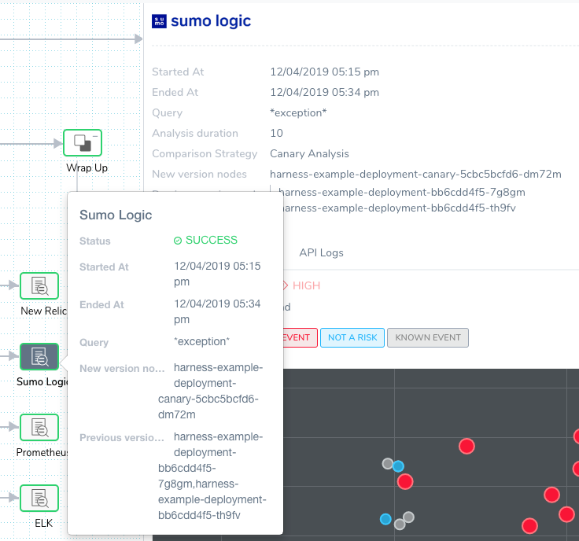

### Execution Context

You can select **View Execution Context** in the details options to see expressions used in the Workflow.

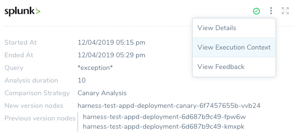

The execution context changes according to the verification step selected. For example, here is the execution context for a log analysis step and a metric analysis step:

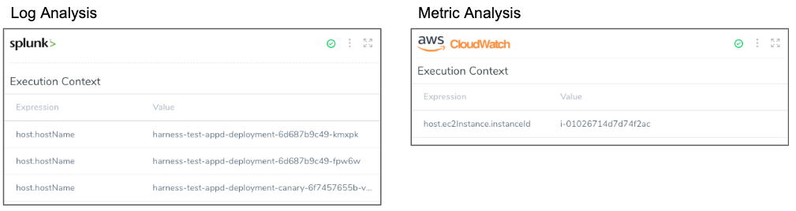

The log analysis shows a [built-in Harness variable](https://docs.harness.io/article/9dvxcegm90-variables) expression used as part of the query `${host.hostname}`, and the metric analysis shows the `${host.ec2InstanceinstanceId}` expression that identifies the target AWS AMI used for gathering metrics.

### Feedback

The feedback features are described in [Harness Verification Feedback Overview](harness-verification-feedback-overview.md).

### Analysis

Deployment verification analysis is displayed in **Continuous Deployment**. Real-time verification analysis is displayed in **Continuous Verification**.

#### Analysis in Continuous Deployments

The machine-learning analysis performed by Harness is displayed differently for metric and log analysis.

##### Metric Time-Series Analysis

Harness performs time-series analysis for Verification Providers that provides metrics, such as AppDynamics. Analysis is performed on each transaction, and the differential between new and previous metrics is displayed.

In the follow example, you can see analysis for four different transactions:

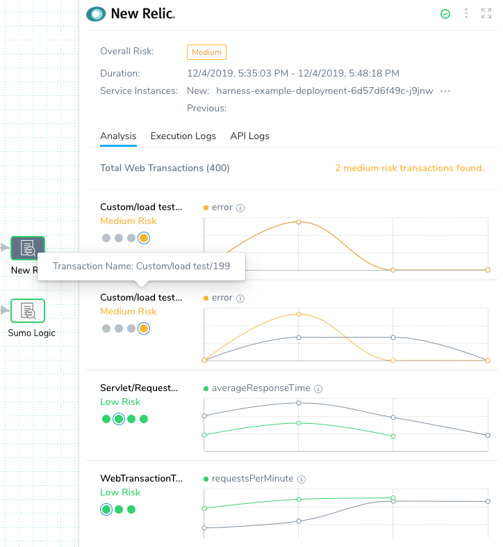

The gray lines represent the previous successful deployment (baseline), and the colored lines (green, orange, red) represent the current deployment.

* **Green:** Low Risk.
* **Orange:** Medium Risk.
* **Red:** High Risk.

If there is little deviation, the lines are green. As the deviation increases, the lines go from orange to red, indicating the level of risk.

Hover over each dot in the graph to see the hostname and the data point value:

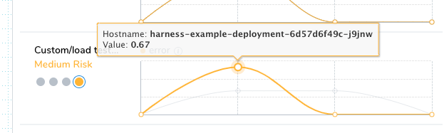

Each of the dots under the transaction names are the metrics analyzed. Hover over a dot to see the metric name and hosts:

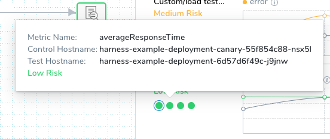

##### Log Analysis

Log analysis is performed by clustering similar log messages and using machine learning to compare them on each deployment.

Harness displays the analysis as a similarity chart, with anomalies displayed both by their color (red) and their deviation from known events (blue).

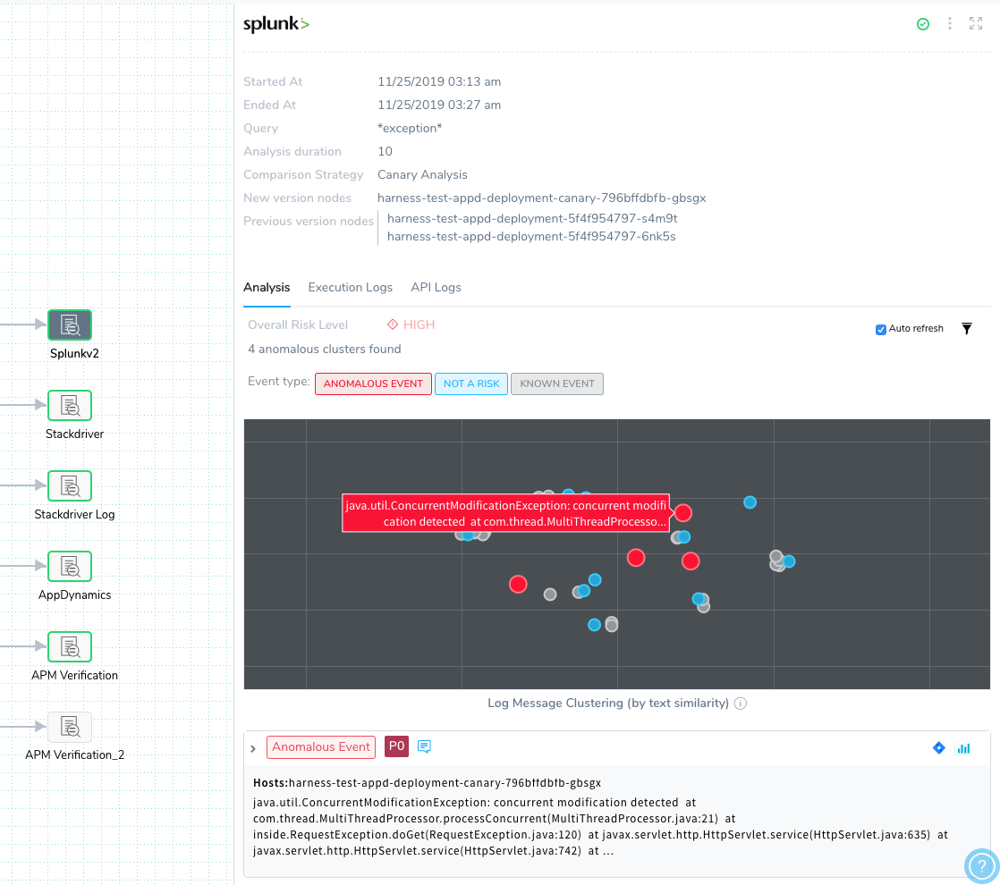

The similarity chart is a multidimensional scale projected onto a 2D space, where each letter in each baseline log is compared to every letter in the test logs.

You can click and drag to zoom in on an area of the chart.


Double-click to zoom out.

Below the chart are the log clusters organized as anomalous or other events.

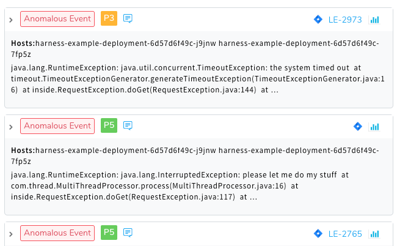

You can assign priority to events and file Jira tickets for the events. For more information, see [Refine Deployment Verification Analysis](../../tuning-tracking-verification/refine-deployment-verification-analysis.md) and [File Jira Tickets on Verification Events](../../tuning-tracking-verification/jira-cv-ticket.md).

You can view the event distribution chart for each log cluster by clicking the **Event Distribution Chart** button.

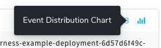

The Event Distribution for the log cluster appears, displaying the event count per minute and frequency.

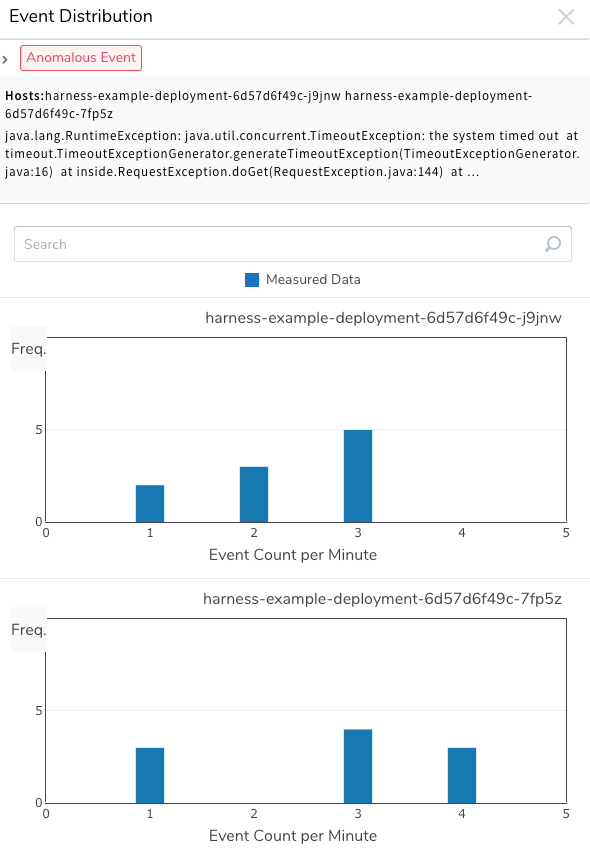

### Execution Logs

Both metric and log analysis include **Execution Logs**.

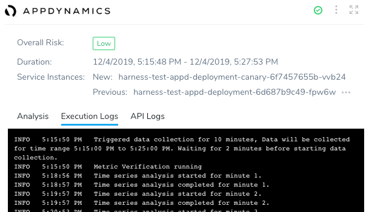

**Metric analysis:** For metric analysis, the **Execution Logs** shows the data collection and time series analysis for each minute of the duration you specified when you set up the **Verify** step in your Workflow.

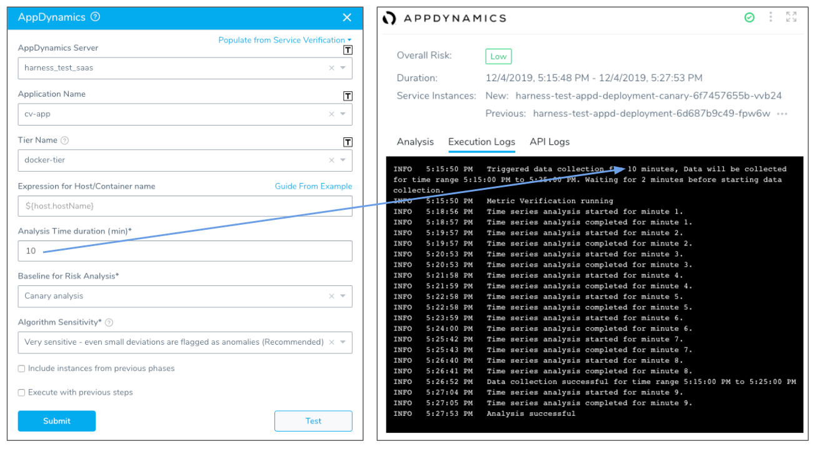

**Log analysis:** For log analysis, the **Execution Logs** shows the log analysis for the duration you specified when you set up the **Verify** step in your Workflow.

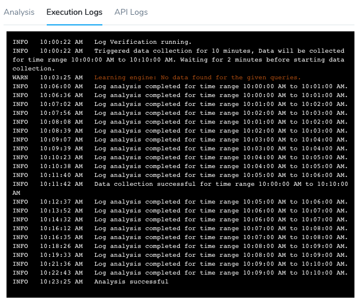

### API Logs

Both metric and log analysis include **API Logs**.

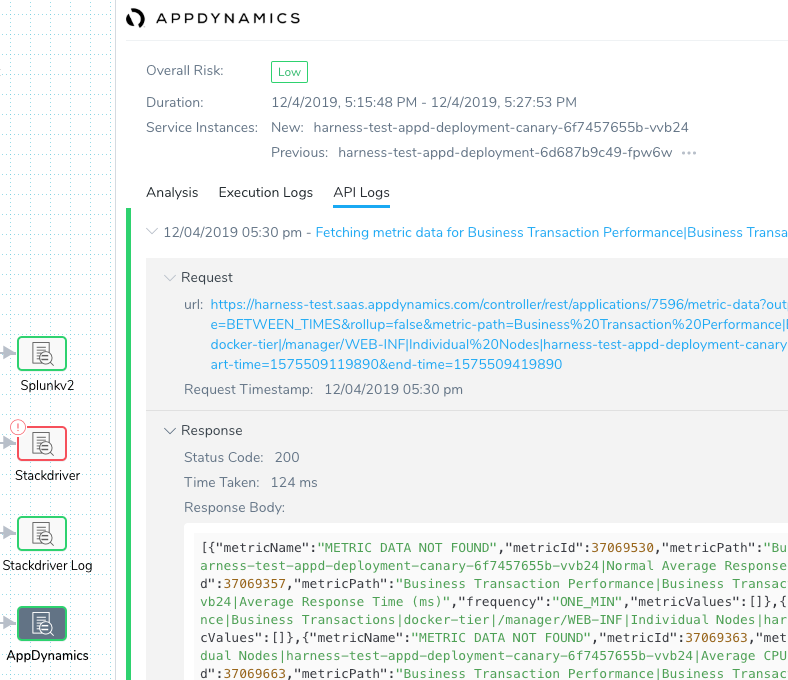

The API request and response for each metric or log query is displayed.

The **Response Body** can be copied and pasted into another program for debugging purposes:


```
{"status":"success","data":{"resultType":"matrix","result":[{"metric":{"__name__":"container_cpu_usage_seconds_total","instance":"gke-qa-target-default-pool-ca25b5a9-zwph","job":"kubernetes-cadvisor"},"values":[[1575509040,"80.471532291"],[1575509100,"83.54884438"]]}]}}
```
### Analysis in 24/7 Service Guard

24/7 Service Guard uses a heatmap for summarizing the analysis of live production services and displays deployment verification below the heatmap as colored dots.

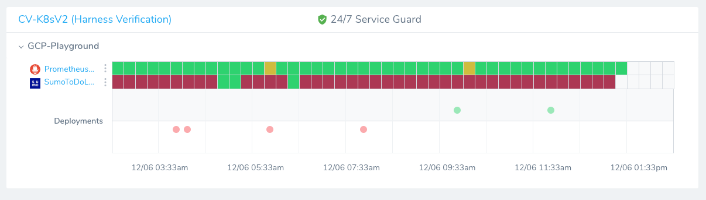

The colored dots are links to the Deployment Verification.

#### Metric Analysis

24/7 Service Guard metric analysis uses the same type of graph as deployment verification. Clicking any square on the heatmap displays the chart.

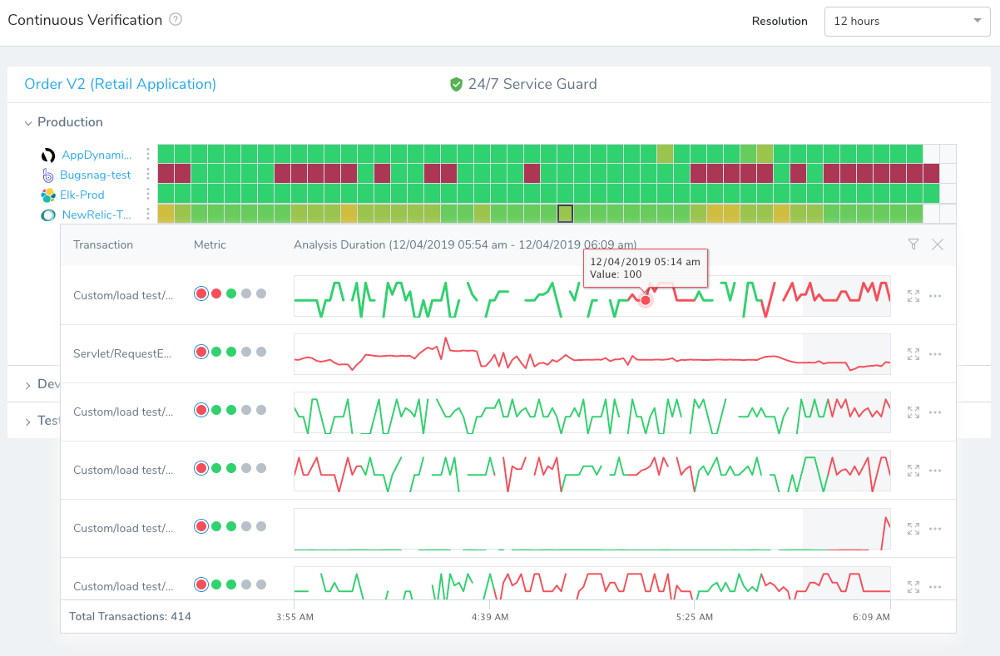

For some tools, like AppDynamics, you can click a link next to each transaction/metric pairing that opens the transaction data in the third party tool. Here the link is for the `/todolist/exeception` transaction and **Average Response Time** metric.

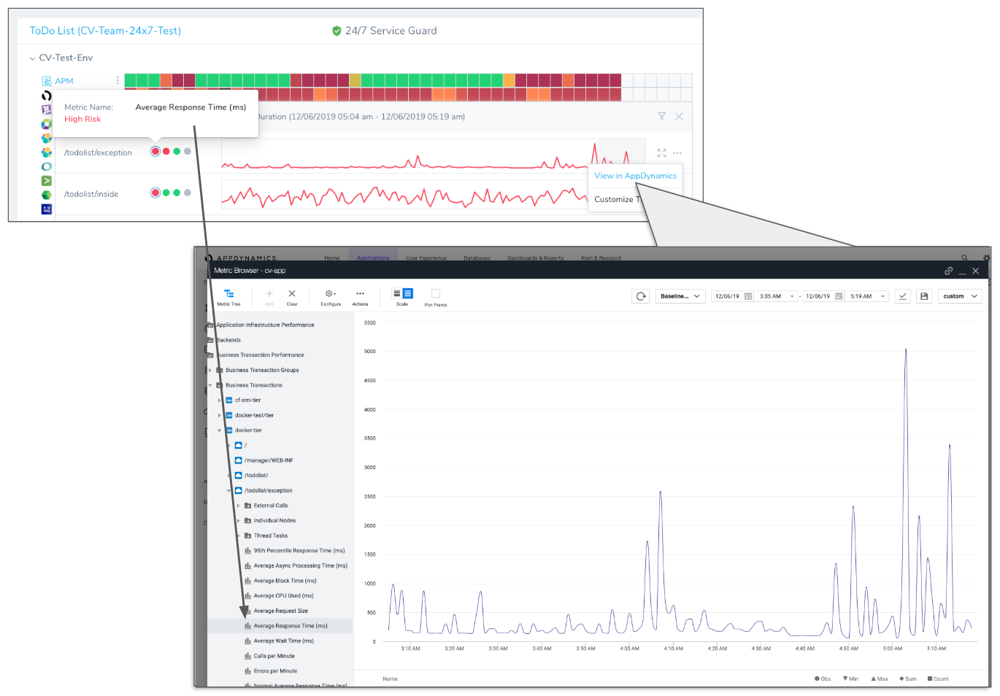

There is also an option to customize the threshold for the metric. Here is the **Customize Threshold** setting for the **Average Response Time**.

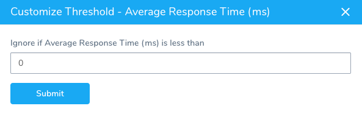

#### Execution Logs

In Harness [24/7 Service Guard](24-7-service-guard-overview.md), Execution Logs is displayed when you click **Execution Logs**:

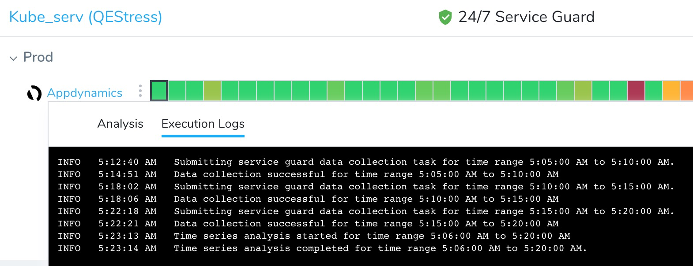

#### Logs Analysis

Logs analysis in 24/7 Service Guard uses the same features as [deployment verification logs analysis](deployment-verification-results.md#log-analysis).

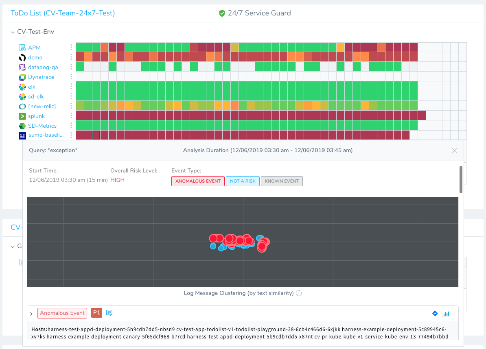

You can prioritize events, file Jira tickets, and view the Event Distribution, just as in deployment verification.

### Next Steps

* [24/7 Service Guard Overview](24-7-service-guard-overview.md)
* [CV Strategies, Tuning, and Best Practices](cv-strategies-and-best-practices.md)
* [File Jira Tickets on Verification Events](../../tuning-tracking-verification/jira-cv-ticket.md)
* [Harness Verification Feedback Overview](harness-verification-feedback-overview.md)
* [Refine 24/7 Service Guard Verification Analysis](../../tuning-tracking-verification/refine-24-7-service-guard-verification-analysis.md)
* [Refine Deployment Verification Analysis](../../tuning-tracking-verification/refine-deployment-verification-analysis.md)

