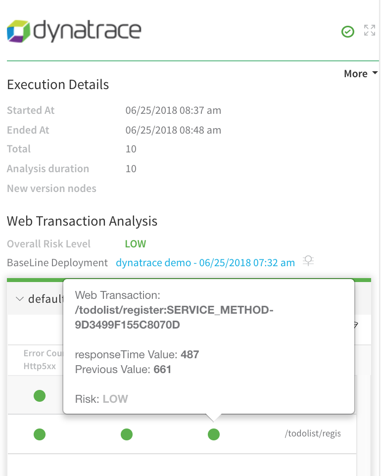
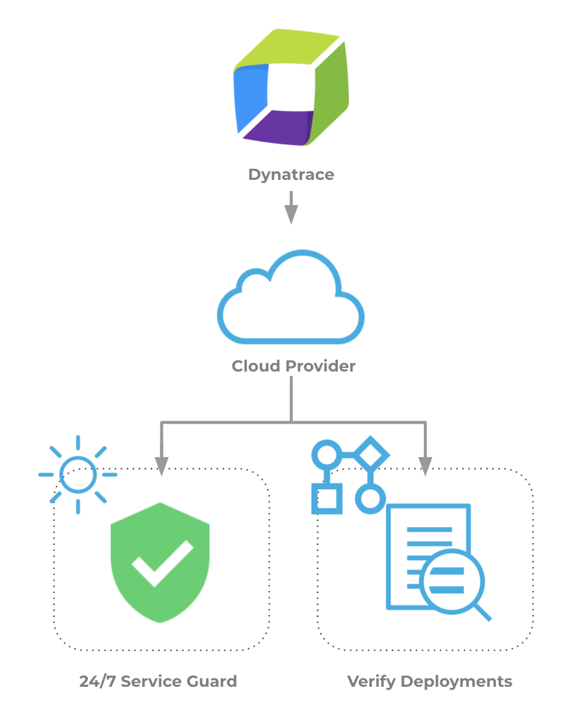

This topic provides an overview of how to set up Harness Continuous Verification features, and monitor your deployments and production applications using its unsupervised machine-learning functionality, on Dynatrace.

In this topic:

* [Visual Summary](#visual_summary)
* [Integration Process Summary](#integration_process_summary)
* [Next Steps](#next_steps)

### Visual Summary

Dynatrace provides constant monitoring of your application to manage performance and availability, and to provide diagnosis of performance problems and allow optimization across your stack. You can add a Dynatrace verification step to your workflow and Dynatrace will be used by Harness to verify the performance and quality of your deployments.

With its Dynatrace integration, Harness can deploy and verify the performance of artifacts instantly in every environment. When a new artifact is deployed, Harness automatically connects to Dynatrace and starts analyzing the application/service performance data to understand the real business impact of each deployment.

Harness applies unsupervised machine learning (Hidden Markov models and Symbolic Aggregate Representation) to understand whether performance deviated for key business transactions and flags performance regressions accordingly.

|  |  |
| --- | --- |
| **Analysis with Dynatrace** | **Harness Analysis** |
|  |  |

### Integration Process Summary

You set up Dynatrace and Harness in the following way:

1. Using Dynatrace, you monitor your microservice or application.
2. In Harness, you connect Harness to the Dynatrace API, adding Dynatrace as a [Harness Verification Provider](https://docs.harness.io/article/myw4h9u05l-verification-providers-list).
3. After you have built and run a successful deployment of your microservice or application in Harness, you then add Dynatrace verification steps to your Harness deployment workflow.
4. Harness uses Dynatrace to verify your future microservice/application deployments.
5. Harness Continuous Verification uses unsupervised machine-learning to analyze your deployments and Dynatrace analytics/logs, discovering events that might be causing your deployments to fail. Then you can use this information to improve your deployments.

### Next Steps

* [Connect to Dynatrace](../../dynatrace-verification/1-dynatrace-connection-setup.md)
* [Monitor Applications 24/7 with Dynatrace](../../dynatrace-verification/2-24-7-service-guard-for-dynatrace.md)
* [Verify Deployments with Dynatrace](../../dynatrace-verification/3-verify-deployments-with-dynatrace.md)

