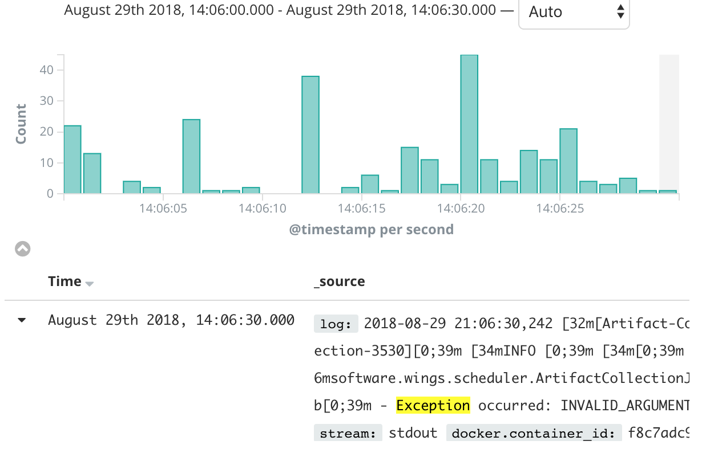
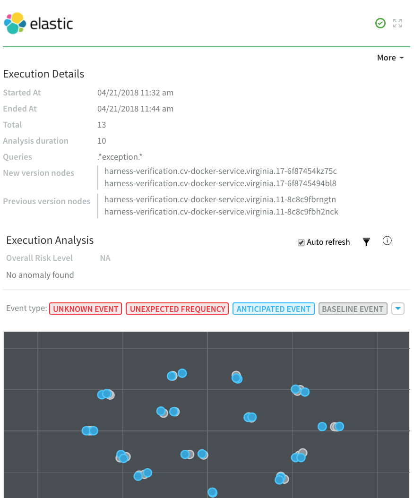
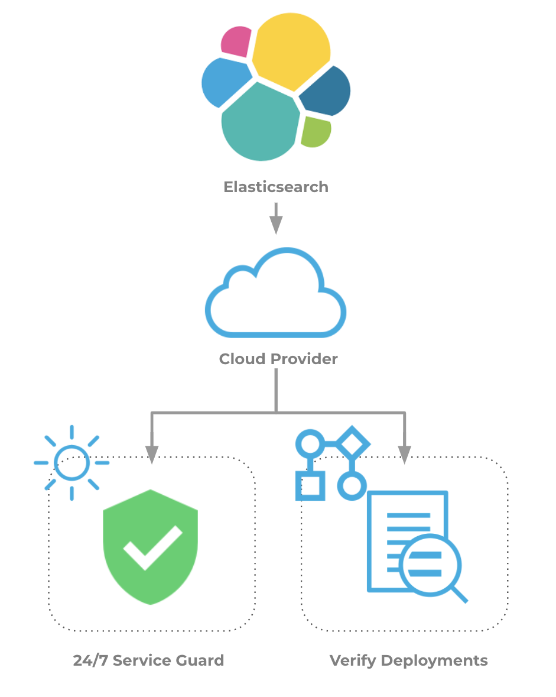

This topic describes how to set up Harness Continuous Verification features, and monitor your deployments and production applications using Harness' unsupervised machine-learning functionality, on the Elastic Stack.

Harness supports Elastic versions 5.0 to 7.x.In this topic:

* [Visual Summary](#visual_summary)
* [Integration Process Summary](#integration_process_summary)
* [Next Steps](#next_steps)

### Visual Summary

Harness Continuous Verification integrates with ELK to verify your deployments and live production applications using the following Harness features:

* **24/7 Service Guard** - Monitors your live, production applications.
* **Deployment Verification** - Monitors your application deployments, and performs automatic rollback according to your criteria.

This topic describes how to set up these Harness Continuous Verification features, and how to monitor your deployments and production applications using its unsupervised machine-learning functionality.

|  |  |
| --- | --- |
| **Exceptions with Elasticsearch via Kibana** | **Harness Analysis of Elasticsearch Verification** |
|  |  |

### Integration Process Summary

You set up ELK and Harness in the following way:

1. **ELK** - Monitor your application using ELK. In this article, we assume that you are using ELK to monitor your application already.
2. **​Verification Provider Setup** - In Harness, you connect Harness to your ELK account, adding ELK as a **Harness Verification Provider**.
3. **Harness Application** - Create a Harness Application with a Service and an Environment. We do not cover Application setup in this sequence. See [Application Components](../../../model-cd-pipeline/applications/application-configuration.md).
4. **​24/7 Service Guard Setup****-** In the Environment, set up 24/7 Service Guard to monitor your live, production application.
5. ​**Verify Deployments**:
	1. Add a Workflow to your Harness Application and deploy your microservice or application to the service infrastructure/[Infrastructure Definition](../../../model-cd-pipeline/environments/environment-configuration.md#add-an-infrastructure-definition) in your Environment.
	2. After you have run a successful deployment, you then add verification steps to the Workflow using your Verification Provider.
	3. Harness uses unsupervised machine-learning and Elasticsearch analytics to analyze your future deployments, discovering events that might be causing your deployments to fail. Then you can use this information to set rollback criteria and improve your deployments.

### Next Steps

* [Connect to Elasticsearch (ELK)](../../elk-elasticsearch-verification/1-elasticsearch-connection-setup.md)
* [Monitor Applications 24/7 with Elasticsearch](../../elk-elasticsearch-verification/2-24-7-service-guard-for-elasticsearch.md)
* [Verify Deployments with Elasticsearch](../../elk-elasticsearch-verification/3-verify-deployments-with-elasticsearch.md)
* [Troubleshoot Verification with Elasticsearch](../../elk-elasticsearch-verification/4-troubleshooting-elasticsearch.md)

