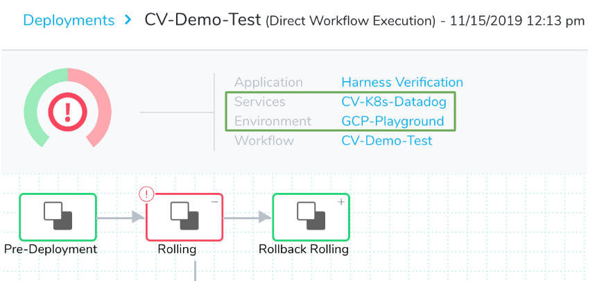
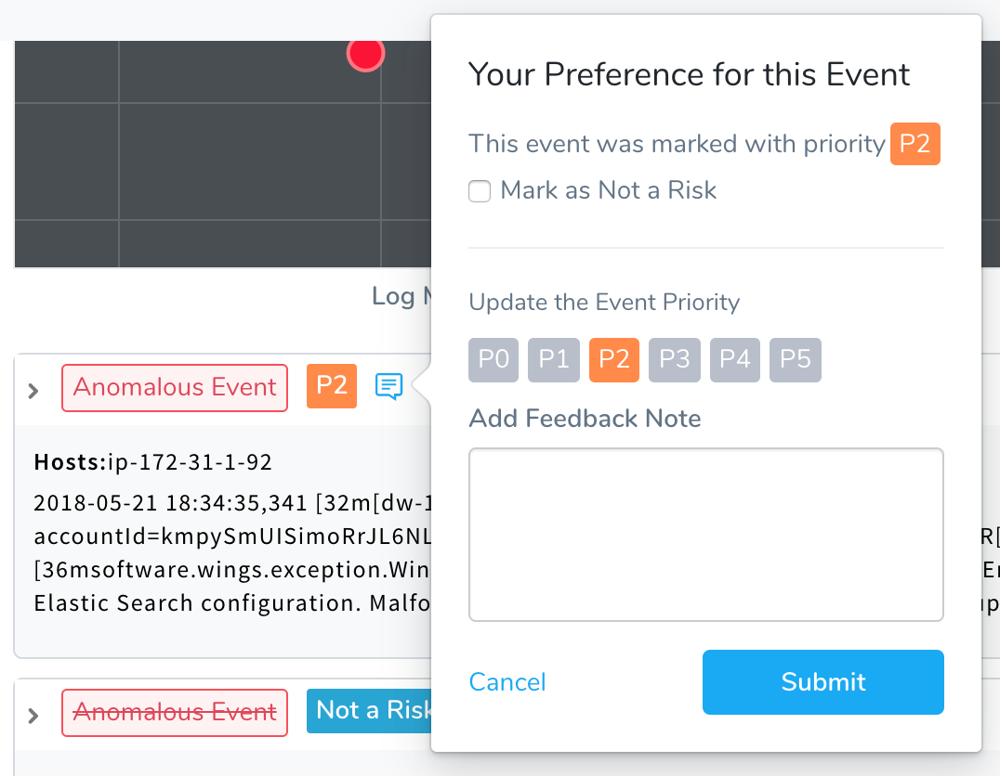

Harness provides verification analysis for deployments and live production services. For each of the verification events, you can perform various operations to improve analysis and reactions to events.

For details on refining analysis feedback for deployments and 24/7 Service Guard, see:

* [Refine 24/7 Service Guard Verification Analysis](../../tuning-tracking-verification/refine-24-7-service-guard-verification-analysis.md)
* [Refine Deployment Verification Analysis](../../tuning-tracking-verification/refine-deployment-verification-analysis.md)
* [Verification Event Classifications](https://docs.harness.io/article/339hy0kbnu-verification-event-classifications)

### Verification Feedback Summary

Verification Feedback is at the Harness Service and Environment level. For example, Continuous Verification Feedback for Service A in a **QA** Environment is different from feedback for Service A in a **Prod** or **Dev** Environment.

Here are the Service and Environment listed in the **Services** and **Environment** headings in the **Deployments** page:

For each event, Harness provides an event classification that you can change. 

### Options for Refining Verification Feedback

You can refine the verification analysis Harness performs on your application's logging data by providing feedback that clarifies verification events. For example, Harness might flag an event as a **Not a Risk** event, but you might like to increase the severity to a **P1**.

You can update the priority level for an event in a Workflow deployment or in 24/7 Service Guard, and it is applied to events for the Service. It is not specific to that Workflow. 

The feedback you provide for a Service in either the Deployments or Continuous Verification page is automatically visible in both pages.  

Verification Feedback is available for log analysis only. It is not available for metrics. To refine your metrics, change the settings in your Workflow verification step or 24/7 Service Guard configuration.

### Next Steps

* [Refine 24/7 Service Guard Verification Analysis](../../tuning-tracking-verification/refine-24-7-service-guard-verification-analysis.md)
* [Refine Deployment Verification Analysis](../../tuning-tracking-verification/refine-deployment-verification-analysis.md)
* [Verification Event Classifications](https://docs.harness.io/article/339hy0kbnu-verification-event-classifications)

