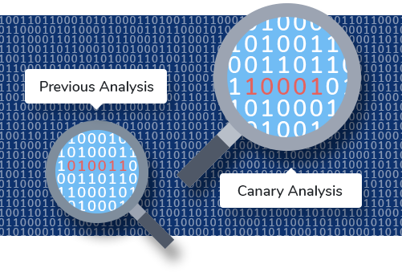
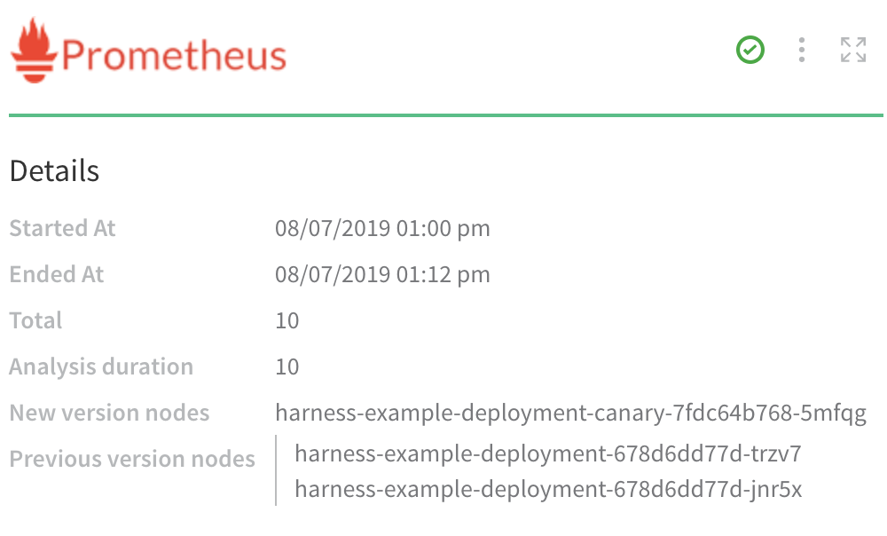

This topic covers the analysis strategies that Harness Continuous Verification can apply to your metrics and logs: Previous and Canary Analysis.

### Overview

As outlined in [What Is Continuous Verification (CV)?](what-is-cv.md), Harness Continuous Verification can consume and analyze performance metrics and/or log data from your choice of providers. This topic covers your choice of analysis strategies: Previous Analysis and Canary Analysis.

### Types of Analysis Strategies

Harness uses two types of analysis strategies, each with a different combination of load (datasets) and granularity:

|  |  |  |
| --- | --- | --- |
| **Analysis Strategy** | **Load** | **Granularity** |
| Previous | Synthetic | Container level |
| Canary | Real user traffic | Container level |

Each strategy is defined below.

### Previous Analysis

In Previous Analysis, Harness compares the metrics received for the nodes deployed in each Workflow Phase with metrics received for all the nodes during the previous deployment. Remember that verification steps are used only after you have deployed successfully at least once: In order to verify deployments and find anomalies, Harness needs data from previous deployments.

For example, if Phase 1 deploys app version 1.2 to node A, the metrics received from the APM during this deployment are compared to the metrics for nodes A, B, and C (all the nodes) during the previous deployment (version 1.1). Previous Analysis is best used when you have predictable load, such as in a QA environment.

For Previous Analysis to be effective, the load on the application should be the same across deployments. For example, provide a (synthetic) test load using [Apache JMeter](https://jmeter.apache.org/). If the load varies between deployments, then Previous Analysis is not effective.
### Canary Analysis

For Canary Analysis, Harness compares the metrics received for all old app version nodes with the metrics for the new app version nodes. The nodes deployed in each Workflow Phase are compared with metrics received for all of the existing nodes hosting the application.

In the following example, a Prometheus verification step is using Canary Analysis to compare a new node with two previous nodes:

For example, if Phase 1 deploys to 25% of your nodes, the metrics received for the new app versions on these nodes are compared with metrics received for the old app versions on these nodes.

The metrics are taken for the period of time defined in **Analysis Time duration**.

Harness supports Canary Analysis only on [Canary deployments](https://docs.harness.io/article/325x7awntc-deployment-concepts-and-strategies#canary_deployment).
### Next Up

Next, see our integrations:

* [Who Are Harness' Verification Providers?](cv-providers.md)

