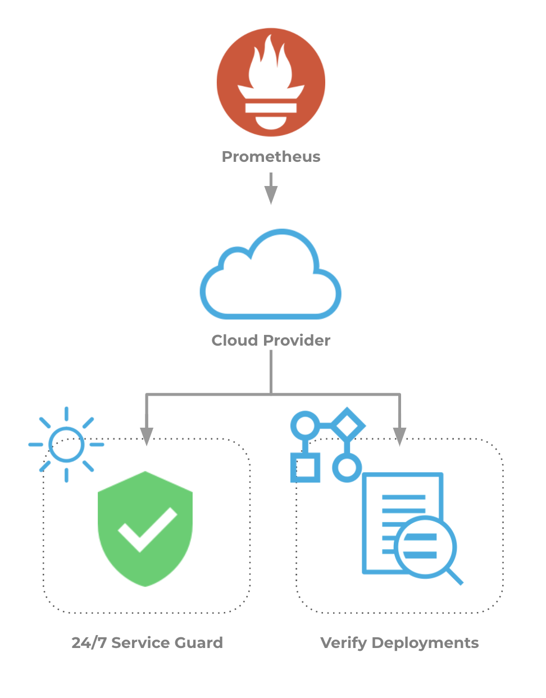

This topic describes how to set up Harness' Continuous Verification features, and monitor your deployments and production applications using its unsupervised machine-learning functionality, on Prometheus.

### Visual Summary

Prometheus uses a multi-dimensional data model with time-series data and key/value pairs, along with a flexible query language to leverage this dimensionality. Prometheus records any numeric time series, such as machine-centric monitoring and the monitoring of highly dynamic service-oriented architectures. For microservices, Prometheus support for multi-dimensional data collection and querying is very useful.

Prometheus integrates with Harness to verify the performance of microservices instantly in every environment.

When you use Prometheus with Harness Service Guard 24/7, or when you deploy a new microservice via Harness, Harness automatically connects to Prometheus and starts analyzing the multi-dimensional data model to understand what exceptions and errors are new or might cause problems for your microservice performance and quality.

Here is an example of a deployment Pipeline Stage verified using Prometheus.

### Integration Process Summary

You set up Prometheus and Harness in the following way:

1. **Prometheus**- Monitor your application using Prometheus. In this article, we assume that you are using Prometheus to monitor your application already.
2. **​Verification Provider Setup**- In Harness, you connect Harness to your Prometheus account, adding Prometheus as a **Harness Verification Provider**.
3. **Harness Application**- Create a Harness Application with a Service and an Environment. We do not cover Application setup in this sequence. See [Application Checklist](../../../model-cd-pipeline/applications/application-configuration.md).
4. **​24/7 Service Guard Setup****-**In the Environment, set up 24/7 Service Guard to monitor your live, production application.
5. ​**Verify Deployments**:
	1. Add a Workflow to your Harness Application and deploy your microservice or application to the service infrastructure/[Infrastructure Definition](../../../model-cd-pipeline/environments/environment-configuration.md#add-an-infrastructure-definition) in your Environment.
	2. After you have run a successful deployment, you then add verification steps to the Workflow using your Verification Provider.
	3. Harness uses unsupervised machine-learning and Prometheus analytics to analyze your future deployments, discovering events that might be causing your deployments to fail. Then you can use this information to set rollback criteria and improve your deployments.

### Next Steps

Read the following topics to build on what you've learned:

* [Connect to Prometheus](../../prometheus-verification/1-prometheus-connection-setup.md)
* [Monitor Applications 24/7 with Prometheus](../../prometheus-verification/2-24-7-service-guard-for-prometheus.md)
* [Verify Deployments with Prometheus](../../prometheus-verification/3-verify-deployments-with-prometheus.md)

