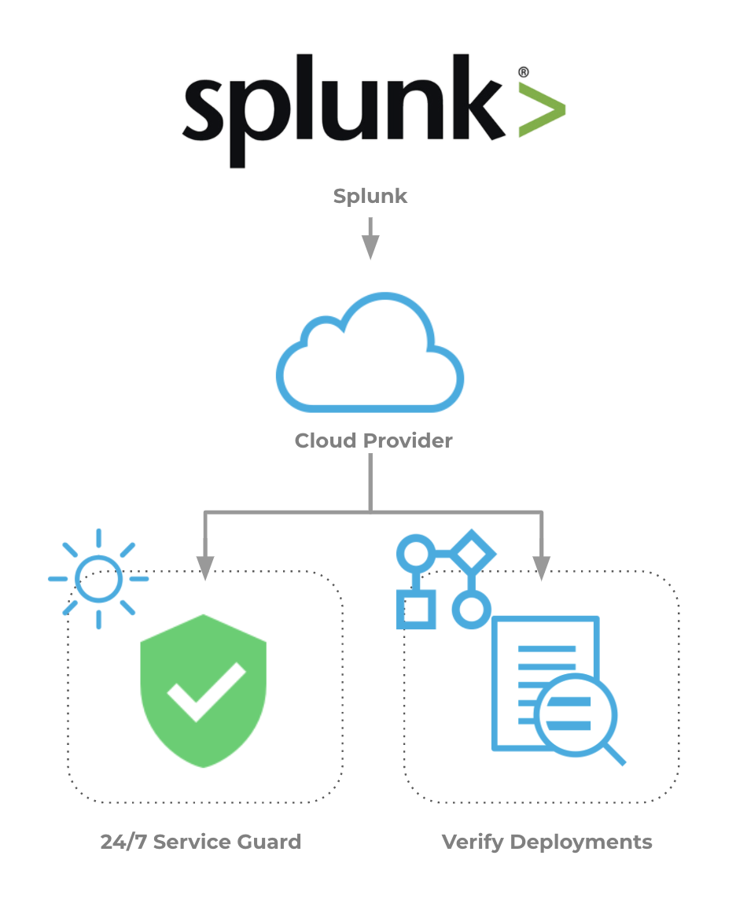

This topic describes how to set up Harness Continuous Verification features, and monitor your deployments and production applications using its unsupervised machine-learning functionality, on Splunk.

In this topic:

* [Visual Summary](#visual_summary)
* [Integration Process Summary](#integration_process_summary)
* [Next Steps](#next_steps)

### Visual Summary

Splunk Enterprise enables you to search, analyze, and visualize data gathered from your microservices, websites, and apps. After you define the data source, Splunk Enterprise indexes the data stream and parses it into a series of individual events that you can view and search. Splunk provides a REST API with over 200 endpoints. Developers can programmatically index, search, and visualize data in Splunk from any app.

Harness Continuous Verification integrates with Splunk to verify your deployments and live production applications using the following Harness features:

* **24/7 Service Guard**- Monitors your live, production applications.
* **Deployment Verification**- Monitors your application deployments, and performs automatic rollback according to your criteria.

This document describes how to set up these Harness Continuous Verification features and monitor your deployments and production applications using its unsupervised machine-learning functionality.

For example, once you have integrated Splunk with your microservice or app, you can add a Splunk verification step to your Harness workflows and Harness will use Splunk to verify the performance and quality of your deployments and apply Harness machine-learning verification analysis to Splunk data.

|  |  |
| --- | --- |
| **Verification with Splunk Enterprise** | **Harness Analysis** |
|  |  |

### Integration Process Summary

You set up Splunk and Harness as following way:

1. **Splunk** - Monitor your application using Splunk. In this article, we assume that you are using Splunk to monitor your application already.
2. **​Verification Provider Setup** - In Harness, you connect Harness to your Splunk account, adding Splunk as a **Harness Verification Provider**.
3. **Harness Application** - Create a Harness Application with a Service and an Environment. We do not cover Application setup in this sequence. See [Create an Application](../../../model-cd-pipeline/applications/application-configuration.md).
4. **​24/7 Service Guard Setup** **-** In the Environment, set up 24/7 Service Guard to monitor your live, production application.
5. ​**Verify Deployments**:
	1. Add a Workflow to your Harness Application and deploy your microservice or application to the service infrastructure/[Infrastructure Definition](../../../model-cd-pipeline/environments/environment-configuration.md#add-an-infrastructure-definition) in your Environment.
	2. After you have run a successful deployment, you then add verification steps to the Workflow using your Verification Provider.
	3. Harness uses unsupervised machine-learning and Splunk analytics to analyze your future deployments, discovering events that might be causing your deployments to fail. Then you can use this information to set rollback criteria and improve your deployments.

### Next Steps

* [Connect to Splunk](../../splunk-verification/1-splunk-connection-setup.md)
* [Monitor Applications 24/7 with Splunk](../../splunk-verification/2-24-7-service-guard-for-splunk.md)
* [Verify Deployments with Splunk](../../splunk-verification/3-verify-deployments-with-splunk.md)

