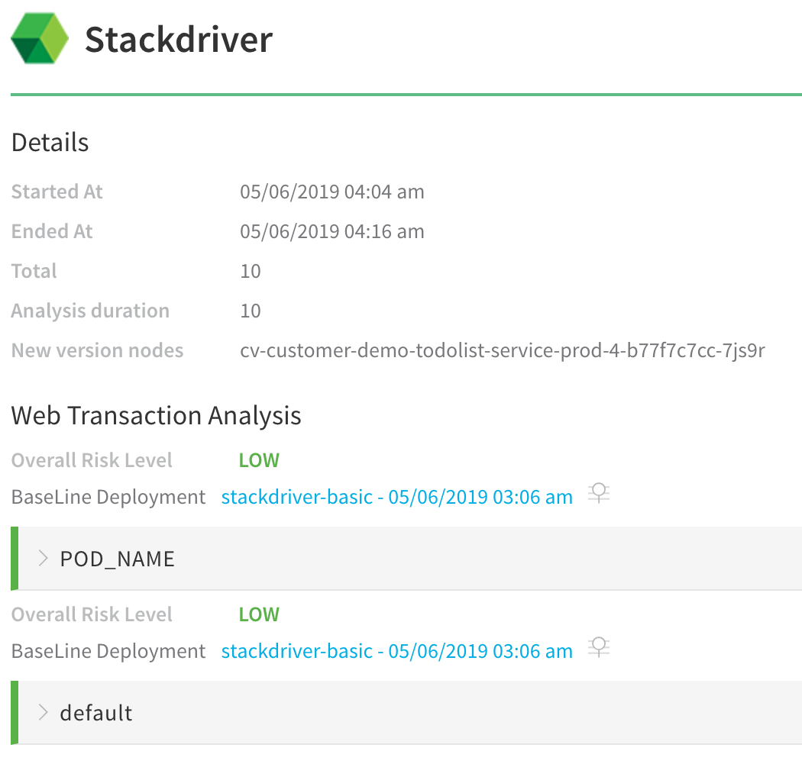
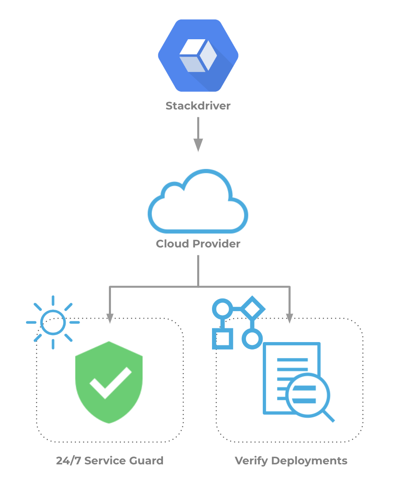

Google Operations (formerly Stackdriver) aggregates metrics, logs, and events from infrastructure, giving developers and operators a rich set of observable signals that speed root-cause analysis and reduce mean time to resolution (MTTR).

### Visual Summary

Harness Continuous Verification integrates with Google Operations to verify your deployments and live production applications using the following Harness features:

* **24/7 Service Guard** – Monitors your live, production applications.
* **Deployment Verification** – Monitors your application deployments, and performs automatic rollback according to your criteria.

|  |  |
| --- | --- |
| **Verification with Stackdriver** | **Harness Analysis** |
|  |  |

You can read more about Harness and Google Operations integration on the [Harness Blog](http://www.harness.io/blog/stackdriver-automated-canary-deployments).

### Integration Process Summary

You set up Stackdriver and Harness in the following way:

1. **Google Operations –** Monitor your application using Stackdriver. In this article, we assume that you are using Stackdriver to monitor your application already.
2. **Cloud Provider Setup –** In Harness, you connect Harness to your Google account, adding Google Cloud Platform as a **Harness Cloud Provider**. For more informations, see [Add Cloud Providers](https://docs.harness.io/article/whwnovprrb-cloud-providers).
3. **Harness Application** – Create a Harness Application with a Service, Environment, and Workflow. We do not cover Application setup in this sequence. See  [Application Components](../../../model-cd-pipeline/applications/application-configuration.md).
4. **​24/7 Service Guard Setup****–** In the Environment, set up 24/7 Service Guard to monitor your live, production application.
5. ​**Verify Deployments**:
	1. Add a Workflow to your Harness Application and deploy your microservice or application to the service infrastructure/ [Infrastructure Definition](../../../model-cd-pipeline/environments/environment-configuration.md#add-an-infrastructure-definition) in your Environment.
	2. After you have run a successful deployment, you then add verification steps to the Workflow using your Verification Provider.
	3. Harness uses unsupervised machine-learning and Stackdriver monitoring to analyze your future deployments, discovering events that might be causing your deployments to fail. Then you can use this information to set rollback criteria and improve your deployments.

### Next Steps

* [Connect to Stackdriver](../../stackdriver-verification/stackdriver-connection-setup.md)
* [Verify Deployments with Stackdriver Logging](../../stackdriver-verification/3-verify-deployments-with-stackdriver.md)
* [Verify Deployments with Stackdriver Metrics](../../stackdriver-verification/verify-deployments-with-stackdriver-metrics.md)
* [Monitor Applications 24/7 with Stackdriver Logging](../../stackdriver-verification/2-24-7-service-guard-for-stackdriver.md)
* [Monitor Applications 24/7 with Stackdriver Metrics](../../stackdriver-verification/monitor-applications-24-7-with-stackdriver-metrics.md)

