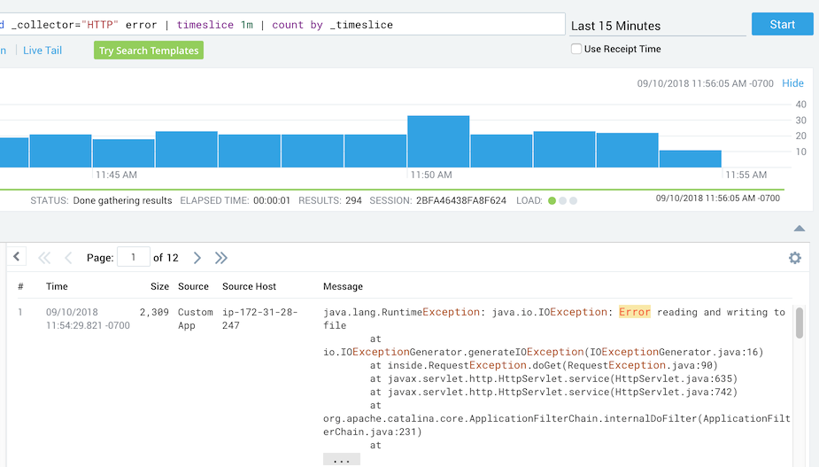
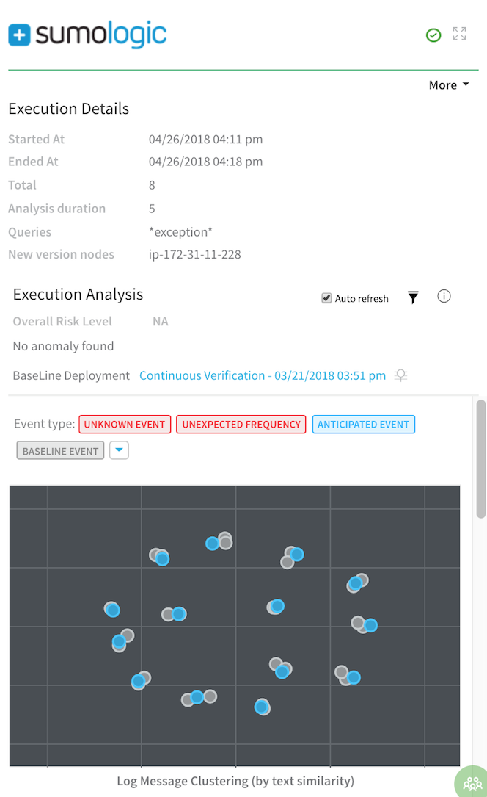
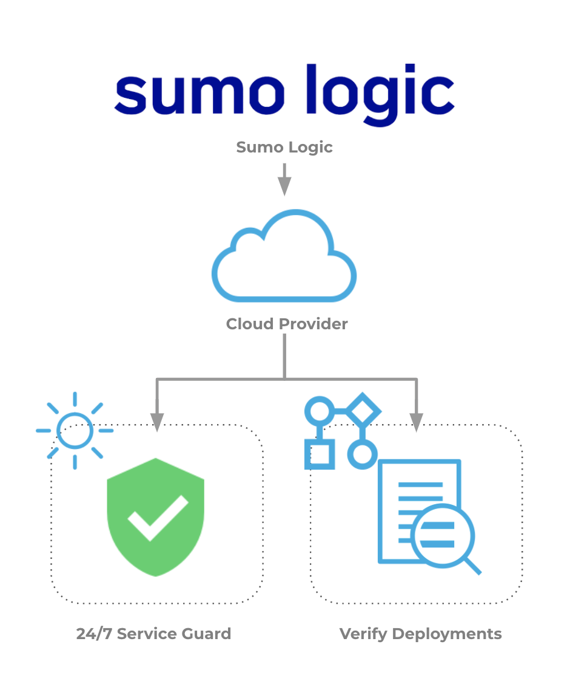

This topic describes how to set up Harness Continuous Verification features and monitor your deployments and production applications using its unsupervised machine-learning functionality on Sumo Logic.

### Visual Summary

Using Sumo Logic, you can interact with, and analyze, your data in the cloud in real time. Sumo Logic uses a powerful and intuitive search capability to expedite functions like forensic analysis, troubleshooting, and system health checks.

Harness Continuous Verification integrates with Sumo Logic to verify your deployments and live production applications, using the following Harness features:

* **24/7 Service Guard** – Monitors your live, production applications.
* **Deployment Verification** – Monitors your application deployments, and performs automatic rollback according to your criteria.

This document describes how to set up these Harness Continuous Verification features, and monitor your deployments and production applications, using Harness' unsupervised machine-learning functionality.

|  |  |
| --- | --- |
| **Search with Sumo Logic** | **Harness Analysis** |
|  |  |

### Integration Process Summary

You set up Sumo Logic and Harness in the following way.

1. **Sumo Logic** – Monitor your application using Sumo Logic. In this article, we assume that you are using Sumo Logic to monitor your application already.
2. **​Verification Provider Setup** – In Harness, you connect Harness to your Sumo Logic account, adding Sumo Logic as a **Harness Verification Provider**.
3. **Harness Application** – Create a Harness Application with a Service and an Environment. We do not cover Application setup in this sequence. See [Application Checklist](../../../model-cd-pipeline/applications/application-configuration.md).
4. **​24/7 Service Guard Setup****–** In the Environment, set up 24/7 Service Guard to monitor your live, production application.
5. ​**Verify Deployments**:
	1. Add a Workflow to your Harness Application and deploy your microservice or application to the service infrastructure/[Infrastructure Definition](../../../model-cd-pipeline/environments/environment-configuration.md#add-an-infrastructure-definition) in your Environment.
	2. After you have run a successful deployment, you then add verification steps to the Workflow using your Verification Provider.
	3. Harness uses unsupervised machine-learning and Sumo Logic analytics to analyze your future deployments, discovering events that might be causing your deployments to fail. Then you can use this information to set rollback criteria and improve your deployments.

### Next Steps

Read the following topics to build on what you've learned:

* [Connect to Sumo Logic](../../sumo-logic-verification/1-sumo-logic-connection-setup.md)
* [Monitor Applications 24/7 with Sumo Logic](../../sumo-logic-verification/2-24-7-service-guard-for-sumo-logic.md)
* [Verify Deployments with Sumo Logic](../../sumo-logic-verification/3-verify-deployments-with-sumo-logic.md)

