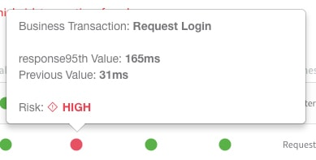
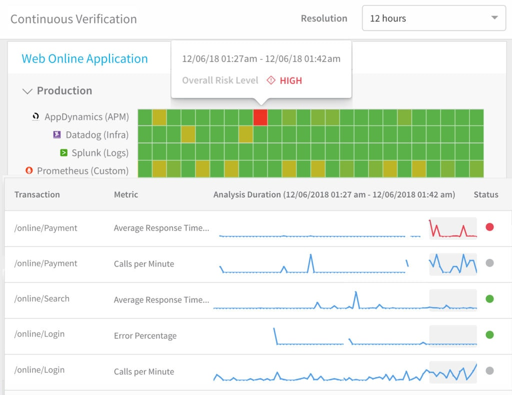
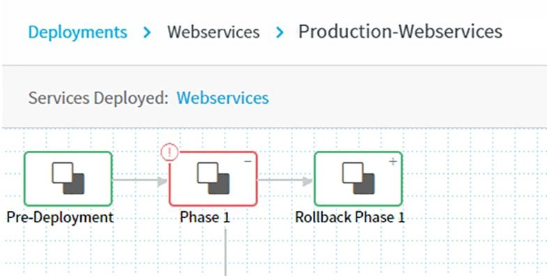

This topic covers Harness' two complementary verification components, Deployment Verification and 24/7 Service Guard.

### Short- and Long-Term Verification

Harness' Continuous Verification enables you to verify your services' health over two timeframes. At deployment time, Harness' **Deployment Verification** feature validates your artifacts, and then validates the individual service instances to which you've deployed.

Over the long term, Harness' **24/7 Service Guard** feature continuously validates your service as a whole.

You can use both or either of these verification types. Both types use the [Verification Providers](cv-providers.md) you set up in Harness.

### Deployment Verification

Deployment Verification verifies the first 15 minutes of deployments. Deployment verification is set up using a Harness Workflow.

For an excellent example of Deployment Verification, see the Harness Blog post, [How Build.com Rolls Back Production in 32 Seconds](https://harness.io/customers/case-studies/automated-ci-cd-rollback/).

#### Video Webinar

This video Webinar covers how Harness Continuous Delivery leverages unsupervised machine learning to verify production deployments, based on users' APM and log data.

<!-- Video:
https://harness-1.wistia.com/medias/rpv5vwzpxz-->
<docvideo src="https://www.youtube.com/embed/ZO5otWQ4PIc" />

### 24/7 Service Guard

Harness' 24/7 Service Guard feature verifies your live, production application continuously. You set up 24/7 Service Guard verification in a Harness [Environment](../../../model-cd-pipeline/environments/environment-configuration.md).

#### Video Summary

Here's a 2-minute video summary of how 24/7 Service Guard works:

<!-- Video:
https://harness-1.wistia.com/medias/rpv5vwzpxz-->
<docvideo src="https://www.youtube.com/embed/yi8J4nZAXxw" />

#### 24/7 Service Guard in Depth

For an introduction to 24/7 Service Guard's uses cases and design, see the Harness Blog post, [Harness 24/7 Service Guard Empowers Developers with Total Operational Control](http://www.harness.io/blog/harness-24-7-service-guard).

For further details about how to use 24/7 Service Guard in combination with other Harness capabilities, see the [24/7 Service Guard Overview](24-7-service-guard-overview.md) topic.

### Next Up

Next, read details about:

* [How Does Harness Perform Continuous Verification?](how-cv.md)

