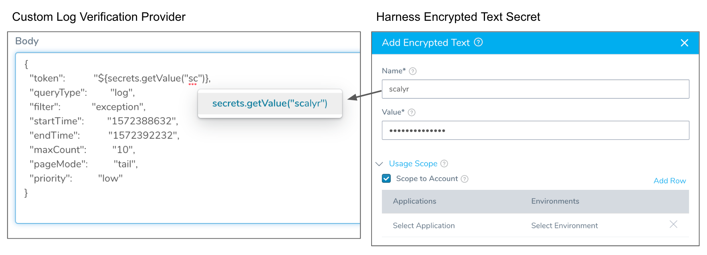
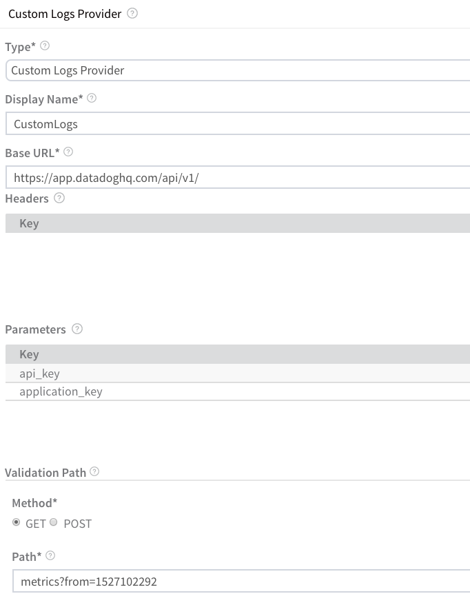

Connect Harness to a Custom Logs Provider to have Harness verify the success of your deployments. Harness will use your tools to verify deployments and use its machine learning features to identify sources of failures.

### Before You Begin

* See [Custom Verification Overview](custom-verification-overview.md).

### Step 1: Add Custom Verification Provider

To connect a custom logs provider, do the following:

1. Click **Setup**.
2. Click **Connectors**.
3. Click **Verification Providers**.
4. Click **Add Verification Provider**, and click **Custom Verification**.

The **Logs Data Provider** dialog appears. In **Type**, select **Custom Logs Provider**.

### Step 2: Display Name

In **Display Name**, give the Verification Provider a name. You will use this name to select this provider in a Workflow.

### Step 3: Base URL

In **Base URL**, enter the base URL of the REST endpoint where Harness will connect. Often, the URL is the server name followed by the index name, such as `http://server_name/index_name`.

### Step 4: Parameters

In **Parameters**, click **Add Parameters**, and add any required parameters.

### Step 5: Validation Path

In **Validation Path**, you will define a validation path used by Harness to validate the connection and ensure a Harness Delegate can reach the provider. Harness expects an HTTP 200 response.

### Step 6: Encrypted Text Secrets in Body

In some cases, you might need to include a token in the **Body** in **Validation Path**. You can enter your token in **Body**, but to protect your token, you can add it to Harness as an Encrypted Text secret and then reference it in Body using the `${secrets.getValue("secret_name")}` syntax:

The Encrypted Text secret must have **Scope to Account** enabled or it cannot be used in the Custom Logs Provider.

If you want to use the same token in your 24/7 Service Guard Custom Logs setup, you must create another Encrypted Text secret for the same token and ensure that **Scope to Account** is **not** enabled. Encrypted Text secrets used in Harness account settings are not shared with Encrypted Text secrets used in Harness Applications. This enables you to prevent Application users from accessing account-level secrets.

### Step 7: Test and Submit

When you are finished, the dialog will look something like this:

Click **TEST** to validate the settings and **SUBMIT** to add the Verification Provider.

### See Also

* [Connect to Custom Verification for Custom Metrics](connect-to-custom-verification-for-custom-metrics.md)

