Harness 24/7 Service Guard monitors your live applications, catching problems that surface minutes or hours following deployment. For more information, see  [24/7 Service Guard Overview](../continuous-verification-overview/concepts-cv/24-7-service-guard-overview.md).

While Harness supports  [all of the common metrics tools](https://docs.harness.io/category/continuous-verification), you can add your Custom metrics to Harness 24/7 Service Guard in your Harness Application Environment. For a setup overview, see  [Connect to Custom Verification for Custom Metrics](connect-to-custom-verification-for-custom-metrics.md).

This section assumes you have a Harness Application set up, containing a Service and Environment. For steps on setting up a Harness Application, see  [Application Components](../../model-cd-pipeline/applications/application-configuration.md).

### Before You Begin

* See [Custom Verification Overview](custom-verification-overview.md).
* See [Connect to Custom Verification for Custom Metrics](connect-to-custom-verification-for-custom-metrics.md).

### Step 1: Set up 24/7 Service Guard for Custom Metrics

To set up 24/7 Service Guard for custom metrics, do the following:

1. Ensure that you have added your Custom Verification provider as a Harness Verification Provider.
2. In your Harness Application, ensure that you have added a Service, as described in  [Services](../../model-cd-pipeline/setup-services/service-configuration.md). For 24/7 Service Guard, you do not need to add an Artifact Source to the Service, or configure its settings. You simply need to create a Service and name it. It will represent your application for 24/7 Service Guard.
3. In your Harness Application, click **Environments**.
4. In **Environments**, ensure that you have added an Environment for the Service you added. For steps on adding an Environment, see  [Environments](../../model-cd-pipeline/environments/environment-configuration.md).
5. Click the Environment for your Service. Typically, the **Environment Type** is **Production**.
6. In the **Environment** page, locate **24/7 Service Guard**.
7. In **24/7 Service Guard**, click **Add Service Verification**, and then click **Custom APM Verification**.

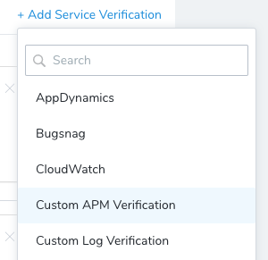

The **Custom APM Verification** dialog appears.

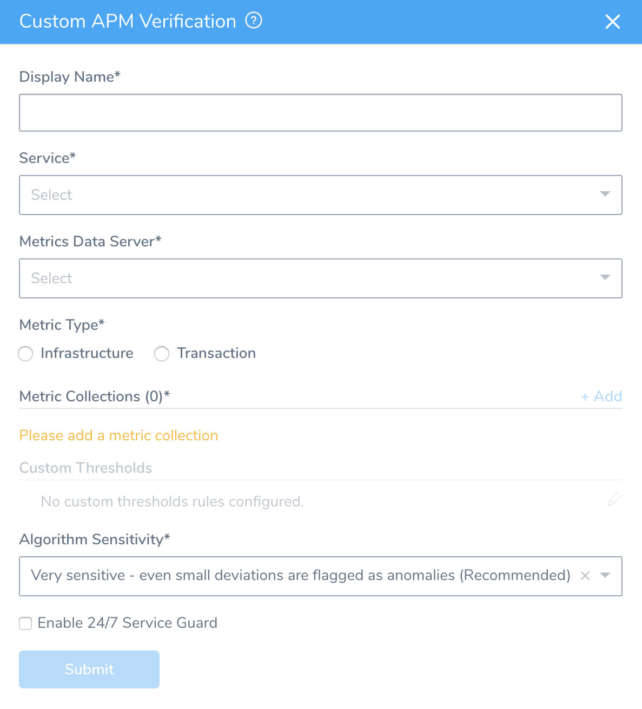

Fill out the dialog. The dialog has the fields described below.

For 24/7 Service Guard, the queries you define to collect metrics are specific to the Application or Service you want monitored. (Verification is at the Application/Service level.) This is unlike Workflows, where verification is performed at the host/node/pod level.

### Step 2: Display Name

Enter the name that will identify this 24/7 Service Guard monitoring in Harness' **Continuous Verification** page.

### Step 3: Service

Select the Harness Service that represents your live, production application or service.

### Step 4: Metrics Data Server

Select the custom metric provider you added.

### Step 5: Metric Type

Select **Infrastructure** or **Transaction**.

Consider what you monitoring before selecting. Each type has subtypes in **Metric Collections**:

* **Infrastructure**
	+ Infrastructure
	+ Value
* **Transaction**
	+ Error
	+ Response Time
	+ Throughput

For example, if you want to monitor if a value goes below the baseline, select **Infrastructure** and then **Value** in **Metric Collections**.

If you want to monitor an error, then select **Transaction**.

#### Always Use Throughput with Error and Response Time Metrics

Whenever you use the Error metric type, you should also add another metric for Throughput with the same Transaction Name.

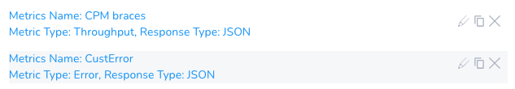

Harness analyze errors as error percentage and without the throughput the error number does not provide much information.

The same setup should used with the Response Time metric also. Whenever you set up a Response Time metric, setup a Throughput metric with the same Transaction Name.

### Step 6: Metric Collections

Click **Add** to add a new metric collection. This displays the dialog shown below.

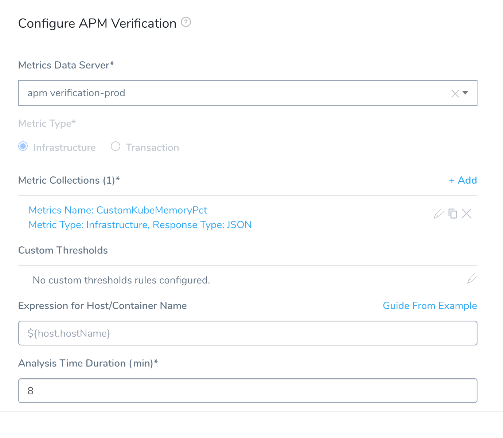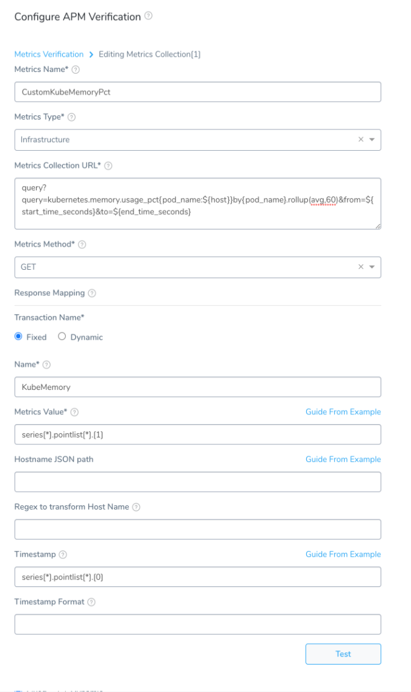

In the resulting **New Metrics Collection** dialog, use the following controls to define a metrics collection.

### Step 7: Metrics Name

Enter a name for the metrics you want analyzed, such as **ThreadCount**.

### Step 8: Metrics Type

For the **Infrastructure** Metrics Type, select the type of metric you want to collect:

* **Infra:** Infrastructure metrics, such as CPU, memory, and HTTP errors.
* **Value:** [Apdex](https://docs.newrelic.com/docs/apm/new-relic-apm/apdex/apdex-measure-user-satisfaction) (measures user satisfaction with response time).
* **Lower Value:** Values below the average.

For the **Transaction** Metrics Type, select the type of metric you want to collect:

* Error
* Response Time
* Throughput

### Step 9: Metrics Collection URL

Enter a query for your verification. You can simply make the query in your Verification Provider and paste it in the **Metrics Collection URL** field.

You will use this query to obtain the JSON paths for the **Response Mapping** settings.

In most cases, you will want to add the placeholders `${start_time}` and `${end_time}` in your query so that you can customize the range when making requests.

### Step 10: Metrics Method

Select **GET** or **POST**. If you select **POST**, the **Metric Collection Body** field appears.

[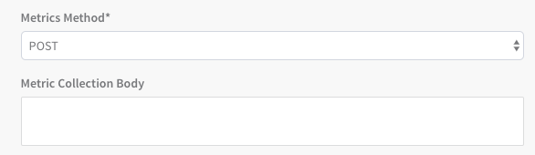](./static/monitor-applications-24-7-with-custom-metrics-78.png)

In **Metric Collection Body**, enter the JSON body to send as a payload when making a REST call to the APM Provider. The requirements of the JSON body will depend on your APM provider.

You can use variables you created in the Service and Workflow in the JSON, as well as [Harness built-in variables](https://docs.harness.io/article/9dvxcegm90-variables).

### Step 11: Response Mapping

These settings are for specifying which JSON fields in the responses to use for monitoring.

### Step 12: Transaction Name

Select **Fixed** or **Dynamic**.

**Fixed:** Use this option when all metrics are for the same transaction. For example, a single login page.

**Dynamic:** Use this option when the metrics are for multiple transactions

### Step 13: Name (Fixed)

Enter a name to identify the transaction.

### Step 14: Transaction Name Path (Dynamic)

This is the JSON label for identifying a transaction name.

For example, in a New Relic Insights query, the **FACET** clause is used to group results by the attribute **transactionName**. You can obtain the field name that records the **transactionName** by using the **Guide From Example** feature:

1. Click **Guide From Example**. The Guide From Example popover appears.
   
	 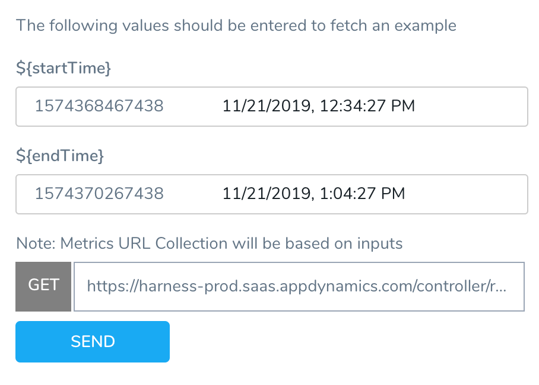
	 
	 The Metrics URL Collection is based on the query you entered in the **Metric Collection URL field** earlier.
	 
2. Specify a time range using the `${startTime}` and `${endTime}`.
3. Click **SEND**. The query is executed and the JSON is returned.
4. Locate the field name that is used to identify transactions. In our New Relic Insights query, it is the **facets.name** field.  
If no metrics are found, you will see a `METRIC DATA NOT FOUND` error.  
Using New Relic Insights as an example, you can find the name in the JSON of your Insights query results.

   
	 
	 
5. Click the field **name** under facets. The field path is added to the **Transaction Name Path** field.

   

### Step 15: Regex to transform Transaction Name (Dynamic)

Enter a regex expression here to obtain the specific name from the transaction path.

For example, if your Transaction Name Path JSON evaluated to a value such as `name : TxnName`, you can write a regex to remove everything other than `TxnName`.

For example `(name:(.*),)` or `(?<=:).*(?=,)`.

### Step 16: Metrics Value

Specify the value for the event count. This is used to filter and aggregate data returned in a SELECT statement. To find the correct label for the value, do the following:

1. Click **Guide From Example**. The example popover appears.

   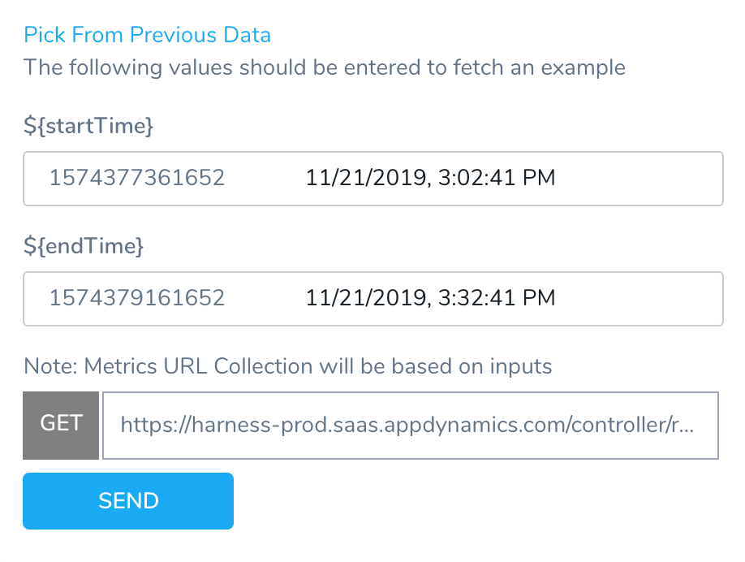
	 
	 The Metrics URL Collection is based on the query you entered in the **Metric Collection URL field** earlier. The **${host}** field refers to the `${host}` variable in your query.
	 
2. Specify a time range using the `${startTime}` and `${endTime}`.
3. Click **Send**. The query is executed and the JSON is returned.  
If no metrics are found, you will see a `METRIC DATA NOT FOUND` error.
4. Locate the field name that is used to count events.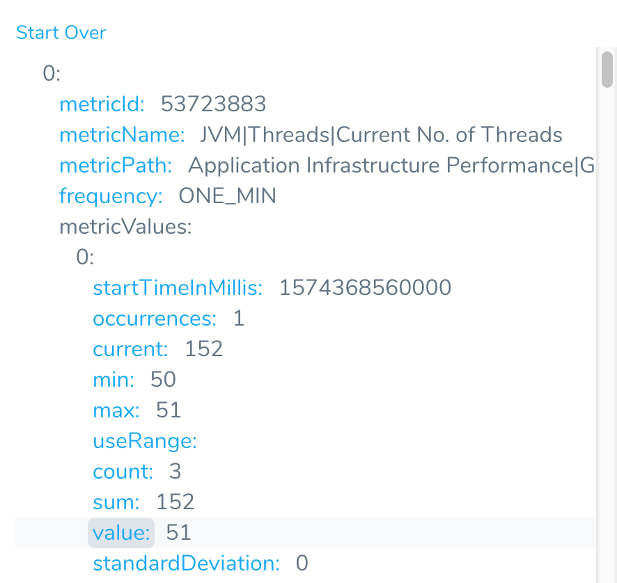
5. Click the name of the field, such as **value**. The JSON path is added to the **Metrics Value** field.

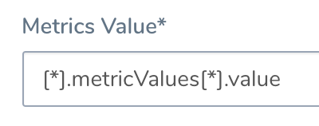

### Step 17: Timestamp

Specify the value for the timestamp in the query. To find the correct label for the value, do the following:

1. Click **Guide From Example**. The popover appears.

  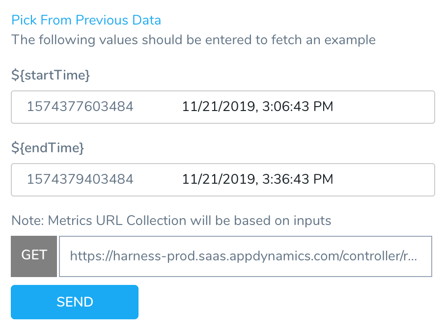
	
	The Metrics URL Collection is based on the query you entered in the **Metric Collection URL field** earlier.
	
2. Click **Send**. The query is executed and the JSON is returned.
3. Click the name of the label for the start time.

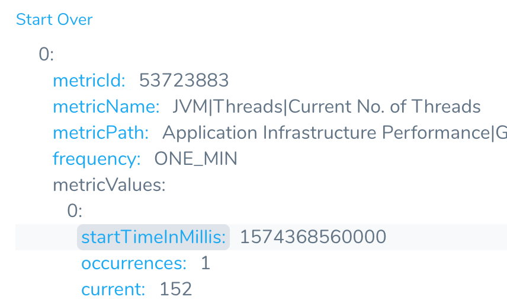

The JSON path is added to the **Timestamp** path:

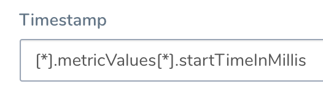

### Step 18: Timestamp Format

Enter a timestamp format. The format follows the Java [SimpleDateFormat](https://docs.oracle.com/javase/8/docs/api/java/text/SimpleDateFormat.html). For example, a timestamp syntax might be **yyyy-MM-dd'T'HH:mm:ss.SSSX**. If you leave this field empty, Harness will use the default range of 1 hour previous (now-1h) to now.

### Step 19: Test the Settings

Once you have filled in the **New Metrics Collection** dialog, click **Test** to check your settings. Once they test successfully, click **Add** to add this collection to the **Custom APM Verification** settings.

This restores the **Custom APM Verification** dialog. Here, you have the option to click **Add** to define additional metrics collections, using the options just outlined.

### Review: Custom Thresholds

In the **Custom APM Verification** dialog, you can access the **Custom Thresholds** section once you have configured at least one Metrics Collection. Within Custom Thresholds, you can define **Ignore Hints** rules that instruct Harness to remove certain metrics/value combinations from 24/7 Service Guard analysis.

For details about defining Custom Thresholds, see [Apply Custom Thresholds to 24/7 Service Guard](../24-7-service-guard/custom-thresholds-24-7.md).

### Step 20: Algorithm Sensitivity

Select the Algorithm Sensitivity. See [CV Strategies, Tuning, and Best Practices](../continuous-verification-overview/concepts-cv/cv-strategies-and-best-practices.md#algorithm-sensitivity-and-failure-criteria).

### Step 21: Enable 24/7 Service Guard

Select this check box to enable 24/7 Service Guard.

When you are finished, the **Custom APM Verification Settings** dialog will look something like this:

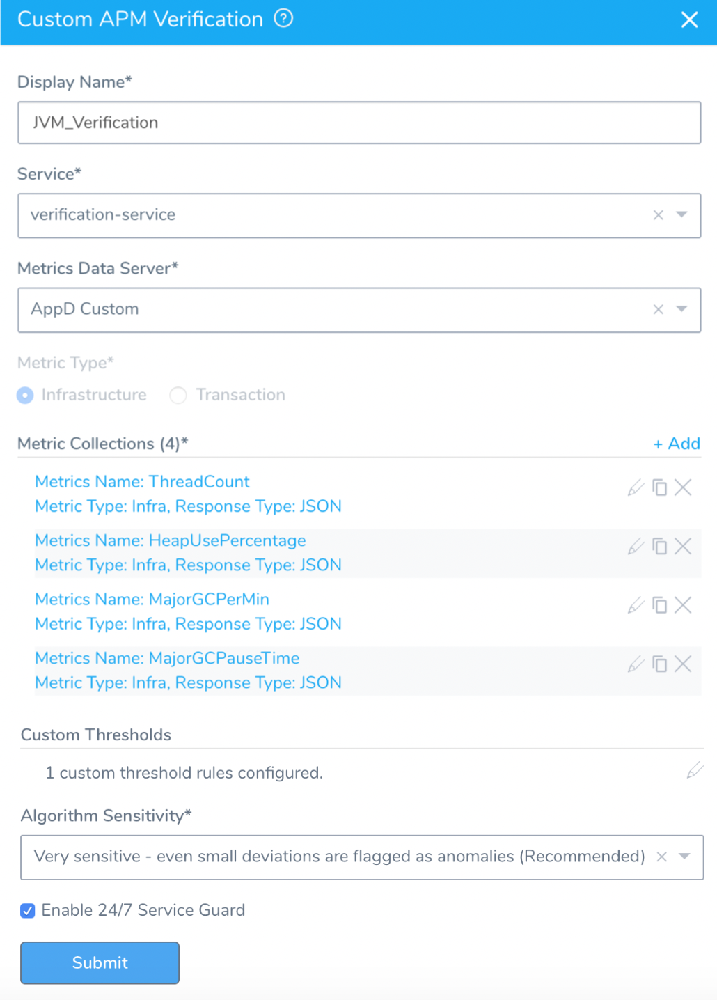

Click **Submit**. The Custom Metrics 24/7 Service Guard verification is added.

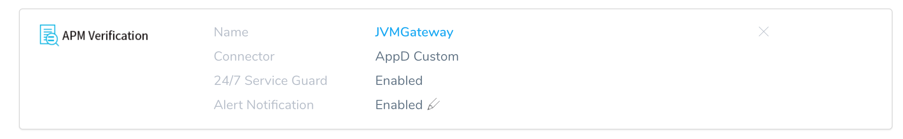

### Review: Verification Results

To see the running 24/7 Service Guard analysis, click **Continuous Verification**.

The 24/7 Service Guard dashboard displays the production verification results.

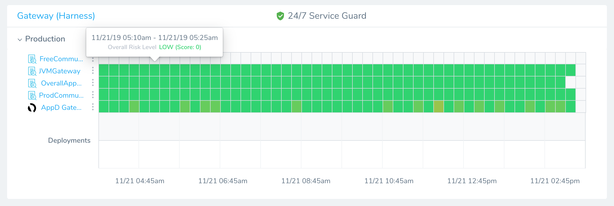