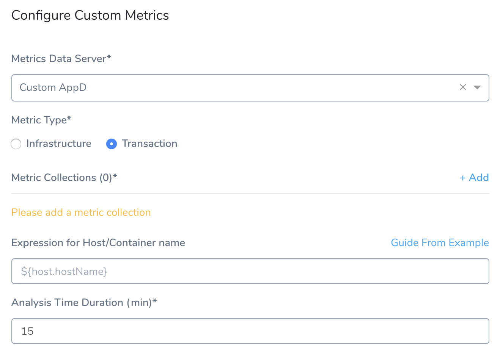
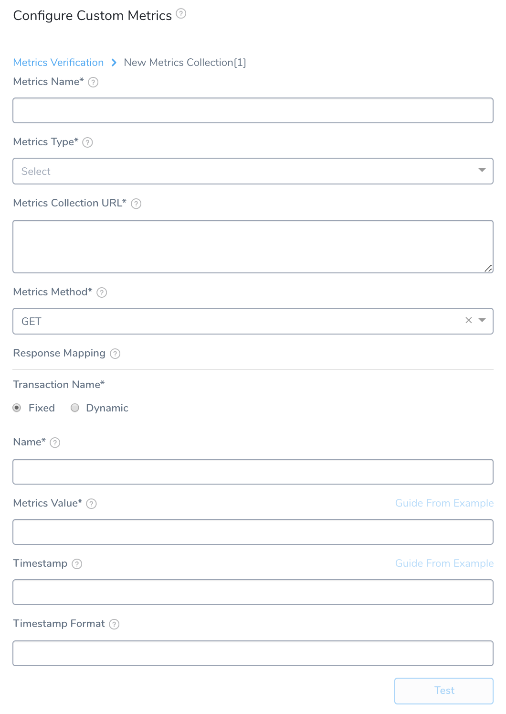
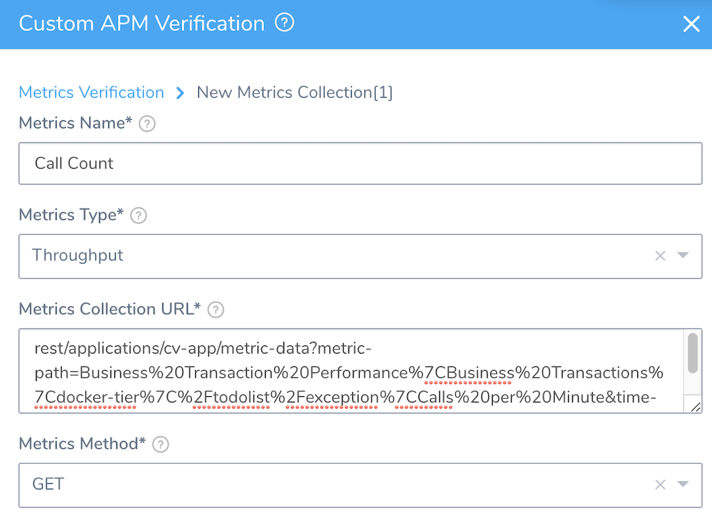
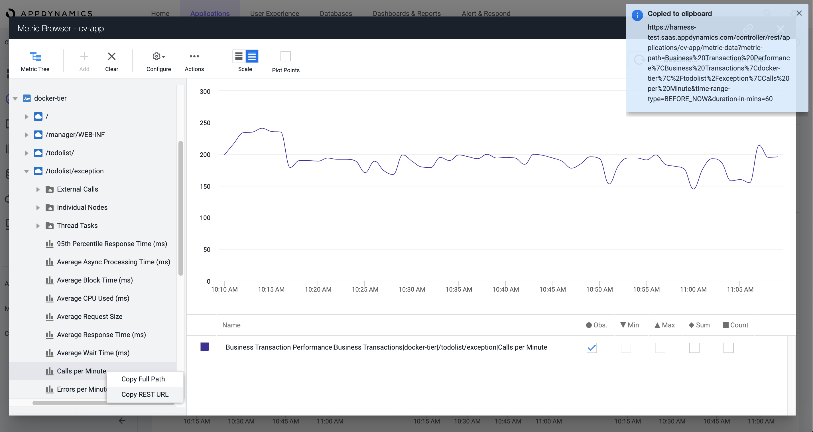
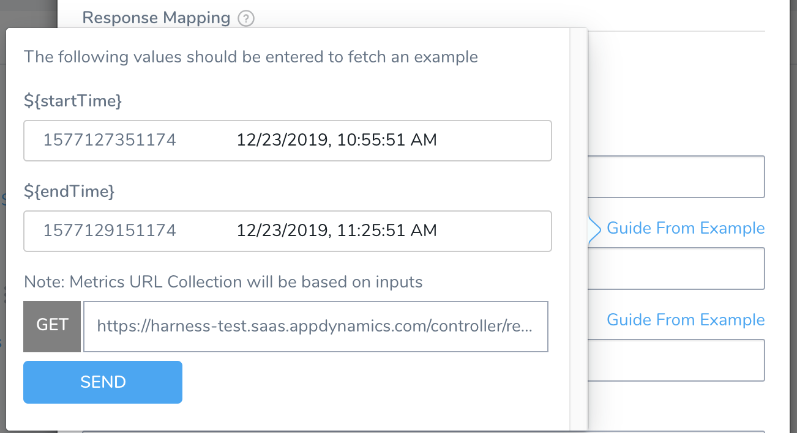
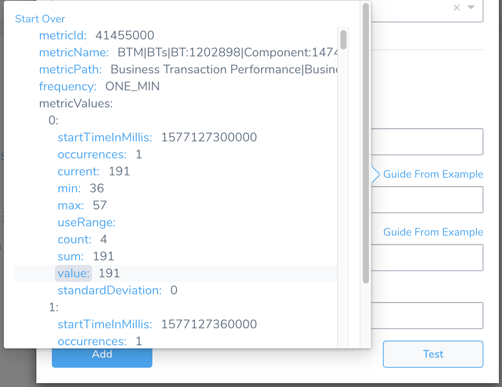
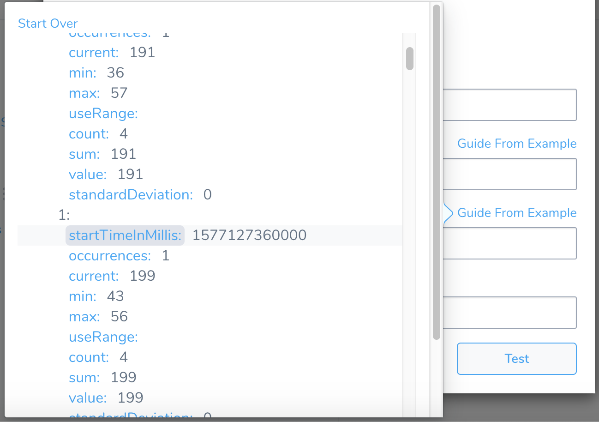
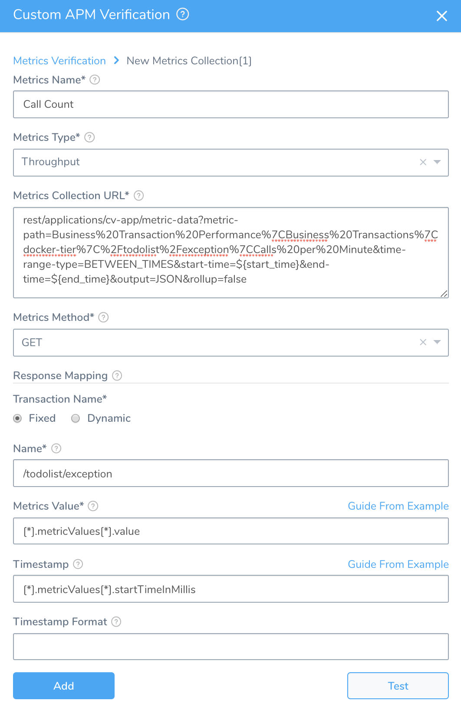
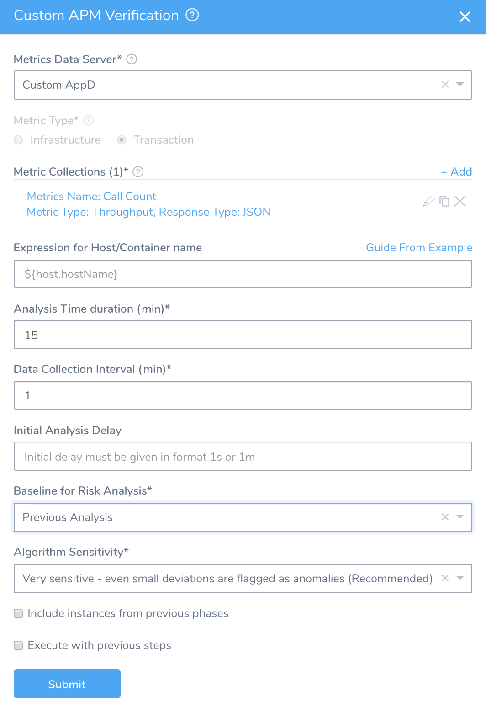

After adding AppDynamics as a Custom Verification Provider, you can use it as a verification step in a Workflow. The following sections outline how to select the AppDynamics metrics you need.


### Before You Begin

* See [Custom Verification Overview](custom-verification-overview.md).
* See [Connect to AppDynamics as a Custom APM](connect-to-app-dynamics-as-a-custom-apm.md).

### Step 1: Set Up the Deployment Verification

You can add verification steps to a Workflow after you have performed at least one successful deployment.To begin the Workflow setup:

1. In Harness, open the Workflow that deploys the Service you will monitor with AppDynamics.
2. In the Workflow, in **Verify Service**, click **Add Step**.
3. In the resulting **Add Step** settings, select **Performance Monitoring** > **Custom Metrics**.
4. Click **Next**. The **Configure****Custom Metrics** settings appear.

### Step 2: Metrics Data Server

In the **Metrics Data Server** drop-down, select the Custom Verification Provider.

### Step 3: Metric Type

Set the **Metric Type** to either **Infrastructure** or **Transaction**.

Your settings will now look something like this:



### Step 4: Metric Collections

Beside **Metric Collections**, click **Add** to display the **New Metrics Collection** settings.

Most fields here define Harness settings for collecting and grouping metrics. The exceptions are settings where you will map JSON response keys to Harness fields.



Fill out the **New Metrics Collection** settings using the following information.



### Step 5: Metrics Name

Enter an arbitrary name for this metric. (This is not an AppDynamics value; it will be internal to Harness.)

### Step 6: Metrics Type

Select the type of events you want to monitor. If you selected **Infrastructure** back in the **Metrics Verification** settings, your choices here are **Infrastructure** or **Values**. If you selected **Transaction** in the **Metrics Verification** settings, your choices here are **Errors**, **Response Time**, or **Throughput**.

#### Always Use Throughput with Error and Response Time Metrics

Whenever you use the Error metric type, you should also add another metric for Throughput with the same Transaction Name. 


Harness analyze errors as error percentage and without the throughput the error number does not provide much information.

The same setup should used with the Response Time metric also. Whenever you set up a Response Time metric, setup a Throughput metric with the same Transaction Name.


### Step 7: Metrics Collection URL

This is the API query that will return a JSON response. See the next section for details on setting up the query.

The query for the **Metrics Collection URL** follows this syntax:


```
rest/applications/cv-app/metric-data?metric-path=Business Transaction Performance|Business Transactions|<tier-name>|/<Business-Transaction-name>/<Metric-name>&time-range-type=BETWEEN_TIMES&start-time=${start_time}&end-time=${end_time}&output=JSON&rollup=false
```
Above, the values in `<...>` brackets are placeholders for parameters that you will define. The values in `${...}` braces are placeholders used for querying the data, which will be substituted at runtime with real values. To build your literal query:

1. In the AppDynamics Metric Browser's Metric Tree, right-click the metric you want to monitor, and then select **Copy REST URL**.  
   In the example below, we've selected the **Throughput** metric `/todolist/exception/Calls per Minute`. Its REST URL is now on the clipboard:
   
   
   
2. Paste the resulting URL into the **Metrics Collection URL** field.
3. Truncate the URL to the substring that follows `.../controller/`.

Your literal query—as copied, pasted into the **Metrics Collection URL** field, and then truncated—will now look something like this:


```
rest/applications/cv-app/metric-data?metric-path=Business%20Transaction%20Performance%7CBusiness%20Transactions%7Cdocker-tier%7C%2Ftodolist%2Fexception%7CCalls%20per%20Minute&time-range-type=BEFORE_NOW&duration-in-mins=60
```
At the end of the query, replace this substring from AppDynamics' default REST URL:


```
&time-range-type=BEFORE_NOW&duration-in-mins=60
```
...with this substring, whose `${...}` placeholders are used to query for dynamic runtime data:


```
&time-range-type=BETWEEN_TIMES&start-time=${start_time}&end-time=${end_time}&output=JSON&rollup=false
```
Your literal query should now look something like this:


```
rest/applications/cv-app/metric-data?metric-path=Business%20Transaction%20Performance%7CBusiness%20Transactions%7Cdocker-tier%7C%2Ftodolist%2Fexception%7CCalls%20per%20Minute&time-range-type=BETWEEN_TIMES&start-time=${start_time}&end-time=${end_time}&output=JSON&rollup=false
```
Next, you will refine your query by specifying the REST method, and by mapping response keys to Harness fields.

### Step 8: Metrics Method

In the **Metrics Method** drop-down, select either **GET** or **POST**, depending on the metric you're monitoring.

If you select **POST** here, the **Metric Collection Body** field appears. Enter the JSON body to send as a payload when making a REST call to AppDynamics. For details, see [Verify Deployments with Custom APMs and Logs](verify-deployments-with-custom-metrics.md).The remaining Metrics Collection settings map the keys in the JSON response to Harness fields.

### Step 9: Transaction Name

Select **Fixed** or **Dynamic**, depending on the transaction name. In our example, we will use **Fixed**.

If you select **Dynamic**, you will see the **Transaction Name Path** and **Regex to transform Transaction Name** fields. The **Transaction Name Path** is filled out in the same way as **Name** field listed just below. You use **Regex to transform Transaction Name** to truncate the value of the **Transaction Name Path**, if needed.

### Step 10: Name

Enter the Business Transaction name, as it appears in the AppDynamics Metric Tree. In this example, you would enter: `/todolist/exception`.

### Step 11: Metrics Value

To map this value, run the query: Click **Guide from Example**, then click **SEND** from the resulting pop-up:



 In the JSON response, click the `value` key. This maps it into Harness' **Metrics Value** field:



### Step 12: Timestamp

As with the preceding field, click this field's **Guide from Example** link to query AppDynamics.


In the JSON response, click the `startTimeInMillis` key, which includes the timestamp. This maps this key to Harness' **Timestamp** field.



### Step 13: Timestamp Format

Optionally, enter a timestamp format, following the Java [SimpleDateFormat](https://docs.oracle.com/javase/8/docs/api/java/text/SimpleDateFormat.html). An example timestamp syntax might be `yyyy-MM-dd'T'HH:mm:ss.SSSX`. If you leave this field empty, Harness will use the default range of 1 hour previous (`now-1h`) to now.

When you've filled in all the required Metrics Collection parameters, your query string in the **Metrics Collection URL** field will be modified to something like this:


```
rest/applications/cv-app/metric-data?metric-path=Business%20Transaction%20Performance%7CBusiness%20Transactions%7Cdocker-tier%7C%2Ftodolist%2Fexception%7CCalls%20per%20Minute&time-range-type=BETWEEN_TIMES&start-time=${start_time}&end-time=${end_time}&output=JSON&rollup=false
```
Your **New Metrics Collection** settings will now look something like this:



Click **Test**. If your configuration tests successfully, click **Add** to add this collection.

This returns you to the **Custom APM Verification** settings' initial **Metrics Verification** page, to fill in the remaining settings.

Fill in the remaining **Metrics Verification** settings as follows:

### Step 14: Expression for Host/Container Name

The expression entered here should resolve to a host/container name in your deployment environment. By default, the expression is `${host.hostName}`.

### Step 15: Analysis Time Duration

Set the duration for the verification step. If a verification step exceeds this value, the Workflow's [Failure Strategy](../../model-cd-pipeline/workflows/workflow-configuration.md#failure-strategy) is triggered. For example, if the Failure Strategy is **Ignore**, then the verification state is marked **Failed**, but the Workflow execution continues.

### Step 16: Data Collection Interval

Specify how often Harness will collect data. For example, when the interval is `1` (1 minute), Harness will collect every minute. If it's `3`, we will collect every 3 minutes. If your total duration is 15 minutes and the interval is 3 minutes, Harness will collect every 3 minutes for a total of 5 times over 15 minutes. Harness recommends the value `2`.

### Step 17: Baseline for Risk Analysis

See [CV Strategies, Tuning, and Best Practices](../continuous-verification-overview/concepts-cv/cv-strategies-and-best-practices.md).

### Step 18: Algorithm for Sensitivity

Harness recommends that you normally accept this drop-down's **Very sensitive** default. If your analysis needs differ, you can flag fewer deviations as anomalies by instead selecting **Moderately sensitive** or **Least sensitive**.

### Step 19: Include instances from previous phases

If you are using this verification step in a multi-phase deployment, select this checkbox to include instances used in previous phases when collecting data. Do not apply this setting to the first phase in a multi-phase deployment.

### Step 20: Execute with previous steps

Enable this check box to run this verification step in parallel with the previous steps in **Verify Service**.

When you've entered all your **Custom APM Verification** settings, they will look something like this:



Click **Submit**. The AppDynamics Custom verification step is now added to the Workflow. Run your Workflow to see the results.

