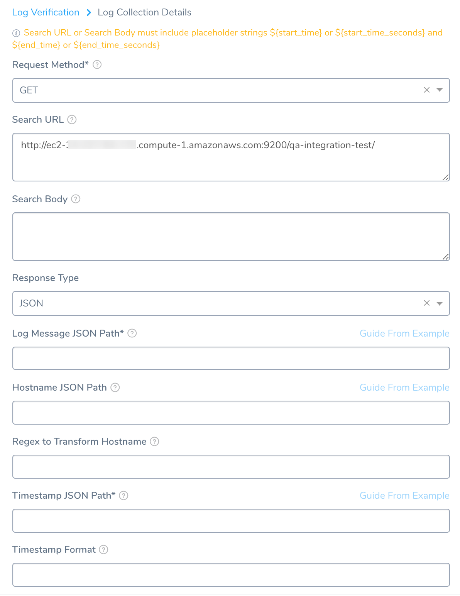
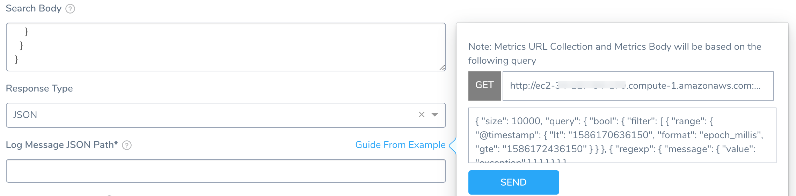
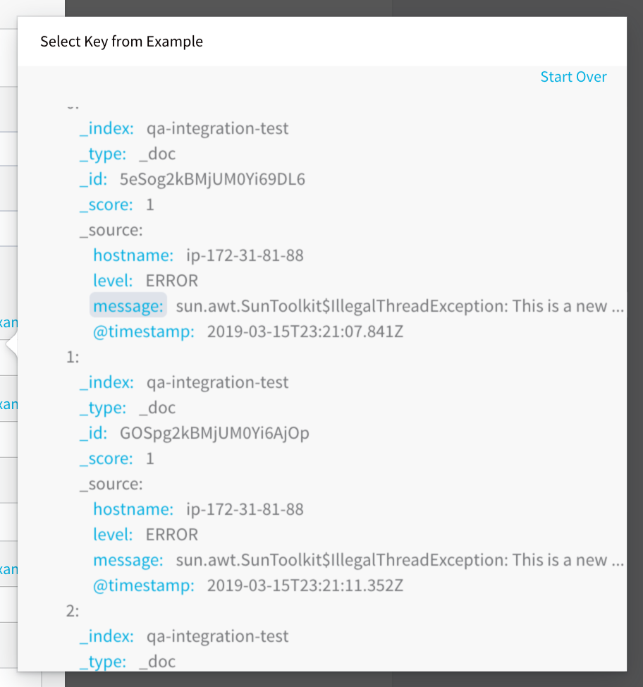
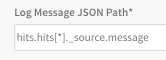
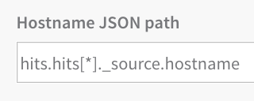
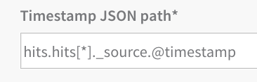

The following procedure describes how to add a custom Logs verification step in a Harness Workflow. For more information about Workflows, see [Add a Workflow](../../model-cd-pipeline/workflows/workflow-configuration.md).

Once you run a deployment and your custom logs provider obtains its data, Harness machine-learning verification analysis will assess the risk level of the deployment using the data from the provider.

In order to obtain the names of the host(s), pod(s), or container(s) where your service is deployed, the verification provider should be added to your Workflow *after* you have run at least one successful deployment.

### Before You Begin

* See [Custom Verification Overview](custom-verification-overview.md).
* See [Connect to Custom Verification for Custom Logs](connect-to-custom-verification-for-custom-logs.md).

### Step 1: Set Up the Deployment Verification

To verify your deployment with a custom metric or log provider, do the following:

1. Ensure that you have added Custom Logs Provider as a verification provider, as described in [Connect to Custom Verification for Custom Logs](connect-to-custom-verification-for-custom-logs.md).
2. In your workflow, under **Verify Service**, click **Add Verification**.

   
   
3. In the resulting **Add Step** settings, select **Log Analysis** > **Custom Log Verification**.
4. Click **Next**. The **Configure Custom Log Verification** settings appear.
5. In **Log Data Provider**, select the custom logs provider you added, described in [Connect to Custom Verification for Custom Logs](connect-to-custom-verification-for-custom-logs.md).
6. Click **Add Log Collection** to add a **Log Collection** section.

### Step 2: Request Method

In **Request Method**, select GET or POST.

### Step 3: Search URL

In **Search URL**, enter the API query that will return a JSON response.

Make sure the following parameters are included in the query. These placeholders will be replaced with the actual values during the execution.

1. `${start_time}` or `${start_time_seconds`}: This is the placeholder parameter to specify the start time of the query. It is similar to the value specified in custom metrics verification.
2. `${end_time}` or `${end_time_seconds}`: This is the placeholder parameter to specify the end time of the query. It is similar to the value specified in custom metrics verification.
3. `${host}`: This is the placeholder for querying based on the host during deployment verification. This is NOT a required field if the setup is for a Previous Analysis.

In the remaining settings, you will map the keys in the JSON response to Harness settings to identify where data—such as log message and timestamp—are located in the JSON response.

### Step 4: Search Body

In **Search Body**, enter any JSON search input for your query. If you need to send a token, but do not want to send it in plaintext, you can use a Harness [encrypted text secret](https://docs.harness.io/article/au38zpufhr-secret-management#encrypted_text).

### Step 5: Response Type

In **Response Type**, select **JSON**.

### Step 6: Log Message JSON Path

In **Log Message JSON Path** – Use **Guide from Example** to query the log provider and return the JSON response.

The URL is a combination of the Verification Cloud Provider **Base URL** and the **Log Collection URL** you entered.

Click **SEND**. In the JSON response, click the key that includes the log message path.

The log message path key is added to **Log Message JSON Path**:

### Step 7: Hostname JSON Path

Use **Guide from Example** to query the log provider and return the JSON response. In the JSON response, click the key that includes the hostname path.

### Step 8: Regex to Transform Host Name

If the JSON value returned requires transformation in order to be used, enter the regex expression here. For example: If the value in the host name JSON path of the response is `pod_name:harness-test.pod.name` and the actual pod name is simply `harness-test.pod.name`, you can write a regular expression to remove the `pod_name` from the response value.

### Step 9: Timestamp JSON Path

Use **Guide from Example** to query the log provider and return the JSON response. In the JSON response, click the key that includes the timestamp.

### Step 10: Timestamp Format

Enter the format of the timestamp included in the query request (not response). The format follows the [Java SimpleDateFormat](https://docs.oracle.com/javase/8/docs/api/java/text/SimpleDateFormat.html). For example, a timestamp syntax might be **yyyy-MM-dd'T'HH:mm:ss.SSSX**. If you leave this field empty, Harness will use the default range of 1 hour previous (now - 1h) to now.

Click **Add**. The Log Collection is added.

### Step 11: Expression for Host/Container

The expression entered here should resolve to a host/container name in your deployment environment. By default, the expression is **${instance.host.hostName}**.

### Step 12: Analysis Time Duration

Set the duration for the verification step. If a verification step exceeds the value, the workflow [Failure Strategy](../../model-cd-pipeline/workflows/workflow-configuration.md#failure-strategy) is triggered. For example, if the Failure Strategy is **Ignore**, then the verification state is marked **Failed** but the workflow execution continues.

Harness waits 2-3 minutes before beginning the analysis to avoid initial deployment noise. This is a standard with monitoring tools.

### Step 13: Data Collection Interval

Specify the frequency at which Harness will run the query. Harness recommends the value 2.

### Step 14: Baseline for Risk Analysis

See [CV Strategies, Tuning, and Best Practices](../continuous-verification-overview/concepts-cv/cv-strategies-and-best-practices.md).

### Step 15: Execute with previous steps

Check this checkbox to run this verification step in parallel with the previous steps in **Verify Service**.

### Step 16: Include instances from previous phases

If you are using this verification step in a multi-phase deployment, select this checkbox to include instances used in previous phases when collecting data. Do not apply this setting to the first phase in a multi-phase deployment.

### Step 17: Wait interval before execution

Set how long the deployment process should wait before executing the verification step.

### Review: Additional Notes

The **Compare With Previous Run** option is used for Canary deployments where the second phase is compared to the first phase, and the third phase is compared to the second phase, and so on. Do not use this setting in a single phase workflow or in the first phase of a multi-phase workflow.

