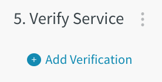
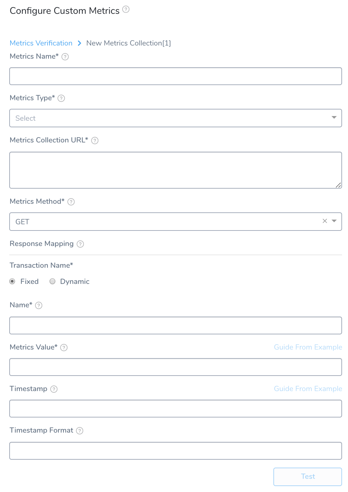
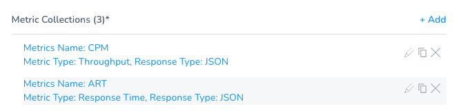
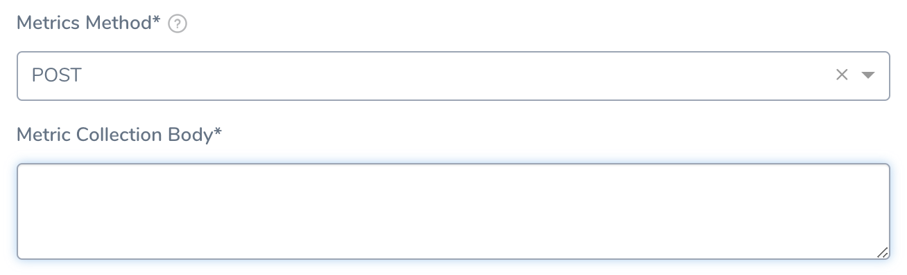
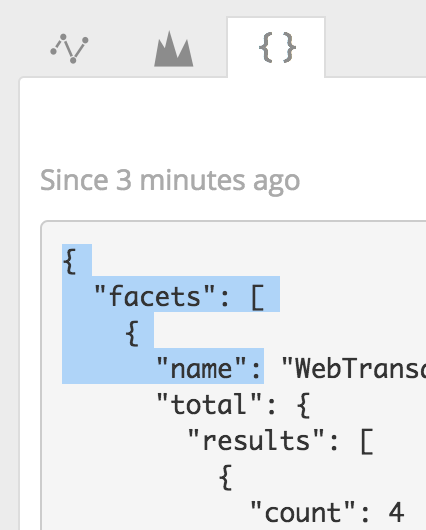
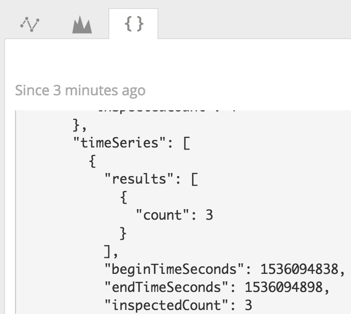
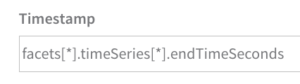
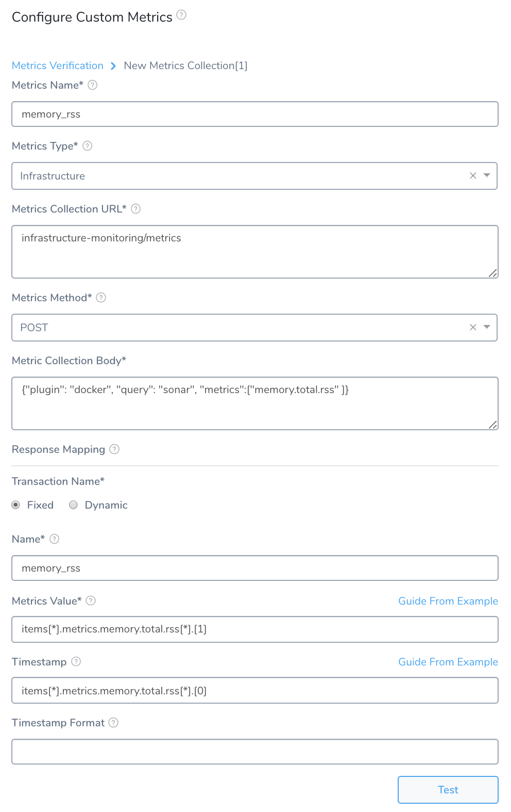

This topic describes how to add a custom APM (metrics) verification step in a Harness Workflow. For more information about Workflows, see [Add a Workflow](../../model-cd-pipeline/workflows/workflow-configuration.md).

Once you run a deployment and your custom metrics provider obtains its data, Harness machine-learning verification analysis will assess the risk level of the deployment using the data from the provider.

In order to obtain the names of the host(s), pod(s), or container(s) where your service is deployed, the verification provider should be added to your Workflow *after* you have run at least one successful deployment.

### Before You Begin

* See [Custom Verification Overview](custom-verification-overview.md).
* See [Connect to Custom Verification for Custom Metrics](connect-to-custom-verification-for-custom-metrics.md).

### Step 1: Set Up the Deployment Verification

To verify your deployment with a custom metric or log provider, do the following:

1. Ensure that you have added Custom Metrics Provider as a verification provider, as described in [Connect to Custom Verification for Custom Metrics](connect-to-custom-verification-for-custom-metrics.md).
2. In your workflow, under **Verify Service**, click **Add Verification**.

   
   
3. In the resulting **Add Step** settings, select **Performance Monitoring** > **Custom Metrics**.
4. Click **Next**. The **Configure****Custom Metrics** settings appear.
5. In **Metrics Data Provider**, select the custom metric provider you added, described in [Connect to Custom Verification for Custom Metrics](connect-to-custom-verification-for-custom-metrics.md).
6. In **Metrics Type**, select **Infrastructure** or **Transaction**.
7. Add a **Metric Collections** section.
   

### Step 2: Metrics Name

Enter a name for the type of error you are collecting, such as **HttpErrors**.

### Step 3: Metrics Type

For the **Infrastructure** Metrics Type, select the type of metric you want to collect:

* **Infra** -–Infrastructure metrics, such as CPU, memory, and HTTP errors.
* **Value** – [Apdex](https://docs.newrelic.com/docs/apm/new-relic-apm/apdex/apdex-measure-user-satisfaction) (measures user satisfaction with response time).
* **Lower Value** – Values below the average.

For the **Transaction** Metrics Type, select the type of metric you want to collect:

* Error
* Response Time
* Throughput

#### Always Use Throughput with Error and Response Time Metrics

Whenever you use the Error metric type, you should also add another metric for Throughput with the same Transaction Name.

Harness analyze errors as error percentage and without the throughput the error number does not provide much information.

The same setup should used with the Response Time metric also. Whenever you set up a Response Time metric, setup a Throughput metric with the same Transaction Name.

### Step 4: Metrics Collection URL

Enter a query for your verification. You can simply make the query in your Verification Provider and paste it in this field. For example, in New Relic Insights, you might have the following query:

You can paste the query into the **Metrics Collection URL** field:

For information on New Relic Insights NRSQL, see [NRQL syntax, components, functions](https://docs.newrelic.com/docs/insights/nrql-new-relic-query-language/nrql-resources/nrql-syntax-components-functions) from New Relic.The time range for a query (**SINCE** clause in our example) should be less than 5 minutes to avoid overstepping the time limit for some verification providers.

Most often, when you create your query, you will include a hostname placeholder in the query, `${host}`. This placeholder will be used later when setting up the **Metrics Value** and other settings that use **Guide from an example**.

For example, if your query is:

`SELECT count(host) FROM Transaction SINCE 30 MINUTES AGO COMPARE WITH 1 WEEK AGO WHERE host = '37c444347ac2' TIMESERIES`

Then you replace the host name with the `${host}` placeholder and paste the query into **Metrics Collection URL**:

`SELECT count(host) FROM Transaction SINCE 30 MINUTES AGO COMPARE WITH 1 WEEK AGO WHERE host = '${host}' TIMESERIES`

Make sure the `${start_time_seconds}` and `${end_time_seconds}` parameters are included in the query.

These variables define a 1-minute interval from the time the Workflow Verification starts. To modify the time interval, click **Edit Step** > **APM** > **Custom** and update the Data Collection Interval in minutes field.

An example part of the query with these values appears as follows:

`from=${start_time_seconds}&to=${end_time_seconds}`

For verification providers that accept values in milliseconds, you can use the `${start_time}` and `${end_time}` variables.

### Step 5: Metrics Method

Select **GET** or **POST**. If you select POST, the **Metric Collection Body** field appears.

In **Metric Collection Body**, enter the JSON body to send as a payload when making a REST call to the APM Provider. The requirements of the JSON body will depend on your APM provider.

You can use variables you created in the Service and Workflow in the JSON, as well as [Harness built-in variables](https://docs.harness.io/article/9dvxcegm90-variables).

### Step 6: Response Mapping Transaction Name

These settings are for specifying which JSON fields in the responses to use.

Select **Fixed** or **Dynamic**.

**Fixed:** Use this option when all metrics are for the same transaction. For example, a single login page.

**Dynamic:** Use this option when the metrics are for multiple transactions.

### Step 7: Name

Fixed

Enter the name with which you want to identify the transaction.

### Step 8: Transaction Name Path

Dynamic

This is the JSON label for identifying a transaction name. In the case of our example New Relic Insights query, the FACET clause is used to group results by the attribute **transactionName**. You can obtain the field name that records the **transactionName** by using the **Guide from an example** feature:

1. Click **Guide from an example**. The **Select Key from Example** popover appears.

   
   
   The Metrics URL Collection is based on the query you entered in the **Metric Collection URL field** earlier.
   
2. In **${host}**, select a host to query. Click the query next to **GET** to see how the host you selected replaces the `${host}` placeholder in your query.
3. Click **SEND**. The query is executed and the JSON is returned.
4. Locate the field name that is used to identify transactions. In our New Relic Insights query, it is the **facets.name** field.  
   If no metrics are found, you will see a `METRIC DATA NOT FOUND` error.  
   In New Relic Insights, you can find the name in the JSON of your query results.
   
   
   
5. Click the field **name** under facets. The field path is added to the **Transaction Name Path** field.

   

### Step 9: Regex to transform Transaction Name

Dynamic

Enter a regex expression here to obtain the specific name from the transaction path.

For example, if your Transaction Name Path JSON evaluated to a value such as `name : TxnName`, you can write a regex to remove everything other than `TxnName`.

For example `(name:(.*),)` or `(?<=:).*(?=,)`.

### Step 10: Metrics Value

Specify the value for the event count. This is used to filter and aggregate data returned in a SELECT statement. To find the correct label for the value, do the following:

1. Click **Guide from an example**. The example popover appears.  
The Metrics URL Collection is based on the query you entered in the **Metric Collection URL field** earlier. The **${host}** field refers to the `${host}` variable in your query.
2. Click **Submit**. The query is executed and the JSON is returned.  
If no metrics are found, you will see a `METRIC DATA NOT FOUND` error.
3. Locate the field name that is used to count events. In our New Relic Insights query, it is the **facets.timeSeries.results.count** field.  
   In New Relic Insights, you can find the name in the JSON of your query results.
   
   
   
4. Click the name of the field **count**. The field path is added to the **Metrics Value** field.

   

### Step 11: Hostname JSON path

(Displayed if `${host}` is present in the **Metrics Collection URL query**)

Use **Guide from an example** to select a host and query your APM. Click the name of the hostname JSON label in the response.

If there is no hostname in the response, leave this setting empty.

### Step 12: Timestamp

Specify the value for the timestamp in the query. To find the correct label for the value, do the following:

1. Click **Guide from an example**. The **Select Key from Example** popover appears.  
The Metrics URL Collection is based on the query you entered in the **Metric Collection URL field** earlier.
2. Click **Submit**. The query is executed and the JSON is returned.
3. Locate the field name that is used for the time series **endTimeSeconds**. In our New Relic Insights query, it is the **facets.timeSeries.endTimeSeconds** field.  
  In New Relic Insights, you can find the name in the JSON of your query results.

  
  
4. Click the name of the field **endTimeSeconds**. The field path is added to the **Timestamp** field.

   

### Step 13: Timestamp Format

Enter the format of the timestamp included in the query *request* (not response), set in **Timestamp**. The format follows the [Java SimpleDateFormat](https://docs.oracle.com/javase/8/docs/api/java/text/SimpleDateFormat.html). For example, a timestamp syntax might be **yyyy-MM-dd'T'HH:mm:ss.SSSX**. If you leave this field empty, Harness will use the default range of 1 hour previous (now-1h) to now.

When you are done, the settings will look something like this:

Click **Test** and then click **Add**.

### Step 14: Custom Thresholds

In the **Configure****Custom Metrics** dialog, you can access the **Custom Thresholds** section once you have configured at least one Metrics Collection. You can use Custom Thresholds to define two types of rules that override normal verification behavior:

* **Ignore Hints** that instruct Harness to skip certain metrics/value combinations from verification analysis.
* **Fast-Fail Hints** that cause a Workflow to enter a failed state.

For details about defining Custom Thresholds, see [Apply Custom Thresholds to Deployment Verification](../tuning-tracking-verification/custom-thresholds.md).

In deployment, where a Fast-Fail Hint moves a Workflow to a failed state, the Workflow's Details panel for that Verification step will indicate the corresponding threshold.

### Step 15: Expression for Host/Container

The expression entered here should resolve to a host/container name in your deployment environment. By default, the expression is **${instance.host.hostName}**.

### Step 16: Analysis Time Duration

Set the duration for the verification step. If a verification step exceeds the value, the workflow [Failure Strategy](../../model-cd-pipeline/workflows/workflow-configuration.md#failure-strategy) is triggered. For example, if the Failure Strategy is **Ignore**, then the verification state is marked **Failed** but the workflow execution continues.

Harness waits 2-3 minutes before beginning the analysis to avoid initial deployment noise. This is a standard with monitoring tools.

### Step 17: Data Collection Interval

Specify the frequency at which Harness will run the query. Harness recommends the value 1 (1 minute).

If the data collection interval is greater than 1 minute, Harness expects a response with multiple timestamped rows to be returned (1 per minute). This is to avoid losing granularity.

### Step 18: Baseline for Risk Analysis

See [CV Strategies, Tuning, and Best Practices](../continuous-verification-overview/concepts-cv/cv-strategies-and-best-practices.md).

### Step 19: Execute with previous steps

Check this checkbox to run this verification step in parallel with the previous steps in **Verify Service**.

### Step 20: Failure Criteria

Specify the sensitivity of the failure criteria. When the criteria is met, the workflow **Failure Strategy** is triggered.

### Step 21: Include instances from previous phases

If you are using this verification step in a multi-phase deployment, select this checkbox to include instances used in previous phases when collecting data. Do not apply this setting to the first phase in a multi-phase deployment.

### Step 22: Wait interval before execution

Set how long the deployment process should wait before executing the verification step.

### Review: Additional Notes

* Depending on the custom metric provider you select, you might need to provide different information to the **Metric Collections** section. For example, you might need to provide a hostname for the **Guide from an example** popover to use to retrieve data. The hostname will be the host/container/pod/node name where the artifact is deployed. In you look in the JSON for the deployment environment, the hostname is typically the **name** label under the **host** label.
* The **Compare With Previous Run** option is used for Canary deployments where the second phase is compared to the first phase, and the third phase is compared to the second phase, and so on. Do not use this setting in a single phase workflow or in the first phase of a multi-phase workflow.

