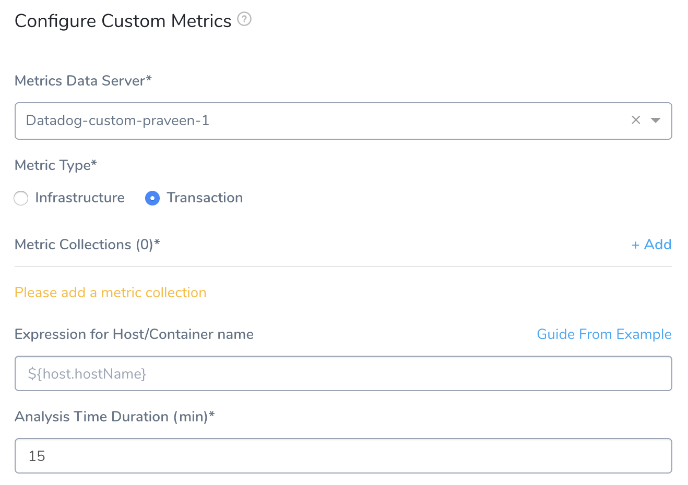
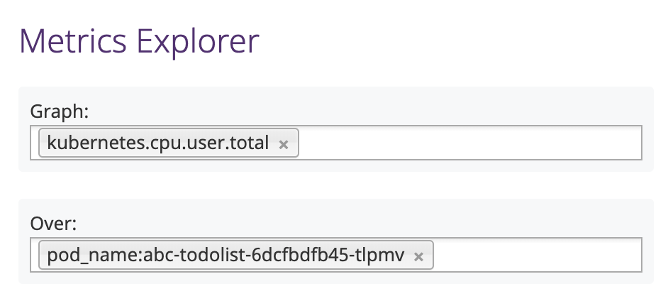
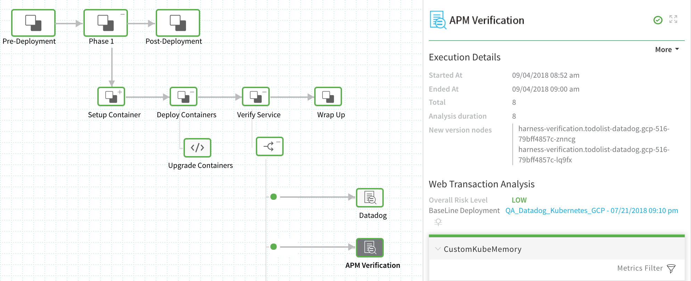
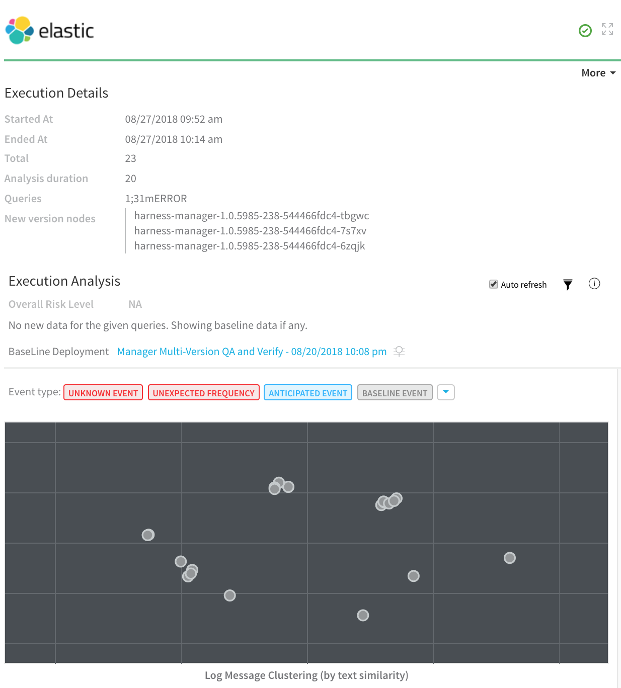

To solve [problem], [solution] [benefit of feature].


### Before You Begin

* See [Custom Verification Overview](custom-verification-overview.md).
* See [Connect to Datadog as a Custom APM](connect-to-datadog-as-a-custom-apm.md).

### Step 1: Set Up the Deployment Verification

1. In Harness, open the **Workflow** that deploys the service you are monitoring with Datadog. You add verification steps after you have performed at least one successful deployment.
2. In the Workflow, in **Verify Service**, click **Add Step**.
3. In the resulting **Add Step** settings, select **Performance Monitoring** > **Custom Metrics**.
4. Click **Next**. The **Configure****Custom Metrics** settings appear.
5. In the **Metrics Data Server** drop-down, select the Custom Verification Provider you set up already.
6. Set the **Metric Type** to either **Infrastructure** or **Transaction**.  
  
Your settings will now look something like this:

### Step 2: Metric Collections

1. Beside **Metric Collections**, click **Add** to display the **New Metrics Collection** settings.  
All of the settings in **New Metrics Collection** are Harness settings for collecting and grouping metrics, except for the settings where you will map JSON response keys to Harness fields.
2. Fill out the **New Metrics Collection** settings using the following information. You will set up an API query for Harness to execute that returns a JSON response. Next, you will map the keys in the JSON response to the fields Harness needs to locate your metric values and host.

### Step 3: Metrics Name

Enter the name to use for your metric. This is not a Datadog value. It is simply the name used for metrics collected by Harness.

### Step 4: Metrics Type

Enter the type of metric, such as **Infra**. These are Harness types, not Datadog's.

#### Always Use Throughput with Error and Response Time Metrics

Whenever you use the Error metric type, you should also add another metric for Throughput with the same Transaction Name. 

Harness analyze errors as error percentage and without the throughput the error number does not provide much information.

The same setup should used with the Response Time metric also. Whenever you set up a Response Time metric, setup a Throughput metric with the same Transaction Name.

 

### Step 5: Metrics Collection URL

This is the API query that will return a JSON response.

The query for Metrics Collection URL follows this syntax:


```
query?query=<METRIC_NAME>{pod_name:${host}}by{pod_name}.rollup(avg,60)&from=${start\_time\_seconds}&to=${end\_time\_seconds}
```
The values in `${...}` braces are placeholders used for querying the data. These are substituted at runtime with real values.

Replace `<METRIC_NAME>` in the query with the correct metric name. The metric names are available in Datadog Metric Explorer:

[](./static/verify-deployments-with-datadog-as-a-custom-apm-04.png)

For example, to search for the `kubernetes.memory.usage_pct metric`, your query would look like this:


```
query?query=kubernetes.memory.usage_pct{pod_name:${host}}by{pod_name}.rollup(avg,60)&from=${start\_time\_seconds}&to=${end\_time\_seconds}
```
### Step 6: Metrics Method

Select **GET** or **POST**.

### Step 7: Response Mapping

In this section you will map the keys in the JSON response to Harness fields.

### Step 8: Transaction Name

Select either **Fixed**, or **Dynamic** depending on the transaction name. In our example, we will use **Fixed**. If you select **Dynamic**, you will see the **Transaction Name Path** and **Regex to transform Transaction Name** fields.

The Transaction Name Path is filled out in the same way as **Name** below. You use **Regex to transform Transaction Name** to truncate the value of the **Transaction Name Path**, if needed.

### Step 9: Name

Enter a name to map to the metric name. For example, if the metric name is `kubernetes.memory.usage_pct` then use a name like **KubeMemory**.

### Step 10: Metrics Value

Run the query using **Guide from an example** to see the JSON response and pick a key to map to **Metrics Value**.

In **Guide from an example**, specify the time range and host for the query. To specify the time range, click in the **${startTime}** and **${endTime}** calendars.

To specify the **${host}**, get the full name of a host from Datadog Metrics Explorer:

[](./static/verify-deployments-with-datadog-as-a-custom-apm-06.png)

To copy the name, click in the graph and click **Copy tags to clipboard**.

[](./static/verify-deployments-with-datadog-as-a-custom-apm-08.png)

Next, paste the name in the **${host}** field.

[](./static/verify-deployments-with-datadog-as-a-custom-apm-10.png)

Click **Submit**. The JSON results appear. Click the name of the field to map to **Metrics Value**.

### Step 11: Timestamp

Use **Guide from an example** to query Datadog and return the JSON response. In the JSON response, click the key that includes the timestamp.

### Step 12: Timestamp Format

Enter a timestamp format. The format follows the Java [SimpleDateFormat](https://docs.oracle.com/javase/8/docs/api/java/text/SimpleDateFormat.html). For example, a timestamp syntax might be `yyyy-MM-dd'T'HH:mm:ss.SSSX`. If you leave this field empty, Harness will use the default range of 1 hour previous (`now-1h`) to now.

Now that the Metric Collection is complete, click **UPDATE** to return to the rest of the **Metrics Verification State** settings.

### Step 13: Canary Analysis

Harness will compare the metrics received for the nodes deployed in each phase with metrics received for the rest of the nodes in the application. For example, if this phase deploys to 25% of your nodes, the metrics received from Custom APM during this deployment for these nodes will be compared with metrics received for the other 75% during the defined period of time.

### Step 14: Previous Analysis

Harness will compare the metrics received for the nodes deployed in each phase with metrics received for all the nodes during the previous deployment. For example, if this phase deploys V1.2 to node A, the metrics received from Custom APM during this deployment will be compared to the metrics for nodes A, B, and C during the previous deployment (V1.1). Previous Analysis is best used when you have predictable load, such as in a QA environment.

### Step 15: Failure Criteria

Specify the sensitivity of the failure criteria. When the criteria is met, the Workflow's Failure Strategy is triggered.

### Step 16: Data Collection Interval

Specify the frequency with which Harness will query Datadog, The value **2** is recommended.

Click **SUBMIT**. Now the Datadog custom verification step is added to the Workflow. Run your Workflow to see the results.

### Review: Verification Results

Once you have deployed your Workflow (or Pipeline) using the Custom verification step, you can automatically verify cloud application and infrastructure performance across your deployment.

#### Workflow Verification

To see the results of Harness machine-learning evaluation of your Custom verification, in your Workflow or Pipeline deployment, you can expand the **Verify Service** step and then click the **APM** **Verification** step.



#### Continuous Verification

You can also see the evaluation in the **Continuous Verification** dashboard. The Workflow verification view is for the DevOps user who developed the workflow; the **Continuous Verification** dashboard is where all deployments are displayed for developers and others interested in deployment analysis.

To learn about the verification analysis features, see the following sections.

#### Transaction Analysis

**Execution details:** See the details of verification execution. Total is the total time the verification step took, and Analysis duration is how long the analysis took.

**Risk level analysis:** Get an overall risk level and view the cluster chart to see events.

**Transaction-level summary:** See a summary of each transaction with the query string, error values comparison, and a risk analysis summary. 



#### Execution Analysis

**Event type:** Filter cluster chart events by Unknown Event, Unexpected Frequency, Anticipated Event, Baseline Event, and Ignore Event.

**Cluster chart:** View the chart to see how the selected event contrasts with anticipated events. Click each event to see its log details.


#### Event Management


|  |
| --- |
| **Event-level analysis:** See the threat level for each event captured.**Tune event capture:** Remove events from analysis at the Service, Workflow, Execution, or overall level.**Event distribution:** Click the chart icon to see an event distribution including the measured data, baseline data, and event frequency. |

