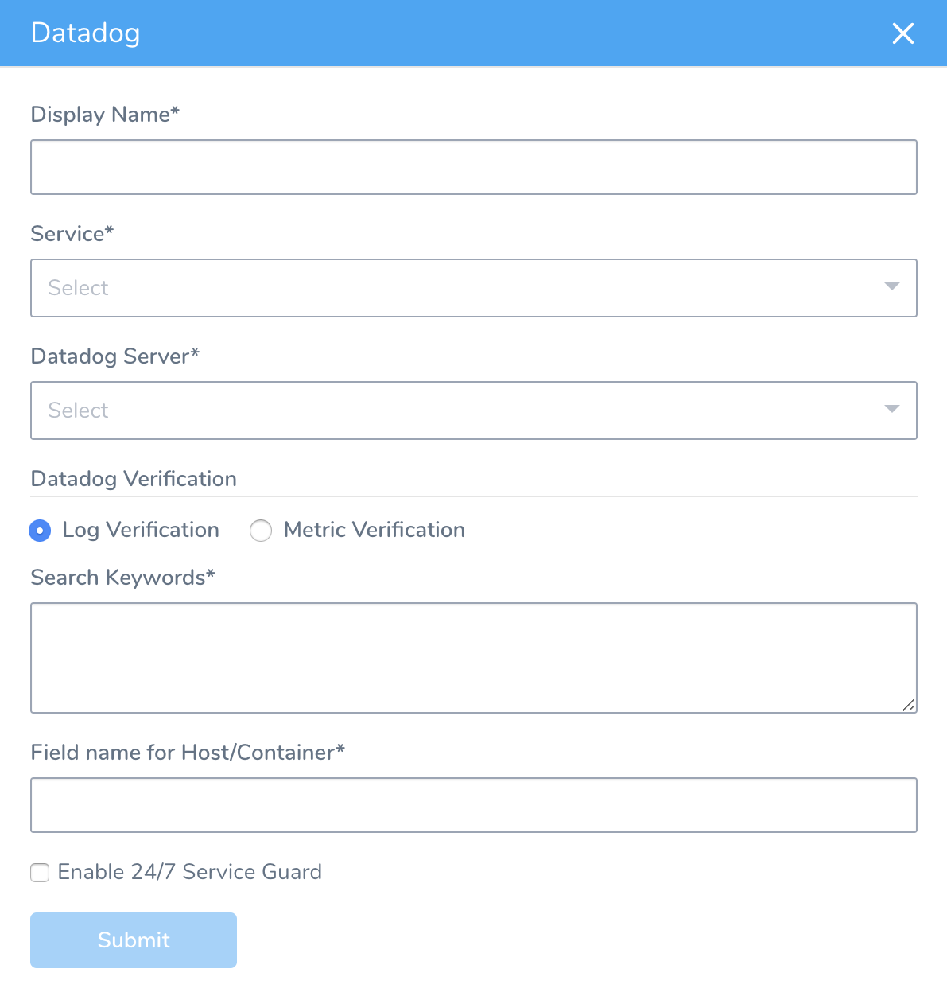
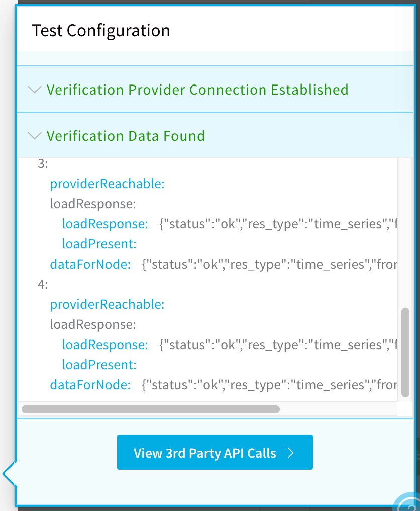
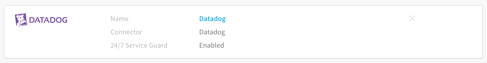
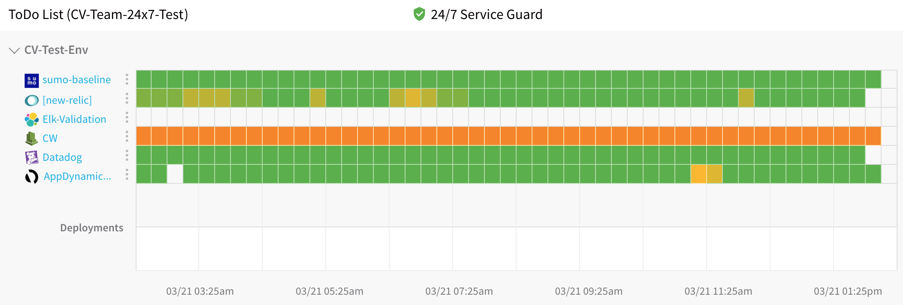

Harness 24/7 Service Guard monitors your live applications, catching problems that surface minutes or hours following deployment. For more information, see [24/7 Service Guard Overview](../continuous-verification-overview/concepts-cv/24-7-service-guard-overview.md).

You can add your Datadog monitoring to Harness 24/7 Service Guard in your Harness Application Environment. For a setup overview, see [Connect to Datadog](1-datadog-connection-setup.md).

This section assumes you have a Harness Application set up and containing a Service and Environment. For steps on setting up a Harness Application, see [Application Checklist](../../model-cd-pipeline/applications/application-configuration.md).

### Before You Begin

* See the [Datadog Verification Overview](../continuous-verification-overview/concepts-cv/datadog-verification-overview.md).
* Make sure you [Connect to Datadog](1-datadog-connection-setup.md).

### Visual Summary

Here's an example of a Datadog Logging setup for 24/7 Service Guard setup.

### Step 1: Set Up 24/7 Service Guard

To set up 24/7 Service Guard for Datadog, do the following:

1. Ensure that you have added Datadog as a Harness Verification Provider, as described in [Verification Provider Setup](1-datadog-connection-setup.md#datadog-verification-provider-setup).
2. In your Harness Application, ensure that you have added a Service, as described in [Services](../../model-cd-pipeline/setup-services/service-configuration.md). For 24/7 Service Guard, you do not need to add an Artifact Source to the Service, or configure its settings. You simply need to create a Service and name it. It will represent your application for 24/7 Service Guard.
3. In your Harness Application, click **Environments**.
4. In **Environments**, ensure that you have added an Environment for the Service you added. For steps on adding an Environment, see [Environments](../../model-cd-pipeline/environments/environment-configuration.md).
5. Click the Environment for your Service. Typically, the **Environment Type** is **Production**.
6. In the **Environment** page, locate **24/7 Service Guard**.
7. In **24/7 Service Guard**, click **Add Service Verification**, and then click **Datadog**. The **Datadog** dialog appears.

### Step 2: Display Name

The name that will identify this service on the **Continuous Verification** dashboard. Use a name that indicates the environment and monitoring tool, such as **Datadog**.

### Step 3: Service

The Harness Service to monitor with 24/7 Service Guard.

### Step 4: Datadog Server

Select the Datadog Verification Provider to use.

### Step 5: Log Verification

Select the Log Verification option.

### Step 6: Search Keywords

Enter search keywords, such as `*expression*`. Separate keywords using spaces. (Follow the Datadog [log search syntax](https://docs.datadoghq.com/logs/explorer/search/#search-syntax).)

You can also enter variable expressions, such as:

`error OR ${serviceVariable.error_type}`

### Step 7: Field Name for Host/Containers

Enter the log field that contains the name of the host/container for which you want logs. You can enter a field name for example.

Harness uses this field to group data and perform analysis at the container-level.

### Step 8: Enable 24/7 Service Guard

Enable this setting to turn on 24/7 Service Guard. If you simply want to set up 24/7 Service Guard, but not enable it, leave this setting disabled.

### Step 9: Verify your Settings

1. Click **Test**. Harness verifies the settings you entered.
2. Click **Submit**. The Datadog 24/7 Service Guard is added.

   To see the running 24/7 Service Guard analysis, click **Continuous Verification**.

The 24/7 Service Guard dashboard displays the production verification results.

 For more information, see [24/7 Service Guard Overview](../continuous-verification-overview/concepts-cv/24-7-service-guard-overview.md).

### Next Steps

* [Verify Deployments with Datadog Logging](3-verify-deployments-with-datadog.md)
* [Verify Deployments with Datadog Metrics](verify-deployments-with-datadog-metrics.md)
* [CV Strategies, Tuning, and Best Practice](../continuous-verification-overview/concepts-cv/cv-strategies-and-best-practices.md#algorithm-sensitivity-and-failure-criteria)

