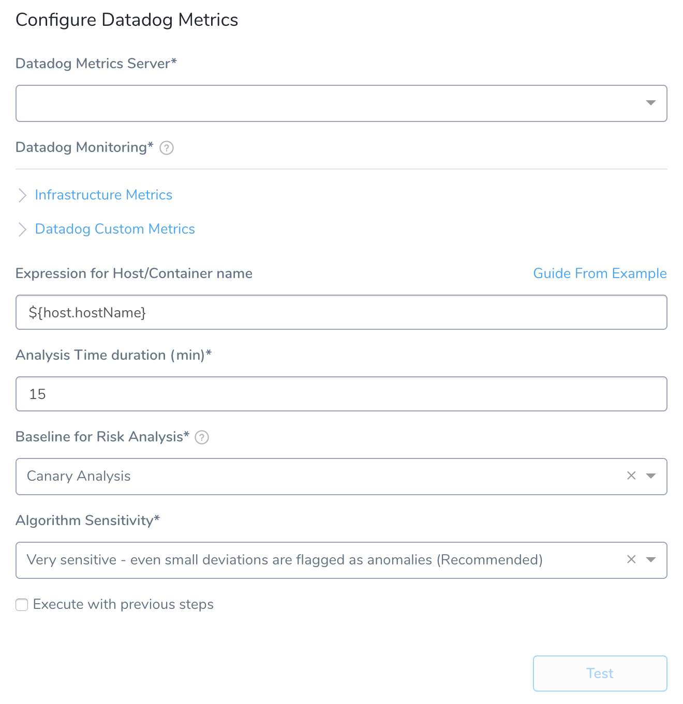
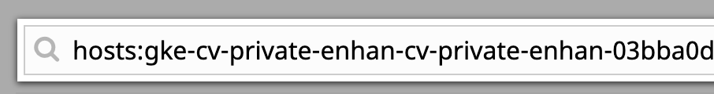
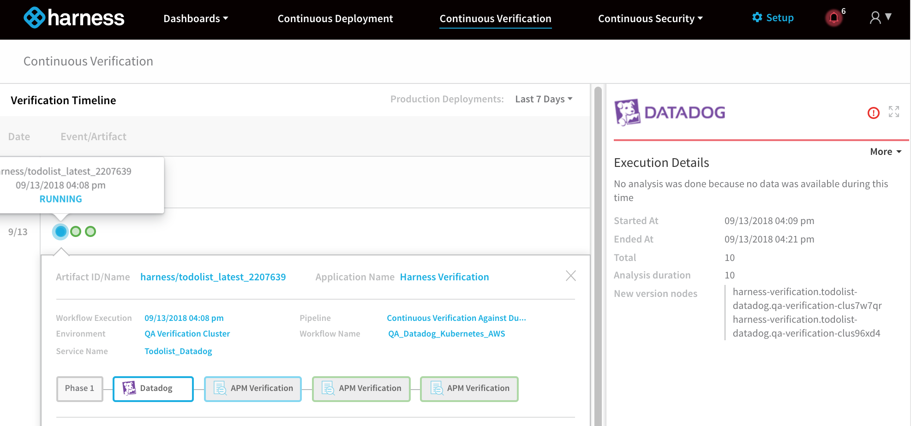
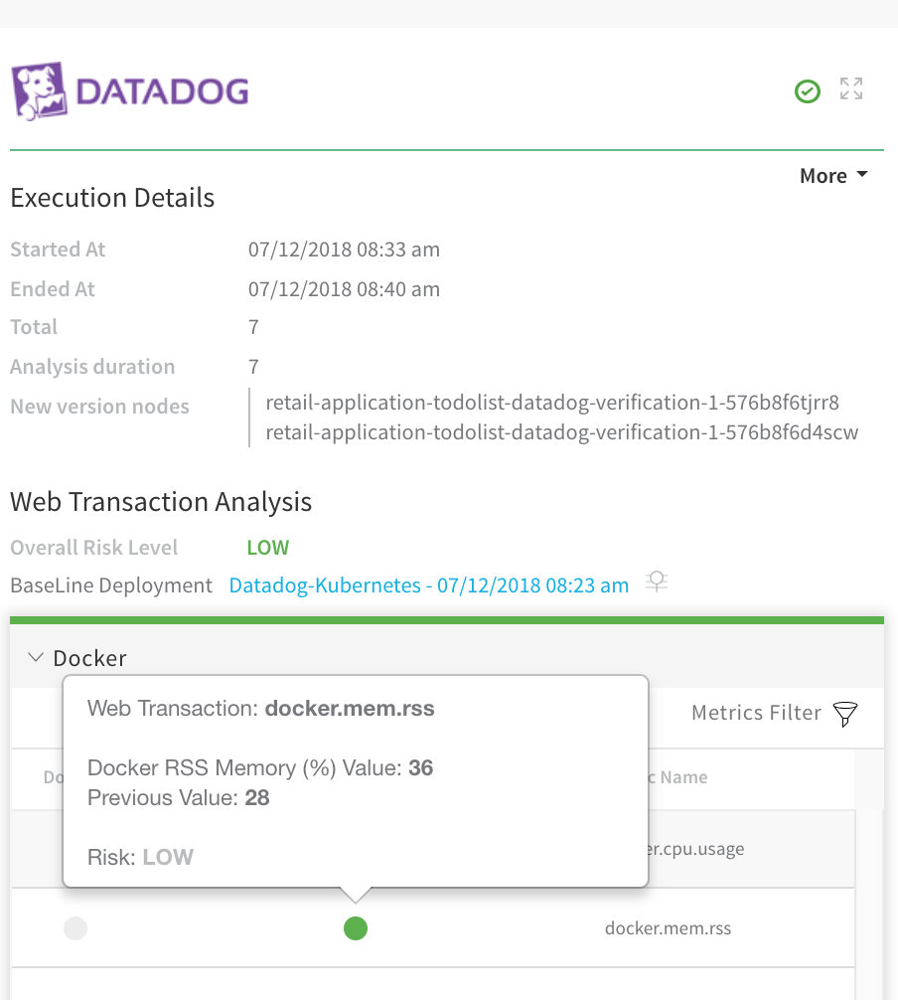
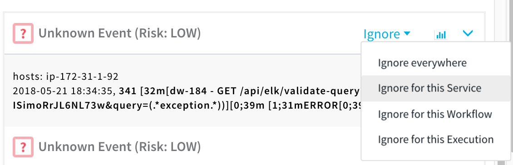

Harness can analyze Datadog metrics to verify, rollback, and improve deployments. To apply this analysis to your deployments, you set up Datadog as a verification step in a Harness Workflow.

Once you run a deployment, and Datadog preforms verification, Harness' machine-learning verification analysis will assess the risk level of the deployment.

In order to obtain the names of the host(s), pod(s), or container(s) where your service is deployed, the verification provider should be added to your workflow *after* you have run at least one successful deployment.

### Before You Begin

* Set up a Harness Application, containing a Service and Environment. See  [Create an Application](../../model-cd-pipeline/applications/application-configuration.md).
* See the  [Datadog Verification Overview](../continuous-verification-overview/concepts-cv/datadog-verification-overview.md).
* Make sure you [Connect to Datadog](1-datadog-connection-setup.md).

### Limitations

For Harness Workflows, Datadog metrics verification is supported only for infrastructure metrics and Datadog custom metrics, as described in this topic. 

Harness does not provide out of the box support for Datadog APM traces because Datadog does not support API calls for those.

### Visual Summary

Here's an example of a Datadog Metrics configuration for verification.

### Step 1: Set Up the Deployment Verification

To verify your deployment with Datadog Metrics, do the following:

1. Ensure that you have added Datadog as a verification provider, as described in [Connect to Datadog](1-datadog-connection-setup.md).
2. In your workflow, under **Verify Service**, click **Add Verification**.
3. In the resulting **Add Step** settings, select either **Performance Monitoring** > **Datadog Metrics.**
4. Click **Next**. The **Datadog Metrics** settings appear.

### Step 2: Datadog Metrics Server

Select the Datadog verification provider you added earlier in [Datadog Connection Setup](1-datadog-connection-setup.md).

You can also enter variable expressions, such as:

 `${serviceVariable.datadog_connector_name}`

### Step 3: Datadog Monitoring

Here you can select any of the Datadog API metrics. For a list of the API metrics, see [Data Collected](https://docs.datadoghq.com/integrations/docker_daemon/#data-collected) from Datadog.

### Step 4: Infrastructure Metrics

Select the [Docker](https://docs.datadoghq.com/integrations/docker_daemon/#metrics), [Kubernetes](https://docs.datadoghq.com/agent/kubernetes/metrics/#kubernetes), and [ECS](https://docs.datadoghq.com/integrations/ecs_fargate/#metrics) metrics to use.

### Step 5: Datadog Custom Metrics

1. In **Hostname Identifier**, enter the field name in Datadog for the host name.

   
   
   This would be the hosts value used when searching:
   
   
   
2. In **Metric Type**, select the metric to use. To use multiple types, click **Add**.
3. In **Display Name**, enter a name to identify this metric in the Harness dashboards.
4. In **Group Name**, enter the name of the service or request context to which the metric relates. For example, **Login**.
5. In **Metric Name**, enter the metric you want to use. These are the metrics you will see in the Datadog Metrics Explorer **Graph** menu:

### Step 6: Expression for Host/Container name

Enter an expression that evaluates to the host/container/pod name tagged in the Datadog events.

For example, in Datadog, a Kubernetes deployment might use the tag **pod\_name** to identify the pod where the microservice is deployed.

Find the where the same name is identified in the deployment environment, and use that path as the expression.For example, locate the pod name in the Datadog **Event Stream** page:

1. In **Datadog**, click **Events**.
2. Locate an event using a search query. For more information, see [Event Stream](https://docs.datadoghq.com/graphing/event_stream/) from Datadog.
3. Expand the event by click the the ellipsis at the end of the event title.

   
   
4. Look through the event details and locate the tag that lists the pod name for the instance where the service is deployed. In our example, the tag is **pod\_name**.

   
   
5. Next, look in the JSON for the host/container/pod in the deployment environment and identify the label containing the same hostname. The path to that label is what the expression should be in **Expression for Host/Container name**. The default expression is **${host.hostName}**. In most cases, this expression will work.

### Step 7: Analysis Time Duration

Set the duration for the verification step. If a verification step exceeds the value, the workflow [Failure Strategy](../../model-cd-pipeline/workflows/workflow-configuration.md#failure-strategy) is triggered. For example, if the Failure Strategy is **Ignore**, then the verification state is marked **Failed** but the workflow execution continues.

See [CV Strategies, Tuning, and Best Practices](../continuous-verification-overview/concepts-cv/cv-strategies-and-best-practices.md).

### Step 8: Baseline for Risk Analysis

See [CV Strategies, Tuning, and Best Practices](../continuous-verification-overview/concepts-cv/cv-strategies-and-best-practices.md).

### Step 9: Algorithm Sensitivity

See [CV Strategies, Tuning, and Best Practices](../continuous-verification-overview/concepts-cv/cv-strategies-and-best-practices.md#algorithm-sensitivity-and-failure-criteria).

### Step 10: Execute with Previous Steps

Check this checkbox to run this verification step in parallel with the previous steps in **Verify Service**.

### Step 11: Verify your Settings

1. Click **TEST**. Harness verifies the settings you entered.
2. When you are finished, click **SUBMIT**. The Datadog verification step is added to your workflow.

### Review: Datadog and ECS

For [ECS-based deployments](https://docs.harness.io/article/08whoizbps-ecs-deployments-overview), Datadog uses the container ID to fetch data for both metrics and logs. Harness can fetch the container ID if the Harness Delegate is running on same ECS cluster as the container or the Delegate must be in same AWS VPC and **port 51678** must be open for incoming traffic.

Getting the container ID is available when you are using some of the later versions of ECS agents in your container instances. AWS documentation does not explicitly mention what agent version is needed. Hence, Harness first looks the version up, and if it there, Harness can proceed. If it is not there, Harness queries the port as a backup to get the container ID.

### Review: Harness Expression Support in CV Settings

You can use expressions (`${...}`) for [Harness built-in variables](https://docs.harness.io/article/7bpdtvhq92-workflow-variables-expressions) and custom [Service](../../model-cd-pipeline/setup-services/service-configuration.md) and [Workflow](../../model-cd-pipeline/workflows/add-workflow-variables-new-template.md) variables in the settings of Harness Verification Providers.

Expression support lets you template your Workflow verification steps. You can add custom expressions for settings, and then provide values for those settings at deployment runtime. Or you can use Harness built-in variable expressions and Harness will provide values at deployment runtime automatically.

### Step 12: View Verification Results

Once you have deployed your workflow (or pipeline) using the Datadog verification step, you can automatically verify cloud application and infrastructure performance across your deployment. For more information, see [Add a Workflow](../../model-cd-pipeline/workflows/workflow-configuration.md) and [Add a Pipeline](../../model-cd-pipeline/pipelines/pipeline-configuration.md).

### Workflow Verification

To see the results of Harness machine-learning evaluation of your Datadog verification, in your workflow or pipeline deployment you can expand the **Verify Service** step and then click the **Datadog** step.

### Continuous Verification

You can also see the evaluation in the **Continuous Verification** dashboard. The workflow verification view is for the DevOps user who developed the workflow. The **Continuous Verification** dashboard is where all future deployments are displayed for developers and others interested in deployment analysis.

To learn about the verification analysis features, see the following sections.

#### Deployments

**Deployment info:** See the verification analysis for each deployment, with information on its service, environment, pipeline, and workflows.

**Verification phases and providers:** See the vertfication phases for each vertfication provider. Click each provider for logs and analysis.

**Verification timeline:** See when each deployment and verification was performed. |

 

#### Transaction Analysis

**Execution details:** See the details of verification execution. Total is the total time the verification step took, and Analysis duration is how long the analysis took.

**Risk level analysis:** Get an overall risk level and view the cluster chart to see events.

**Transaction-level summary:** See a summary of each transaction with the query string, error values comparison, and a risk analysis summary. 

 |

#### Execution Analysis

**Event type:** Filter cluster chart events by Unknown Event, Unexpected Frequency, Anticipated Event, Baseline Event, and Ignore Event.

**Cluster chart:** View the chart to see how the selected event contrast. Click each event to see its log details. |

 

#### Event Management

**Event-level analysis:** See the threat level for each event captured.

**Tune event capture:** Remove events from analysis at the service, workflow, execution, or overall level.

**Event distribution:** Click the chart icon to see an event distribution including the measured data, baseline data, and event frequency.

 |

### Next Steps

* [Configuration as Code](https://docs.harness.io/article/htvzryeqjw-configuration-as-code)
* [Users and Permissions](https://docs.harness.io/article/ven0bvulsj-users-and-permissions)
* [CV Strategies, Tuning, and Best Practice](../continuous-verification-overview/concepts-cv/cv-strategies-and-best-practices.md#algorithm-sensitivity-and-failure-criteria)

