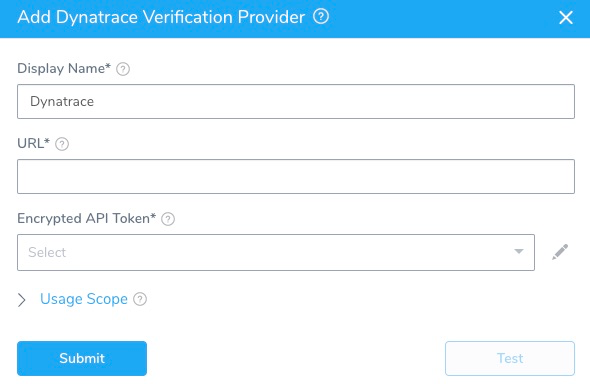

The first step in using Dynatrace with Harness is to set up a Dynatrace Verification Provider in Harness.

A Harness Verification Provider is a connection to monitoring tools such as Dynatrace. Once Harness is connected, you can use Deployment Verification with your Dynatrace data and analysis.

### Before You Begin

* See the [Dynatrace Verification Overview](../continuous-verification-overview/concepts-cv/dynatrace-verification-overview.md).

### Step 1: Generate Dynatrace Access Token

Dynatrace requires token-based authentication for accessing the Dynatrace API. For more information, see [Access tokens](https://www.dynatrace.com/support/help/get-started/introduction/why-do-i-need-an-access-token-and-an-environment-id/#anchor-access-tokens) from Dynatrace.

To generate a Dynatrace access token, do the following:

1. Log into your Dynatrace environment.
2. In the navigation menu, click **Settings**, and then click **Integration**.
3. Select **Dynatrace API**. The Dynatrace API page appears.

   
   
4. Enter a token name in the text field. The default Dynatrace API token switches are sufficient for Harness.
5. Click **Generate**. The token appears in the token list.
6. Click **Edit**. The token details appear.

   
   
7. Click **Copy**. You will use this token when connecting Harness to Dynatrace, described below.

### Step 2: Add Dynatrace Verification Provider

To add Dynatrace as a verification provider, do the following:

1. In **Harness**, click **Setup**.
2. Click **Connectors**.
3. Click **Verification Providers**.
4. Click **Add Verification Provider**, and select **Dynatrace**. The **Dynatrace** dialog for your provider appears.

   

### Step 3: URL

The URL of your Dynatrace account. The URL has the following syntax:

`https://your_environment_ID.live.dynatrace.com`

HTTPS is mandatory for Dynatrace connections.

### Step 4: API Token

For secrets and other sensitive settings, select or create a new [Harness Encrypted Text secret](https://docs.harness.io/article/ygyvp998mu-use-encrypted-text-secrets).In **Encrypted API Token**, enter in the API token you created in Dynatrace, described above.

### Step 5: Display Name

The name for the Dynatrace verification provider connection in Harness. If you will have multiple Dynatrace connections, enter a unique name.

You will use this name to select this connection when integrating Dynatrace with the **Verify Steps** of your workflows, described below.

### Step 6: Usage Scope

Usage scope is inherited from the secrets used in the settings.

### Next Steps

* [Monitor Applications 24/7 with Dynatrace](2-24-7-service-guard-for-dynatrace.md)
* [Verify Deployments with Dynatrace](3-verify-deployments-with-dynatrace.md)

