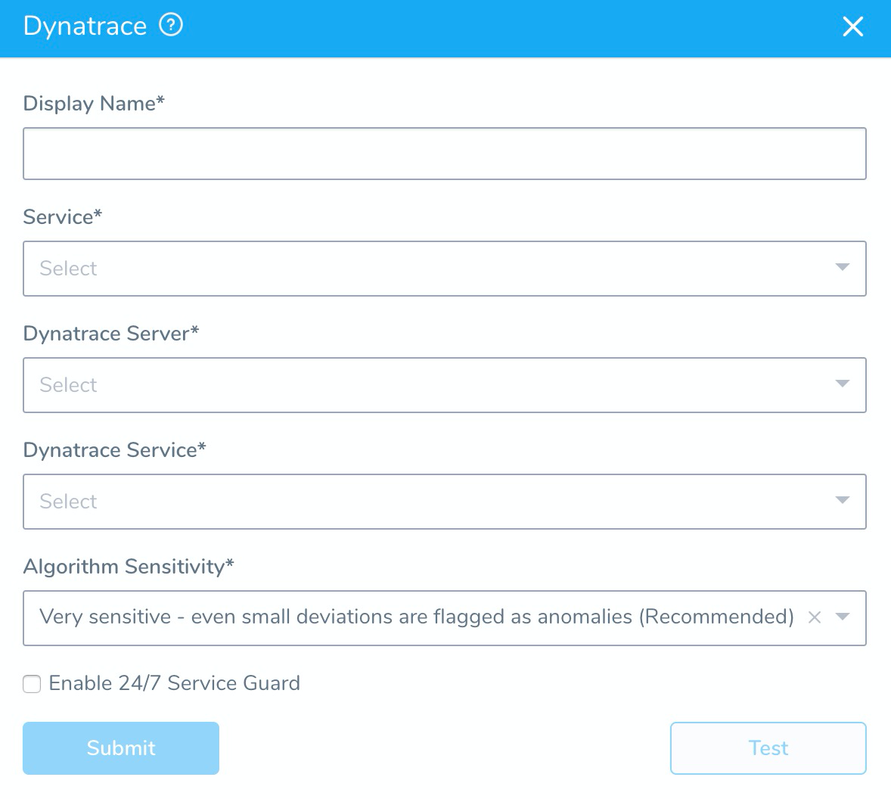
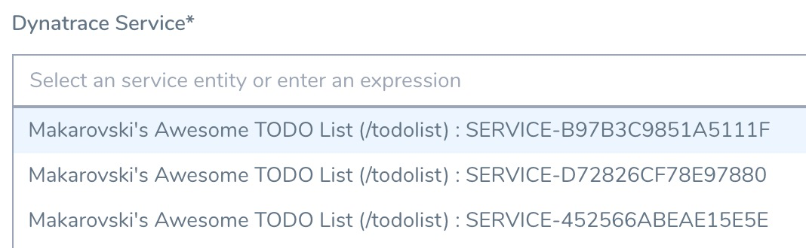
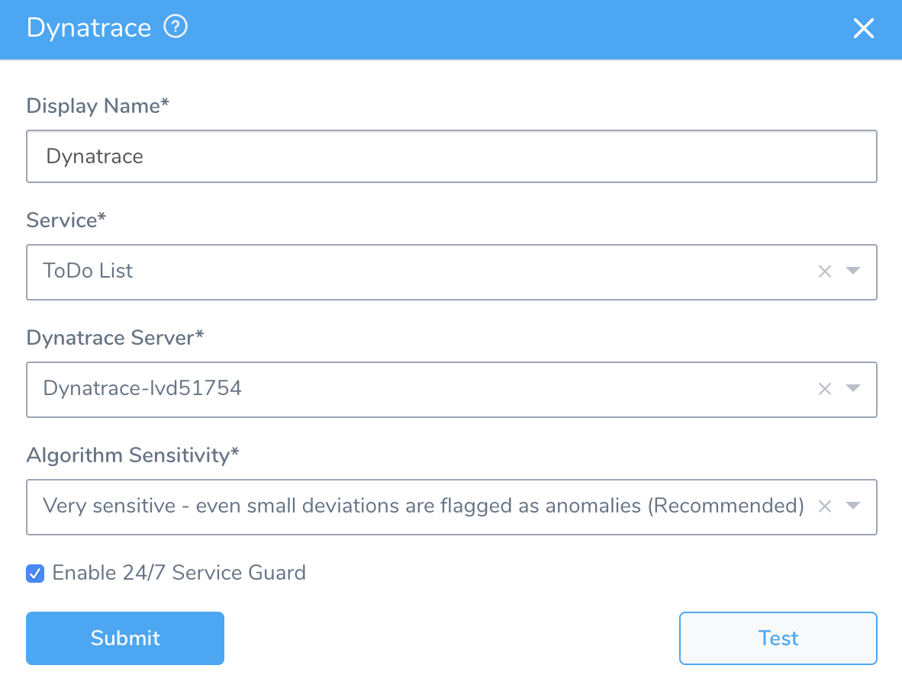
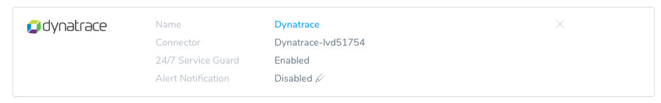
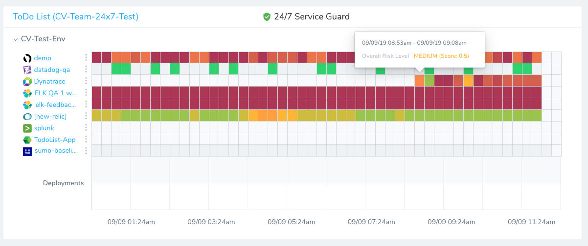

Harness 24/7 Service Guard monitors your live applications, catching problems that surface minutes or hours following deployment. For more information, see [24/7 Service Guard Overview](../continuous-verification-overview/concepts-cv/24-7-service-guard-overview.md).

You can add your Dynatrace monitoring to Harness 24/7 Service Guard in your Harness Application Environment. For a setup overview, see [Connect to Dynatrace](1-dynatrace-connection-setup.md).

This section assumes you have a Harness Application set up and containing a Service and Environment. For steps on setting up a Harness Application, see [Application Checklist](../../model-cd-pipeline/applications/application-configuration.md).

### Before You Begin

* See the [Dynatrace Verification Overview](../continuous-verification-overview/concepts-cv/dynatrace-verification-overview.md).
* See [Connect to Dynatrace](1-dynatrace-connection-setup.md).

### Step 1: Set up 24/7 Service Guard for Dynatrace

To set up 24/7 Service Guard for Dynatrace, do the following:

1. Ensure that you have added Dynatrace as a Harness Verification Provider, as described in [Verification Provider Setup](1-dynatrace-connection-setup.md#dynatrace-verification-provider-setup).
2. In your Harness Application, ensure that you have added a Service, as described in [Services](../../model-cd-pipeline/setup-services/service-configuration.md). For 24/7 Service Guard, you do not need to add an Artifact Source to the Service, or configure its settings. You simply need to create a Service and name it. It will represent your application for 24/7 Service Guard.
3. In your Harness Application, click **Environments**.
4. In **Environments**, ensure that you have added an Environment for the Service you added. For steps on adding an Environment, see [Environments](../../model-cd-pipeline/environments/environment-configuration.md).
5. Click the Environment for your Service. Typically, the **Environment Type** is **Production**.
6. In the **Environment** page, locate **24/7 Service Guard**.
   
7. In **24/7 Service Guard**, click **Add Service Verification**, and then click **Dynatrace**. The **Dynatrace** dialog appears.

   

Fill out the settings.

Dynatrace returns API data for transactions that are marked as [key requests](https://www.dynatrace.com/support/help/how-to-use-dynatrace/transactions-and-services/monitoring/monitor-key-requests/) only. To use these transactions in Harness, be sure to mark them as key requests in Dynatrace.

### Step 2: Display Name

The name that will identify this service on the Continuous Verification dashboard. Use a name that indicates the environment and monitoring tool, such as Dynatrace.

### Step 3: Service

The Harness Service to monitor with 24/7 Service Guard.

### Step 4: Dynatrace Server

This dropdown contains the names of the Dynatrace verification providers you added, as described above.

Select the name of the Dynatrace verification provider that monitors the application defined in the Harness Service you selected in **Service**.

### Step 5: Dynatrace Service

Once you select a Dynatrace server in **Dynatrace Server**, Harness goes and fetches a list of all the services you have in Dynatrace.

Select the Dynatrace service to monitor. Dynatrace analytics are performed at Dynatrace's service level.

You can also enter a built-in [Harness variable expression](https://docs.harness.io/article/9dvxcegm90-variables) or custom variable, such as a [Service](../../model-cd-pipeline/setup-services/service-configuration.md) or [Workflow variable](../../model-cd-pipeline/workflows/add-workflow-variables-new-template.md):

If you see multiple services for the same application, it is likely because the service is being hit from multiple endpoints.

This is uncommon in production, but in development/test environments you might be throwing traffic and data at the service from multiple endpoints (local, QA, etc). These endpoints get registered as different services by Dynatrace.

To distinguish services, Harness list the service ID also.

This ID is taken from the Dynatrace console URL (`id=<service_ID>`). if you need to select a specific service, use the ID in the URL to match the service listed in the Harness **Dynatrace Service** setting.

### Step 6: Algorithm Sensitiivty

See [CV Strategies, Tuning, and Best Practices](../continuous-verification-overview/concepts-cv/cv-strategies-and-best-practices.md#algorithm-sensitivity-and-failure-criteria).

### Step 7: Enable 24/7 Service Guard

Enable this setting to turn on 24/7 Service Guard. If you simply want to set up 24/7 Service Guard, but not enable it, leave this setting disabled.

When you are finished, the dialog will look something like this:

### Step 8: Verify Your Settings

Click **Test**. Harness verifies the settings you entered.

Harness will filter by the service you selected in **Dynatrace Service**. You can see this in the **Third-Party API Call History**.

Click **Submit**. The Dynatrace 24/7 Service Guard is added.

To see the running 24/7 Service Guard analysis, click **Continuous Verification**.

The 24/7 Service Guard dashboard displays the production verification results.

### Next Steps

* [Verify Deployments with Dynatrace](3-verify-deployments-with-dynatrace.md)

