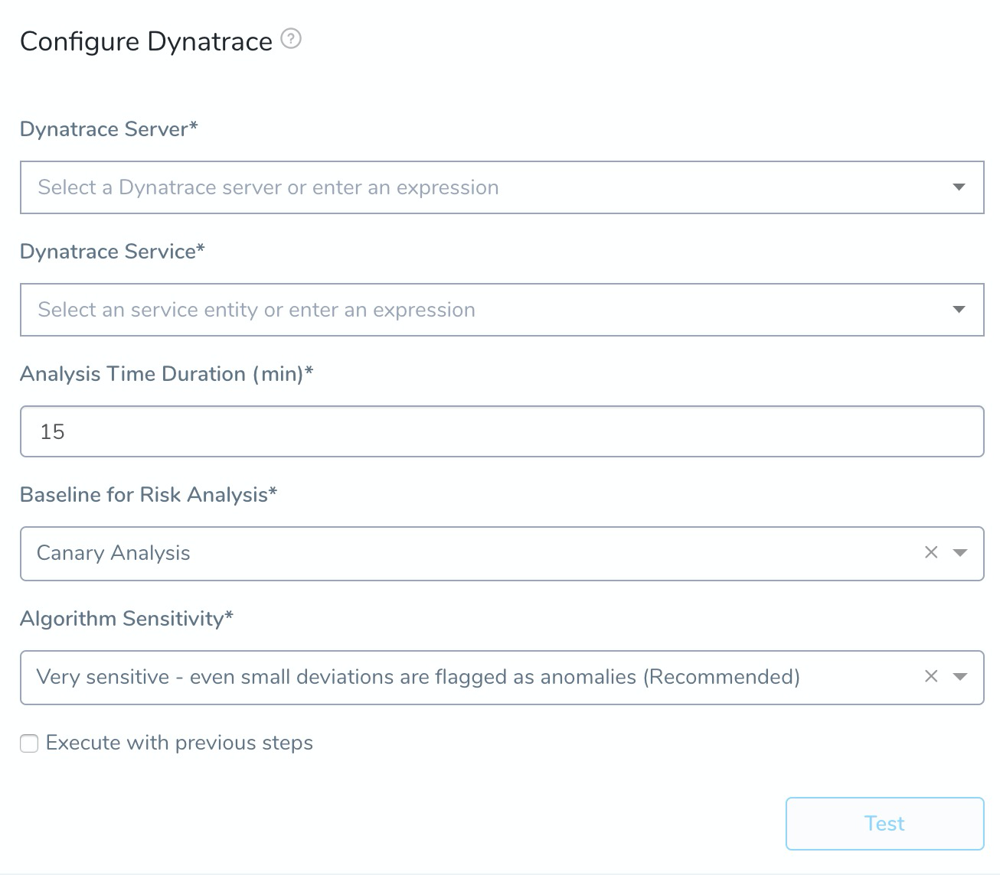
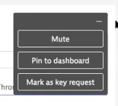
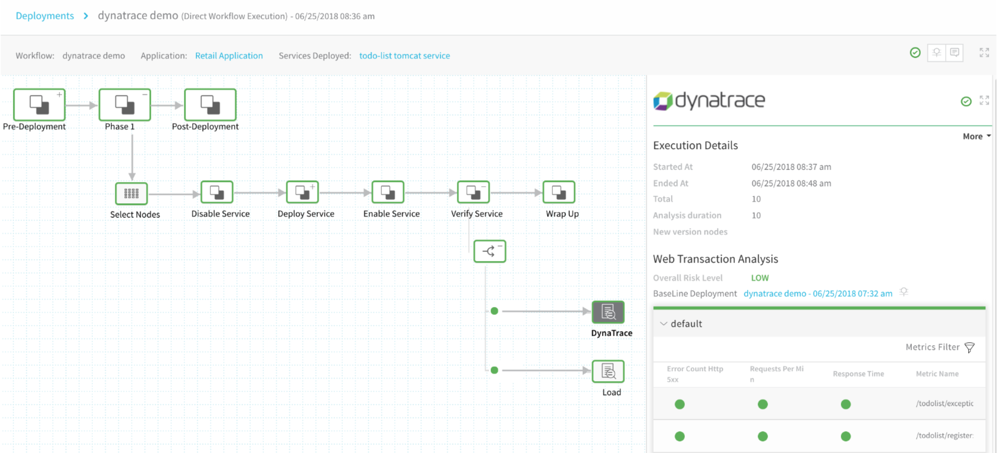
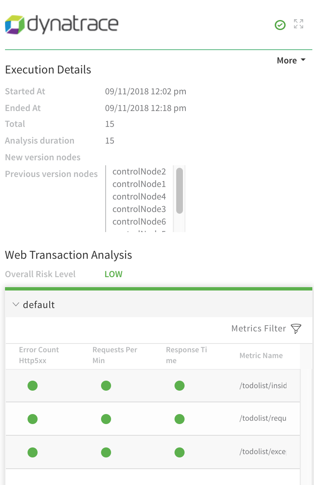

The following procedure describes how to add Dynatrace as a verification step in a Harness workflow. For more information about workflows, see [Add a Workflow](../../model-cd-pipeline/workflows/workflow-configuration.md).

Once you run a deployment and Dynatrace preforms verification, Harness' machine-learning verification analysis will assess the risk level of the deployment.

Harness does not perform host level analysis using Dynatrace as Dynatrace API does not support host level analysis. Harness performs analysis at the service level for a time duration of the last seven days.

### Before You Begin

* Set up a Harness Application, containing a Service and Environment. See  [Create an Application](../../model-cd-pipeline/applications/application-configuration.md).
* See the [Dynatrace Verification Overview](../continuous-verification-overview/concepts-cv/dynatrace-verification-overview.md).
* See [Connect to Dynatrace](1-dynatrace-connection-setup.md).

### Visual Summary

Here's an example of Dynatrace setup for verification.

### Step 1: Set up the Deployment Verification

To verify your deployment with Dynatrace, do the following:

1. Ensure that you have added Dynatrace as a verification provider, as described in [Dynatrace Connection Setup](1-dynatrace-connection-setup.md).
2. In your Workflow, under **Verify Service**, click **Add Step**.
3. Select **Dynatrace**, and click **Next**. The **Configure****Dynatrace** settings appear.

These **Configure Dynatrace** settings include the following fields.

Dynatrace returns API data for transactions that are marked as [key requests](https://www.dynatrace.com/support/help/how-to-use-dynatrace/transactions-and-services/monitoring/monitor-key-requests/) only. To use these transactions in Harness, be sure to mark them as key requests in Dynatrace:

### Step 2: Dynatrace Server

This dropdown contains the names of the Dynatrace verification providers you added, as described above. Select the name of the Dynatrace verification provider that connects to the Dynatrace environment associated with the microservice/application this workflow deploys.

### Step 3: Dynatrace Service

One you select a Dynatrace server in **Dynatrace Server**, Harness goes and fetches a list of all the services you have in Dynatrace.

Select the Dynatrace service to monitor. Dynatrace analytics are performed at Dynatrace's service level.

You can find the Dynatrace service in Dynatrace search:

You can also enter a built-in [Harness variable expression](https://docs.harness.io/article/9dvxcegm90-variables) or custom variable, such as a [Service](../../model-cd-pipeline/setup-services/service-configuration.md) or [Workflow variable](../../model-cd-pipeline/workflows/add-workflow-variables-new-template.md):

If you see multiple services for the same application, it is likely because the service is being hit from multiple endpoints.

This is uncommon in production, but in development/test environments you might be throwing traffic and data at the service from multiple endpoints (local, QA, etc). These endpoints get registered as different services by Dynatrace.

To distinguish services, Harness list the service ID also.

This ID is taken from the Dynatrace console URL (`id=<service_ID>`).

If you need to select a specific service, use the ID in the URL to match the service listed in the Harness **Dynatrace Service** setting.

### Step 4: Analysis Time duration

Set the duration for the verification step. If a verification step exceeds the value, the workflow [Failure Strategy](../../model-cd-pipeline/workflows/workflow-configuration.md#failure-strategy) is triggered. For example, if the Failure Strategy is **Ignore**, then the verification state is marked **Failed** but the workflow execution continues.

See [CV Strategies, Tuning, and Best Practices](../continuous-verification-overview/concepts-cv/cv-strategies-and-best-practices.md).

### Step 5: Baseline for Risk Analysis

See [CV Strategies, Tuning, and Best Practices](../continuous-verification-overview/concepts-cv/cv-strategies-and-best-practices.md).

### Step 6: Algorithm Sensitivity

See [CV Strategies, Tuning, and Best Practices](../continuous-verification-overview/concepts-cv/cv-strategies-and-best-practices.md#algorithm-sensitivity-and-failure-criteria).

### Step 7: Verify Your Configuration

When you are finished, click **Test** to verify your configuration.

Harness will filter by the service you selected in **Dynatrace Service**. You can see this in the **Third-Party API Call History**.

Once your configuration tests successfully, click **Submit**. The **Dynatrace** verification step is added to your workflow.

### Review: Harness Expression Support in CV Settings

You can use expressions (`${...}`) for [Harness built-in variables](https://docs.harness.io/article/7bpdtvhq92-workflow-variables-expressions) and custom [Service](../../model-cd-pipeline/setup-services/service-configuration.md) and [Workflow](../../model-cd-pipeline/workflows/add-workflow-variables-new-template.md) variables in the settings of Harness Verification Providers.

Expression support lets you template your Workflow verification steps. You can add custom expressions for settings, and then provide values for those settings at deployment runtime. Or you can use Harness built-in variable expressions and Harness will provide values at deployment runtime automatically.

### Step 8: View Verification Results

Once you have deployed your workflow (or pipeline) using the Dynatrace verification step, you can automatically verify cloud application and infrastructure performance across your deployment. For more information, see [Add a Workflow](../../model-cd-pipeline/workflows/workflow-configuration.md) and [Add a Pipeline](../../model-cd-pipeline/pipelines/pipeline-configuration.md).

#### Workflow Verification

To see the results of Harness machine-learning evaluation of your Dynatrace verification, in your workflow or pipeline deployment you can expand the **Verify Service** step and then click the **Dynatrace** step.

#### Continuous Verification

You can also see the evaluation in the **Continuous Verification** dashboard. The workflow verification view is for the DevOps user who developed the workflow. The **Continuous Verification** dashboard is where all future deployments are displayed for developers and others interested in deployment analysis.

To learn about the verification analysis features, see the following sections.

##### Transaction Analysis
 
 **Execution details:** See the details of verification execution. Total is the total time the verification step took, and Analysis duration is how long the analysis took.
 
 **Risk level analysis:** Get an overall risk level and view the cluster chart to see events.
 
 **Transaction-level summary:** See a summary of each transaction with the query string, error values comparison, and a risk analysis summary. 
 
 

##### Execution Analysis

**Event type:** Filter cluster chart events by Unknown Event, Unexpected Frequency, Anticipated Event, Baseline Event, and Ignore Event.

**Cluster chart:** View the chart to see how the selected event contrast. Click each event to see its log details. 

 
 
##### Event Management

**Event-level analysis:** See the threat level for each event captured.

**Tune event capture:** Remove events from analysis at the service, workflow, execution, or overall level.

**Event distribution:** Click the chart icon to see an event distribution including the measured data, baseline data, and event frequency. 

 

### Next Steps

* [Configuration as Code](https://docs.harness.io/article/htvzryeqjw-configuration-as-code)
* [Managing Users and Groups (RBAC)](https://docs.harness.io/article/ven0bvulsj-users-and-permissions)

