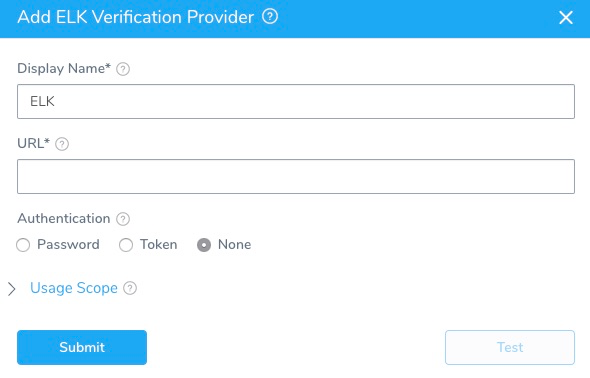

The first step in using Elasticsearch (ELK) with Harness is to set up an Elasticsearch Verification Provider in Harness.

A Harness Verification Provider is a connection to monitoring tools, such as Elasticsearch. Once Harness is connected, you can use Harness 24/7 Service Guard and Deployment Verification with your Elasticsearch data and analysis.

### Before You Begin

* See the [Elasticsearch Verification Overview](../continuous-verification-overview/concepts-cv/elasticsearch-verification-overview.md).

### Step 1: Add Elasticsearch (ELK) Verification Provider

To add Elasticsearch as a Harness Verification Provider, do the following:

1. In Harness, click **Setup**.
2. Click **Connectors**, and then click **Verification Providers**.
3. Click **Add Verification Provider**, and select **ELK**. The **Add ELK Verification Provider** dialog for your provider appears.

   

### Step 2: Display Name

Enter a display name for the provider. If you are going to use multiple providers of the same type, ensure you give each provider a different name.

### Step 3: URL

Enter the URL of the server. The format is **http(s)://*****server*****:*****port*****/**. The default port is **9200**.

### Step 4: Username and Encrypted Password

For secrets and other sensitive settings, select or create a new [Harness Encrypted Text secret](https://docs.harness.io/article/ygyvp998mu-use-encrypted-text-secrets).

Enter the credentials to authenticate with the server.

### Step 5: Token

For secrets and other sensitive settings, select or create a new [Harness Encrypted Text secret](https://docs.harness.io/article/ygyvp998mu-use-encrypted-text-secrets).

Some systems provide Elasticsearch as a service and use access tokens.If you have token based authentication, provide the authentication header that is passed when making the HTTP request.

Header: **APITokenKey**. Example: **x-api-key** (varies by system).

Value: **APITokenValue**. Example: **kdsc3h3hd8wngdfujr23e23e2.**

### Step 6: Usage Scope

Usage scope is inherited from the secrets used in the settings.

If you selected **None** in **Authentication**, then you can scope this connection to Harness Applications and Environments.

### Next Steps

* [Monitor Applications 24/7 with Elasticsearch](2-24-7-service-guard-for-elasticsearch.md)
* [Verify Deployments with Elasticsearch](3-verify-deployments-with-elasticsearch.md)

