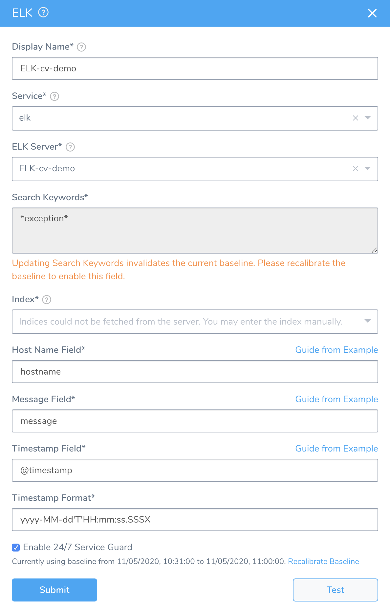
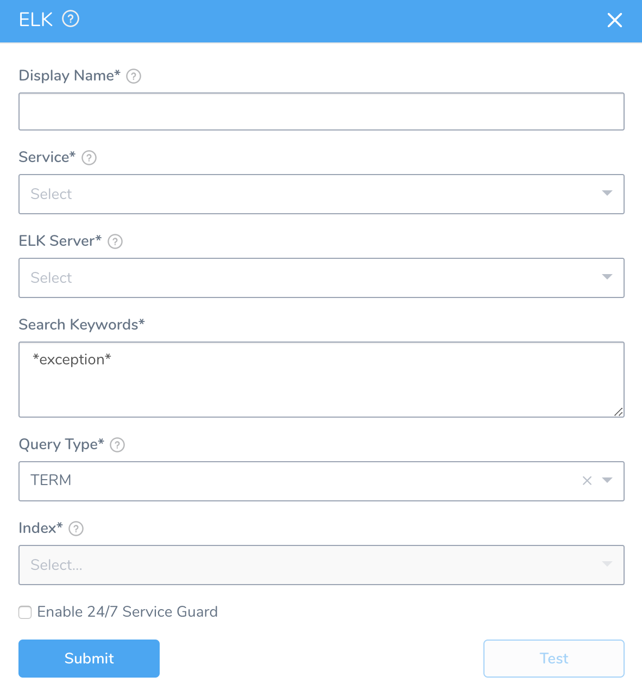
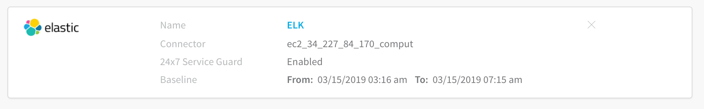

Harness 24/7 Service Guard monitors your live applications, catching problems that surface minutes or hours following deployment. For more information, see [24/7 Service Guard Overview](../continuous-verification-overview/concepts-cv/24-7-service-guard-overview.md).

You can add your Elasticsearch monitoring to Harness 24/7 Service Guard in your Harness Application Environment. For a setup overview, see [Connect to Elasticsearch](1-elasticsearch-connection-setup.md).

This section assumes you have set up a Harness Application, containing a Service and Environment. For steps on setting up a Harness Application, see [Application Components](../../model-cd-pipeline/applications/application-configuration.md).

### Before You Begin

* See the [Elasticsearch Verification Overview](../continuous-verification-overview/concepts-cv/elasticsearch-verification-overview.md).

### Visual Summary

Here's an example 24/7 Service Guard setup for Elasticsearch.

### Step 1: Set Up 24/7 Service Guard for Elasticsearch

To set up 24/7 Service Guard for Elasticsearch, do the following:

1. Ensure that you have added ELK Elasticsearch as a Harness Verification Provider, as described in [Verification Provider Setup](#verification_provider_setup).
2. In your Harness Application, ensure that you have added a Service, as described in [Services](../../model-cd-pipeline/setup-services/service-configuration.md). For 24/7 Service Guard, you do not need to add an Artifact Source to the Service, or configure its settings. You simply need to create a Service and name it. It will represent your application for 24/7 Service Guard.
3. In your Harness Application, click **Environments**.
4. In **Environments**, ensure that you have added an Environment for the Service you added. For steps on adding an Environment, see [Environments](../../model-cd-pipeline/environments/environment-configuration.md).
5. Click the Environment for your running microservice. Typically, the **Environment Type** is **Production**.
6. In the **Environment** page, locate **24/7 Service Guard**.
   
7. In **24/7 Service Guard**, click **Add Service Verification**, and then click **ELK**. The **ELK** dialog appears.

   
   
8. Fill out the dialog. The dialog has the following fields.

For 24/7 Service Guard, the queries you define to collect logs are specific to the application or service you want monitored. Verification is application/service level. This is unlike Workflows, where verification is performed at the host/node/pod level.

### Step 2: Display Name

The name that will identify this service on the **Continuous Verification** dashboard. Use a name that indicates the environment and monitoring tool, such as **ELK**.

### Step 3: Service

The Harness Service to monitor with 24/7 Service Guard.

### Step 4: ELK Server

Select the ELK Verification Provider to use.

### Step 5: Search Keywords

Enter search keywords for your query, such as **error** or **exception**.

Do not use wildcards in queries with Elasticsearch. ElasticSearch documentation indicates that wildcard queries can become very expensive and take down the cluster.

### Step 6: Index

 Enter the the index to search. This field is automatically populated from the index templates, if available.

### Step 7: Host Name Field

Enter the field name used in the ELK logs that refers to the host/pod/container ELK is monitoring.

### Step 8: Message Field

Enter the field by which the messages are usually indexed. Typically, a log field.

To find the field in **Kibana** and enter it in **Harness**, do the following:

1. In Kibana, click **Discover**.
2. In the search field, search for **error or exception**.
3. In the results, locate a log for the host/container/pod ELK is monitoring. For example, in the following Kubernetes results in Kibana, the messages are indexed under the **log** field.
4. In **Harness**, in the **ELK** dialog, next to **Message Field**, click **Guide From Example**. The **Message Field** popover appears.
5. In the JSON response, click on the name of the label that maps to the log in your Kibana results. Using our Kubernetes example, you would click the **log** label.  
  
The label is added to the **Message Field**.

### Step 9: Timestamp Field

Enter the timestamp field in the Elasticsearch record, such as **@timestamp**.

### Step 10: Timestamp Format

Enter the format for the timestamp field in the Elasticsearch record. Use Kibana to determine the format.

In **Kibana**, use the **Filter** feature in **Discover** to construct your timestamp range:

Format Examples:

**Timestamp:** 2018-08-24T21:40:20.123Z. **Format:** yyyy-MM-dd'T'HH:mm:ss.SSSX

**Timestamp:** 2018-08-30T21:57:23+00:00. **Format:** yyyy-MM-dd'T'HH:mm:ss.SSSXXX

For more information, see  [Data Math](https://www.elastic.co/guide/en/elasticsearch/reference/6.x/common-options.html#date-math) from Elastic.

### Step 11: Enable 24/7 Service Guard

Click the checkbox to enable 24/7 Service Guard.

### Step 12: Baseline

Select the baseline time unit for monitoring. For example, if you select **For 4 hours**, Harness will collect the logs for the last 4 hours as the baseline for comparisons with future logs. If you select **Custom Range** you can enter a **Start Time** and **End Time**.

### Step 13: Verify Your Settings

1. Click **Test**. Harness verifies the settings you entered.
2. Click **Submit**. The ELK 24/7 Service Guard is configured.

   

To see the running 24/7 Service Guard analysis, click **Continuous Verification**.

The 24/7 Service Guard dashboard displays the production verification results.

 For more information, see [24/7 Service Guard Overview](../continuous-verification-overview/concepts-cv/24-7-service-guard-overview.md).

### Next Steps

* [Verify Deployments with Elasticsearch](3-verify-deployments-with-elasticsearch.md)

