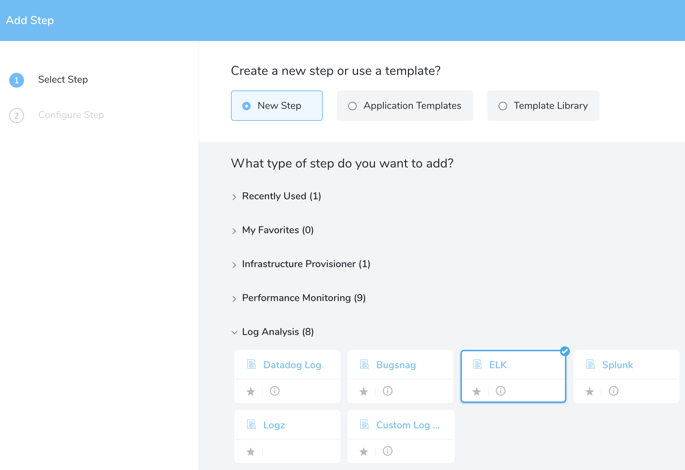
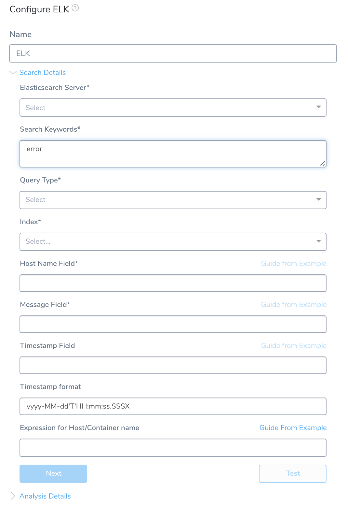
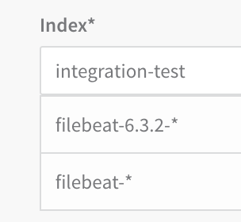
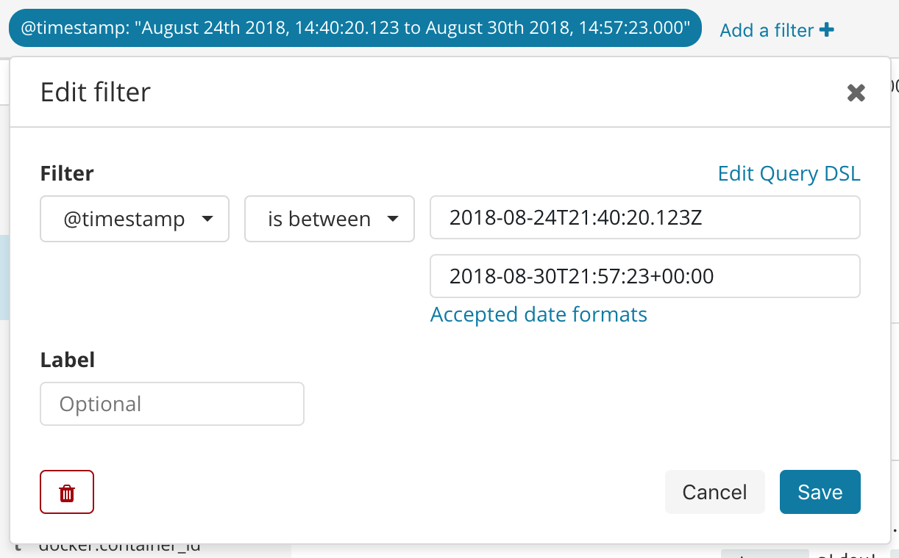
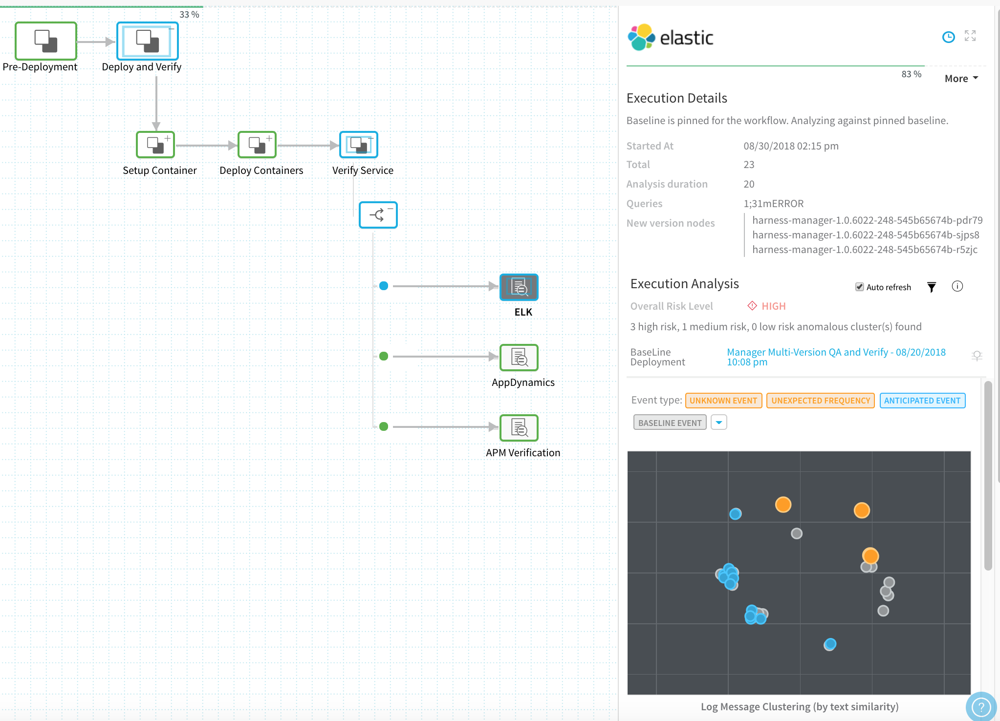
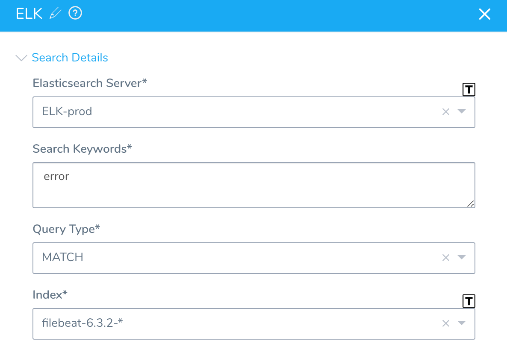
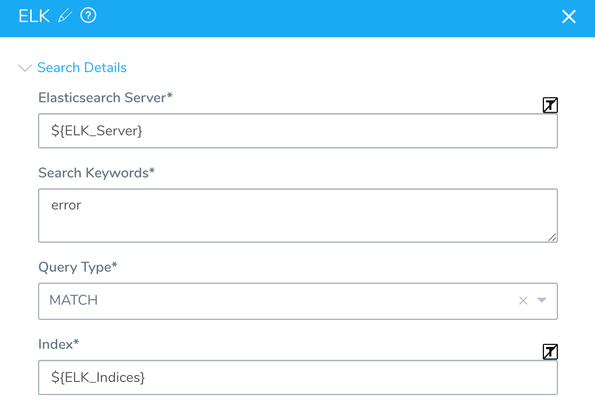
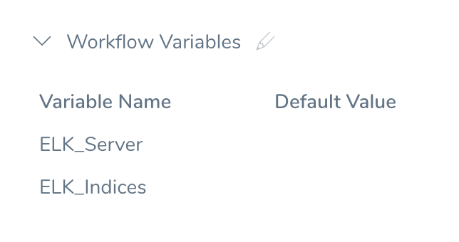
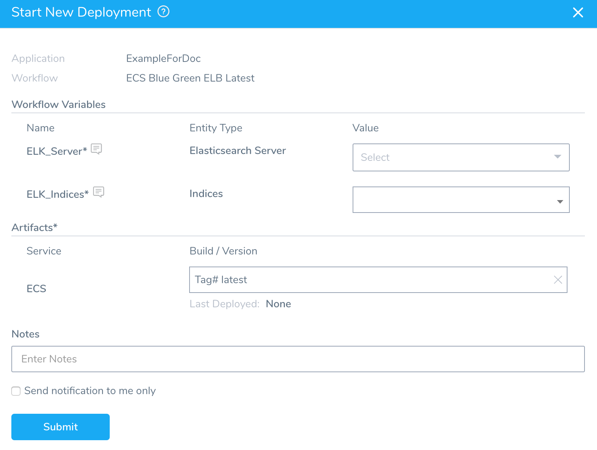

Harness can analyze Elasticsearch data to verify, rollback, and improve deployments. To apply this analysis to your deployments, you set up ELK as a verification step in a Harness Workflow. This section covers setup steps, and provides a summary of Harness verification results.

In order to obtain the names of the host(s), pod(s), or container(s) where your service is deployed, the verification provider should be added to your workflow *after* you have run at least one successful deployment.

##   Before You Begin

* See the [Elasticsearch Verification Overview](../continuous-verification-overview/concepts-cv/elasticsearch-verification-overview.md).

##   Visual Summary

Here's an example configuration of Elasticsearch deployment verification.

##   Step 1: Set Up the Deployment Verification

To add an ELK verification step to your Workflow:

1. Ensure that you have added ELK Elasticsearch as a Verification Provider, as described in [Verification Provider Setup](#verification_provider_setup).
2. In your Workflow, under **Verify Service**, click **Add Verification**.
3. In the resulting **Add Step** settings, select **Log Analysis** > **ELK**.
4. Click **Next**. The **Configure** **ELK** settings appear.

##   Step 2: Elasticsearch Server

Select the server you added when you set up the ELK verification provider earlier in [Connect to Elasticsearch](1-elasticsearch-connection-setup.md).

You can also enter [variable expressions](https://docs.harness.io/article/9dvxcegm90-variables), such as: `${serviceVariable.elk_connector_name}`.

If the **Elasticsearch Server** field contains an expression, the **Index** field must also use an expression.

##   Step 3: Search Keywords

Enter search keywords for your query, such as **error** or **exception**.

The keywords are searched against the logs identified in the **Message** field of the dialog (see below).

You can also enter variable expressions, such as: `error OR ${serviceVariable.error_type}`

For an advanced query, enter an Elasticsearch JSON query. You can use JSON to create complex queries beyond keywords. The following example looks for the substring **error** in the field **log**:

`{"regexp":{"log": {"value":"error"}}}`

Do not use wildcards in queries for Elasticsearch. ElasticSearch documentation indicates that wildcard queries can become very expensive on the resources and take down the cluster.

##   Step 4: Query Type

Select query type for the value entered in the **Host Name Field**. The queries accept text, numerics, and dates. For MATCH and MATCH\_PHRASE types, the input is analyzed and the query is constructed.

1. **TERM** finds documents that contain the exact term specified in the entered value. See [ELK documentation on TERM queries](https://www.elastic.co/guide/en/elasticsearch/reference/current/query-dsl-term-query.html#query-dsl-term-query) for more information.
2. **MATCH\_PHRASE** finds documents that contain the terms specified in the exact order of entries in the analyzed text. See [ELK documentation on MATCH\_PHRASE queries](https://www.elastic.co/guide/en/elasticsearch/reference/current/query-dsl-match-query.html#_phrase) for more information.
3. **MATCH** finds documents that contain the entries in the analyzed text in any order. See [ELK documentation on MATCH queries](https://www.elastic.co/guide/en/elasticsearch/reference/current/query-dsl-match-query.html) for more information.

##   Step 5: Index

Enter the the index to search. This field is automatically populated from the index templates, if available.

You can also enter variable expressions, such as: `${service.name}`

If the **Elasticsearch Server** field contains an expression, the **Index** field must also use an expression.If there are no index templates, or if you do not have administrator privileges with ELK, enter the index manually:

1. To locate indices, in **Kibana**, click **Management**.
2. Click **Index Patterns**. The **Index Patterns** page appears.
3. Copy the name of one of the Index patterns.
4. In **Harness**, in the **ELK** dialog, paste the name of the Index pattern into **Indices**.

##   Step 6: Host Name Field

Enter the field name used in the ELK logs that refers to the host/pod/container ELK is monitoring.

###   Select Key from Example

To find the hostname in Kibana and enter it in Harness, do the following:

1. In **Kibana**, click **Discover**.
2. In the search field, search for **error** or **exception**.
3. In the results, locate the host name of the host/container/pod where ELK is monitoring. For example, when using Kubernetes, the pod name field **kubernetes.pod\_name** is used.
4. In **Harness**, in the **ELK** dialog, next to **Host Name Field**, click **Guide From Example**. The **Host Name Field** popover appears.
5. In the JSON response, click on the name of the label that maps to the host/container/pod in your log search results. Using our Kubernetes example, under **pod**, you would click the first **name** label.  
The **Host Name Field** is filled with the JSON label for the hostname.

###   Paste Custom JSON Response

If you do not want to get the sample record from the server configuration and select the required object, you can use your own JSON object.

Click **Paste Custom JSON Response** and paste your custom valid JSON object in the text field. It will appear in the dialog and you can select to use it.

Make sure the styling of the JSON object is valid as the input field strictly validates the entry.

##   Step 7: Message Field

Enter the field by which the messages are usually indexed. This is typically a **log** field. You can also enter variable expressions, such as: `${serviceVariable.message_field}`.

To find the field in **Kibana** and enter it in **Harness**, do the following:

1. In **Kibana**, click **Discover**.
2. In the search field, search for **error or exception**.
3. In the results, locate a log for the host/container/pod ELK is monitoring. For example, in the following Kubernetes results in Kibana, the messages are indexed under the **log** field.
4. In **Harness**, in the **ELK** dialog, next to **Message Field**, click **Guide From Example**. The **Message Field** popover appears.
5. In the JSON response, click on the name of the label that maps to the log in your Kibana results. Using our Kubernetes example, you would click the **log** label.  
The label is added to the **Message Field**.

You can also paste your own JSON object by clicking **Paste Custom JSON Response**.

##   Step 8: Expression for Host/Container name

Add an expression that evaluates to the host name value for the field you entered in the **Host Name Field** above. The default expression is **${instance.host.hostName}**.

In order to obtain the names of the host where your service is deployed, the verification provider should be added to your workflow **after** you have run at least one successful deployment.To ensure that you pick the right field when using **Guide From Example**, you can use a host name from the ELK log messages as a guide.

For AWS EC2 hostnames, use the expression `${instance.hostName`}.To use **Guide From Example** for a host name expression, do the following:

1. In **Kibana**, click **Discover**.
2. In the search field, search for **error or exception**.
3. In the results, locate the name of the host/container/pod ELK is monitoring. For example, when using Kubernetes, the pod name field **kubernetes.pod\_name** displays the value you need.  
The expression that you provide in **Expression for Host/Container Name** should evaluate to the name here, although the suffixes can differ.
4. In **Harness**, in your workflow ELK dialog, click **Guide From Example**. The **Expression for Host Name** popover appears.  
The dialog shows the service, environment, and service infrastructure used for this workflow.
5. In **Host**, click the name of the host to use when testing verification. The hostname will be similar to the hostname you used for the **Host Name Field**, as described earlier in this procedure. The suffixes can be different.
6. Click **SUBMIT**. The JSON for the host appears. Look for the **host** section.  
You want to use a **name** label in the **host** section. Do not use a host name label outside of that section.
7. To identify which label to use to build the expression, compare the host/pod/container name in the JSON with the hostname you use when configuring **Host Name Field**.
8. In the **Expression for Host Name** popover, click the **name** label to select the expression. Click back in the main dialog to close the **Guide From Example**. The expression is added to the **Expression for Host/Container name** field.  
For example, if you clicked the **name** label, the expression **${host.name}** is added to the **Expression for Host/Container name** field.

You can also paste your own JSON object by clicking **Paste Custom JSON Response**.

##   Step 9: Timestamp Field

Enter either a static value (such as `@timestamp`), or a variable expression such as: `${serviceVariable.timestamp_field}`.

 If you are using a timestamp in the **Timestamp Field** that is not formatted as epoch/Unix timestamp (the default), then you must enter the format you are using in the **Timestamp Format** setting. The format is used to parse the timestamp in **Timestamp Field**.You can also paste your own JSON object by clicking **Paste Custom JSON Response**.

##   Step 10: Timestamp Format

Enter the format for the **timestamp** field in the Elasticsearch record. You can also enter a variable expression, such as: `${serviceVariable.timestamp_format_field}`.

If you are entering a literal format, use Kibana to determine the format. In Kibana, use the **Discover** > **Filter** feature to construct your timestamp range:

Format Examples:

**Timestamp:** 2018-08-24T21:40:20.123Z. **Format:** yyyy-MM-dd'T'HH:mm:ss.SSSX

**Timestamp:** 2018-08-30T21:57:23+00:00. **Format:** yyyy-MM-dd'T'HH:mm:ss.SSSXXX

For more information, see [Date Math](https://www.elastic.co/guide/en/elasticsearch/reference/6.x/common-options.html#date-math) from Elastic.

You can also paste your own JSON object by clicking **Paste Custom JSON Response**.

##   Step 11: Test Expression for Host Name

At the bottom of the dialog, click **Test**.

A new **Expression for Host Name** popover appears.

In **Host**, select the same host you selected last time, and then click **RUN**. Verification for the host is found.

If you receive an error, it is likely because you selected the wrong label in **Expression for Host/Container Name** or **Host Name Field**. Resolve the error as needed.

Click **Analysis Details**.

##   Step 12: Analysis Period

Set the duration for the verification step. If a verification step exceeds the value, the workflow [Failure Strategy](../../model-cd-pipeline/workflows/workflow-configuration.md#failure-strategy) is triggered. For example, if the Failure Strategy is **Ignore**, then the verification state is marked **Failed** but the workflow execution continues.

Harness waits 2-3 minutes before beginning the analysis to avoid initial deployment noise. This is a standard with monitoring tools.

##   Step 13: Baseline for Risk Analysis

See [CV Strategies, Tuning, and Best Practices](../continuous-verification-overview/concepts-cv/cv-strategies-and-best-practices.md).

For Canary Analysis and Previous Analysis, analysis happens at the host/node/pod level. For Predictive Analysis, data collection happens at the host/node/pod level but analysis happens at the application or service level. Consequently, for data collection, provide a query that targets the logs for the host using fields such as **SOURCE\_HOST** in **Field name for Host/Container**.

##   Step 14: Algorithm Sensitivity

Select the sensitivity that will result in the most useful results for your analysis.

See [CV Strategies, Tuning, and Best Practices](../continuous-verification-overview/concepts-cv/cv-strategies-and-best-practices.md#algorithm-sensitivity-and-failure-criteria).

##   Step 15: Execute with previous steps

Check this checkbox to run this verification step in parallel with the previous steps in **Verify Service**.

##   Step 16: Include instances from previous phases

If you are using this verification step in a multi-phase deployment, select this checkbox to include instances used in previous phases when collecting data. Do not apply this setting to the first phase in a multi-phase deployment.

Click **Submit**.

##   Review: Harness Expression Support in CV Settings

You can use expressions (`${...}`) for [Harness built-in variables](https://docs.harness.io/article/7bpdtvhq92-workflow-variables-expressions) and custom [Service](../../model-cd-pipeline/setup-services/service-configuration.md) and [Workflow](../../model-cd-pipeline/workflows/add-workflow-variables-new-template.md) variables in the settings of Harness Verification Providers.

Expression support lets you template your Workflow verification steps. You can add custom expressions for settings, and then provide values for those settings at deployment runtime. Or you can use Harness built-in variable expressions and Harness will provide values at deployment runtime automatically.

##   Step 17: View Verification Results

Once you have deployed your workflow (or pipeline) using the New Relic verification step, you can automatically verify cloud application and infrastructure performance across your deployment.

###   Workflow Verification

To see the results of Harness machine-learning evaluation of your ELK verification, in your workflow or pipeline deployment you can expand the **Verify Service** step and then click the **ELK** step.

###   Continuous Verification

You can also see the evaluation in the **Continuous Verification** dashboard. The workflow verification view is for the DevOps user who developed the workflow. The **Continuous Verification** dashboard is where all future deployments are displayed for developers and others interested in deployment analysis.

To learn about the verification analysis features, see the following sections.

###   Transaction Analysis

* **Execution details:** See the details of verification execution. Total is the total time the verification step took, and Analysis duration is how long the analysis took.
* **Risk level analysis:** Get an overall risk level and view the cluster chart to see events.
* **Transaction-level summary:** See a summary of each transaction with the query string, error values comparison, and a risk analysis summary.

###   Execution Analysis

*  **Event type:** Filter cluster chart events by Unknown Event, Unexpected Frequency, Anticipated Event, Baseline Event, and Ignore Event.
* **Cluster chart:** View the chart to see how the selected event contrast. Click each event to see its log details. 

###   Event Management

* **Event-level analysis:** See the threat level for each event captured.
* **Tune event capture:** Remove events from analysis at the service, workflow, execution, or overall level.
* **Event distribution:** Click the chart icon to see an event distribution including the measured data, baseline data, and event frequency. 

##   Option: Templatize ELK Verification

Once you have created an ELK verification step, you can templatize certain settings. This enables you to use the ELK verification step in the Workflow (and multiple Pipelines) without having to provide settings until runtime.

You templatize settings by click the **[T]** icon next to the setting.

The settings are replaced by Workflow variables:

You will now see them in the **Workflow Variables** section of the Workflow:

When you deploy the Workflow, **Start New Deployment** prompts you to enter values for templatize settings:

You can select the necessary settings and deploy the Workflow.

You can also pass variables into a Workflow from a Trigger that can be used for templatized values. For more information, see [Passing Variables into Workflows and Pipelines from Triggers](../../model-cd-pipeline/expressions/passing-variable-into-workflows.md).

##   Next Steps

* [Troubleshooting Elasticsearch](4-troubleshooting-elasticsearch.md)

