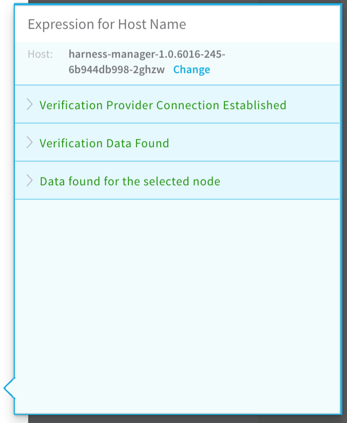

The following are resolutions to common configuration problems.

### Workflow Step Test Error

When you click **TEST** in the **ELK** workflow dialog **Expression for Host Name** popover, you should get provider information:



The following error message can occur when testing the New Relic verification step in your workflow:


```
ELK_CONFIGURATION_ERROR: Error while saving ELK configuration. No node with name ${hostName} found reporting to ELK
```
#### Cause

The expression in the **Expression for Host/Container name** field is incorrect. Typically, this occurs when the wrong hostName label is selected to create the expression in the **Expression for Host/Container name** field.

#### Solution

Following the steps in [Verify with ELK](#verify_with_elk) again to select the correct expression. Ensure that the **name** label selected is under the **host** section of the JSON.


### SocketTimeoutException

When you add an ELK verification provider and click SUBMIT, you might see the following error.


#### Cause

The Harness delegate does not have a valid connection to the ELK server.

#### Solution

On the same server or instance where the Harness delegate is running, run one of the following cURL commands to verify whether the delegate can connect to the ELK server.

If you do not have a username and password for the ELK server:


```
curl -i -X POST url/*/_search?size=1 -H 'Content-Type: application/json' -d '{"size":1,"query":{"match_all":{}},"sort":{"@timestamp":"desc"}}'
```
If you have username and password then use this command:


```
curl -i -X POST url/*/_search?size=1 -H 'Content-Type: application/json' -H 'Authorization: <Basic: Base64 encoded *username:password*>'-d '{"size":1,"query":{"match_all":{}},"sort":{"@timestamp":"desc"}}'
```
If you have token-based authentication, use this command:


```
curl -i -X POST url/*/_search?size=1 -H 'Content-Type: application/json' -H 'tokenKey: *tokenValue*'-d '{"size":1,"query":{"match_all":{}},"sort":{"@timestamp":"desc"}}'
```
If the cURL command cannot connect, it will fail.

If the cURL command can connect, it will return a HTTP 200, along with the JSON.

If the cURL command is successful, but you still see the SocketTimeoutException error in the ELK dialog, contact Harness Support ([support@harness.io](mailto:support@harness.io)).

It is possible that the response from the ELK server is just taking very long.

### Log Errors Due To Missing Fields

While trying to set up a simple query for ELK deployment verification, an error message occurs about a missing field and the workflow fails.

#### Cause

The fields specified in the query can be present only in a subset of the documents. 

#### Solution

Make sure that the field exists in the document that is being examined in ELK and then filter the value of the field.

For example, if you want to fetch only documents where the message field contains the term exception and the ELK index contains documents that could either contain the message field or not contain it. In such a case, a query with conditions as implemented here is recommended.


```
  
{   
    "bool":{   
        "must":[   
            {   
                "exists":{   
                    "field":"message"   
                      }   
            },   
            {   
                "regexp":{  
                    "message":{   
                        "value":"exception"   
                    }   
                  }   
            }   
           ]   
      }   
}  

```
### Next Steps

* [Configuration as Code](https://docs.harness.io/article/htvzryeqjw-configuration-as-code)
* [Managing Users and Groups (RBAC)](https://docs.harness.io/article/ven0bvulsj-users-and-permissions)

